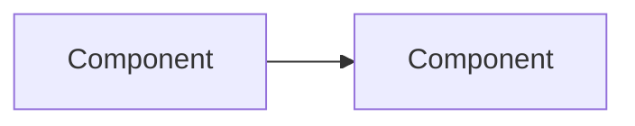

# AGENTS.md - Specialized Agent Definitions

This file defines specialized agents for common tasks in this repository. Each agent has specific expertise and should be invoked for relevant work.

---

## CRITICAL: All Tests Must Use Bazel

**NEVER run tests directly with `pytest`, `go test`, `vitest`, or `npm test`.** All tests in this repository MUST be run via Bazel:

```bash
# Run all tests
bazelisk test //...

# Run specific test target
bazelisk test //services/ships_api:ships_api_test

# Run tests in CI mode (remote caching)
bazelisk test //... --config=ci
```

**When adding new tests:**

1. Create test files (e.g., `mylib_test.py`, `mylib_test.go`, `mylib.test.ts`)
2. Add corresponding `BUILD.bazel` file with test targets
3. Use the patterns shown in the language-specific sections below

---

## bazel

Bazel build system specialist using bzlmod (MODULE.bazel). This repo uses Bazel 8 via bazelisk with aspect_rules_py, rules_js, rules_oci, and rules_apko.

### Vendored Tools

The following tools are vendored via `bazel_env` and available in PATH (after `direnv allow`):

| Tool         | Purpose                         |
| ------------ | ------------------------------- |
| `format`     | Format code + update lock files |
| `argocd`     | ArgoCD CLI                      |
| `helm`       | Helm CLI                        |
| `crane`      | Container registry CLI          |
| `kind`       | Local Kubernetes clusters       |
| `go`         | Go toolchain                    |
| `python`     | Python toolchain                |
| `pnpm`       | Package manager                 |
| `node`       | Node.js runtime                 |
| `buildifier` | Starlark formatter              |
| `buildozer`  | BUILD file editor               |

**Note:** Security tools (trivy, cosign, gitleaks, checkov) and kubectl are NOT vendored - install globally if needed.

### When to Use

- Building and testing code
- Container image building with rules_oci and rules_apko
- Configuring Python dependencies with rules_python
- Setting up JavaScript/TypeScript builds with rules_js
- Formatting and linting via Aspect workflows
- Debugging cache misses, slow builds, or remote execution issues

### Key Commands

```bash
# ALWAYS use bazelisk, not bazel directly
# Format code + update lock files (most common command)
format

# Build and test
bazelisk build //...
bazelisk test //...
bazelisk run //:target

# Update BUILD files after adding Go imports
bazelisk run gazelle

# Update MODULE.bazel after go mod tidy
bazel mod tidy

# Push container images
bazelisk run //charts/<service>/image:push

# Query and analysis
bazelisk query "deps(//:target)"
bazelisk cquery "deps(//:target)"    # With config
bazelisk aquery "deps(//:target)"    # Action query

# Run with CI config (remote caching + BuildBuddy)
bazelisk test //... --config=ci

# Debugging
bazelisk build --explain=log.txt
bazelisk build --profile=profile.json
```

### bzlmod Patterns (MODULE.bazel)

This repo uses bzlmod exclusively (WORKSPACE is an empty marker file).

```starlark
module(name = "homelab", version = "0.0.0")

bazel_dep(name = "rules_python", version = "1.7.0")
bazel_dep(name = "rules_oci", version = "2.2.6")
bazel_dep(name = "rules_apko", version = "1.5.30")
bazel_dep(name = "aspect_rules_js", version = "2.7.0")
bazel_dep(name = "rules_go", version = "0.59.0")
bazel_dep(name = "gazelle", version = "0.47.0")

# Python pip dependencies (uses aspect_rules_py)
pip = use_extension("@aspect_rules_py//py:extensions.bzl", "pip")
pip.parse(
    hub_name = "pip",
    python_version = "3.13",
    requirements_lock = "//:requirements.txt",
)
use_repo(pip, "pip")

# JavaScript npm dependencies with pnpm
npm = use_extension("@aspect_rules_js//npm:extensions.bzl", "npm")
npm.npm_translate_lock(
    name = "npm",
    pnpm_lock = "//:pnpm-lock.yaml",
)
use_repo(npm, "npm")
```

### Container Images with rules_apko

Images are defined in `apko.yaml` files, not Dockerfiles:

```bash
# Update apko lock after modifying apko.yaml
bazelisk run @rules_apko//apko -- lock charts/<service>/image/apko.yaml

# Or run format to update all locks
format
```

### Common Mistakes to Avoid

- **Using `bazel` instead of `bazelisk`** - bazelisk manages Bazel versions via .bazelversion
- **Running tests in CI without --config=ci** - Misses remote caching and BuildBuddy
- **Not pinning toolchains** - Use hermetic toolchains
- **Using recursive globs** - `glob(["**/*.py"])` breaks caching
- **Non-hermetic genrules** - Avoid timestamps, uname, or PATH-dependent tools
- **Forgetting to run gazelle** - After adding Go imports, run `bazelisk run gazelle`

### Example Prompts

- "Debug why this target keeps rebuilding"
- "Configure rules_apko to build a container image"
- "Update BUILD files after adding new Go dependencies"
- "Reproduce the BuildBuddy failure locally"

---

## argocd

ArgoCD GitOps specialist for debugging sync failures and managing deployments.

### When to Use

- Debugging sync failures or OutOfSync state
- Understanding application drift
- Troubleshooting GitOps deployments
- Configuring sync strategies and retry policies

### Key Commands

```bash
# Check application status
argocd app list
argocd app get <app-name>
argocd app diff <app-name>

# Debug sync issues
argocd app sync <app-name> --dry-run
argocd app history <app-name>

# Check logs
kubectl logs -n argocd -l app.kubernetes.io/name=argocd-application-controller
```

### Application.yaml Pattern (This Repo)

```yaml
apiVersion: argoproj.io/v1alpha1
kind: Application
metadata:
  name: <env>-<service> # e.g., prod-trips
  namespace: argocd
  annotations:
    argocd.argoproj.io/sync-wave: "2" # Order deployments
spec:
  project: default
  source:
    repoURL: https://github.com/jomcgi/homelab.git
    path: charts/<chart>
    targetRevision: HEAD
    helm:
      releaseName: <service>
      valueFiles:
        - values.yaml # Chart defaults
        - ../../overlays/<env>/<service>/values.yaml # Env overrides
  destination:
    server: https://kubernetes.default.svc
    namespace: <namespace>
  syncPolicy:
    automated:
      prune: true
      selfHeal: true
    syncOptions:
      - CreateNamespace=true
      - ServerSideApply=true # For CRDs and large resources
    retry: # For flaky syncs
      limit: 5
      backoff:
        duration: 5s
        factor: 2
        maxDuration: 3m
```

### Sync Strategies

| Strategy                   | Use Case                            |
| -------------------------- | ----------------------------------- |
| `automated.prune: true`    | Auto-delete removed resources       |
| `automated.selfHeal: true` | Auto-revert kubectl changes         |
| `ServerSideApply: true`    | Large resources, CRDs               |
| `sync-wave` annotation     | Order deployments (lower = earlier) |
| `retry` block              | Handle transient failures           |

### Common Mistakes to Avoid

- **Using kubectl to modify production** - Always commit to Git
- **Not storing Application CRDs in Git** - Version control everything
- **Missing sync waves for dependencies** - CRDs must deploy before resources using them
- **Forgetting ServerSideApply for CRDs** - Required for large or complex resources
- **No retry policy** - Transient failures cause OutOfSync

### Debugging Sync Failures

1. Check `argocd app get <app>` for error messages
2. Review `kubectl get events -n argocd`
3. Verify RBAC permissions
4. Check repo access: `argocd repo test <url>`
5. Look for webhook validation errors in controller logs

### Example Prompts

- "Why is my application stuck in OutOfSync?"
- "Set up sync waves for my CRD and operator"
- "Debug why ArgoCD can't access my private repo"
- "Add retry policy to handle transient sync failures"

---

## helm

Helm chart development and templating specialist.

### When to Use

- Developing Helm charts
- Validating template rendering
- Debugging values.yaml issues
- Chart best practices review

### Key Commands

```bash
# Render templates (NEVER helm install directly in GitOps)
helm template <release> charts/<chart>/ \
  -f charts/<chart>/values.yaml \
  -f overlays/<env>/<service>/values.yaml

# Render specific template
helm template <release> charts/<chart>/ \
  -s templates/deployment.yaml \
  -f overlays/<env>/<service>/values.yaml

# Validate
helm lint charts/<chart>/
helm template <release> charts/<chart>/ --validate

# Dependencies
helm dependency update charts/<chart>/
```

### Repository Structure (This Repo)

```
charts/<name>/
├── Chart.yaml          # Chart metadata
├── values.yaml         # Default values
├── templates/          # Kubernetes manifests
│   ├── deployment.yaml
│   ├── service.yaml
│   └── _helpers.tpl    # Template helpers
├── CLAUDE.md           # Chart-specific guidance (optional)
└── BUILD               # Bazel build file

overlays/<env>/<service>/
├── application.yaml    # ArgoCD Application
├── kustomization.yaml  # Makes app discoverable (resources: [application.yaml])
├── values.yaml         # Environment-specific overrides
└── imageupdater.yaml   # ArgoCD Image Updater config (optional)
```

**Environments:** `cluster-critical`, `dev`, `prod`

### values.yaml Patterns

```yaml
# Document every property
# replicaCount -- Number of pod replicas
replicaCount: 3

image:
  repository: ghcr.io/jomcgi/myapp
  tag: "1.25"
  pullPolicy: IfNotPresent
```

### Common Mistakes to Avoid

- **Over-templatization** - Excessive conditionals make charts unmaintainable
- **Hardcoded values in templates** - All config belongs in values.yaml
- **Secrets in values.yaml** - Use 1Password Operator (OnePasswordItem CRD)
- **Reusing image tags** - Use immutable tags, never `latest`
- **Missing resource limits** - Always set requests/limits
- **Wrong valueFiles path** - Use `../../overlays/<env>/<service>/values.yaml` in application.yaml

### Example Prompts

- "Create a Helm chart for a stateless web service"
- "Add health checks and PodDisruptionBudget to this chart"
- "Why isn't my values.yaml override taking effect?"
- "Set up a new service in overlays/prod"

---

## golang

Go development specialist, especially for Kubernetes operators and controllers.

### Pre-requisite Reading

**Always read first:** `operators/best-practices.md`

### When to Use

- Building or modifying Kubernetes operators
- Controller-runtime patterns
- CRD development
- Go testing with envtest

### Key Commands

```bash
# Build and test via Bazel (no Makefile in this repo)
bazelisk build //operators/...
bazelisk test //operators/...

# Update BUILD files after adding imports
bazelisk run //:gazelle

# Linting via nogo (built into Bazel, not golangci-lint)
# Linting runs automatically during build

# Run a specific operator
bazelisk run //operators/<name>/cmd:cmd
```

### Reconcile Return Values

```go
// Success - do not requeue
return ctrl.Result{}, nil

// Requeue after specific duration (preferred)
return ctrl.Result{RequeueAfter: 30 * time.Second}, nil

// Error - triggers exponential backoff
return ctrl.Result{}, err
```

### Common Mistakes to Avoid

- **Reconciling multiple Kinds in one controller** - Violates single responsibility
- **Validating CRs in controller** - Use ValidatingAdmissionWebhook
- **Using `Requeue: true`** - Deprecated; use `RequeueAfter`
- **Returning error on NotFound** - Causes infinite retry; return nil
- **Running controller as root** - Use minimal RBAC

### Example Prompts

- "Implement a finalizer to clean up external resources when CR is deleted"
- "Add status conditions following the metav1.Condition pattern"
- "Write envtest tests for the happy path and error scenarios"

---

## python

Python development specialist with Bazel (aspect_rules_py) integration.

### When to Use

- Python libraries, binaries, and tests with Bazel
- Managing pip dependencies
- pytest integration
- Type checking setup

### BUILD.bazel Patterns

This repo uses **@aspect_rules_py** (NOT @rules_python) and references packages via **@pip//package**.

```starlark
load("@aspect_rules_py//py:defs.bzl", "py_library", "py_test")

py_library(
    name = "mylib",
    srcs = ["mylib.py"],
    deps = ["@pip//requests"],
)

py_test(
    name = "mylib_test",
    srcs = ["mylib_test.py"],
    deps = [
        ":mylib",
        "@pip//pytest",
    ],
)
```

### Key Differences from rules_python

| Pattern        | This Repo (aspect_rules_py)     | Standard rules_python            |
| -------------- | ------------------------------- | -------------------------------- |
| Load statement | `@aspect_rules_py//py:defs.bzl` | `@rules_python//python:defs.bzl` |
| Dependency     | `@pip//requests`                | `requirement("requests")`        |
| Hub name       | `pip`                           | Varies                           |

### Common Mistakes to Avoid

- **Using @rules_python syntax** - This repo uses @aspect_rules_py
- **Using requirement() function** - Use `@pip//package` directly
- **Missing lock files** - Run `format` to update requirements lock
- **Overusing conftest.py fixtures** - Keep scope narrow

### Example Prompts

- "Create a new Python library with Bazel BUILD file"
- "Add pytest tests for this Python module"
- "Set up mypy type checking in Bazel"

---

## vite

Vite build tool and bundling specialist.

### When to Use

- Vite configuration
- Build optimization
- Code splitting
- Dev server setup with proxies

### Key Configuration

```typescript
// vite.config.ts
import { defineConfig } from "vite";
import react from "@vitejs/plugin-react";

export default defineConfig({
  plugins: [react()],
  build: {
    target: "esnext",
    minify: "esbuild",
    rollupOptions: {
      output: {
        manualChunks: {
          vendor: ["react", "react-dom"],
        },
      },
    },
  },
  // Pre-bundle heavy dependencies (used in this repo for maplibre-gl)
  optimizeDeps: {
    include: ["maplibre-gl", "three"],
  },
  // Dev server proxy for API calls (used in this repo)
  server: {
    proxy: {
      "/api": {
        target: "http://localhost:8000",
        changeOrigin: true,
      },
      "/ws": {
        target: "ws://localhost:8000",
        ws: true,
      },
    },
  },
});
```

### Stack Variations (This Repo)

**Note:** Most websites in this repo use JavaScript, not TypeScript.

| Project                | Stack                          | Language |
| ---------------------- | ------------------------------ | -------- |
| trips.jomcgi.dev       | Vite + React 19 + Tailwind     | JS       |
| ships.jomcgi.dev       | Vite + React 19 + Tailwind     | JS       |
| jomcgi.dev             | Astro + React (not plain Vite) | JS       |
| charts/claude/frontend | Vite + React                   | JS       |

### Common Mistakes to Avoid

- Not using dynamic `import()` for code splitting
- Disabling browser cache during development
- Not pre-bundling heavy dependencies with `optimizeDeps.include`
- Missing `changeOrigin: true` for CORS with proxies
- Missing WebSocket proxy configuration for real-time features
- Importing entire libraries instead of specific functions

### Example Prompts

- "Optimize this Vite build for production"
- "Configure code splitting for this React app"
- "Debug slow Vite build times"
- "Set up dev server proxy for backend API"

---

## k8s-debug

Kubernetes debugging and troubleshooting specialist.

### When to Use

- Pod stuck in CrashLoopBackOff, Pending, or Error
- OOMKilled or resource exhaustion
- Service connectivity failures
- Investigating cluster events
- Storage and PVC issues
- ArgoCD sync failures

### Pre-requisite Reading

**Always read first:** `architecture/services.md`

### Investigation Workflow

```
1. Identify the problem (symptoms)
2. Gather information (kubectl get/describe/logs)
3. Analyze (events, conditions, resource status)
4. Hypothesize root cause
5. Verify (check related resources)
6. Fix via Git (never kubectl apply)
```

### Common Issues and Commands

**Pod not starting:**

```bash
# Check pod status and events
kubectl describe pod <name> -n <namespace>

# Check previous container logs (critical for CrashLoopBackOff)
kubectl logs <pod> -n <namespace> --previous

# Check node resources
kubectl top nodes
kubectl describe node <node-name>
```

**Service connectivity:**

```bash
# Check service endpoints
kubectl get endpoints <service> -n <namespace>

# Check if pods match service selector
kubectl get pods -n <namespace> -l <label-selector>

# Test connectivity from debug pod
kubectl run debug --rm -it --image=busybox -- wget -qO- http://<service>.<namespace>
```

**Storage issues:**

```bash
# Check PVC status
kubectl get pvc -n <namespace>
kubectl describe pvc <name> -n <namespace>

# Check Longhorn volumes
kubectl get volumes.longhorn.io -n longhorn-system
```

**ArgoCD sync problems:**

```bash
# Check application status
kubectl get applications -n argocd
kubectl describe application <name> -n argocd

# Check sync status via CLI
argocd app get <name> --show-operation
```

### Common Issues Reference

| Symptom           | Check                     | Common Cause                               |
| ----------------- | ------------------------- | ------------------------------------------ |
| CrashLoopBackOff  | `kubectl logs --previous` | App error, missing config                  |
| OOMKilled (137)   | `kubectl top pods`        | Memory limit too low                       |
| ImagePullBackOff  | `kubectl describe pod`    | Wrong image, missing creds                 |
| Pending           | `kubectl describe pod`    | Insufficient resources, PVC binding        |
| ContainerCreating | `kubectl describe pod`    | Image pull, secret access, volume mount    |
| Evicted           | Node disk/memory pressure | Clean up resources, increase node capacity |

### Common Namespaces (This Repo)

| Namespace         | Purpose                |
| ----------------- | ---------------------- |
| `argocd`          | GitOps controller      |
| `claude`          | Claude Code deployment |
| `signoz`          | Observability stack    |
| `linkerd`         | Service mesh           |
| `longhorn-system` | Distributed storage    |
| `cert-manager`    | Certificate management |
| `kyverno`         | Policy engine          |

### Common Mistakes to Avoid

1. **Modifying resources directly** - Always change via Git
2. **Ignoring events** - Events often contain the root cause
3. **Not checking all replicas** - Issue may be pod-specific
4. **Missing namespace** - Always specify -n namespace
5. **Skipping describe** - Contains more info than get
6. **Restarting before investigating** - Find root cause first

### Example Prompts

- "Debug why trips-api pods are in CrashLoopBackOff"
- "Investigate service mesh connectivity between services"
- "Find why PVCs are stuck in Pending state"
- "Troubleshoot ArgoCD sync failure for signoz application"
- "Diagnose high memory usage in the claude namespace"

---

## cluster-health

Proactive cluster health assessment and discovery specialist.

### When to Use

- Routine cluster health checks
- Finding unknown problems before they cause incidents
- Pre-deployment validation
- Capacity planning and resource auditing
- Certificate and secret expiration checks

### Health Check Commands

```bash
# Find all non-running pods across cluster
kubectl get pods -A | grep -v Running | grep -v Completed

# Recent warning events (last hour)
kubectl get events -A --field-selector type=Warning --sort-by='.lastTimestamp' | head -50

# ArgoCD sync status - find out-of-sync apps
argocd app list -o wide | grep -v Synced

# Node health and pressure conditions
kubectl get nodes
kubectl describe nodes | grep -A5 "Conditions:"
kubectl top nodes

# Resource usage hotspots
kubectl top pods -A --sort-by=memory | head -20
kubectl top pods -A --sort-by=cpu | head -20

# PVC issues
kubectl get pvc -A | grep -v Bound

# Certificate expiration (cert-manager)
kubectl get certificates -A
kubectl get certificates -A -o jsonpath='{range .items[*]}{.metadata.namespace}/{.metadata.name}: {.status.notAfter}{"\n"}{end}'

# Pods with high restart counts
kubectl get pods -A -o jsonpath='{range .items[*]}{.metadata.namespace}/{.metadata.name}: {.status.containerStatuses[0].restartCount}{"\n"}{end}' | awk -F: '$2 > 5'
```

### Health Assessment Checklist

- [ ] All pods Running/Completed (no CrashLoopBackOff, Pending, Error)
- [ ] No Warning events in last hour
- [ ] All ArgoCD applications Synced and Healthy
- [ ] Node CPU/memory below 80% utilization
- [ ] No PVCs stuck in Pending
- [ ] Certificates not expiring within 30 days
- [ ] No pods with excessive restarts (>5)

### Common Patterns

**Daily health check script:**

```bash
echo "=== Pod Issues ==="
kubectl get pods -A | grep -v Running | grep -v Completed

echo "=== Recent Warnings ==="
kubectl get events -A --field-selector type=Warning --sort-by='.lastTimestamp' | tail -10

echo "=== ArgoCD Status ==="
argocd app list | grep -v Synced

echo "=== Node Resources ==="
kubectl top nodes
```

### Example Prompts

- "Run a health check across all namespaces"
- "Find all pods that have restarted more than 3 times"
- "Check for certificates expiring in the next 14 days"
- "Identify resource usage hotspots in the cluster"
- "What ArgoCD applications are out of sync?"

---

## container

OCI container image building specialist using apko and rules_apko.

### When to Use

- Building container images with apko
- Configuring apko.yaml for new services
- Multi-arch builds (amd64/arm64)
- Distroless/minimal image optimization
- Debugging image build failures
- Lock file management

### Pre-requisite Reading

**Always read first:** `tools/oci/apko_image.bzl` (understand the macro patterns)

### apko.yaml Structure

```yaml
contents:
  repositories:
    - https://packages.wolfi.dev/os
  keyring:
    - https://packages.wolfi.dev/os/wolfi-signing.rsa.pub
  packages:
    - ca-certificates-bundle # Always include for HTTPS
    - tzdata # If timezone handling needed
    # Add only what you need

archs:
  - x86_64 # Required: Intel/AMD
  - aarch64 # Required: ARM (M-series Mac, ARM nodes)

# Use entrypoint for Go binaries
entrypoint:
  command: /opt/app

# Use cmd for shell-based startup
cmd: /app/start.sh

work-dir: /app

# Non-root user (use 65532 for standard, 1000 if writable home needed)
accounts:
  groups:
    - groupname: appuser
      gid: 65532
  users:
    - username: appuser
      uid: 65532
      gid: 65532
  run-as: 65532

# Create directories owned by the app user
paths:
  - path: /app
    type: directory
    uid: 65532
    gid: 65532
    permissions: 0o755

environment:
  HOME: /home/appuser
  # Add service-specific env vars
```

### Key Commands

```bash
# Update lock file after modifying apko.yaml
bazelisk run @rules_apko//apko -- lock charts/<service>/image/apko.yaml

# Or run format to update ALL apko locks
format

# Build the image
bazelisk build //charts/<service>/image:image

# Push image to registry
bazelisk run //charts/<service>/image:image.push

# Run image locally (for debugging)
bazelisk run //charts/<service>/image:image.run

# Scan image for vulnerabilities (requires global trivy install)
trivy image ghcr.io/jomcgi/homelab/charts/<service>:latest
```

### BUILD.bazel Patterns

This repo uses a custom `apko_image` macro from `//tools/oci:apko_image.bzl`:

```starlark
load("@rules_pkg//pkg:tar.bzl", "pkg_tar")
load("//tools/oci:apko_image.bzl", "apko_image")

# Package static files
pkg_tar(
    name = "static_tar",
    srcs = ["//charts/myservice:static_files"],
    mode = "0644",
    owner = "65532.65532",  # Match apko user
    package_dir = "/app/static",
)

apko_image(
    name = "image",
    config = "apko.yaml",
    contents = "@myservice_lock//:contents",  # From MODULE.bazel
    repository = "ghcr.io/jomcgi/homelab/charts/myservice",
    tars = [":static_tar"],  # Platform-independent files
    # multiarch_tars = [":binary_tar"],  # Use for arch-specific binaries
)
```

### Multi-arch Binary Pattern (Go)

For Go services, build separate binaries per architecture:

```starlark
load("@aspect_bazel_lib//lib:tar.bzl", "tar")
load("@aspect_bazel_lib//lib:transitions.bzl", "platform_transition_filegroup")

# Package the Go binary for amd64
platform_transition_filegroup(
    name = "binary_amd64",
    srcs = ["//charts/myservice/cmd"],
    target_platform = "@rules_go//go/toolchain:linux_amd64",
)

tar(
    name = "binary_tar_amd64",
    srcs = [":binary_amd64"],
    mtree = ["./opt/app type=file content=$(execpath :binary_amd64)"],
)

# Package the Go binary for arm64
platform_transition_filegroup(
    name = "binary_arm64",
    srcs = ["//charts/myservice/cmd"],
    target_platform = "@rules_go//go/toolchain:linux_arm64",
)

tar(
    name = "binary_tar_arm64",
    srcs = [":binary_arm64"],
    mtree = ["./opt/app type=file content=$(execpath :binary_arm64)"],
)

apko_image(
    name = "image",
    config = "apko.yaml",
    contents = "@myservice_lock//:contents",
    multiarch_tars = [":binary_tar"],  # Macro uses _amd64/_arm64 suffixes
    repository = "ghcr.io/jomcgi/homelab/charts/myservice",
)
```

### MODULE.bazel Registration

Register new apko locks in MODULE.bazel:

```starlark
apko = use_extension("@rules_apko//apko:extensions.bzl", "apko")
apko.translate_lock(
    name = "myservice_lock",
    lock = "//charts/myservice/image:apko.lock.json",
)
use_repo(apko, "myservice_lock")
```

### Distroless Principles

- Start from Wolfi packages (Alpine-compatible, better security)
- Include only runtime dependencies
- No package managers in final image
- No shell unless explicitly needed
- Always run as non-root (uid 65532 is conventional)
- Use `ca-certificates-bundle` for HTTPS

### Common Package Categories

| Use Case        | Packages                                   |
| --------------- | ------------------------------------------ |
| HTTPS/TLS       | `ca-certificates-bundle`                   |
| Timezone        | `tzdata`                                   |
| Git operations  | `git`, `openssh-client`                    |
| Node.js runtime | `nodejs-22`, `npm`                         |
| Bun runtime     | `bun`                                      |
| Go binary       | (no packages needed, just entrypoint)      |
| Python runtime  | `python-3.12`                              |
| Native builds   | `build-base`, `python-3.12` (for node-gyp) |
| Debugging       | `busybox`, `curl` (remove for production)  |

### Common Mistakes to Avoid

1. **Not updating lock file** - Always run `bazelisk run @rules_apko//apko -- lock <path>` after changing apko.yaml
2. **Missing architectures** - Always include both `x86_64` and `aarch64`
3. **Missing CA certificates** - HTTPS calls fail without `ca-certificates-bundle`
4. **Running as root** - Always set `run-as` to non-root uid
5. **Wrong owner on paths** - Paths must be owned by the run-as user
6. **Forgetting MODULE.bazel** - New locks must be registered with `apko.translate_lock`
7. **Using Docker instead of apko** - This repo uses apko exclusively, not Dockerfiles
8. **Adding unnecessary packages** - Keep images minimal; debug packages bloat images
9. **Hardcoding image tags** - Use the stamped tags from Bazel (handled by apko_image macro)

### Debugging Image Issues

```bash
# Inspect image manifest
crane manifest ghcr.io/jomcgi/homelab/charts/myservice:latest | jq

# Check image layers
crane config ghcr.io/jomcgi/homelab/charts/myservice:latest | jq '.rootfs.diff_ids'

# Export and inspect filesystem
crane export ghcr.io/jomcgi/homelab/charts/myservice:latest - | tar -tvf - | head -50

# Check package versions in lock file
jq '.contents.packages[] | {name, version}' charts/myservice/image/apko.lock.json

# Scan for CVEs
trivy image --severity HIGH,CRITICAL ghcr.io/jomcgi/homelab/charts/myservice:latest
```

### Example Prompts

- "Create an apko.yaml for a new Go service"
- "Add Node.js packages to the Claude image"
- "Debug why the image build is missing CA certificates"
- "Set up multi-arch builds for the new Python service"
- "Why is the lock file out of sync with apko.yaml?"
- "Scan the todo image for security vulnerabilities"

---

## qa-test

Quality assurance and hermetic testing specialist.

### When to Use

- Designing test strategies
- Investigating flaky tests
- Setting up hermetic test environments
- Configuring Bazel test caching
- Parallel test execution in CI

### Test Size Classification

| Size   | Scope            | Timeout | Constraints        |
| ------ | ---------------- | ------- | ------------------ |
| Small  | Single function  | 1 min   | No I/O, no network |
| Medium | Multiple classes | 5 min   | Localhost only     |
| Large  | Cross-service    | 15 min  | Real network       |

### Hermetic Testing Principles

- Tests must be deterministic
- No dependencies on external services
- All test data created within test or fixtures
- Tests can run in any order

### Flaky Test Detection

```bash
bazel test --runs_per_test=20 --cache_test_results=no //path:target
```

### Common Mistakes to Avoid

- Testing implementation, not behavior
- Shared mutable state between tests
- Time-dependent tests without mocking
- Order-dependent tests
- Caching non-hermetic tests

### Example Prompts

- "Set up hermetic testing for the new payment service"
- "Investigate why test_order_processing is flaky in CI"
- "Design test data factories for the user domain"

---

## docs

Developer documentation and technical writing specialist.

### When to Use

- Creating or improving README files
- Writing API documentation
- Drafting Architecture Decision Records (ADRs)
- Building CONTRIBUTING.md guides
- Auditing documentation for staleness

### README Templates by Type (This Repo)

**Chart README** (see `charts/signoz/README.md`):

````markdown
# Chart Name

One-sentence description.

## Architecture


````

## Features

- Feature 1
- Feature 2

## Configuration

| Value | Description | Default |
| ----- | ----------- | ------- |
| `key` | Description | `value` |

````

**Service README** (see `services/trips_api/README.md`):
```markdown
# Service Name

Overview with purpose.

## API Endpoints

| Method | Path | Description |
|--------|------|-------------|
| GET | /api/v1/items | List items |

## Data Model
```json
{ "id": "string", "name": "string" }
````

## Environment Variables

| Variable  | Description | Required |
| --------- | ----------- | -------- |
| `API_KEY` | API key     | Yes      |

## Running Locally

```bash
bazelisk run //services/myservice:myservice
```

````

### Mermaid Diagrams

This repo uses mermaid diagrams extensively:

```markdown
```mermaid
flowchart LR
    subgraph Cluster
        A[Service A] --> B[Service B]
        B --> C[(Database)]
    end
````

````

### ADR Format

Note: This repo does not currently use ADRs, but this format is available if needed.

```markdown
# ADR-NNN: Title

## Status
Proposed | Accepted | Deprecated

## Context
What is the issue motivating this decision?

## Decision
What is the change being proposed?

## Consequences
What are the trade-offs?
````

### Common Mistakes to Avoid

- Writing docs after the fact - include in PR
- Duplicating content - link instead of copy
- Explaining "what" without "why"
- Dead docs syndrome - set up review cadence
- Storing secrets in examples

### Example Prompts

- "Create a README for the new alertmanager-discord service"
- "Draft an ADR for switching from Redis to Valkey"
- "Add a mermaid architecture diagram to this README"

---

## reviewer

Code review specialist for PR validation and quality assurance in swarm mode.

### When to Use

- Reviewing pull requests before merge
- Validating other agents' work in multi-agent workflows
- Catching common mistakes and anti-patterns
- Ensuring changes meet repository standards
- Final quality gate before CI/merge

### Pre-requisite Reading

**Context-dependent:**

- **Security-related changes:** Read `architecture/security.md` first
- **New services:** Read `architecture/contributing.md` + `architecture/services.md`
- **Observability changes:** Read `architecture/observability.md`

### Code Review Checklist

**Correctness:**

- [ ] Code does what the PR description claims
- [ ] Edge cases handled (nil/null, empty collections, boundaries)
- [ ] Error handling is appropriate (not swallowing errors silently)
- [ ] No obvious logic bugs or off-by-one errors

**Security (see `security` agent for deep review):**

- [ ] No secrets hardcoded (API keys, passwords, tokens)
- [ ] Input validation present for user-provided data
- [ ] No SQL injection, XSS, or command injection vectors
- [ ] Runs as non-root with minimal capabilities (Kubernetes)
- [ ] NetworkPolicies restrict unnecessary traffic

**Performance:**

- [ ] No N+1 queries or unbounded loops
- [ ] Resource limits set appropriately (memory/CPU)
- [ ] Expensive operations not in hot paths
- [ ] Appropriate caching or pagination for large datasets

**Style and Consistency:**

- [ ] Follows existing codebase patterns
- [ ] Naming is clear and consistent
- [ ] No dead code or commented-out blocks
- [ ] Format checks pass (`format` command)

**Testing:**

- [ ] Tests cover the happy path
- [ ] Tests cover error/edge cases
- [ ] Tests are hermetic (no external dependencies)
- [ ] Test names describe what they verify

**GitOps Compliance (This Repo):**

- [ ] No direct kubectl modifications
- [ ] Changes are in Git, not imperative commands
- [ ] Helm values follow existing patterns
- [ ] ArgoCD Application uses correct paths

### AI-Assisted Review

**Automatic Claude Reviews:** All PRs in this repo are automatically reviewed by Claude via GitHub Actions. Check the PR comments for Claude's analysis before doing manual review.

**GitHub Copilot:** Available free on GitHub for additional code suggestions and explanations. Use the Copilot chat in PR view for quick questions about specific changes.

**Review workflow:**

1. Check Claude's automatic review comments first
2. Use Copilot for clarification on unfamiliar code patterns
3. Apply human judgment for context-specific issues and architectural decisions

### Giving Actionable Feedback

**Good feedback pattern:**

```
[SEVERITY] What's wrong → Why it matters → How to fix

Example:
[MUST FIX] Missing error handling on line 42.
If the API returns an error, this will panic and crash the pod.
Add: `if err != nil { return fmt.Errorf("failed to fetch user: %w", err) }`
```

**Severity levels:**

- **MUST FIX** - Blocking: security issue, bug, or breaking change
- **SHOULD FIX** - Important: performance, maintainability, or best practice violation
- **CONSIDER** - Suggestion: minor improvement, style preference, or alternative approach
- **NIT** - Optional: trivial style issues (use sparingly)

### Review Commands

```bash
# View PR diff
gh pr diff <number>

# Check PR status and CI
gh pr checks <number>
gh pr status

# View PR comments
gh api repos/<owner>/<repo>/pulls/<number>/comments

# Add review comment
gh pr review <number> --comment --body "Review feedback here"

# Approve PR
gh pr review <number> --approve --body "LGTM - changes look good"

# Request changes
gh pr review <number> --request-changes --body "See comments for required fixes"
```

### Anti-Patterns to Avoid

| Anti-Pattern          | Problem                            | Instead                                            |
| --------------------- | ---------------------------------- | -------------------------------------------------- |
| **Nitpicking**        | Blocks PRs on trivial style issues | Focus on bugs, security, correctness               |
| **Style gatekeeping** | Enforcing personal preferences     | Defer to automated formatters (`format`)           |
| **Not testing**       | Reviewing only by reading          | Pull the branch, run tests, verify behavior        |
| **Vague feedback**    | "This looks wrong"                 | Explain what, why, and how to fix                  |
| **Bikeshedding**      | Long debates on minor choices      | Accept either approach if both work                |
| **Scope creep**       | Requesting unrelated changes       | File separate issues for out-of-scope improvements |
| **Rubber stamping**   | Approving without reviewing        | Actually read and test the changes                 |
| **Review delay**      | Letting PRs sit for days           | Review within 24 hours or delegate                 |

### Checklist by Change Type

**Helm Chart Changes:**

- [ ] `values.yaml` has sensible defaults
- [ ] Templates render correctly: `helm template <release> charts/<chart>/`
- [ ] Resource limits set
- [ ] Health checks configured
- [ ] NetworkPolicy in place

**Operator/Controller Changes:**

- [ ] Single responsibility per controller
- [ ] Proper finalizer cleanup
- [ ] Status conditions updated
- [ ] RBAC is minimal
- [ ] Reconcile returns are correct (see `golang` agent)

**API Changes:**

- [ ] Backward compatible or versioned
- [ ] Input validation present
- [ ] Error responses are structured
- [ ] Documentation updated

**CI/Build Changes:**

- [ ] Tests pass locally with `bazelisk test //...`
- [ ] No new non-hermetic dependencies
- [ ] Cache-friendly (no timestamps, no random values)

### Example Prompts

- "Review PR #123 for security issues"
- "Check if this Helm chart follows repository patterns"
- "Validate the operator changes against operators/best-practices.md"
- "Review the API changes for backward compatibility"
- "Run CodeRabbit and summarize the findings"

---

## security

Kubernetes and cloud-native security specialist.

### When to Use

- Reviewing code changes for security vulnerabilities
- Auditing container images and dependencies for CVEs
- Configuring Pod Security Standards and Kyverno policies
- Designing RBAC and NetworkPolicy configurations
- Implementing secret management
- Supply chain security (SBOM, image signing)

### Pre-requisite Reading

**Always read first:** `architecture/security.md`

### Key Commands (Require Global Install)

**Note:** These tools are NOT vendored via Bazel - install globally if needed:

```bash
# Container image scanning (install: brew install trivy)
trivy image <image:tag>
trivy image --severity HIGH,CRITICAL <image:tag>

# Kubernetes manifest scanning
trivy k8s --report summary cluster
checkov -d charts/

# Secret scanning (install: brew install gitleaks)
gitleaks detect --source .

# SBOM generation
trivy image --format spdx-json -o sbom.json <image:tag>

# Image signing (install: brew install cosign)
cosign sign --key cosign.key <image:tag>
cosign verify --key cosign.pub <image:tag>
```

### Inspecting Kyverno Policies (This Repo)

```bash
# List cluster policies
kubectl get clusterpolicies

# View existing policies (Linkerd and OTEL injection)
kubectl describe clusterpolicy inject-linkerd-namespace-annotation
helm template kyverno charts/kyverno/ -s templates/linkerd-injection-policy.yaml
helm template kyverno charts/kyverno/ -s templates/otel-injection-policy.yaml
```

### Pod Security Standards

```yaml
# Apply via namespace labels
metadata:
  labels:
    pod-security.kubernetes.io/enforce: restricted
```

| Profile      | Use Case               |
| ------------ | ---------------------- |
| `privileged` | System components only |
| `baseline`   | Development/staging    |
| `restricted` | Production workloads   |

### Secure Pod SecurityContext

```yaml
securityContext:
  runAsNonRoot: true
  runAsUser: 65534
  allowPrivilegeEscalation: false
  readOnlyRootFilesystem: true
  capabilities:
    drop: ["ALL"]
```

### NetworkPolicy Pattern (Default Deny)

```yaml
apiVersion: networking.k8s.io/v1
kind: NetworkPolicy
metadata:
  name: default-deny-all
spec:
  podSelector: {}
  policyTypes:
    - Ingress
    - Egress
```

### Secret Management (This Repo)

This repo uses **1Password Operator** for secrets, not External Secrets:

```yaml
apiVersion: onepassword.com/v1
kind: OnePasswordItem
metadata:
  name: my-secret
spec:
  itemPath: "vaults/homelab/items/my-secret"
```

### Common Mistakes to Avoid

1. **Running containers as root** - Always use `runAsNonRoot: true`
2. **Using `:latest` image tags** - Pin to digest or immutable tags
3. **Storing secrets in Git** - Use 1Password Operator (OnePasswordItem CRD)
4. **Wildcard RBAC permissions** - Specify exact resources and verbs
5. **No NetworkPolicies** - Apply default-deny in every namespace
6. **Missing resource limits** - Enables DoS via resource exhaustion

### Example Prompts

- "Review this PR for security vulnerabilities"
- "Scan the trips-api container image for CVEs"
- "Create a NetworkPolicy for the database namespace"
- "Audit RBAC permissions for the monitoring service account"
- "Set up image signing with Cosign in CI"

---

## pr-manager

Pull request lifecycle manager. A task is not complete until CI passes and PR is ready to merge.

### When to Use

- Creating and managing pull requests
- Monitoring CI status (BuildBuddy)
- Debugging CI failures
- Ensuring PRs meet merge criteria
- Reproducing CI failures locally

### PR Lifecycle

```
Code complete → Create PR → CI runs → Fix failures → CI green → Ready for review → Merge
```

**A task is ONLY complete when CI is green.**

### Creating PRs

```bash
# Create PR with proper description
gh pr create --title "feat: add X" --body "## Summary\n- Change 1\n- Change 2"

# Check PR status
gh pr status
gh pr checks

# View CI details
gh pr checks --watch
```

### CI Pipeline (BuildBuddy Workflows)

This repo uses **BuildBuddy Workflows** directly (defined in `buildbuddy.yaml`), not GitHub Actions for builds:

```
git push → BuildBuddy Workflows → bazel test //... --config=ci → PR status check
```

**Key file:** `buildbuddy.yaml` defines the CI pipeline.

### Monitoring CI

```bash
# Watch CI status
gh pr checks --watch

# Get BuildBuddy invocation URL from checks
gh pr checks | grep buildbuddy

# Open BuildBuddy UI for detailed logs
# URL format: https://app.buildbuddy.io/invocation/<id>
```

### Reproducing CI Failures Locally

```bash
# Run with CI config
bazelisk test //... --config=ci

# Run specific failing target
bazelisk test //path:failing_target --config=ci

# Force no-cache to match fresh CI run
bazelisk test //path:target --cache_test_results=no

# Full clean rebuild
bazelisk clean --expunge && bazelisk test //...
```

### Common CI Failures

| Issue                    | Cause              | Fix                                                     |
| ------------------------ | ------------------ | ------------------------------------------------------- |
| Passes locally, fails CI | Non-hermetic test  | Remove hardcoded paths, timestamps, env vars            |
| Flaky test               | Race condition     | Add synchronization, use `--runs_per_test=10` to verify |
| Missing dependency       | Implicit dep       | Add explicit dep to BUILD file                          |
| Timeout                  | Slow test          | Optimize or increase timeout                            |
| Format check             | Uncommitted format | Run `format` and commit                                 |

### Merge Criteria Checklist

- [ ] All CI checks passing (green checkmark)
- [ ] No merge conflicts
- [ ] PR description complete
- [ ] Changes match PR scope (no unrelated changes)

### Common Mistakes to Avoid

1. **Declaring done before CI passes** - Always wait for green
2. **Ignoring flaky tests** - Fix them, don't re-run until green
3. **Not checking BuildBuddy logs** - Contains detailed failure info
4. **Pushing without local test** - Run `bazelisk test //...` first
5. **Large PRs** - Smaller PRs are easier to review and debug

### Example Prompts

- "Create a PR for my changes"
- "CI is failing, help me debug"
- "Check if my PR is ready to merge"
- "Reproduce the BuildBuddy failure locally"
- "Why is this test flaky in CI?"

---

## observability

Observability specialist for metrics, traces, logs, and alerting.

### When to Use

- Instrumenting services with OpenTelemetry
- Setting up structured logging
- Creating dashboards (RED/USE methods)
- Configuring alerts with runbooks
- Implementing SLOs and error budgets
- Debugging distributed tracing issues

### Pre-requisite Reading

**Always read first:** `architecture/observability.md`

### Auto-Instrumentation (This Repo)

Kyverno policies automatically inject OpenTelemetry instrumentation:

- Pods in labeled namespaces get OTEL sidecars injected
- Check policy: `kubectl describe clusterpolicy inject-otel-instrumentation`

### SigNoz MCP Skill

Use `/signoz` skill for querying logs, traces, and metrics via MCP integration.

### Dashboard Methods

- **RED** (services): Rate, Errors, Duration
- **USE** (resources): Utilization, Saturation, Errors

### Structured Logging

```json
{
  "timestamp": "2025-01-31T12:00:00Z",
  "level": "ERROR",
  "service": "trips-api",
  "trace_id": "abc123",
  "message": "Database connection timeout",
  "duration_ms": 5000
}
```

### OpenTelemetry Instrumentation (Go)

```go
tracer := otel.Tracer("myservice")
ctx, span := tracer.Start(ctx, "ProcessOrder")
defer span.End()

span.SetAttributes(
    attribute.String("order.id", orderID),
)
```

### SLO-Based Alerting

```yaml
# Burn rate alert - consuming error budget too fast
alert: HighErrorBudgetBurn
expr: |
  sli:request_success_rate:ratio_rate1h < 0.99
for: 2m
labels:
  severity: critical
annotations:
  runbook: https://runbooks.example.com/high-error-rate
```

### Runbook Template

```markdown
# Alert: HighErrorRate

## Impact

Users experiencing failed requests

## Investigation

1. Check traces: `status.code = ERROR AND service.name = "affected-service"`
2. Check recent deployments: `argocd app history <app>`

## Mitigation

1. If recent deploy: Roll back via Git revert
2. If dependency: Check upstream service health
```

### SigNoz Query Patterns

```sql
-- Logs: Errors in last hour
service.name = "trips-api" AND severity_text = "ERROR"

-- Traces: Slow requests
duration > 1s AND service.name = "ships-api"
```

### Common Mistakes to Avoid

1. **High cardinality labels** - Never use user IDs as metric labels
2. **Missing service.name** - Required for trace correlation
3. **No sampling strategy** - Sample high-volume traces
4. **Alert on symptoms, not causes** - Alert on error rate, not CPU
5. **Missing runbooks** - Alerts without runbooks increase MTTR

### Example Prompts

- "Add OpenTelemetry tracing to the ships-api service"
- "Create an SLO dashboard for trips-api"
- "Set up burn-rate alerting for the payment service"
- "Debug why traces are fragmented between services"
- "Configure structured logging for the Python service"

---

## planner

Task decomposition and swarm coordination specialist for breaking down complex work into parallelizable subtasks.

### When to Use

- Breaking down complex tasks into subtasks for swarm mode
- Identifying dependencies between tasks
- Determining which work can be parallelized vs must be sequential
- Scoping work and estimating complexity
- Creating clear acceptance criteria for each subtask

### Task Decomposition Patterns

**Vertical Slices (Preferred for Features)**

Implement end-to-end functionality through all layers:

```
Task: Add user preferences feature
├── Subtask 1: API endpoint + database schema + basic UI (slice 1: theme preference)
├── Subtask 2: API endpoint + database schema + basic UI (slice 2: notification preference)
└── Subtask 3: Settings page integration (depends on 1, 2)
```

Advantages:

- Each slice is independently deployable
- Earlier feedback on full-stack integration
- Reduces integration risk

**Horizontal Layers (Use for Infrastructure)**

Implement one layer completely before moving up:

```
Task: Add caching layer
├── Subtask 1: Redis deployment + Helm chart
├── Subtask 2: Cache client library (depends on 1)
└── Subtask 3: Service integration (depends on 2)
```

When to use horizontal:

- Infrastructure changes (databases, caches, queues)
- Shared libraries that multiple services depend on
- Security foundations (auth, encryption)

### Parallelization Analysis

**Parallelizable Work (assign to separate agents)**

- Independent services with no shared state
- Tests for different modules
- Documentation updates
- Frontend and backend with mocked interfaces
- Multiple Helm charts with no dependencies

**Sequential Work (single agent or ordered dependencies)**

- Database migrations before application code
- CRDs before resources that use them
- Base library before consuming services
- ArgoCD Application before dependent Applications (sync-waves)

### Identifying Dependencies

```
Ask these questions:
1. Does this task need output from another task?
2. Does this task modify files that another task reads?
3. Does this task create resources that another task references?
4. Would running these in parallel cause merge conflicts?
```

**Dependency Mapping Example**

```
Task A: Create CRD schema          → blocks B, C
Task B: Implement controller       → blocked by A, blocks D
Task C: Write validation webhook   → blocked by A, blocks D
Task D: Integration tests          → blocked by B, C
Task E: Update documentation       → parallelizable (no code deps)
```

### Scope Estimation

Focus on complexity indicators, not time estimates:

| Complexity  | Indicators                                                                 |
| ----------- | -------------------------------------------------------------------------- |
| **Trivial** | Single file change, well-understood pattern, no new dependencies           |
| **Small**   | 2-5 files, follows existing patterns, minimal research needed              |
| **Medium**  | 5-15 files, some new patterns, may need design decisions                   |
| **Large**   | 15+ files, new architecture, cross-cutting concerns, external integrations |
| **Unknown** | Requires spike/research before estimation                                  |

**Complexity Drivers**

- Number of systems touched (1 = simple, 3+ = complex)
- Familiarity with codebase area (known vs unexplored)
- External dependencies (APIs, services, libraries)
- Testing requirements (unit vs integration vs e2e)
- Rollback complexity (stateless vs stateful changes)

### Acceptance Criteria

Every subtask must have clear, verifiable acceptance criteria:

**Good Criteria (Specific, Testable)**

```markdown
## Subtask: Add health check endpoint

### Acceptance Criteria

- [ ] GET /healthz returns 200 when service is healthy
- [ ] GET /healthz returns 503 when database is unreachable
- [ ] Response includes {"status": "ok|degraded|unhealthy"}
- [ ] Endpoint excluded from authentication middleware
- [ ] Unit tests cover all three states
- [ ] Helm chart includes livenessProbe configuration
```

**Bad Criteria (Vague, Untestable)**

```markdown
- [ ] Health check works
- [ ] Tests added
- [ ] Code is clean
```

### Anti-Patterns to Avoid

| Anti-Pattern                 | Problem                                                        | Fix                                                                         |
| ---------------------------- | -------------------------------------------------------------- | --------------------------------------------------------------------------- |
| **Over-planning**            | Spending more time planning than executing; analysis paralysis | Limit planning to 10-15% of expected work; start with rough plan and refine |
| **Under-specifying**         | Vague tasks lead to rework and scope creep                     | Every task needs acceptance criteria and clear boundaries                   |
| **Ignoring dependencies**    | Parallel work collides; blocked agents wait                    | Map dependencies before assigning; use `blockedBy` in tasks                 |
| **Premature decomposition**  | Breaking down before understanding the problem                 | Do spike/research task first for unknowns                                   |
| **Uniform sizing**           | All tasks same size regardless of complexity                   | Match task size to agent capability; smaller is usually better              |
| **Hidden coupling**          | Tasks appear independent but share state                       | Identify shared files, configs, and resources explicitly                    |
| **Kitchen sink tasks**       | One task tries to do too much                                  | Single responsibility; one clear outcome per task                           |
| **Missing integration task** | Components built but never wired together                      | Always include integration/verification as final task                       |

### Planning Checklist

Before assigning tasks to swarm:

- [ ] Each task has clear acceptance criteria
- [ ] Dependencies are mapped and documented
- [ ] Parallelizable tasks identified (no shared file conflicts)
- [ ] Sequential tasks have explicit `blockedBy` relationships
- [ ] Complex tasks broken into smaller pieces
- [ ] Unknown areas have spike/research tasks first
- [ ] Integration/verification task included at the end
- [ ] No task requires more than one agent's full context

### Example Prompts

- "Break down this feature into parallelizable subtasks"
- "What's the dependency order for these changes?"
- "Estimate complexity for adding a new service"
- "Create acceptance criteria for the authentication task"
- "Which of these tasks can run in parallel?"
- "This task is too big, help me decompose it"
