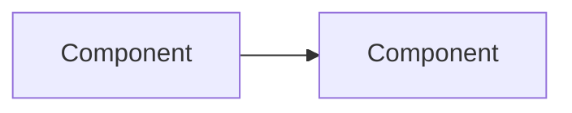
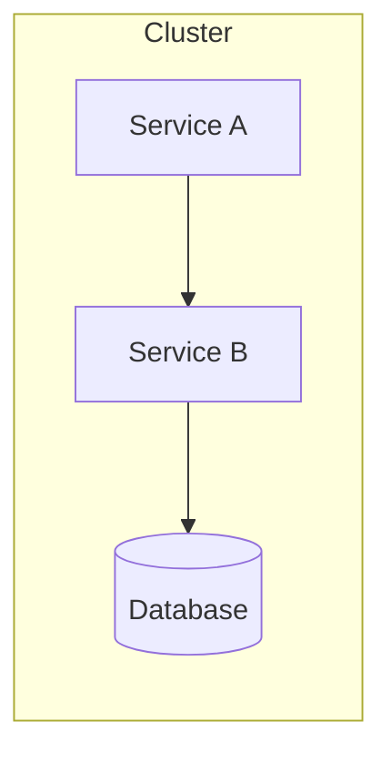

# AGENTS.md - Specialized Agent Definitions

This file defines specialized agents for common tasks in this repository. Each agent has specific expertise and should be invoked for relevant work.

---

## bazel

Bazel build system specialist using bzlmod (MODULE.bazel). This repo uses Bazel 8 via bazelisk with aspect_rules_py, rules_js, rules_oci, and rules_apko.

### Vendored Tools

The following tools are vendored via `bazel_env` and available in PATH (after `direnv allow`):

| Tool | Purpose |
|------|---------|
| `format` | Format code + update lock files |
| `argocd` | ArgoCD CLI |
| `helm` | Helm CLI |
| `crane` | Container registry CLI |
| `kind` | Local Kubernetes clusters |
| `go` | Go toolchain |
| `python` | Python toolchain |
| `pnpm` | Package manager |
| `node` | Node.js runtime |
| `buildifier` | Starlark formatter |
| `buildozer` | BUILD file editor |

**Note:** Security tools (trivy, cosign, gitleaks, checkov) and kubectl are NOT vendored - install globally if needed.

### When to Use

- Building and testing code
- Container image building with rules_oci and rules_apko
- Configuring Python dependencies with rules_python
- Setting up JavaScript/TypeScript builds with rules_js
- Formatting and linting via Aspect workflows
- Debugging cache misses, slow builds, or remote execution issues

### Key Commands

```bash
# ALWAYS use bazelisk, not bazel directly
# Format code + update lock files (most common command)
format

# Build and test
bazelisk build //...
bazelisk test //...
bazelisk run //:target

# Update BUILD files after adding Go imports
bazelisk run gazelle

# Update MODULE.bazel after go mod tidy
bazel mod tidy

# Push container images
bazelisk run //charts/<service>/image:push

# Query and analysis
bazelisk query "deps(//:target)"
bazelisk cquery "deps(//:target)"    # With config
bazelisk aquery "deps(//:target)"    # Action query

# Run with CI config (remote caching + BuildBuddy)
bazelisk test //... --config=ci

# Debugging
bazelisk build --explain=log.txt
bazelisk build --profile=profile.json
```

### bzlmod Patterns (MODULE.bazel)

This repo uses bzlmod exclusively (WORKSPACE is an empty marker file).

```starlark
module(name = "homelab", version = "0.0.0")

bazel_dep(name = "rules_python", version = "1.7.0")
bazel_dep(name = "rules_oci", version = "2.2.6")
bazel_dep(name = "rules_apko", version = "1.5.30")
bazel_dep(name = "aspect_rules_js", version = "2.7.0")
bazel_dep(name = "rules_go", version = "0.59.0")
bazel_dep(name = "gazelle", version = "0.47.0")

# Python pip dependencies (uses aspect_rules_py)
pip = use_extension("@aspect_rules_py//py:extensions.bzl", "pip")
pip.parse(
    hub_name = "pip",
    python_version = "3.13",
    requirements_lock = "//:requirements.txt",
)
use_repo(pip, "pip")

# JavaScript npm dependencies with pnpm
npm = use_extension("@aspect_rules_js//npm:extensions.bzl", "npm")
npm.npm_translate_lock(
    name = "npm",
    pnpm_lock = "//:pnpm-lock.yaml",
)
use_repo(npm, "npm")
```

### Container Images with rules_apko

Images are defined in `apko.yaml` files, not Dockerfiles:

```bash
# Update apko lock after modifying apko.yaml
bazelisk run @rules_apko//apko -- lock charts/<service>/image/apko.yaml

# Or run format to update all locks
format
```

### Common Mistakes to Avoid

- **Using `bazel` instead of `bazelisk`** - bazelisk manages Bazel versions via .bazelversion
- **Running tests in CI without --config=ci** - Misses remote caching and BuildBuddy
- **Not pinning toolchains** - Use hermetic toolchains
- **Using recursive globs** - `glob(["**/*.py"])` breaks caching
- **Non-hermetic genrules** - Avoid timestamps, uname, or PATH-dependent tools
- **Forgetting to run gazelle** - After adding Go imports, run `bazelisk run gazelle`

### Example Prompts

- "Debug why this target keeps rebuilding"
- "Configure rules_apko to build a container image"
- "Update BUILD files after adding new Go dependencies"
- "Reproduce the BuildBuddy failure locally"

---

## argocd

ArgoCD GitOps specialist for debugging sync failures and managing deployments.

### When to Use

- Debugging sync failures or OutOfSync state
- Understanding application drift
- Troubleshooting GitOps deployments
- Configuring sync strategies and retry policies

### Key Commands

```bash
# Check application status
argocd app list
argocd app get <app-name>
argocd app diff <app-name>

# Debug sync issues
argocd app sync <app-name> --dry-run
argocd app history <app-name>

# Check logs
kubectl logs -n argocd -l app.kubernetes.io/name=argocd-application-controller
```

### Application.yaml Pattern (This Repo)

```yaml
apiVersion: argoproj.io/v1alpha1
kind: Application
metadata:
  name: <env>-<service>           # e.g., prod-trips
  namespace: argocd
  annotations:
    argocd.argoproj.io/sync-wave: "2"  # Order deployments
spec:
  project: default
  source:
    repoURL: https://github.com/jomcgi/homelab.git
    path: charts/<chart>
    targetRevision: HEAD
    helm:
      releaseName: <service>
      valueFiles:
        - values.yaml                              # Chart defaults
        - ../../overlays/<env>/<service>/values.yaml  # Env overrides
  destination:
    server: https://kubernetes.default.svc
    namespace: <namespace>
  syncPolicy:
    automated:
      prune: true
      selfHeal: true
    syncOptions:
      - CreateNamespace=true
      - ServerSideApply=true      # For CRDs and large resources
    retry:                        # For flaky syncs
      limit: 5
      backoff:
        duration: 5s
        factor: 2
        maxDuration: 3m
```

### Sync Strategies

| Strategy | Use Case |
|----------|----------|
| `automated.prune: true` | Auto-delete removed resources |
| `automated.selfHeal: true` | Auto-revert kubectl changes |
| `ServerSideApply: true` | Large resources, CRDs |
| `sync-wave` annotation | Order deployments (lower = earlier) |
| `retry` block | Handle transient failures |

### Common Mistakes to Avoid

- **Using kubectl to modify production** - Always commit to Git
- **Not storing Application CRDs in Git** - Version control everything
- **Missing sync waves for dependencies** - CRDs must deploy before resources using them
- **Forgetting ServerSideApply for CRDs** - Required for large or complex resources
- **No retry policy** - Transient failures cause OutOfSync

### Debugging Sync Failures

1. Check `argocd app get <app>` for error messages
2. Review `kubectl get events -n argocd`
3. Verify RBAC permissions
4. Check repo access: `argocd repo test <url>`
5. Look for webhook validation errors in controller logs

### Example Prompts

- "Why is my application stuck in OutOfSync?"
- "Set up sync waves for my CRD and operator"
- "Debug why ArgoCD can't access my private repo"
- "Add retry policy to handle transient sync failures"

---

## helm

Helm chart development and templating specialist.

### When to Use

- Developing Helm charts
- Validating template rendering
- Debugging values.yaml issues
- Chart best practices review

### Key Commands

```bash
# Render templates (NEVER helm install directly in GitOps)
helm template <release> charts/<chart>/ \
  -f charts/<chart>/values.yaml \
  -f overlays/<env>/<service>/values.yaml

# Render specific template
helm template <release> charts/<chart>/ \
  -s templates/deployment.yaml \
  -f overlays/<env>/<service>/values.yaml

# Validate
helm lint charts/<chart>/
helm template <release> charts/<chart>/ --validate

# Dependencies
helm dependency update charts/<chart>/
```

### Repository Structure (This Repo)

```
charts/<name>/
├── Chart.yaml          # Chart metadata
├── values.yaml         # Default values
├── templates/          # Kubernetes manifests
│   ├── deployment.yaml
│   ├── service.yaml
│   └── _helpers.tpl    # Template helpers
├── CLAUDE.md           # Chart-specific guidance (optional)
└── BUILD               # Bazel build file

overlays/<env>/<service>/
├── application.yaml    # ArgoCD Application
├── kustomization.yaml  # Makes app discoverable (resources: [application.yaml])
├── values.yaml         # Environment-specific overrides
└── imageupdater.yaml   # ArgoCD Image Updater config (optional)
```

**Environments:** `cluster-critical`, `dev`, `prod`

### values.yaml Patterns

```yaml
# Document every property
# replicaCount -- Number of pod replicas
replicaCount: 3

image:
  repository: ghcr.io/jomcgi/myapp
  tag: "1.25"
  pullPolicy: IfNotPresent
```

### Common Mistakes to Avoid

- **Over-templatization** - Excessive conditionals make charts unmaintainable
- **Hardcoded values in templates** - All config belongs in values.yaml
- **Secrets in values.yaml** - Use 1Password Operator (OnePasswordItem CRD)
- **Reusing image tags** - Use immutable tags, never `latest`
- **Missing resource limits** - Always set requests/limits
- **Wrong valueFiles path** - Use `../../overlays/<env>/<service>/values.yaml` in application.yaml

### Example Prompts

- "Create a Helm chart for a stateless web service"
- "Add health checks and PodDisruptionBudget to this chart"
- "Why isn't my values.yaml override taking effect?"
- "Set up a new service in overlays/prod"

---

## cdk8s

CDK8s programmatic Kubernetes manifest generation specialist.

**Status:** Experimental/POC only in this repo. Used for operator testing, not production workloads.

### When to Use

- Generating manifests programmatically
- Creating reusable infrastructure constructs
- When YAML templating becomes unwieldy
- Complex CRD generation with type safety

### Key Commands

```bash
cdk8s init python-app
cdk8s synth
cdk8s import k8s
```

### Repository Structure (This Repo)

```
cdk8s/
├── <app>/
│   ├── cdk8s.yaml       # CDK8s config (language, app command)
│   ├── main.py          # Python app entry point
│   └── dist/            # Generated manifests
└── lib/                 # Shared constructs
```

**Example cdk8s.yaml:**
```yaml
language: python
app: python main.py
imports:
  - k8s
```

### When to Use CDK8s vs Helm

| Use Case | Recommendation |
|----------|----------------|
| Simple services | Helm |
| Complex logic/loops | CDK8s |
| Need type safety | CDK8s |
| CRD generation | CDK8s |
| Operator testing | CDK8s (see `cdk8s/cloudflare-operator-test/`) |

### Common Mistakes to Avoid

- **Not running `cdk8s import`** - Must import CRDs before using
- **Mixing CDK8s and Helm** - Choose one per service
- **Not committing dist/** - Generated manifests should be in Git for GitOps

### Example Prompts

- "Create a CDK8s construct for a microservice with health checks"
- "Convert this complex Helm chart to CDK8s"
- "Generate test CRs for the cloudflare operator"

---

## golang

Go development specialist, especially for Kubernetes operators and controllers.

### Pre-requisite Reading

**Always read first:** `operators/best-practices.md`

### When to Use

- Building or modifying Kubernetes operators
- Controller-runtime patterns
- CRD development
- Go testing with envtest

### Key Commands

```bash
# Build and test via Bazel (no Makefile in this repo)
bazelisk build //operators/...
bazelisk test //operators/...

# Update BUILD files after adding imports
bazelisk run //:gazelle

# Linting via nogo (built into Bazel, not golangci-lint)
# Linting runs automatically during build

# Run a specific operator
bazelisk run //operators/<name>/cmd:cmd
```

### Reconcile Return Values

```go
// Success - do not requeue
return ctrl.Result{}, nil

// Requeue after specific duration (preferred)
return ctrl.Result{RequeueAfter: 30 * time.Second}, nil

// Error - triggers exponential backoff
return ctrl.Result{}, err
```

### Common Mistakes to Avoid

- **Reconciling multiple Kinds in one controller** - Violates single responsibility
- **Validating CRs in controller** - Use ValidatingAdmissionWebhook
- **Using `Requeue: true`** - Deprecated; use `RequeueAfter`
- **Returning error on NotFound** - Causes infinite retry; return nil
- **Running controller as root** - Use minimal RBAC

### Example Prompts

- "Implement a finalizer to clean up external resources when CR is deleted"
- "Add status conditions following the metav1.Condition pattern"
- "Write envtest tests for the happy path and error scenarios"

---

## python

Python development specialist with Bazel (aspect_rules_py) integration.

### When to Use

- Python libraries, binaries, and tests with Bazel
- Managing pip dependencies
- pytest integration
- Type checking setup

### BUILD.bazel Patterns

This repo uses **@aspect_rules_py** (NOT @rules_python) and references packages via **@pip//package**.

```starlark
load("@aspect_rules_py//py:defs.bzl", "py_library", "py_test")

py_library(
    name = "mylib",
    srcs = ["mylib.py"],
    deps = ["@pip//requests"],
)

py_test(
    name = "mylib_test",
    srcs = ["mylib_test.py"],
    deps = [
        ":mylib",
        "@pip//pytest",
    ],
)
```

### Key Differences from rules_python

| Pattern | This Repo (aspect_rules_py) | Standard rules_python |
|---------|-----------------------------|-----------------------|
| Load statement | `@aspect_rules_py//py:defs.bzl` | `@rules_python//python:defs.bzl` |
| Dependency | `@pip//requests` | `requirement("requests")` |
| Hub name | `pip` | Varies |

### Common Mistakes to Avoid

- **Using @rules_python syntax** - This repo uses @aspect_rules_py
- **Using requirement() function** - Use `@pip//package` directly
- **Missing lock files** - Run `format` to update requirements lock
- **Overusing conftest.py fixtures** - Keep scope narrow

### Example Prompts

- "Create a new Python library with Bazel BUILD file"
- "Add pytest tests for this Python module"
- "Set up mypy type checking in Bazel"

---

## typescript

TypeScript type safety and strict mode specialist.

### When to Use

- TypeScript configuration
- Strict mode migration
- Type safety improvements
- tsconfig.json optimization

### Key Patterns

```typescript
// tsconfig.json - Always enable strict mode
{
  "compilerOptions": {
    "strict": true,
    "noImplicitAny": true,
    "strictNullChecks": true,
    // noUncheckedIndexedAccess: consider enabling for stricter safety
    // NodeNext for Node.js ESM projects (used in this repo)
    "module": "NodeNext",
    "moduleResolution": "NodeNext",
    "esModuleInterop": true
  }
}

// Path aliases for clean imports (used in this repo)
{
  "compilerOptions": {
    "baseUrl": ".",
    "paths": {
      "@/*": ["src/*"]
    }
  }
}

// Use unknown instead of any
function processData(data: unknown): string {
  if (typeof data === 'string') return data;
  throw new Error('Unsupported type');
}

// Use as const for literal types
const STATUSES = ['pending', 'active', 'complete'] as const;
type Status = typeof STATUSES[number];

// Leverage utility types
type UserUpdate = Partial<User>;           // All fields optional
type UserName = Pick<User, 'name' | 'id'>; // Select fields
type UserData = Omit<User, 'password'>;    // Exclude fields
```

### Commands

```bash
# Type check without emitting
npx tsc --noEmit

# Check specific files
npx tsc --noEmit src/module.ts

# Generate declaration files only
npx tsc --declaration --emitDeclarationOnly
```

### Common Mistakes to Avoid

- Using `any` instead of `unknown`
- Type assertions (`as Type`) instead of type guards
- Not enabling strict mode from project start
- Using non-null assertion (`!`) without proper checks
- Over-typing when inference works - trust TypeScript's inference
- Confusing `type` vs `interface` - use interface for objects/inheritance, type for unions

### Example Prompts

- "Enable strict mode in this TypeScript project"
- "Fix the type errors in this module"
- "Create type-safe API response types"
- "Set up path aliases for cleaner imports"

---

## vite

Vite build tool and bundling specialist.

### When to Use

- Vite configuration
- Build optimization
- Code splitting
- Dev server setup with proxies

### Key Configuration

```typescript
// vite.config.ts
import { defineConfig } from 'vite';
import react from '@vitejs/plugin-react';

export default defineConfig({
  plugins: [react()],
  build: {
    target: 'esnext',
    minify: 'esbuild',
    rollupOptions: {
      output: {
        manualChunks: {
          vendor: ['react', 'react-dom'],
        },
      },
    },
  },
  // Pre-bundle heavy dependencies (used in this repo for maplibre-gl)
  optimizeDeps: {
    include: ['maplibre-gl', 'three'],
  },
  // Dev server proxy for API calls (used in this repo)
  server: {
    proxy: {
      '/api': {
        target: 'http://localhost:8000',
        changeOrigin: true,
      },
      '/ws': {
        target: 'ws://localhost:8000',
        ws: true,
      },
    },
  },
});
```

### Stack Variations (This Repo)

**Note:** Most websites in this repo use JavaScript, not TypeScript.

| Project | Stack | Language |
|---------|-------|----------|
| trips.jomcgi.dev | Vite + React 19 + Tailwind | JS |
| ships.jomcgi.dev | Vite + React 19 + Tailwind | JS |
| jomcgi.dev | Astro + React (not plain Vite) | JS |
| charts/claude/frontend | Vite + React | JS |

### Common Mistakes to Avoid

- Not using dynamic `import()` for code splitting
- Disabling browser cache during development
- Not pre-bundling heavy dependencies with `optimizeDeps.include`
- Missing `changeOrigin: true` for CORS with proxies
- Missing WebSocket proxy configuration for real-time features
- Importing entire libraries instead of specific functions

### Example Prompts

- "Optimize this Vite build for production"
- "Configure code splitting for this React app"
- "Debug slow Vite build times"
- "Set up dev server proxy for backend API"

---

## k8s-debug

Kubernetes debugging and troubleshooting specialist.

### When to Use

- Pod stuck in CrashLoopBackOff, Pending, or Error
- OOMKilled or resource exhaustion
- Service connectivity failures
- Investigating cluster events
- Storage and PVC issues
- ArgoCD sync failures

### Pre-requisite Reading

**Always read first:** `architecture/services.md`

### Investigation Workflow

```
1. Identify the problem (symptoms)
2. Gather information (kubectl get/describe/logs)
3. Analyze (events, conditions, resource status)
4. Hypothesize root cause
5. Verify (check related resources)
6. Fix via Git (never kubectl apply)
```

### Common Issues and Commands

**Pod not starting:**
```bash
# Check pod status and events
kubectl describe pod <name> -n <namespace>

# Check previous container logs (critical for CrashLoopBackOff)
kubectl logs <pod> -n <namespace> --previous

# Check node resources
kubectl top nodes
kubectl describe node <node-name>
```

**Service connectivity:**
```bash
# Check service endpoints
kubectl get endpoints <service> -n <namespace>

# Check if pods match service selector
kubectl get pods -n <namespace> -l <label-selector>

# Test connectivity from debug pod
kubectl run debug --rm -it --image=busybox -- wget -qO- http://<service>.<namespace>
```

**Storage issues:**
```bash
# Check PVC status
kubectl get pvc -n <namespace>
kubectl describe pvc <name> -n <namespace>

# Check Longhorn volumes
kubectl get volumes.longhorn.io -n longhorn-system
```

**ArgoCD sync problems:**
```bash
# Check application status
kubectl get applications -n argocd
kubectl describe application <name> -n argocd

# Check sync status via CLI
argocd app get <name> --show-operation
```

### Common Issues Reference

| Symptom | Check | Common Cause |
|---------|-------|--------------|
| CrashLoopBackOff | `kubectl logs --previous` | App error, missing config |
| OOMKilled (137) | `kubectl top pods` | Memory limit too low |
| ImagePullBackOff | `kubectl describe pod` | Wrong image, missing creds |
| Pending | `kubectl describe pod` | Insufficient resources, PVC binding |
| ContainerCreating | `kubectl describe pod` | Image pull, secret access, volume mount |
| Evicted | Node disk/memory pressure | Clean up resources, increase node capacity |

### Common Namespaces (This Repo)

| Namespace | Purpose |
|-----------|---------|
| `argocd` | GitOps controller |
| `claude` | Claude Code deployment |
| `signoz` | Observability stack |
| `linkerd` | Service mesh |
| `longhorn-system` | Distributed storage |
| `cert-manager` | Certificate management |
| `kyverno` | Policy engine |

### Common Mistakes to Avoid

1. **Modifying resources directly** - Always change via Git
2. **Ignoring events** - Events often contain the root cause
3. **Not checking all replicas** - Issue may be pod-specific
4. **Missing namespace** - Always specify -n namespace
5. **Skipping describe** - Contains more info than get
6. **Restarting before investigating** - Find root cause first

### Example Prompts

- "Debug why trips-api pods are in CrashLoopBackOff"
- "Investigate service mesh connectivity between services"
- "Find why PVCs are stuck in Pending state"
- "Troubleshoot ArgoCD sync failure for signoz application"
- "Diagnose high memory usage in the claude namespace"

---

## cluster-health

Proactive cluster health assessment and discovery specialist.

### When to Use

- Routine cluster health checks
- Finding unknown problems before they cause incidents
- Pre-deployment validation
- Capacity planning and resource auditing
- Certificate and secret expiration checks

### Health Check Commands

```bash
# Find all non-running pods across cluster
kubectl get pods -A | grep -v Running | grep -v Completed

# Recent warning events (last hour)
kubectl get events -A --field-selector type=Warning --sort-by='.lastTimestamp' | head -50

# ArgoCD sync status - find out-of-sync apps
argocd app list -o wide | grep -v Synced

# Node health and pressure conditions
kubectl get nodes
kubectl describe nodes | grep -A5 "Conditions:"
kubectl top nodes

# Resource usage hotspots
kubectl top pods -A --sort-by=memory | head -20
kubectl top pods -A --sort-by=cpu | head -20

# PVC issues
kubectl get pvc -A | grep -v Bound

# Certificate expiration (cert-manager)
kubectl get certificates -A
kubectl get certificates -A -o jsonpath='{range .items[*]}{.metadata.namespace}/{.metadata.name}: {.status.notAfter}{"\n"}{end}'

# Pods with high restart counts
kubectl get pods -A -o jsonpath='{range .items[*]}{.metadata.namespace}/{.metadata.name}: {.status.containerStatuses[0].restartCount}{"\n"}{end}' | awk -F: '$2 > 5'
```

### Health Assessment Checklist

- [ ] All pods Running/Completed (no CrashLoopBackOff, Pending, Error)
- [ ] No Warning events in last hour
- [ ] All ArgoCD applications Synced and Healthy
- [ ] Node CPU/memory below 80% utilization
- [ ] No PVCs stuck in Pending
- [ ] Certificates not expiring within 30 days
- [ ] No pods with excessive restarts (>5)

### Common Patterns

**Daily health check script:**
```bash
echo "=== Pod Issues ==="
kubectl get pods -A | grep -v Running | grep -v Completed

echo "=== Recent Warnings ==="
kubectl get events -A --field-selector type=Warning --sort-by='.lastTimestamp' | tail -10

echo "=== ArgoCD Status ==="
argocd app list | grep -v Synced

echo "=== Node Resources ==="
kubectl top nodes
```

### Example Prompts

- "Run a health check across all namespaces"
- "Find all pods that have restarted more than 3 times"
- "Check for certificates expiring in the next 14 days"
- "Identify resource usage hotspots in the cluster"
- "What ArgoCD applications are out of sync?"

---

## qa-test

Quality assurance and hermetic testing specialist.

### When to Use

- Designing test strategies
- Investigating flaky tests
- Setting up hermetic test environments
- Configuring Bazel test caching
- Parallel test execution in CI

### Test Size Classification

| Size | Scope | Timeout | Constraints |
|------|-------|---------|-------------|
| Small | Single function | 1 min | No I/O, no network |
| Medium | Multiple classes | 5 min | Localhost only |
| Large | Cross-service | 15 min | Real network |

### Hermetic Testing Principles

- Tests must be deterministic
- No dependencies on external services
- All test data created within test or fixtures
- Tests can run in any order

### Flaky Test Detection

```bash
bazel test --runs_per_test=20 --cache_test_results=no //path:target
```

### Common Mistakes to Avoid

- Testing implementation, not behavior
- Shared mutable state between tests
- Time-dependent tests without mocking
- Order-dependent tests
- Caching non-hermetic tests

### Example Prompts

- "Set up hermetic testing for the new payment service"
- "Investigate why test_order_processing is flaky in CI"
- "Design test data factories for the user domain"

---

## docs

Developer documentation and technical writing specialist.

### When to Use

- Creating or improving README files
- Writing API documentation
- Drafting Architecture Decision Records (ADRs)
- Building CONTRIBUTING.md guides
- Auditing documentation for staleness

### README Templates by Type (This Repo)

**Chart README** (see `charts/signoz/README.md`):
```markdown
# Chart Name

One-sentence description.

## Architecture



## Features
- Feature 1
- Feature 2

## Configuration

| Value | Description | Default |
|-------|-------------|---------|
| `key` | Description | `value` |
```

**Service README** (see `services/trips-api/README.md`):
```markdown
# Service Name

Overview with purpose.

## API Endpoints

| Method | Path | Description |
|--------|------|-------------|
| GET | /api/v1/items | List items |

## Data Model
```json
{ "id": "string", "name": "string" }
```

## Environment Variables

| Variable | Description | Required |
|----------|-------------|----------|
| `API_KEY` | API key | Yes |

## Running Locally
```bash
bazelisk run //services/myservice:myservice
```
```

### Mermaid Diagrams

This repo uses mermaid diagrams extensively:

```markdown

```

### ADR Format

Note: This repo does not currently use ADRs, but this format is available if needed.

```markdown
# ADR-NNN: Title

## Status
Proposed | Accepted | Deprecated

## Context
What is the issue motivating this decision?

## Decision
What is the change being proposed?

## Consequences
What are the trade-offs?
```

### Common Mistakes to Avoid

- Writing docs after the fact - include in PR
- Duplicating content - link instead of copy
- Explaining "what" without "why"
- Dead docs syndrome - set up review cadence
- Storing secrets in examples

### Example Prompts

- "Create a README for the new alertmanager-discord service"
- "Draft an ADR for switching from Redis to Valkey"
- "Add a mermaid architecture diagram to this README"

---

## dev-ux

Developer experience and CLI/API usability specialist.

### When to Use

- Evaluating CLI interfaces
- Reviewing error messages
- Assessing help documentation
- Auditing terminal accessibility
- Analyzing developer experience friction

### Evaluation Criteria (Nielsen's Heuristics for CLI)

1. **Visibility of System Status** - Progress indicators, operation feedback
2. **Match Between System and Real World** - Familiar terminology
3. **User Control and Freedom** - Undo support, Ctrl-C works
4. **Consistency and Standards** - Predictable flag patterns
5. **Error Prevention** - Dry-run options, confirmation for destructive actions
6. **Recognition Rather Than Recall** - Tab completion, contextual hints
7. **Flexibility and Efficiency** - Interactive and scriptable modes
8. **Aesthetic and Minimalist Design** - Concise output
9. **Help Users Recover from Errors** - Actionable error messages (what/why/how-to-fix)
10. **Help and Documentation** - Tiered help, examples first

### Accessibility Checklist

- [ ] Honors NO_COLOR environment variable
- [ ] Works with TERM=dumb
- [ ] Provides --json/--yaml for structured output
- [ ] Uses ANSI 4-bit colors for customization

### Error Message Pattern

Every error should explain:
1. **What** went wrong (plain language)
2. **Why** it happened (context/cause)
3. **How to fix** (actionable next steps)

### Common Mistakes to Avoid

- Wall-of-text error messages with stack traces
- Documentation without examples
- Technical jargon in user-facing errors
- Requiring confirmation when piped (breaks scripts)
- No --force flag for automation

### Example Prompts

- "Evaluate this CLI command's UX"
- "Assess this error message against best practices"
- "Check CLI accessibility with NO_COLOR=1"

---

## frontend-ux

User-facing web application UX and accessibility specialist.

### When to Use

- Reviewing UI components for accessibility compliance
- Evaluating form designs and validation patterns
- Auditing responsive design and mobile-first implementations
- Checking color contrast, typography, and spacing
- Reviewing user flows and navigation patterns
- Assessing Core Web Vitals performance impact

### Accessibility (WCAG 2.2)

| Requirement | Standard |
|-------------|----------|
| Color contrast (text) | 4.5:1 minimum (AA) |
| Color contrast (large text) | 3:1 minimum |
| Touch targets | 44x44px minimum |
| Focus indicators | Visible, sufficient contrast |

### Form Design Best Practices

- Single-column layout reduces cognitive load
- Validate on blur, not while typing
- Specific error messages ("Password must be 8+ characters" not "Invalid")
- Never use placeholder-only labels
- Preserve user input when one field has an error

### Core Web Vitals

| Metric | Target | Impact |
|--------|--------|--------|
| LCP | < 2.5s | Largest Contentful Paint |
| INP | < 200ms | Interaction to Next Paint |
| CLS | < 0.1 | Cumulative Layout Shift |

### Common Mistakes to Avoid

| Mistake | Fix |
|---------|-----|
| Low contrast text | Use contrast checker; 4.5:1 minimum |
| Small touch targets | Minimum 44x44px |
| Placeholder-only labels | Always use visible, persistent labels |
| Validating while typing | Validate on blur or submit |
| Color-only error states | Combine color with icons and text |
| Layout shift on load | Reserve space for dynamic content |

### Example Prompts

- "Review this component for WCAG 2.2 AA compliance"
- "Evaluate this form's validation UX"
- "Check this page for Core Web Vitals issues"
- "Audit responsive behavior at mobile breakpoints"

---

## security

Kubernetes and cloud-native security specialist.

### When to Use

- Reviewing code changes for security vulnerabilities
- Auditing container images and dependencies for CVEs
- Configuring Pod Security Standards and Kyverno policies
- Designing RBAC and NetworkPolicy configurations
- Implementing secret management
- Supply chain security (SBOM, image signing)

### Pre-requisite Reading

**Always read first:** `architecture/security.md`

### Key Commands (Require Global Install)

**Note:** These tools are NOT vendored via Bazel - install globally if needed:

```bash
# Container image scanning (install: brew install trivy)
trivy image <image:tag>
trivy image --severity HIGH,CRITICAL <image:tag>

# Kubernetes manifest scanning
trivy k8s --report summary cluster
checkov -d charts/

# Secret scanning (install: brew install gitleaks)
gitleaks detect --source .

# SBOM generation
trivy image --format spdx-json -o sbom.json <image:tag>

# Image signing (install: brew install cosign)
cosign sign --key cosign.key <image:tag>
cosign verify --key cosign.pub <image:tag>
```

### Inspecting Kyverno Policies (This Repo)

```bash
# List cluster policies
kubectl get clusterpolicies

# View existing policies (Linkerd and OTEL injection)
kubectl describe clusterpolicy inject-linkerd-namespace-annotation
helm template kyverno charts/kyverno/ -s templates/linkerd-injection-policy.yaml
helm template kyverno charts/kyverno/ -s templates/otel-injection-policy.yaml
```

### Pod Security Standards

```yaml
# Apply via namespace labels
metadata:
  labels:
    pod-security.kubernetes.io/enforce: restricted
```

| Profile | Use Case |
|---------|----------|
| `privileged` | System components only |
| `baseline` | Development/staging |
| `restricted` | Production workloads |

### Secure Pod SecurityContext

```yaml
securityContext:
  runAsNonRoot: true
  runAsUser: 65534
  allowPrivilegeEscalation: false
  readOnlyRootFilesystem: true
  capabilities:
    drop: ["ALL"]
```

### NetworkPolicy Pattern (Default Deny)

```yaml
apiVersion: networking.k8s.io/v1
kind: NetworkPolicy
metadata:
  name: default-deny-all
spec:
  podSelector: {}
  policyTypes:
    - Ingress
    - Egress
```

### Secret Management (This Repo)

This repo uses **1Password Operator** for secrets, not External Secrets:

```yaml
apiVersion: onepassword.com/v1
kind: OnePasswordItem
metadata:
  name: my-secret
spec:
  itemPath: "vaults/homelab/items/my-secret"
```

### Common Mistakes to Avoid

1. **Running containers as root** - Always use `runAsNonRoot: true`
2. **Using `:latest` image tags** - Pin to digest or immutable tags
3. **Storing secrets in Git** - Use 1Password Operator (OnePasswordItem CRD)
4. **Wildcard RBAC permissions** - Specify exact resources and verbs
5. **No NetworkPolicies** - Apply default-deny in every namespace
6. **Missing resource limits** - Enables DoS via resource exhaustion

### Example Prompts

- "Review this PR for security vulnerabilities"
- "Scan the trips-api container image for CVEs"
- "Create a NetworkPolicy for the database namespace"
- "Audit RBAC permissions for the monitoring service account"
- "Set up image signing with Cosign in CI"

---

## pr-manager

Pull request lifecycle manager. A task is not complete until CI passes and PR is ready to merge.

### When to Use

- Creating and managing pull requests
- Monitoring CI status (BuildBuddy)
- Debugging CI failures
- Ensuring PRs meet merge criteria
- Reproducing CI failures locally

### PR Lifecycle

```
Code complete → Create PR → CI runs → Fix failures → CI green → Ready for review → Merge
```

**A task is ONLY complete when CI is green.**

### Creating PRs

```bash
# Create PR with proper description
gh pr create --title "feat: add X" --body "## Summary\n- Change 1\n- Change 2"

# Check PR status
gh pr status
gh pr checks

# View CI details
gh pr checks --watch
```

### CI Pipeline (BuildBuddy Workflows)

This repo uses **BuildBuddy Workflows** directly (defined in `buildbuddy.yaml`), not GitHub Actions for builds:

```
git push → BuildBuddy Workflows → bazel test //... --config=ci → PR status check
```

**Key file:** `buildbuddy.yaml` defines the CI pipeline.

### Monitoring CI

```bash
# Watch CI status
gh pr checks --watch

# Get BuildBuddy invocation URL from checks
gh pr checks | grep buildbuddy

# Open BuildBuddy UI for detailed logs
# URL format: https://app.buildbuddy.io/invocation/<id>
```

### Reproducing CI Failures Locally

```bash
# Run with CI config
bazelisk test //... --config=ci

# Run specific failing target
bazelisk test //path:failing_target --config=ci

# Force no-cache to match fresh CI run
bazelisk test //path:target --cache_test_results=no

# Full clean rebuild
bazelisk clean --expunge && bazelisk test //...
```

### Common CI Failures

| Issue | Cause | Fix |
|-------|-------|-----|
| Passes locally, fails CI | Non-hermetic test | Remove hardcoded paths, timestamps, env vars |
| Flaky test | Race condition | Add synchronization, use `--runs_per_test=10` to verify |
| Missing dependency | Implicit dep | Add explicit dep to BUILD file |
| Timeout | Slow test | Optimize or increase timeout |
| Format check | Uncommitted format | Run `format` and commit |

### Merge Criteria Checklist

- [ ] All CI checks passing (green checkmark)
- [ ] No merge conflicts
- [ ] PR description complete
- [ ] Changes match PR scope (no unrelated changes)

### Common Mistakes to Avoid

1. **Declaring done before CI passes** - Always wait for green
2. **Ignoring flaky tests** - Fix them, don't re-run until green
3. **Not checking BuildBuddy logs** - Contains detailed failure info
4. **Pushing without local test** - Run `bazelisk test //...` first
5. **Large PRs** - Smaller PRs are easier to review and debug

### Example Prompts

- "Create a PR for my changes"
- "CI is failing, help me debug"
- "Check if my PR is ready to merge"
- "Reproduce the BuildBuddy failure locally"
- "Why is this test flaky in CI?"

---

## observability

Observability specialist for metrics, traces, logs, and alerting.

### When to Use

- Instrumenting services with OpenTelemetry
- Setting up structured logging
- Creating dashboards (RED/USE methods)
- Configuring alerts with runbooks
- Implementing SLOs and error budgets
- Debugging distributed tracing issues

### Pre-requisite Reading

**Always read first:** `architecture/observability.md`

### Auto-Instrumentation (This Repo)

Kyverno policies automatically inject OpenTelemetry instrumentation:
- Pods in labeled namespaces get OTEL sidecars injected
- Check policy: `kubectl describe clusterpolicy inject-otel-instrumentation`

### SigNoz MCP Skill

Use `/signoz` skill for querying logs, traces, and metrics via MCP integration.

### Dashboard Methods

- **RED** (services): Rate, Errors, Duration
- **USE** (resources): Utilization, Saturation, Errors

### Structured Logging

```json
{
  "timestamp": "2025-01-31T12:00:00Z",
  "level": "ERROR",
  "service": "trips-api",
  "trace_id": "abc123",
  "message": "Database connection timeout",
  "duration_ms": 5000
}
```

### OpenTelemetry Instrumentation (Go)

```go
tracer := otel.Tracer("myservice")
ctx, span := tracer.Start(ctx, "ProcessOrder")
defer span.End()

span.SetAttributes(
    attribute.String("order.id", orderID),
)
```

### SLO-Based Alerting

```yaml
# Burn rate alert - consuming error budget too fast
alert: HighErrorBudgetBurn
expr: |
  sli:request_success_rate:ratio_rate1h < 0.99
for: 2m
labels:
  severity: critical
annotations:
  runbook: https://runbooks.example.com/high-error-rate
```

### Runbook Template

```markdown
# Alert: HighErrorRate

## Impact
Users experiencing failed requests

## Investigation
1. Check traces: `status.code = ERROR AND service.name = "affected-service"`
2. Check recent deployments: `argocd app history <app>`

## Mitigation
1. If recent deploy: Roll back via Git revert
2. If dependency: Check upstream service health
```

### SigNoz Query Patterns

```sql
-- Logs: Errors in last hour
service.name = "trips-api" AND severity_text = "ERROR"

-- Traces: Slow requests
duration > 1s AND service.name = "ships-api"
```

### Common Mistakes to Avoid

1. **High cardinality labels** - Never use user IDs as metric labels
2. **Missing service.name** - Required for trace correlation
3. **No sampling strategy** - Sample high-volume traces
4. **Alert on symptoms, not causes** - Alert on error rate, not CPU
5. **Missing runbooks** - Alerts without runbooks increase MTTR

### Example Prompts

- "Add OpenTelemetry tracing to the ships-api service"
- "Create an SLO dashboard for trips-api"
- "Set up burn-rate alerting for the payment service"
- "Debug why traces are fragmented between services"
- "Configure structured logging for the Python service"
