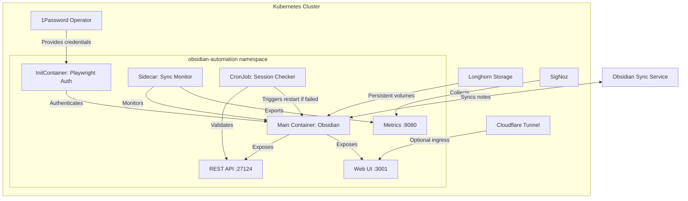

# obsidian-automation - Task 5

Execute task 5 for the obsidian-automation specification.

## Task Description
Create StatefulSet template in charts/obsidian-automation/templates/statefulset.yaml

## Code Reuse
**Leverage existing code**: structure.md labels/annotations patterns

## Requirements Reference
**Requirements**: 3.3, 9.1, 9.5

## Usage
```
/Task:5-obsidian-automation
```

## Instructions

Execute with @spec-task-executor agent the following task: "Create StatefulSet template in charts/obsidian-automation/templates/statefulset.yaml"

```
Use the @spec-task-executor agent to implement task 5: "Create StatefulSet template in charts/obsidian-automation/templates/statefulset.yaml" for the obsidian-automation specification and include all the below context.

# Steering Context
## Steering Documents Context (Pre-loaded)

### Product Context
# Product Steering Document

## Vision
A personal Kubernetes homelab that serves as both a platform for running useful services and a learning environment for mastering Kubernetes operators and SRE best practices.

## Primary User
- **Individual developer** (solo user)
- Some public-facing websites for general access
- Selected services exposed to friends on request

## Core Objectives
1. **Learning Platform**: Deep understanding of Kubernetes operators and SRE best practices
2. **Service Hosting**: Reliable platform for personal tools and automation
3. **Experimentation**: Easy deployment of new tools and technologies as discovered
4. **Observability**: Know immediately when things break, measure everything

## Current Services
- **Hiking Route Finder** (hikes.jomcgi.dev) - Public website for finding Scottish hikes with good weather
- **Workflow Automation** (N8N) - Process automation and integrations

## Planned Services
1. **N8N Workflows** - Advanced automation and integration platform
2. **Obsidian Server** - Linux server running Obsidian with official sync
   - Plugin for API exposure to automate note interactions
3. **AIS Maritime Streaming** - Real-time vessel tracking for local bay
   - Clickhouse for time-series data storage
   - NATS JetStream for message streaming
   - Visualization service for maritime data
4. **Future Integrations**:
   - Obsidian Sync (official paid service)
   - Various LLM providers for AI capabilities

## Success Metrics
- **Availability**: Personal use tolerates downtime, but alerts are critical
- **Observability**: Complete visibility into system health and performance
- **Response Times**: Web requests must be fast, batch processing can be slow
- **SLOs**: Defined service level objectives to prioritize improvement efforts
- **Learning Velocity**: Regular deployment of new operators and services

## Key Constraints
- **Single User**: No multi-tenancy or user management complexity
- **Resource Aware**: Must work within cluster constraints (currently 3x 12CPU/16GB nodes)
- **Security First**: Zero internet exposure except through Cloudflare tunnels
- **Simplicity**: Prefer simple, understandable solutions over complex ones

## Product Principles
1. **Easy Deployment**: New tools should be deployable with minimal friction
2. **Observable by Default**: Every service must expose metrics and health status
3. **Secure by Design**: All services follow zero-trust security model
4. **Learning Focused**: Choose technologies that advance SRE/operator knowledge
5. **Pragmatic Choices**: Personal use allows for practical trade-offs

---

### Technology Context
# Technology Steering Document

## Core Platform
- **Operating System**: Talos Linux (immutable, secure Kubernetes OS)
- **Orchestration**: Kubernetes v1.33.0+
- **GitOps**: ArgoCD for declarative deployments
- **Package Management**: Helm charts + Kustomize overlays

## Languages & Frameworks
- **Go 1.24+**: Kubernetes operators, system services
- **Python 3.11+**: Data processing, API services, streaming applications
- **JavaScript/Node.js 20+**: Testing, static sites
- **Style Guides**: Google's style guides for all languages

## Infrastructure Components

### Storage & Persistence
- **Distributed Storage**: Longhorn with automated backups
- **Time-Series DB**: Clickhouse (planned for AIS maritime data)
- **Message Streaming**: NATS JetStream (planned for AIS pipeline)
- **Object Storage**: Cloudflare R2 for static assets

### Networking & Security
- **Ingress**: Cloudflare Tunnel (Zero Trust, no open ports)
- **Secret Management**: 1Password Operator with OnePasswordItem CRDs
- **Container Security**: Non-root, read-only filesystems, dropped capabilities
- **DNS & CDN**: Cloudflare with automatic HTTPS

### Observability Stack
- **All-in-One**: SigNoz for metrics, logs, and traces
- **Metrics**: Prometheus-compatible metrics collection
- **Logging**: Structured logs with OpenTelemetry
- **Tracing**: Distributed tracing via OpenTelemetry
- **SLOs**: Service Level Objectives for response time tracking

## Resource Constraints
- **Current Cluster**: 3 nodes × 12 CPU cores × 16GB RAM each
- **Future Upgrade**: Potentially 64GB RAM per node for streaming workloads
- **Performance Requirements**:
  - Web requests: Fast response times (define SLOs)
  - Batch processing: Can be slow
  - Streaming: Near real-time for AIS data

## Third-Party Services
- **Current**:
  - Cloudflare (tunnels, DNS, CDN, Pages, R2)
  - 1Password (secret management)
  - GitHub (code, containers, actions)
  - Norwegian Meteorological Institute (weather API)
- **Planned**:
  - Obsidian Sync (official note synchronization)
  - LLM Providers (OpenAI, Anthropic, Google)

## Development Practices
- **CI/CD**: GitHub Actions for automated testing
- **Container Registry**: GitHub Container Registry (GHCR)
- **Testing**:
  - Playwright for end-to-end testing
  - BDD tests asserting behavior via public interfaces
  - Integration tests on actual deployments (no mocks)
  - No unit tests unless absolutely necessary
- **Local Development**: Minikube for testing deployments

## Deployment Strategy
- **GitOps Workflow**: All changes via Git commits
- **Helm Charts**: Application packaging in `charts/`
- **ArgoCD Apps**: Cluster configs in `clusters/homelab/`
- **Operators**: Custom operators in `operators/`, deployed via Git-referenced Helm charts
- **Self-Healing**: Automatic drift correction via ArgoCD

## Technical Principles
1. **Simplicity First**: Choose boring technology that works
2. **Observable by Default**: All services export metrics on `/metrics`
3. **Idempotent Operations**: Apply configurations multiple times safely
4. **Graceful Degradation**: Services work without optional dependencies
5. **Deep Modules**: Simple interfaces hiding complex implementations

## Architecture Decisions
- **Zero Trust Security**: No direct internet exposure
- **Declarative Everything**: Infrastructure as code
- **Immutable Infrastructure**: No in-place updates
- **Service Mesh**: Not needed for single-user setup
- **Multi-tenancy**: Not required, single namespace approach

## Current State
- **All services managed via ArgoCD**: No legacy deployments
- **Fully GitOps**: Every deployment tracked in Git
- **Operators First**: Custom operators for complex resources

---

### Structure Context
# Structure Steering Document

## Directory Organization

```
homelab/
├── .claude/                    # Claude Code configuration
│   ├── agents/                 # Custom Claude agents
│   ├── commands/               # Custom slash commands
│   ├── specs/                  # Specification documents
│   ├── steering/               # Steering documents (this directory)
│   └── CLAUDE.md              # Project-specific Claude instructions
│
├── charts/                     # Helm charts for applications
│   ├── argocd/                # ArgoCD deployment
│   ├── cloudflare-tunnel/     # Ingress tunnel configuration
│   ├── n8n/                   # Workflow automation
│   └── signoz/                # Observability platform
│
├── clusters/                   # ArgoCD cluster configurations
│   └── homelab/               # Production cluster
│       ├── argocd/            # ArgoCD self-management
│       ├── cloudflare-tunnel/ # Tunnel application
│       ├── longhorn/          # Storage application
│       ├── n8n/               # N8N workflow automation
│       └── signoz/            # SigNoz observability
│
├── operators/                  # Custom Kubernetes operators
│   └── cloudflare/            # Cloudflare resource operator
│       ├── api/               # CRD API definitions
│       ├── cmd/               # Operator entrypoint
│       ├── controllers/       # Reconciliation logic
│       ├── helm/              # Operator Helm chart
│       └── tests/             # BDD/integration tests
│
├── overlays/                   # Kustomize environment configs
│   ├── base/                  # Base configurations
│   ├── dev/                   # Development environment
│   └── homelab-prod/          # Production environment
│
└── websites/                   # Static websites
    ├── hikes.jomcgi.dev/      # Hiking route finder
    └── jomcgi.dev/            # Personal homepage
```

## File Naming Conventions

### Kubernetes Manifests
- **Helm Charts**: `Chart.yaml`, `values.yaml`, `templates/*.yaml`
- **Kustomize**: `kustomization.yaml`, `patches/*.yaml`
- **ArgoCD**: `application.yaml` or `app.yaml`
- **ConfigMaps**: `*-config.yaml` or `*-configmap.yaml`
- **Secrets**: `*-secret.yaml` (using OnePasswordItem CRDs)

### Source Code
- **Go Files**: `snake_case.go` for files, `CamelCase` for types
- **Python Files**: `snake_case.py` following PEP 8
- **JavaScript**: `camelCase.js` or `kebab-case.js` for files
- **Tests**: `*_test.go`, `test_*.py`, `*.test.js`

### Documentation
- **README Files**: `README.md` in each major directory
- **API Docs**: `api.md` or inline godoc comments
- **Specs**: `.claude/specs/<feature-name>.md`

## Code Organization Patterns

### Helm Charts (`charts/<name>/`)
```
<name>/
├── Chart.yaml              # Chart metadata
├── values.yaml             # Default values
├── values.dev.yaml         # Development overrides
├── values.prod.yaml        # Production overrides
├── templates/
│   ├── deployment.yaml     # Main deployment
│   ├── service.yaml        # Service definition
│   ├── ingress.yaml        # Ingress rules
│   ├── configmap.yaml      # Configuration
│   └── _helpers.tpl        # Template helpers
└── tests/
    └── integration_test.go # BDD integration tests
```

### Operators (`operators/<name>/`)
```
<name>/
├── api/
│   └── v1alpha1/
│       ├── types.go        # CRD type definitions
│       └── zz_generated.go # Generated deepcopy
├── cmd/
│   └── main.go            # Operator entrypoint
├── controllers/
│   ├── controller.go      # Main reconciliation
│   └── controller_test.go # BDD controller tests
├── helm/
│   └── <name>/            # Operator Helm chart
├── config/
│   ├── crd/               # CRD manifests
│   └── rbac/              # RBAC definitions
└── go.mod                 # Go module definition
```

### ArgoCD Applications (`clusters/homelab/<name>/`)
```
<name>/
├── application.yaml        # ArgoCD Application
├── values.yaml            # Helm value overrides
└── kustomization.yaml     # Optional Kustomize config
```

## Testing Structure

### BDD Test Organization
- **Feature Files**: `tests/features/*.feature` (if using Gherkin)
- **Step Definitions**: `tests/steps/*_steps.go` or `*_steps.py`
- **Integration Tests**: `tests/integration/*_test.go`
- **End-to-End**: `tests/e2e/*.spec.js` (Playwright)

### Test Naming
- **Go**: `TestFeature_Scenario` (e.g., `TestTunnel_CreatesRoute`)
- **Python**: `test_feature_scenario` (e.g., `test_api_returns_json`)
- **JavaScript**: `describe('Feature', () => { it('scenario', ...) })`

## Configuration Management

### Environment-Specific Configs
1. **Base Configuration**: Define in `charts/<name>/values.yaml`
2. **Environment Overrides**: Use `values.dev.yaml`, `values.prod.yaml`
3. **Secret References**: Use OnePasswordItem CRDs, never hardcode
4. **Feature Flags**: Environment variables in ConfigMaps

### GitOps Structure
- **Single Source of Truth**: Git repository
- **Environment Promotion**: Dev → Prod via PR
- **Rollback Strategy**: Git revert with ArgoCD sync

## Conventions and Standards

### Container Images
- **Registry**: `ghcr.io/jomcgi/<name>`
- **Tags**: `v1.2.3` for releases, `main` for latest
- **Multi-arch**: Support `linux/amd64` and `linux/arm64`

### Labels and Annotations
```yaml
metadata:
  labels:
    app.kubernetes.io/name: <name>
    app.kubernetes.io/instance: <instance>
    app.kubernetes.io/version: <version>
    app.kubernetes.io/component: <component>
    app.kubernetes.io/part-of: homelab
    app.kubernetes.io/managed-by: argocd
  annotations:
    prometheus.io/scrape: "true"
    prometheus.io/port: "8080"
    prometheus.io/path: "/metrics"
```

### Security Context (Standard)
```yaml
securityContext:
  runAsNonRoot: true
  runAsUser: 65532
  fsGroup: 65532
  readOnlyRootFilesystem: true
  allowPrivilegeEscalation: false
  capabilities:
    drop: [ALL]
  seccompProfile:
    type: RuntimeDefault
```

## Development Workflow

### Adding New Service
1. Create Helm chart in `charts/<service>/`
2. Add BDD tests in `charts/<service>/tests/`
3. Create ArgoCD app in `clusters/homelab/<service>/`
4. Test locally with Minikube
5. Deploy via Git commit (ArgoCD auto-sync)

### Adding New Operator
1. Scaffold operator in `operators/<name>/`
2. Define CRDs in `operators/<name>/api/`
3. Implement controller logic with BDD tests
4. Package as Helm chart in `operators/<name>/helm/`
5. Deploy via ArgoCD with Git reference

### Modifying Existing Service
1. Update Helm chart or values
2. Run BDD tests locally
3. Commit changes to feature branch
4. Create PR for review
5. Merge triggers ArgoCD sync

## Best Practices

### Code Quality
- **Style Guides**: Follow Google's style guides
- **Linting**: Run linters before commit
- **Testing**: BDD tests for public interfaces
- **Documentation**: Document public APIs and complex logic

### Resource Management
- **Requests/Limits**: Set appropriate CPU/memory constraints
- **HPA**: Use for services with variable load
- **PDB**: Define PodDisruptionBudgets for critical services
- **Priority Classes**: Use for critical system components

### Observability Requirements
- **Metrics**: Export Prometheus metrics on `/metrics`
- **Health Checks**: Implement `/health` and `/ready` endpoints
- **Structured Logging**: JSON logs with trace correlation
- **Tracing**: OpenTelemetry spans for request flows

### Security Requirements
- **No Root**: Never run containers as root
- **Read-Only FS**: Use read-only root filesystems
- **Network Policies**: Implement where appropriate
- **Secret Management**: Only via 1Password Operator
- **Image Scanning**: Scan images for vulnerabilities

**Note**: Steering documents have been pre-loaded. Do not use get-content to fetch them again.

# Specification Context
## Specification Context (Pre-loaded): obsidian-automation

### Requirements
# Requirements Document

## Introduction

This feature implements an automated Obsidian service on Kubernetes that provides programmatic access to note creation and editing through a hybrid architecture. The solution uses browser automation for one-time authentication with Obsidian Sync, then exposes a REST API for ongoing operations. This enables automated note-taking workflows while maintaining full compatibility with Obsidian's official sync service.

## Alignment with Product Vision

This feature directly supports the homelab's objectives as outlined in product.md:

- **Service Hosting**: Provides a reliable platform for the planned "Obsidian Server" service with official sync integration
- **Learning Platform**: Demonstrates advanced Kubernetes patterns including StatefulSets, initContainers, and CronJobs
- **Observability**: Includes comprehensive health checks and metrics for the automation service
- **Experimentation**: Enables easy deployment of AI-powered note automation workflows
- **Simplicity**: Uses a clever hybrid approach that minimizes complexity while maximizing functionality

The feature aligns with the "Obsidian Sync" integration planned in the product roadmap and enables the "Plugin for API exposure to automate note interactions" mentioned in the planned services.

## Requirements

### Requirement 1: Automated Authentication

**User Story:** As a developer, I want the Obsidian service to automatically authenticate with Obsidian Sync on pod startup, so that I don't need to manually login each time the service restarts.

#### Acceptance Criteria

1. WHEN the Obsidian pod starts THEN the system SHALL automatically authenticate using stored credentials from 1Password
2. IF authentication fails THEN the system SHALL retry up to 3 times with exponential backoff
3. WHEN authentication succeeds THEN the system SHALL verify that the REST API plugin is available and responding
4. IF the REST API plugin is not available after sync THEN the system SHALL fail the pod startup with a clear error message

### Requirement 2: REST API Access

**User Story:** As a developer, I want to access Obsidian's REST API from other services in the cluster, so that I can programmatically create and edit notes.

#### Acceptance Criteria

1. WHEN the Obsidian service is running THEN the REST API SHALL be accessible on port 27124 within the cluster
2. IF an API request is made without proper authorization THEN the system SHALL return a 401 Unauthorized response
3. WHEN a valid API request is made THEN the system SHALL process it and trigger Obsidian Sync for the changes
4. IF the API becomes unresponsive THEN the readiness probe SHALL mark the pod as not ready

### Requirement 3: Session Persistence

**User Story:** As a developer, I want authentication sessions to persist across pod restarts, so that re-authentication is only needed when sessions expire.

#### Acceptance Criteria

1. WHEN the pod restarts with a valid session THEN the system SHALL reuse the existing session without re-authentication
2. IF a session expires THEN the system SHALL automatically trigger re-authentication
3. WHEN session data is stored THEN it SHALL be persisted in a Longhorn volume mounted at /session
4. IF session validation fails THEN the system SHALL clear the session and perform fresh authentication

### Requirement 4: Automatic Re-authentication

**User Story:** As a developer, I want the system to automatically re-authenticate when sessions expire, so that the service remains available without manual intervention.

#### Acceptance Criteria

1. WHEN a CronJob runs every 6 hours THEN it SHALL check if the REST API is responsive
2. IF the API check fails THEN the system SHALL delete the pod to trigger re-authentication
3. WHEN re-authentication is triggered THEN it SHALL follow the same process as initial authentication
4. IF re-authentication fails repeatedly THEN the system SHALL alert via metrics/logs

### Requirement 5: Sync Status Monitoring

**User Story:** As a developer, I want continuous verification that Obsidian Sync is connected and functioning, so that I know immediately if notes are failing to synchronize.

#### Acceptance Criteria

1. WHEN the service is running THEN it SHALL check sync status every 5 minutes via synthetic test
2. IF sync is disconnected THEN the system SHALL expose a metric indicating sync failure
3. WHEN a synthetic test runs THEN it SHALL create a test note, verify it syncs, and delete it
4. IF the synthetic test fails THEN the readiness probe SHALL mark the pod as not ready after 3 consecutive failures
5. WHEN sync status changes THEN the system SHALL log the event with timestamp and reason
6. IF sync has been disconnected for more than 15 minutes THEN the system SHALL trigger pod restart for re-authentication

### Requirement 6: Sync Verification API

**User Story:** As a developer, I want to query the current sync status through the API, so that I can verify synchronization before critical operations.

#### Acceptance Criteria

1. WHEN `/api/sync/status` is called THEN it SHALL return current sync connection status, last sync time, and pending changes count
2. IF sync is not connected THEN the endpoint SHALL return status 503 with details about the disconnection
3. WHEN `/api/sync/verify` is called THEN it SHALL perform an immediate sync check and return the result
4. IF there are pending unsynced changes THEN the API SHALL include a list of affected files

### Requirement 7: Secure Credential Management

**User Story:** As a security-conscious developer, I want Obsidian credentials to be securely managed, so that sensitive information is never exposed in the codebase.

#### Acceptance Criteria

1. WHEN credentials are needed THEN they SHALL be retrieved from 1Password using OnePasswordItem CRDs
2. IF credentials are not available THEN the pod SHALL fail to start with a clear error message
3. WHEN credentials are used THEN they SHALL only be available to the authentication container
4. IF credential rotation occurs in 1Password THEN the system SHALL use the updated credentials on next authentication

### Requirement 8: Container Security

**User Story:** As a security engineer, I want the Obsidian service to follow security best practices, so that it maintains the cluster's security posture while handling necessary write operations.

#### Acceptance Criteria

1. WHEN the Obsidian container runs THEN it SHALL use a read-only root filesystem with specific volume mounts for writable paths
2. IF write access is needed THEN it SHALL be limited to /vaults (notes), /config (Obsidian config), and /session (auth data) via mounted volumes
3. WHEN the container starts THEN it SHALL run as non-root user (UID 1000) with all capabilities dropped
4. IF privilege escalation is attempted THEN the security context SHALL prevent it
5. WHEN network access is configured THEN ingress SHALL only be allowed through Cloudflare Tunnel
6. IF direct internet exposure is attempted THEN network policies SHALL block it

### Requirement 9: Resource Management

**User Story:** As a cluster administrator, I want the Obsidian service to use resources efficiently, so that it doesn't impact other services in the cluster.

#### Acceptance Criteria

1. WHEN the Obsidian container runs THEN it SHALL be limited to 2GB RAM and 2 CPU cores
2. IF resource limits are exceeded THEN Kubernetes SHALL throttle or restart the pod as appropriate
3. WHEN Playwright runs for authentication THEN it SHALL complete within 60 seconds or timeout
4. IF authentication takes longer than 60 seconds THEN the initContainer SHALL fail and retry
5. WHEN storage is allocated THEN it SHALL use Longhorn with appropriate size limits (10Gi for vaults, 1Gi for config/session)

### Requirement 10: Failure Recovery

**User Story:** As a developer, I want the service to gracefully handle various failure scenarios, so that it can recover automatically without data loss.

#### Acceptance Criteria

1. WHEN Longhorn storage becomes unavailable THEN the pod SHALL enter a waiting state until storage recovers
2. IF a partial sync failure occurs THEN the system SHALL log affected files and retry sync for failed items only
3. WHEN the REST API plugin becomes corrupted THEN the system SHALL detect via health checks and trigger pod restart
4. IF network partition occurs between pod and Obsidian Sync THEN the system SHALL queue changes locally and retry when connection restored
5. WHEN sync conflicts are detected THEN the system SHALL preserve both versions and log the conflict for manual resolution

## Non-Functional Requirements

### Performance
- REST API response time SHALL be under 500ms for standard operations
- Authentication process SHALL complete within 60 seconds
- Sync operations SHALL not block API responses
- The service SHALL handle at least 10 concurrent API requests
- Sync status checks SHALL complete within 10 seconds

### Security
- All credentials SHALL be managed through 1Password Operator using OnePasswordItem CRDs
- The container SHALL run with the following security context:
  - runAsNonRoot: true
  - runAsUser: 1000
  - fsGroup: 1000
  - readOnlyRootFilesystem: true
  - allowPrivilegeEscalation: false
  - capabilities.drop: [ALL]
  - seccompProfile.type: RuntimeDefault
- Network access SHALL be restricted to ports 3001 (web UI) and 27124 (REST API)
- Ingress SHALL only be allowed through Cloudflare Tunnel
- API keys SHALL be rotated monthly and stored in 1Password
- Session data SHALL be encrypted at rest using Longhorn encryption

### Reliability
- The service SHALL automatically recover from transient failures
- Health checks SHALL accurately reflect service availability
- The service SHALL maintain 99% availability within the cluster
- Sync conflicts SHALL be handled gracefully without data loss
- Sync disconnections SHALL be detected within 5 minutes
- The service SHALL maintain sync connectivity 99.5% of the time
- Storage failures SHALL not cause data loss (graceful degradation)

### Observability
- The following Prometheus metrics SHALL be exposed on /metrics endpoint:
  - `obsidian_sync_connected` (gauge): 1 if connected, 0 if disconnected
  - `obsidian_sync_last_success_timestamp` (gauge): Unix timestamp of last successful sync
  - `obsidian_api_request_duration_seconds` (histogram): API response times
  - `obsidian_api_requests_total` (counter): Total API requests by endpoint and status
  - `obsidian_synthetic_test_success` (gauge): 1 if last synthetic test passed, 0 if failed
- All logs SHALL be structured JSON with the following fields:
  - timestamp, level, message, trace_id, span_id, component
- OpenTelemetry tracing SHALL be implemented for API requests with spans for:
  - Authentication, API processing, sync operations, storage operations
- All sync failures SHALL include: timestamp, affected files, error details, retry count
- Authentication events SHALL be logged with: timestamp, success/failure, reason

### Usability
- API documentation SHALL be available via OpenAPI/Swagger specification
- Error messages SHALL include: error code, user-friendly message, remediation steps
- The service SHALL integrate with existing homelab services via standard Kubernetes patterns
- Deployment SHALL follow standard ArgoCD GitOps workflow with Helm charts
- Sync status SHALL be queryable via:
  - REST API endpoint: GET /api/sync/status
  - Prometheus metrics: obsidian_sync_connected
  - Kubernetes readiness probe

---

### Design
# Design Document

## Overview

The Obsidian Automation feature implements a hybrid architecture that combines browser automation for authentication with a REST API for ongoing operations. This design enables programmatic access to Obsidian notes while maintaining full compatibility with Obsidian Sync. The solution uses a StatefulSet for persistent session management, initContainers for authentication, and CronJobs for session maintenance.

## Steering Document Alignment

### Technical Standards (tech.md)
- **GitOps Deployment**: Follows ArgoCD pattern with Helm charts and Kustomize overlays
- **Container Security**: Implements required security context with read-only filesystem and specific volume mounts
- **Storage**: Uses Longhorn for persistent volumes following StatefulSet patterns for data consistency
- **Observability**: Exports Prometheus metrics to SigNoz, structured JSON logs, and OpenTelemetry traces
- **Languages**: Uses JavaScript (Playwright authentication) and Go (sync monitor sidecar)
- **Testing**: Includes BDD tests for deployment validation and synthetic monitoring
- **Simplicity**: Balances feature completeness with operational simplicity through clear component separation

### Project Structure (structure.md)
- **Helm Chart**: Located in `charts/obsidian-automation/` following standard template structure
- **ArgoCD Application**: Configuration in `clusters/homelab/obsidian-automation/`
- **Container Images**: Published to `ghcr.io/jomcgi/obsidian-automation-*`
- **Security Context**: Follows standard non-root, read-only filesystem pattern
- **Labels/Annotations**: Uses standard Kubernetes labels for service discovery and monitoring

## Code Reuse Analysis

### Existing Components to Leverage
- **1Password Operator Pattern**: Reuse from `operators/cloudflare/helm/cloudflare-operator/examples/1password-secret.yaml`
- **Longhorn Storage Configuration**: Follow pattern from `charts/n8n/values.yaml`
- **Security Context Template**: Apply standard from `structure.md` security requirements
- **ArgoCD Application Structure**: Mirror `clusters/homelab/cloudflare-tunnel/application.yaml`
- **Helm Chart Dependencies**: Follow pattern from `charts/n8n/Chart.yaml`

### Integration Points
- **Cloudflare Tunnel**: Ingress for external access (if needed) via existing tunnel
- **SigNoz Observability**: Metrics and logs exported to existing SigNoz deployment
- **1Password Secrets**: Credentials retrieved via existing OnePasswordItem CRDs
- **Longhorn Storage**: Persistent volumes managed by existing Longhorn deployment
- **ArgoCD GitOps**: Deployment managed through existing ArgoCD instance

## Architecture

The solution uses a four-component architecture that balances complexity with reliability. While this adds operational overhead, each component serves a critical function that cannot be easily combined without sacrificing maintainability or security. The components are:



## Components and Interfaces

### Component 1: Authentication InitContainer
- **Purpose:** Performs one-time authentication with Obsidian Sync using Playwright
- **Interfaces:**
  - Reads credentials from environment variables (injected from 1Password)
  - Writes session state to `/session` volume
  - Validates REST API availability before completion
- **Dependencies:**
  - 1Password credentials (OBSIDIAN_EMAIL, OBSIDIAN_PASSWORD)
  - Shared volumes with main container
- **Reuses:** Standard initContainer patterns from existing deployments

### Component 2: Obsidian Main Container
- **Purpose:** Runs Obsidian with REST API plugin for programmatic access
- **Interfaces:**
  - REST API on port 27124 (internal cluster access)
  - Web UI on port 3001 (optional, for debugging)
  - Health endpoint: GET /health (via sync monitor)
  - Ready endpoint: GET /ready (via sync monitor)
- **Dependencies:**
  - Session data from initContainer
  - Longhorn persistent volumes
  - REST API plugin (synced from vault)
- **Reuses:** Container security context from homelab standards

### Component 3: Sync Monitor Sidecar
- **Purpose:** Monitors sync status and performs synthetic tests
- **Interfaces:**
  - Prometheus metrics on port 8080/metrics
  - Health/readiness probes for Kubernetes
  - Synthetic test execution every 5 minutes
- **Dependencies:**
  - Access to Obsidian REST API (localhost:27124)
  - API key from 1Password
- **Reuses:** Prometheus metric patterns from existing services

### Component 4: Session Maintenance CronJob
- **Purpose:** Validates API availability and triggers re-authentication when needed
- **Interfaces:**
  - Checks REST API health endpoint
  - Deletes pod if authentication needed
- **Dependencies:**
  - Kubernetes API access for pod deletion
  - Service account with appropriate RBAC
- **Reuses:** CronJob patterns from cluster maintenance tasks

## Data Models

### Session State
```yaml
# Stored in /session/auth.json
{
  "authenticated": boolean,
  "timestamp": ISO8601,
  "expiresAt": ISO8601,
  "syncEnabled": boolean,
  "vaultId": string
}
```

### Sync Status
```yaml
# Exposed via REST API and metrics
{
  "connected": boolean,
  "lastSyncTime": ISO8601,
  "pendingChanges": number,
  "failedFiles": string[],
  "syncErrors": Array<{
    "file": string,
    "error": string,
    "timestamp": ISO8601
  }>
}
```

### API Configuration
```yaml
# REST API plugin configuration
{
  "port": 27124,
  "apiKey": string,  # From 1Password
  "listenOnAllInterfaces": true,
  "enableCors": true,
  "corsOrigin": "*",
  "authenticationRequired": true
}
```

## Error Handling

### Error Scenarios

1. **Authentication Failure**
   - **Handling:** Retry with exponential backoff (1s, 2s, 4s)
   - **User Impact:** Pod stays in Init state until successful
   - **Recovery:** Automatic retry or manual credential update
   - **Graceful Degradation:** API returns 503 with clear error message about authentication status

2. **Sync Disconnection**
   - **Handling:** Log event, expose metric, synthetic test fails
   - **User Impact:** API returns 503 for write operations
   - **Recovery:** Automatic reconnection attempt, pod restart after 15 minutes

3. **Storage Failure**
   - **Handling:** Pod enters CrashLoopBackoff with clear error
   - **User Impact:** Service unavailable until storage recovers
   - **Recovery:** Automatic when Longhorn recovers

4. **REST API Plugin Corruption**
   - **Handling:** Health check fails, readiness probe marks not ready
   - **User Impact:** API unavailable, triggers pod restart
   - **Recovery:** Fresh sync from vault restores plugin

5. **Network Partition**
   - **Handling:** Queue changes locally, retry with backoff
   - **User Impact:** Temporary inability to sync changes
   - **Recovery:** Automatic when network recovers

## Testing Strategy

### Unit Testing
- **Authentication script testing**: Validate Playwright script logic with mocked Obsidian responses
- **Sync monitor testing**: Go unit tests for metric calculations and health check logic
- **Key components to test**: Session persistence, API response parsing, metric export functions

### Integration Testing
- **Authentication flow testing**: Verify InitContainer completes successfully with test credentials
- **API connectivity testing**: Validate REST API availability after authentication
- **Key flows to test**: Session reuse, re-authentication trigger, sync status updates, CronJob execution

### End-to-End Testing
- **Complete deployment testing**: Deploy via ArgoCD and verify all components start correctly
- **User journey testing**: Create/update/delete notes via API, verify sync to cloud
- **User scenarios to test**: Authentication flow, API operations, sync verification, failure recovery, performance under load

## Deployment Configuration

### Helm Chart Structure
```yaml
obsidian-automation/
├── Chart.yaml
├── values.yaml
├── values.prod.yaml
├── templates/
│   ├── statefulset.yaml      # Main Obsidian deployment
│   ├── service.yaml           # Cluster service for API access
│   ├── configmap.yaml         # Authentication scripts
│   ├── cronjob.yaml           # Session maintenance
│   ├── serviceaccount.yaml    # RBAC for pod management
│   ├── networkpolicy.yaml     # Network restrictions
│   ├── servicemonitor.yaml    # Prometheus monitoring
│   └── onepassworditem.yaml   # Credential references
└── tests/
    └── integration_test.go     # BDD deployment tests
```

### StatefulSet Storage Configuration
```yaml
# Following Longhorn patterns from existing services
volumeClaimTemplates:
  - metadata:
      name: vault-data
    spec:
      accessModes: ["ReadWriteOnce"]
      storageClassName: "longhorn"
      resources:
        requests:
          storage: 10Gi
  - metadata:
      name: config-data
    spec:
      accessModes: ["ReadWriteOnce"]
      storageClassName: "longhorn"
      resources:
        requests:
          storage: 1Gi
  - metadata:
      name: session-data
    spec:
      accessModes: ["ReadWriteOnce"]
      storageClassName: "longhorn"
      resources:
        requests:
          storage: 100Mi
```

### Network Policy Implementation
```yaml
apiVersion: networking.k8s.io/v1
kind: NetworkPolicy
metadata:
  name: obsidian-automation
spec:
  podSelector:
    matchLabels:
      app.kubernetes.io/name: obsidian-automation
  policyTypes:
  - Ingress
  - Egress
  ingress:
  - from:
    - namespaceSelector:
        matchLabels:
          name: ingress  # Only Cloudflare Tunnel
    - podSelector: {}    # Allow within namespace
    ports:
    - protocol: TCP
      port: 27124        # REST API
    - protocol: TCP
      port: 8080         # Metrics
  egress:
  - to:                  # Allow DNS
    - namespaceSelector: {}
    - podSelector:
        matchLabels:
          k8s-app: kube-dns
    ports:
    - protocol: UDP
      port: 53
  - to:                  # Obsidian Sync
    ports:
    - protocol: TCP
      port: 443
  - to:                  # 1Password operator
    - namespaceSelector:
        matchLabels:
          name: onepassword
```

### Security Context Implementation
```yaml
securityContext:
  runAsNonRoot: true
  runAsUser: 1000
  fsGroup: 1000
  readOnlyRootFilesystem: true
  allowPrivilegeEscalation: false
  capabilities:
    drop: [ALL]
  seccompProfile:
    type: RuntimeDefault

volumeMounts:
  - name: vault-data
    mountPath: /vaults
  - name: config-data
    mountPath: /config
  - name: session-data
    mountPath: /session
  - name: tmp
    mountPath: /tmp  # For Obsidian temp files
```

### Resource Allocation
```yaml
resources:
  obsidian:
    limits:
      memory: 2Gi
      cpu: 2000m
    requests:
      memory: 1Gi
      cpu: 500m

  sync-monitor:
    limits:
      memory: 256Mi
      cpu: 200m
    requests:
      memory: 128Mi
      cpu: 100m

  playwright-auth:
    limits:
      memory: 1Gi
      cpu: 1000m
    requests:
      memory: 512Mi
      cpu: 500m
```

## ArgoCD Integration

### Application Configuration
```yaml
apiVersion: argoproj.io/v1alpha1
kind: Application
metadata:
  name: obsidian-automation
  namespace: argocd
spec:
  source:
    repoURL: https://github.com/jomcgi/homelab
    path: charts/obsidian-automation
    helm:
      valueFiles:
        - values.yaml
        - ../../clusters/homelab/obsidian-automation/values.yaml
  syncPolicy:
    automated:
      prune: true
      selfHeal: true
    syncOptions:
    - CreateNamespace=true
    retry:
      limit: 5
      backoff:
        duration: 5s
        factor: 2
        maxDuration: 3m
  healthAssessmentTimeout: 600  # Extended for InitContainer auth
```

### Health Check Configuration
```yaml
# In StatefulSet spec
readinessProbe:
  httpGet:
    path: /ready
    port: 8080  # Sync monitor sidecar
  initialDelaySeconds: 120  # Allow time for authentication
  periodSeconds: 10
  timeoutSeconds: 5
  successThreshold: 1
  failureThreshold: 3

livenessProbe:
  httpGet:
    path: /health
    port: 8080  # Sync monitor sidecar
  initialDelaySeconds: 180
  periodSeconds: 30
  timeoutSeconds: 5
  failureThreshold: 3
```

## Monitoring and Observability

### Prometheus Metrics
- `obsidian_sync_connected`: Gauge (0/1) for sync connection status
- `obsidian_sync_last_success_timestamp`: Gauge for last successful sync
- `obsidian_api_request_duration_seconds`: Histogram for API latencies
- `obsidian_api_requests_total`: Counter for API requests by endpoint
- `obsidian_synthetic_test_success`: Gauge (0/1) for synthetic test status
- `obsidian_authentication_attempts_total`: Counter for auth attempts

### Structured Logging
```json
{
  "timestamp": "2024-01-15T10:30:00Z",
  "level": "info",
  "message": "Sync status changed",
  "trace_id": "abc123",
  "span_id": "def456",
  "component": "sync-monitor",
  "sync_status": "connected",
  "vault_id": "vault-123"
}
```

### OpenTelemetry Tracing
- Span: `obsidian.api.request` (parent)
  - Span: `obsidian.auth.validate`
  - Span: `obsidian.note.create`
  - Span: `obsidian.sync.trigger`
  - Span: `obsidian.storage.write`

**Note**: Specification documents have been pre-loaded. Do not use get-content to fetch them again.

## Task Details
- Task ID: 5
- Description: Create StatefulSet template in charts/obsidian-automation/templates/statefulset.yaml
- Leverage: structure.md labels/annotations patterns
- Requirements: 3.3, 9.1, 9.5

## Instructions
- Implement ONLY task 5: "Create StatefulSet template in charts/obsidian-automation/templates/statefulset.yaml"
- Follow all project conventions and leverage existing code
- Mark the task as complete using: claude-code-spec-workflow get-tasks obsidian-automation 5 --mode complete
- Provide a completion summary
```

## Task Completion
When the task is complete, mark it as done:
```bash
claude-code-spec-workflow get-tasks obsidian-automation 5 --mode complete
```

## Next Steps
After task completion, you can:
- Execute the next task using /obsidian-automation-task-[next-id]
- Check overall progress with /spec-status obsidian-automation
