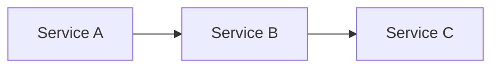

# ADR — Architecture Decision Records

ADRs are the primary mechanism for proposing, tracking, and recording architectural decisions in this repo. Unlike ephemeral RFCs, ADRs persist even when superseded — preserving the "why" behind decisions and their evolution.

## Location

ADRs live in `docs/decisions/<category>/` as numbered Markdown files.

Current categories:

- `agents/` — Autonomous coding agents, sandbox lifecycle, MCP tooling

New categories are created as needed. Keep them broad enough to be useful.

## Usage

```
/adr create <category> <slug>   # Scaffold a new ADR
/adr list                       # List existing ADRs
/adr <category>/<number>        # Read and summarize an ADR
```

## Creating a New ADR

### Step 1: Determine the number

Look at the highest-numbered file in the target category and increment by one. If the category doesn't exist yet, start at 001.

```bash
ls docs/decisions/<category>/
```

### Step 2: Create the file

Create `docs/decisions/<category>/NNN-<slug>.md` using this template:

````markdown
# ADR NNN: <Title>

**Author:** <Name>
**Status:** Draft
**Created:** <YYYY-MM-DD>
**Supersedes:** <link to previous ADR, if applicable>

---

## Problem

What problem does this solve? Why now?

---

## Proposal

Core idea in 2-3 paragraphs. Include a Before/After table if helpful:

| Aspect | Today | Proposed |
| ------ | ----- | -------- |
| ...    | ...   | ...      |

---

## Architecture

High-level design. Use mermaid diagrams for data flow:


````

## Implementation

Break work into phases with a checklist. This is the canonical task list — no GitHub issues needed.

### Phase 1: MVP

- [ ] Task with enough context to execute independently
- [ ] Another task

### Phase 2+

- [ ] Follow-on work

## Security

Reference `docs/security.md` for baseline. Document any deviations.

## Risks

| Risk | Likelihood | Impact | Mitigation |
| ---- | ---------- | ------ | ---------- |
| ...  | ...        | ...    | ...        |

## Open Questions

1. Unresolved design decisions

## References

| Resource    | Relevance      |
| ----------- | -------------- |
| [Link](url) | Why it matters |

````

### Step 3: Commit with conventional commit format

```bash
git commit -m "docs(adr): <short description>"
````

## ADR Statuses

| Status                | Meaning                                                                     |
| --------------------- | --------------------------------------------------------------------------- |
| **Draft**             | Under discussion, not yet approved                                          |
| **Accepted**          | Approved for implementation                                                 |
| **Implemented**       | Work is complete                                                            |
| **Superseded by NNN** | Replaced by a newer ADR (link to it). Keep the file — it preserves context. |
| **Deprecated**        | Abandoned without replacement                                               |

## Superseding an ADR

When a decision is reversed or evolved:

1. Create the new ADR with a `Supersedes:` field linking to the old one
2. Update the old ADR's status to `Superseded by [NNN-slug](NNN-slug.md)`
3. **Do not delete the old ADR** — it preserves the reasoning and context that led to the change

## Tracking Work

ADRs track their own work via markdown checklists in the Implementation section. Each task should have enough context to be picked up independently. Check off items as PRs land:

```markdown
## Implementation

### Phase 1: MVP

- [x] Create Helm chart in `charts/context-forge/` with gateway config
- [x] Add overlay in `overlays/cluster-critical/context-forge/`
- [ ] Register SigNoz API endpoints in gateway config
- [ ] Add Cloudflare tunnel route for `mcp.jomcgi.dev`
```

## Conventions

- **File naming**: `docs/decisions/<category>/NNN-<kebab-case-slug>.md`
- **Numbering**: Sequential within each category (001, 002, ...). Numbers are never reused.
- **Commit prefix**: `docs(adr):` for new ADRs and updates
- **Diagrams**: Mermaid for all architecture and flow diagrams (renders natively on GitHub)
- **Sections**: Problem → Proposal → Architecture → Implementation → Security → Risks → References
- **Phased rollout**: Break implementation into MVP + phases with success criteria
- **References table**: Link external docs, repos, and related architecture files
- **Work tracking**: Markdown checklists in the ADR itself, not external issue trackers
