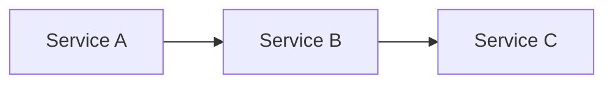

# RFC — Request for Comments

RFCs are the primary mechanism for proposing and tracking architectural changes in this repo.

## Location

All RFCs live in `architecture/rfcs/` as Markdown files.

## Usage

```
/rfc create <slug>        # Scaffold a new RFC
/rfc list                 # List existing RFCs
/rfc <slug>               # Read and summarize an RFC
```

## Creating a New RFC

### Step 1: Create the file

Create `architecture/rfcs/<slug>.md` using this template:

```markdown
# RFC: <Title>

**Author:** <Name>
**Status:** Draft
**Created:** <YYYY-MM-DD>

---

## Problem

What problem does this solve? Why now?

---

## Proposal

Core idea in 2-3 paragraphs. Include a Before/After table if helpful:

| Aspect | Today | Proposed |
|--------|-------|----------|
| ... | ... | ... |

---

## Architecture

High-level design. Use mermaid diagrams for data flow:



## Implementation

Break work into phases with a checklist. This is the canonical task list — no GitHub issues needed.

### Phase 1: MVP
- [ ] Task with enough context to execute independently
- [ ] Another task

### Phase 2+
- [ ] Follow-on work

## Security

Reference `architecture/security.md` for baseline. Document any deviations.

## Risks

| Risk | Likelihood | Impact | Mitigation |
|------|-----------|--------|------------|
| ... | ... | ... | ... |

## Open Questions

1. Unresolved design decisions

## References

| Resource | Relevance |
|----------|-----------|
| [Link](url) | Why it matters |
```

### Step 2: Commit with `rfc:` prefix

```bash
git commit -m "rfc: <short description>"
```

## RFC Statuses

| Status | Meaning |
|--------|---------|
| **Draft** | Under discussion, not yet approved |
| **Accepted** | Approved for implementation |
| **Implemented** | Work is complete |
| **Deprecated** | Superseded or abandoned |

## Tracking Work

RFCs track their own work via markdown checklists in the Implementation section. Each task should have enough context to be picked up independently. Check off items as PRs land:

```markdown
## Implementation

### Phase 1: MVP
- [x] Create Helm chart in `charts/context-forge/` with gateway config
- [x] Add overlay in `overlays/cluster-critical/context-forge/`
- [ ] Register SigNoz API endpoints in gateway config
- [ ] Add Cloudflare tunnel route for `mcp.jomcgi.dev`
```

## Listing RFCs

```bash
ls architecture/rfcs/
```

## Conventions

- **File naming**: `architecture/rfcs/<kebab-case-slug>.md` (e.g., `context-forge.md`)
- **Commit prefix**: `rfc:` for new RFCs and updates
- **Diagrams**: Mermaid for all architecture and flow diagrams (renders natively on GitHub)
- **Sections**: Problem → Proposal → Architecture → Implementation → Security → Risks → References
- **Phased rollout**: Break implementation into MVP + phases with success criteria
- **References table**: Link external docs, repos, and related architecture files
- **Work tracking**: Markdown checklists in the RFC itself, not external issue trackers
