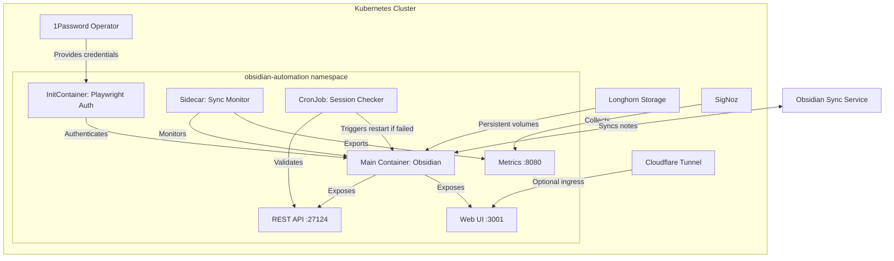

# Design Document

## Overview

The Obsidian Automation feature implements a hybrid architecture that combines browser automation for authentication with a REST API for ongoing operations. This design enables programmatic access to Obsidian notes while maintaining full compatibility with Obsidian Sync. The solution uses a StatefulSet for persistent session management, initContainers for authentication, and CronJobs for session maintenance.

## Steering Document Alignment

### Technical Standards (tech.md)
- **GitOps Deployment**: Follows ArgoCD pattern with Helm charts and Kustomize overlays
- **Container Security**: Implements required security context with read-only filesystem and specific volume mounts
- **Storage**: Uses Longhorn for persistent volumes following StatefulSet patterns for data consistency
- **Observability**: Exports Prometheus metrics to SigNoz, structured JSON logs, and OpenTelemetry traces
- **Languages**: Uses JavaScript (Playwright authentication) and Go (sync monitor sidecar)
- **Testing**: Includes BDD tests for deployment validation and synthetic monitoring
- **Simplicity**: Balances feature completeness with operational simplicity through clear component separation

### Project Structure (structure.md)
- **Helm Chart**: Located in `charts/obsidian-automation/` following standard template structure
- **ArgoCD Application**: Configuration in `clusters/homelab/obsidian-automation/`
- **Container Images**: Published to `ghcr.io/jomcgi/obsidian-automation-*`
- **Security Context**: Follows standard non-root, read-only filesystem pattern
- **Labels/Annotations**: Uses standard Kubernetes labels for service discovery and monitoring

## Code Reuse Analysis

### Existing Components to Leverage
- **1Password Operator Pattern**: Reuse from `operators/cloudflare/helm/cloudflare-operator/examples/1password-secret.yaml`
- **Longhorn Storage Configuration**: Follow pattern from `charts/n8n/values.yaml`
- **Security Context Template**: Apply standard from `structure.md` security requirements
- **ArgoCD Application Structure**: Mirror `clusters/homelab/cloudflare-tunnel/application.yaml`
- **Helm Chart Dependencies**: Follow pattern from `charts/n8n/Chart.yaml`

### Integration Points
- **Cloudflare Tunnel**: Ingress for external access (if needed) via existing tunnel
- **SigNoz Observability**: Metrics and logs exported to existing SigNoz deployment
- **1Password Secrets**: Credentials retrieved via existing OnePasswordItem CRDs
- **Longhorn Storage**: Persistent volumes managed by existing Longhorn deployment
- **ArgoCD GitOps**: Deployment managed through existing ArgoCD instance

## Architecture

The solution uses a four-component architecture that balances complexity with reliability. While this adds operational overhead, each component serves a critical function that cannot be easily combined without sacrificing maintainability or security. The components are:



## Components and Interfaces

### Component 1: Authentication InitContainer
- **Purpose:** Performs one-time authentication with Obsidian Sync using Playwright
- **Interfaces:**
  - Reads credentials from environment variables (injected from 1Password)
  - Writes session state to `/session` volume
  - Validates REST API availability before completion
- **Dependencies:**
  - 1Password credentials (OBSIDIAN_EMAIL, OBSIDIAN_PASSWORD)
  - Shared volumes with main container
- **Reuses:** Standard initContainer patterns from existing deployments

### Component 2: Obsidian Main Container
- **Purpose:** Runs Obsidian with REST API plugin for programmatic access
- **Interfaces:**
  - REST API on port 27124 (internal cluster access)
  - Web UI on port 3001 (optional, for debugging)
  - Health endpoint: GET /health (via sync monitor)
  - Ready endpoint: GET /ready (via sync monitor)
- **Dependencies:**
  - Session data from initContainer
  - Longhorn persistent volumes
  - REST API plugin (synced from vault)
- **Reuses:** Container security context from homelab standards

### Component 3: Sync Monitor Sidecar
- **Purpose:** Monitors sync status and performs synthetic tests
- **Interfaces:**
  - Prometheus metrics on port 8080/metrics
  - Health/readiness probes for Kubernetes
  - Synthetic test execution every 5 minutes
- **Dependencies:**
  - Access to Obsidian REST API (localhost:27124)
  - API key from 1Password
- **Reuses:** Prometheus metric patterns from existing services

### Component 4: Session Maintenance CronJob
- **Purpose:** Validates API availability and triggers re-authentication when needed
- **Interfaces:**
  - Checks REST API health endpoint
  - Deletes pod if authentication needed
- **Dependencies:**
  - Kubernetes API access for pod deletion
  - Service account with appropriate RBAC
- **Reuses:** CronJob patterns from cluster maintenance tasks

## Data Models

### Session State
```yaml
# Stored in /session/auth.json
{
  "authenticated": boolean,
  "timestamp": ISO8601,
  "expiresAt": ISO8601,
  "syncEnabled": boolean,
  "vaultId": string
}
```

### Sync Status
```yaml
# Exposed via REST API and metrics
{
  "connected": boolean,
  "lastSyncTime": ISO8601,
  "pendingChanges": number,
  "failedFiles": string[],
  "syncErrors": Array<{
    "file": string,
    "error": string,
    "timestamp": ISO8601
  }>
}
```

### API Configuration
```yaml
# REST API plugin configuration
{
  "port": 27124,
  "apiKey": string,  # From 1Password
  "listenOnAllInterfaces": true,
  "enableCors": true,
  "corsOrigin": "*",
  "authenticationRequired": true
}
```

## Error Handling

### Error Scenarios

1. **Authentication Failure**
   - **Handling:** Retry with exponential backoff (1s, 2s, 4s)
   - **User Impact:** Pod stays in Init state until successful
   - **Recovery:** Automatic retry or manual credential update
   - **Graceful Degradation:** API returns 503 with clear error message about authentication status

2. **Sync Disconnection**
   - **Handling:** Log event, expose metric, synthetic test fails
   - **User Impact:** API returns 503 for write operations
   - **Recovery:** Automatic reconnection attempt, pod restart after 15 minutes

3. **Storage Failure**
   - **Handling:** Pod enters CrashLoopBackoff with clear error
   - **User Impact:** Service unavailable until storage recovers
   - **Recovery:** Automatic when Longhorn recovers

4. **REST API Plugin Corruption**
   - **Handling:** Health check fails, readiness probe marks not ready
   - **User Impact:** API unavailable, triggers pod restart
   - **Recovery:** Fresh sync from vault restores plugin

5. **Network Partition**
   - **Handling:** Queue changes locally, retry with backoff
   - **User Impact:** Temporary inability to sync changes
   - **Recovery:** Automatic when network recovers

## Testing Strategy

### Unit Testing
- **Authentication script testing**: Validate Playwright script logic with mocked Obsidian responses
- **Sync monitor testing**: Go unit tests for metric calculations and health check logic
- **Key components to test**: Session persistence, API response parsing, metric export functions

### Integration Testing
- **Authentication flow testing**: Verify InitContainer completes successfully with test credentials
- **API connectivity testing**: Validate REST API availability after authentication
- **Key flows to test**: Session reuse, re-authentication trigger, sync status updates, CronJob execution

### End-to-End Testing
- **Complete deployment testing**: Deploy via ArgoCD and verify all components start correctly
- **User journey testing**: Create/update/delete notes via API, verify sync to cloud
- **User scenarios to test**: Authentication flow, API operations, sync verification, failure recovery, performance under load

## Deployment Configuration

### Helm Chart Structure
```yaml
obsidian-automation/
├── Chart.yaml
├── values.yaml
├── values.prod.yaml
├── templates/
│   ├── statefulset.yaml      # Main Obsidian deployment
│   ├── service.yaml           # Cluster service for API access
│   ├── configmap.yaml         # Authentication scripts
│   ├── cronjob.yaml           # Session maintenance
│   ├── serviceaccount.yaml    # RBAC for pod management
│   ├── networkpolicy.yaml     # Network restrictions
│   ├── servicemonitor.yaml    # Prometheus monitoring
│   └── onepassworditem.yaml   # Credential references
└── tests/
    └── integration_test.go     # BDD deployment tests
```

### StatefulSet Storage Configuration
```yaml
# Following Longhorn patterns from existing services
volumeClaimTemplates:
  - metadata:
      name: vault-data
    spec:
      accessModes: ["ReadWriteOnce"]
      storageClassName: "longhorn"
      resources:
        requests:
          storage: 10Gi
  - metadata:
      name: config-data
    spec:
      accessModes: ["ReadWriteOnce"]
      storageClassName: "longhorn"
      resources:
        requests:
          storage: 1Gi
  - metadata:
      name: session-data
    spec:
      accessModes: ["ReadWriteOnce"]
      storageClassName: "longhorn"
      resources:
        requests:
          storage: 100Mi
```

### Network Policy Implementation
```yaml
apiVersion: networking.k8s.io/v1
kind: NetworkPolicy
metadata:
  name: obsidian-automation
spec:
  podSelector:
    matchLabels:
      app.kubernetes.io/name: obsidian-automation
  policyTypes:
  - Ingress
  - Egress
  ingress:
  - from:
    - namespaceSelector:
        matchLabels:
          name: ingress  # Only Cloudflare Tunnel
    - podSelector: {}    # Allow within namespace
    ports:
    - protocol: TCP
      port: 27124        # REST API
    - protocol: TCP
      port: 8080         # Metrics
  egress:
  - to:                  # Allow DNS
    - namespaceSelector: {}
    - podSelector:
        matchLabels:
          k8s-app: kube-dns
    ports:
    - protocol: UDP
      port: 53
  - to:                  # Obsidian Sync
    ports:
    - protocol: TCP
      port: 443
  - to:                  # 1Password operator
    - namespaceSelector:
        matchLabels:
          name: onepassword
```

### Security Context Implementation
```yaml
securityContext:
  runAsNonRoot: true
  runAsUser: 1000
  fsGroup: 1000
  readOnlyRootFilesystem: true
  allowPrivilegeEscalation: false
  capabilities:
    drop: [ALL]
  seccompProfile:
    type: RuntimeDefault

volumeMounts:
  - name: vault-data
    mountPath: /vaults
  - name: config-data
    mountPath: /config
  - name: session-data
    mountPath: /session
  - name: tmp
    mountPath: /tmp  # For Obsidian temp files
```

### Resource Allocation
```yaml
resources:
  obsidian:
    limits:
      memory: 2Gi
      cpu: 2000m
    requests:
      memory: 1Gi
      cpu: 500m

  sync-monitor:
    limits:
      memory: 256Mi
      cpu: 200m
    requests:
      memory: 128Mi
      cpu: 100m

  playwright-auth:
    limits:
      memory: 1Gi
      cpu: 1000m
    requests:
      memory: 512Mi
      cpu: 500m
```

## ArgoCD Integration

### Application Configuration
```yaml
apiVersion: argoproj.io/v1alpha1
kind: Application
metadata:
  name: obsidian-automation
  namespace: argocd
spec:
  source:
    repoURL: https://github.com/jomcgi/homelab
    path: charts/obsidian-automation
    helm:
      valueFiles:
        - values.yaml
        - ../../clusters/homelab/obsidian-automation/values.yaml
  syncPolicy:
    automated:
      prune: true
      selfHeal: true
    syncOptions:
    - CreateNamespace=true
    retry:
      limit: 5
      backoff:
        duration: 5s
        factor: 2
        maxDuration: 3m
  healthAssessmentTimeout: 600  # Extended for InitContainer auth
```

### Health Check Configuration
```yaml
# In StatefulSet spec
readinessProbe:
  httpGet:
    path: /ready
    port: 8080  # Sync monitor sidecar
  initialDelaySeconds: 120  # Allow time for authentication
  periodSeconds: 10
  timeoutSeconds: 5
  successThreshold: 1
  failureThreshold: 3

livenessProbe:
  httpGet:
    path: /health
    port: 8080  # Sync monitor sidecar
  initialDelaySeconds: 180
  periodSeconds: 30
  timeoutSeconds: 5
  failureThreshold: 3
```

## Monitoring and Observability

### Prometheus Metrics
- `obsidian_sync_connected`: Gauge (0/1) for sync connection status
- `obsidian_sync_last_success_timestamp`: Gauge for last successful sync
- `obsidian_api_request_duration_seconds`: Histogram for API latencies
- `obsidian_api_requests_total`: Counter for API requests by endpoint
- `obsidian_synthetic_test_success`: Gauge (0/1) for synthetic test status
- `obsidian_authentication_attempts_total`: Counter for auth attempts

### Structured Logging
```json
{
  "timestamp": "2024-01-15T10:30:00Z",
  "level": "info",
  "message": "Sync status changed",
  "trace_id": "abc123",
  "span_id": "def456",
  "component": "sync-monitor",
  "sync_status": "connected",
  "vault_id": "vault-123"
}
```

### OpenTelemetry Tracing
- Span: `obsidian.api.request` (parent)
  - Span: `obsidian.auth.validate`
  - Span: `obsidian.note.create`
  - Span: `obsidian.sync.trigger`
  - Span: `obsidian.storage.write`