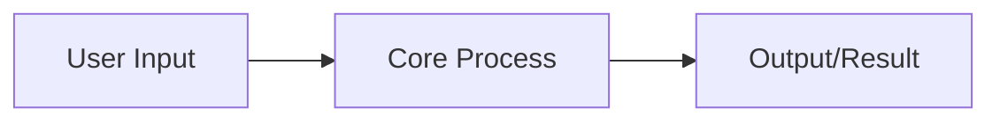

<!-- Template Instructions:
- Replace all [bracketed] placeholders
- Provide concrete examples for each behavior test
- Ensure stack choices match user's environment
-->

### Project Prompt: [Project Name]

**0. Context & Constraints:**
*   **Current Environment:** [Existing infrastructure/stack]
*   **User Profile:** [Experience level and goals]
*   **Hard Constraints:** [Time, budget, hardware limitations]

**1. Core Value Proposition:**
*   **Problem:** [Clearly state the user's problem.]
*   **Solution:** [Describe the project's solution in one sentence.]
*   **Value:** [Explain the primary benefit for the user, e.g., saves time, reduces errors, provides new insight.]

**2. Intended Use Case:**
*   **Primary User:** [Description of the target user.]
*   **Scenario:** [A short story of how the user will interact with the product to solve their problem.]

**3. MVP Scope & Key Features:**
*   [A bulleted list of the absolute minimum required features.]
*   [List of features explicitly de-scoped for the MVP.]

**4. Technical Constraints & Considerations:**
*   **Stack:** [Required or forbidden technologies.]
*   **Key Design Principle:** [A guiding principle for the implementation, e.g., "Simplicity over feature-completeness," or "State should be managed immutably."]

**5. Acceptance Criteria & Testing Plan:**
*   [A list of testable behaviors in a "Behavior: Test" format.]
*   **Behavior 1:** [e.g., User creates a new item.]
    *   **Test:** [e.g., Verify the item appears in the user's list and is saved to the database.]
*   **Behavior 2:** [e.g., User attempts to delete a non-existent item.]
    *   **Test:** [e.g., Verify the system does not throw an error and the state remains unchanged (demonstrating 'defining errors out of existence').]

**6. Validation & Experimentation Plan:**
*   **Proof of Concept:** [What to build in Week 1 to validate feasibility]
*   **Alpha Testing:** [How to test with yourself/close collaborators]
*   **Beta Rollout:** [Gradual expansion plan if applicable]
*   **Rollback Plan:** [How to revert if things go wrong]

**7. Call to Action: Implementation Strategy**
*   **Your Task:** Implement the project described in this brief.
*   **Process:**
    1.  **Plan First:** Propose a high-level technical plan. This should include the proposed file structure, key components/modules, and main data structures. **Do not write any implementation code yet.**
    2.  **Await Approval:** Present the plan for review. I will provide feedback or approve it.
    3.  **Execute Step-by-Step:** Once the plan is approved, begin implementing the project, focusing on one MVP feature at a time.

**8. Architecture Visualization:**

**9. Learning & Iteration Plan:**
*   **Week 1 Checkpoint:** What will you measure and adjust?
*   **Month 1 Review:** What architectural decisions to revisit?
*   **Success Criteria Evolution:** How might requirements change as you learn?

**10. Rapid Validation Plan:**
*   **Hour 1-2:** [Minimal test to validate core assumption]
*   **Day 1:** [Working prototype of core feature]
*   **Week 1:** [Full MVP with basic monitoring]

**11. Risk Mitigation:**
*   **Technical Risks:** [Identified unknowns and spike plans]
*   **Operational Risks:** [Failure modes and recovery plans]

**12. Success Metrics Dashboard:**
*   **North Star:** [Primary success metric]
*   **Leading Indicators:** [3-5 early warning metrics]
*   **SLOs:** [If applicable, specific service objectives]

**13. Learning Objectives:**
*   **Technical Skills:** [What you'll learn by building this]
*   **Architectural Insights:** [Patterns to validate/discover]

**14. Implementation Hints:**
*   **Start here:** [First concrete step]
*   **Watch out for:** [Common pitfall based on dialogue]
*   **If stuck:** [Fallback approach]