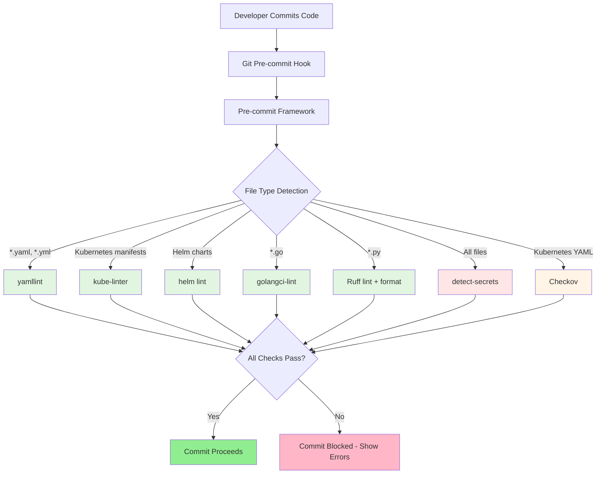
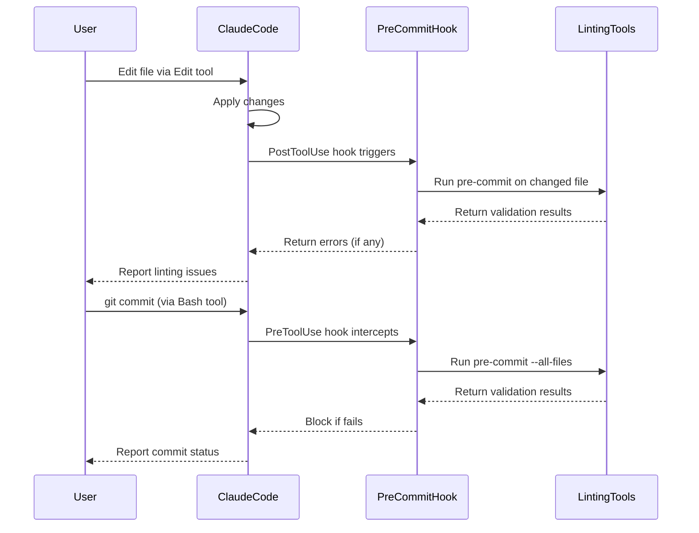

# Design Document

## Overview

This design implements a comprehensive pre-commit linting system for the homelab Kubernetes infrastructure repository. The system will use the pre-commit framework to orchestrate multiple linting tools (yamllint, kube-linter, helm lint, golangci-lint, Ruff, Checkov, detect-secrets) that automatically validate YAML, Kubernetes manifests, Helm charts, Go code, and Python code before commits. Additionally, it integrates with Claude Code through hooks to enable AI-assisted validation during development.

The design follows the homelab's core principles: **simplicity over cleverness**, **security by default**, and **observable systems**. By catching issues at commit time, we reduce deployment failures and enforce consistent code quality across the entire codebase.

## Steering Document Alignment

### Technical Standards (tech.md)

**Code Quality Tools Alignment:**
- Extends existing code quality practices (yamllint, helm lint, kube-linter already mentioned in tech.md:71-83)
- Adds modern Python tooling (Ruff) and Go tooling (golangci-lint) that align with 2025 best practices
- Integrates with existing CI/CD workflows (GitHub Actions)

**Security & Compliance:**
- Enforces security requirements from tech.md:133-144 (non-root containers, read-only filesystems)
- Adds secrets detection to prevent credential leaks
- Validates compliance with CIS Kubernetes benchmarks via Checkov

**Performance Requirements:**
- Meets performance expectations (hooks complete in <10 seconds for single files)
- Uses Ruff for Python (200x faster than traditional tools)
- Only scans modified files (pre-commit default behavior)

### Project Structure (structure.md)

**File Organization:**
- Configuration files placed at repository root (`.pre-commit-config.yaml`, `.golangci.yml`, `.yamllintrc`, `pyproject.toml`)
- Claude Code integration via `.claude/settings.json` (existing file)
- Documentation added to root `README.md` per structure.md:274

**Naming Conventions:**
- Configuration files follow standard conventions (`.pre-commit-config.yaml`, `.golangci.yml`)
- Hook scripts (if needed) use `kebab-case` per structure.md:54

**Documentation Standards:**
- Inline comments in configuration files explaining rules per structure.md:266-292
- Root README.md updated with setup instructions per structure.md:251-260

## Code Reuse Analysis

### Existing Components to Leverage

- **`.golangci.yml` (operators/cloudflare)**:
  - Existing Go linting configuration with sensible defaults
  - Will be copied to repository root and enhanced with additional linters
  - Already enables: gofmt, goimports, errcheck, govet, staticcheck, revive, unused

- **`.claude/settings.json`**:
  - Existing Claude Code configuration with permissions and MCP servers
  - Will be extended with pre-commit hook integrations (PreToolUse, PostToolUse)

- **GitHub Actions workflows** (future):
  - Will integrate `pre-commit run --all-files` into existing CI/CD pipelines
  - Reuses existing GitHub Actions setup patterns

### Integration Points

- **Claude Code Hooks**:
  - PostToolUse hooks trigger validation after Edit/Write tools
  - PreToolUse hooks run pre-commit before `git commit` commands
  - Hooks receive error output and report to user

- **Git Workflow**:
  - Pre-commit framework installs as Git pre-commit hook (`.git/hooks/pre-commit`)
  - Runs automatically on `git commit`
  - Can be bypassed with `git commit --no-verify` (documented for emergencies)

- **CI/CD Integration** (future):
  - GitHub Actions runs same `.pre-commit-config.yaml` configuration
  - Ensures consistency between local and CI validation

## Architecture

The pre-commit linting system follows a **pipeline architecture** where each linting tool operates independently on specific file types. The pre-commit framework orchestrates tool execution based on file patterns, ensuring only relevant validators run for changed files.

### Modular Design Principles

- **Single File Responsibility**: Each configuration file handles one concern
  - `.pre-commit-config.yaml`: Hook orchestration and versioning
  - `.golangci.yml`: Go-specific linting rules
  - `.yamllintrc`: YAML syntax and style rules
  - `pyproject.toml`: Python (Ruff) configuration

- **Component Isolation**: Each linting tool runs in isolated environment managed by pre-commit
  - Tools installed in separate virtual environments
  - No dependency conflicts between tools
  - Version pinning ensures reproducibility

- **Service Layer Separation**:
  - **Validation Layer**: Linting tools (yamllint, kube-linter, etc.)
  - **Orchestration Layer**: Pre-commit framework
  - **Integration Layer**: Claude Code hooks and CI/CD

- **Utility Modularity**: Hook scripts (if needed) are single-purpose
  - Helm chart detection script finds charts to lint
  - Secret baseline management for detect-secrets



### Claude Code Integration Architecture



## Components and Interfaces

### Component 1: Pre-commit Framework Configuration

- **Purpose:** Orchestrates all linting tools, manages versions, and controls hook execution
- **Interfaces:**
  - **File:** `.pre-commit-config.yaml` (YAML configuration)
  - **Commands:**
    - `pre-commit install` - Install hooks into `.git/hooks/`
    - `pre-commit run --all-files` - Run all hooks manually
    - `pre-commit autoupdate` - Update hook versions
- **Dependencies:**
  - Python 3.8+ (for pre-commit framework itself)
  - Individual tool dependencies (managed by pre-commit)
- **Reuses:** None (root configuration)

**Configuration Structure:**
```yaml
repos:
  - repo: <tool-repository-url>
    rev: <version-tag>
    hooks:
      - id: <hook-id>
        files: <regex-pattern>
        args: [<tool-arguments>]
```

### Component 2: YAML Linting (yamllint)

- **Purpose:** Validate YAML syntax and enforce formatting consistency (2-space indentation, no trailing whitespace)
- **Interfaces:**
  - **Config:** `.yamllintrc` (YAML configuration file)
  - **Hook ID:** `yamllint`
  - **File Pattern:** `\\.ya?ml$`
- **Dependencies:** yamllint package (managed by pre-commit)
- **Reuses:** Existing YAML formatting conventions from homelab (2-space indentation)

**Rules Configuration:**
```yaml
extends: default
rules:
  line-length:
    max: 120
  indentation:
    spaces: 2
  comments:
    min-spaces-from-content: 1
```

### Component 3: Kubernetes Manifest Linting (kube-linter)

- **Purpose:** Validate Kubernetes manifests against security best practices and operational excellence
- **Interfaces:**
  - **Hook ID:** `kube-linter`
  - **File Pattern:** Kubernetes YAML files (Deployment, Service, ConfigMap, etc.)
  - **Config:** `.kube-linter.yaml` (optional custom configuration)
- **Dependencies:** kube-linter binary (installed by pre-commit)
- **Reuses:** Security patterns from CLAUDE.md (non-root, read-only filesystem, resource limits)

**Key Checks:**
- `no-read-only-root-fs`: Containers must have read-only root filesystem
- `run-as-non-root`: Containers must run as non-root user
- `no-privilege-escalation`: Containers must not allow privilege escalation
- `required-label-owner`: Resources must have `app.kubernetes.io/name` label
- `cpu-requirements`: Deployments must specify CPU requests/limits
- `memory-requirements`: Deployments must specify memory requests/limits

### Component 4: Helm Chart Validation (helm lint)

- **Purpose:** Validate Helm charts for template syntax errors and rendering issues
- **Interfaces:**
  - **Hook ID:** `helm-lint` (custom hook via Gruntwork or similar)
  - **File Pattern:** Detects chart directories (presence of `Chart.yaml`)
  - **Support Files:** `linter_values.yaml` (optional per-chart values for linting)
- **Dependencies:**
  - Helm binary (installed separately, required on system PATH)
  - Helm lint hook script
- **Reuses:** Existing Helm chart structure from `charts/` directory

**Validation Process:**
1. Detect modified Helm charts (by checking for `Chart.yaml` in parent directories)
2. Run `helm lint <chart-directory>` for each modified chart
3. If `linter_values.yaml` exists, merge with `values.yaml`: `helm lint -f values.yaml -f linter_values.yaml`

### Component 5: Go Linting and Formatting (golangci-lint)

- **Purpose:** Lint and format Go code according to best practices and project-specific rules
- **Interfaces:**
  - **Config:** `.golangci.yml` (root of repository)
  - **Hook ID:** `golangci-lint` (from official golangci-lint pre-commit repo)
  - **File Pattern:** `\\.go$`
  - **Commands:**
    - `golangci-lint run --fix` - Lint with auto-fix
    - `gofmt` - Format code
    - `goimports` - Organize imports
- **Dependencies:** golangci-lint binary (installed by pre-commit)
- **Reuses:** Existing `.golangci.yml` from `operators/cloudflare/`

**Configuration Enhancements (based on existing):**
```yaml
version: "2"
run:
  allow-parallel-runners: true
  timeout: 5m
linters:
  enable:
    - copyloopvar      # Detect loop variable capture issues
    - dupl             # Detect code duplication
    - errcheck         # Check error handling
    - goconst          # Detect repeated constants
    - gocyclo          # Check cyclomatic complexity
    - govet            # Vet examines Go source code
    - ineffassign      # Detect ineffectual assignments
    - misspell         # Spell checking
    - revive           # Fast, configurable linter
    - staticcheck      # Static analysis
    - unused           # Detect unused code
    - gosec            # Security-focused linter (NEW)
    - gofmt            # Format checking
    - goimports        # Import organization
formatters:
  enable:
    - gofmt
    - goimports
```

### Component 6: Python Linting and Formatting (Ruff)

- **Purpose:** Lint and format Python code using modern, fast tooling that replaces Black/Flake8/isort
- **Interfaces:**
  - **Config:** `pyproject.toml` (root of repository)
  - **Hook IDs:**
    - `ruff` - Linting with auto-fix
    - `ruff-format` - Code formatting
  - **File Pattern:** `\\.py$`
- **Dependencies:** Ruff package (installed by pre-commit)
- **Reuses:** Python best practices (PEP 8, security checks)

**Configuration:**
```toml
[tool.ruff]
line-length = 120
target-version = "py38"

[tool.ruff.lint]
select = [
  "E",    # pycodestyle errors
  "W",    # pycodestyle warnings
  "F",    # Pyflakes
  "I",    # isort
  "N",    # pep8-naming
  "S",    # flake8-bandit (security)
  "B",    # flake8-bugbear
  "UP",   # pyupgrade
  "C4",   # flake8-comprehensions
]
ignore = []

[tool.ruff.lint.per-file-ignores]
"tests/*" = ["S101"]  # Allow assert in tests
```

**Execution Order:**
1. `ruff` (linting with `--fix`) runs first
2. `ruff-format` (formatting) runs second
3. This order ensures lint fixes don't conflict with formatting

### Component 7: Secrets Detection (detect-secrets)

- **Purpose:** Prevent accidental commits of API keys, passwords, and other sensitive data
- **Interfaces:**
  - **Hook ID:** `detect-secrets`
  - **File Pattern:** All files
  - **Baseline:** `.secrets.baseline` (for managing false positives)
  - **Commands:**
    - `detect-secrets scan` - Scan for secrets
    - `detect-secrets audit .secrets.baseline` - Review and approve false positives
- **Dependencies:** detect-secrets package (installed by pre-commit)
- **Reuses:** None (new security layer)

**Detection Strategy:**
- High-entropy string detection (base64, hex)
- Pattern matching for common secret formats (AWS keys, private keys, tokens)
- Keyword detection (password, api_key, secret, token)

**Allowed Patterns:**
- OnePasswordItem CRD references (not plaintext secrets)
- Example values in documentation (explicitly marked)
- False positives added to baseline file

### Component 8: Compliance and Security Validation (Checkov)

- **Purpose:** Validate Kubernetes manifests against CIS benchmarks and security compliance policies
- **Interfaces:**
  - **Hook ID:** `checkov`
  - **File Pattern:** Kubernetes YAML files
  - **Config:** `.checkov.yaml` (optional)
  - **Framework:** Kubernetes (built-in policies)
- **Dependencies:** Checkov package (installed by pre-commit)
- **Reuses:** Security principles from tech.md and CLAUDE.md

**Key Checks:**
- CKV_K8S_8: Liveness probe defined
- CKV_K8S_9: Readiness probe defined
- CKV_K8S_14: Image tag is not latest
- CKV_K8S_20: Containers do not run as root
- CKV_K8S_22: Read-only root filesystem
- CKV_K8S_23: No privilege escalation
- CKV_K8S_28: Resource limits defined
- CKV_K8S_43: Image from trusted registry (optional)

**Warning vs Blocking:**
- Security violations (root containers, privilege escalation): **BLOCKING**
- Best practices (missing probes, network policies): **WARNING** (non-blocking)

### Component 9: Claude Code Hook Integration

- **Purpose:** Integrate pre-commit validation into Claude Code workflow for AI-assisted development
- **Interfaces:**
  - **Config:** `.claude/settings.json`
  - **Hook Events:**
    - `PostToolUse` - After Edit/Write tools execute
    - `PreToolUse` - Before Bash git commit commands
  - **Commands:**
    - `pre-commit run --files <changed-file>` (PostToolUse)
    - `pre-commit run --all-files` (PreToolUse, before commit)
- **Dependencies:**
  - Pre-commit installed and configured
  - Claude Code hook support
- **Reuses:** Existing `.claude/settings.json` structure

**Hook Configuration:**
```json
{
  "hooks": {
    "PostToolUse": [
      {
        "matcher": "Edit|Write",
        "hooks": [
          {
            "type": "command",
            "command": "pre-commit run --files $FILE_PATH || true"
          }
        ]
      }
    ],
    "PreToolUse": [
      {
        "matcher": "Bash(git commit:*)",
        "hooks": [
          {
            "type": "command",
            "command": "pre-commit run --all-files"
          }
        ]
      }
    ]
  }
}
```

**Error Reporting:**
- Hook failures return non-zero exit codes
- Claude Code captures stdout/stderr and presents to user
- User can choose to fix issues or bypass with `--no-verify`

## Data Models

### Pre-commit Configuration Model

```yaml
# .pre-commit-config.yaml structure
repos:
  - repo: <string>          # Git repository URL
    rev: <string>            # Version tag or commit SHA
    hooks:
      - id: <string>         # Hook identifier
        name: <string>       # Display name (optional)
        files: <regex>       # File pattern to match (optional)
        exclude: <regex>     # Files to exclude (optional)
        args: <list>         # Command-line arguments (optional)
        pass_filenames: <bool>  # Pass filenames to hook (default: true)
        always_run: <bool>   # Run even if no files match (default: false)
```

### golangci-lint Configuration Model

```yaml
# .golangci.yml structure
version: "2"
run:
  timeout: <duration>
  allow-parallel-runners: <bool>
linters:
  enable: <list>              # List of linter names
  disable: <list>             # List of linters to disable
  settings:                   # Per-linter settings
    <linter-name>:
      <setting-key>: <value>
formatters:
  enable: <list>              # List of formatter names
exclusions:
  paths: <list>               # Paths to exclude from linting
```

### Ruff Configuration Model

```toml
# pyproject.toml structure
[tool.ruff]
line-length = <int>
target-version = <string>

[tool.ruff.lint]
select = <list>               # Rule categories to enable
ignore = <list>               # Specific rules to ignore

[tool.ruff.lint.per-file-ignores]
"<glob-pattern>" = <list>     # Ignore rules for specific files
```

### yamllint Configuration Model

```yaml
# .yamllintrc structure
extends: default
rules:
  <rule-name>:
    <setting>: <value>
```

### Checkov Configuration Model

```yaml
# .checkov.yaml structure (optional)
framework:
  - kubernetes
skip-check:
  - <check-id>                # Checks to skip
soft-fail: <bool>             # Continue on failures (default: false)
```

### detect-secrets Baseline Model

```json
{
  "version": "1.4.0",
  "filters_used": [...],
  "results": {
    "<file-path>": [
      {
        "type": "<secret-type>",
        "hashed_secret": "<hash>",
        "line_number": <int>,
        "is_verified": <bool>
      }
    ]
  }
}
```

## Error Handling

### Error Scenarios

1. **Pre-commit Not Installed**
   - **Handling:** Display clear installation instructions
   - **User Impact:** User sees: "pre-commit command not found. Install with: pip install pre-commit"
   - **Resolution:** Run `pip install pre-commit` and retry

2. **Linting Tool Fails to Install**
   - **Handling:** Pre-commit downloads and caches tools automatically; network issues show clear errors
   - **User Impact:** User sees: "Failed to install <tool>. Check network connectivity."
   - **Resolution:** Retry or manually install tool if persistent

3. **YAML Syntax Error**
   - **Handling:** yamllint reports file path, line number, and specific violation
   - **User Impact:**
     ```
     charts/example/values.yaml:15:3: [error] wrong indentation: expected 4 but found 2 (indentation)
     ```
   - **Resolution:** Fix indentation at specified line

4. **Kubernetes Security Violation**
   - **Handling:** kube-linter blocks commit with specific policy violation
   - **User Impact:**
     ```
     charts/example/templates/deployment.yaml: (object: <namespace>/<name>) container "app" does not have a read-only root file system (no-read-only-root-fs)
     ```
   - **Resolution:** Add `readOnlyRootFilesystem: true` to securityContext

5. **Helm Template Rendering Error**
   - **Handling:** helm lint reports template syntax error with line number
   - **User Impact:**
     ```
     [ERROR] templates/deployment.yaml: parse error at (example/templates/deployment.yaml:25): unclosed action
     ```
   - **Resolution:** Fix Go template syntax at specified line

6. **Go Linting Error**
   - **Handling:** golangci-lint reports file, line, and specific linter rule
   - **User Impact:**
     ```
     operators/cloudflare/internal/controller/tunnel_controller.go:45:2: ineffectual assignment to err (ineffassign)
     ```
   - **Resolution:** Fix ineffectual assignment or suppress with `//nolint:ineffassign` if intentional

7. **Python Linting Error**
   - **Handling:** Ruff reports file, line, rule code, and description
   - **User Impact:**
     ```
     scripts/deploy.py:12:5: F841 Local variable `unused_var` is assigned to but never used
     ```
   - **Resolution:** Remove unused variable or prefix with `_` if intentional

8. **Secret Detected**
   - **Handling:** detect-secrets blocks commit and shows potential secret location
   - **User Impact:**
     ```
     Potential secret in file scripts/config.py:8
     Type: High Entropy String
     ```
   - **Resolution:**
     - If false positive: `detect-secrets scan --baseline .secrets.baseline`
     - If real secret: Remove and use 1Password OnePasswordItem instead

9. **Compliance Violation (Checkov)**
   - **Handling:** Checkov reports policy ID, file, and violation description
   - **User Impact:**
     ```
     Check: CKV_K8S_28: "Ensure that containers have resource limits"
     File: /charts/example/templates/deployment.yaml:10-30
     ```
   - **Resolution:** Add resource limits to container spec

10. **Claude Code Hook Failure**
    - **Handling:** Hook captures error output and returns to Claude Code
    - **User Impact:** Claude Code reports: "Pre-commit validation failed: <error details>"
    - **Resolution:** Claude Code can auto-fix if possible, or user manually fixes

11. **Slow Hook Execution**
    - **Handling:** Progress output for long-running hooks (>30s)
    - **User Impact:** User sees: "Running golangci-lint (this may take a moment)..."
    - **Resolution:** Normal operation; consider caching or scoping reduction

12. **Git Bypass Required (Emergency)**
    - **Handling:** User can bypass with `git commit --no-verify`
    - **User Impact:** Warning in documentation: "Use only in emergencies; CI will still validate"
    - **Resolution:** Fix issues in follow-up commit

## Testing Strategy

### Unit Testing

**Approach:** Test individual linting configurations in isolation

**Key Components to Test:**

1. **yamllint Configuration:**
   - Create test YAML files with violations (wrong indentation, trailing whitespace)
   - Run `yamllint <test-file>` and verify errors are caught
   - Verify compliant YAML files pass

2. **golangci-lint Configuration:**
   - Create test Go files with common issues (unused variables, ineffectual assignments)
   - Run `golangci-lint run <test-file>` and verify errors are caught
   - Verify clean Go code passes

3. **Ruff Configuration:**
   - Create test Python files with style violations, unused imports, security issues
   - Run `ruff check <test-file>` and verify errors are caught
   - Run `ruff format <test-file>` and verify formatting is applied

4. **detect-secrets:**
   - Create test files with fake secrets (high-entropy strings, API key patterns)
   - Run `detect-secrets scan <test-file>` and verify secrets are detected
   - Test baseline workflow for false positives

### Integration Testing

**Approach:** Test complete pre-commit workflow with real repository files

**Key Flows to Test:**

1. **Full Pre-commit Run:**
   - Run `pre-commit install` to set up hooks
   - Make changes to various file types (YAML, Go, Python, Kubernetes manifests)
   - Run `git commit` and verify hooks execute
   - Introduce violations and verify commit is blocked

2. **Individual Hook Testing:**
   - Run `pre-commit run yamllint --all-files`
   - Run `pre-commit run kube-linter --all-files`
   - Run `pre-commit run golangci-lint --all-files`
   - Run `pre-commit run ruff --all-files`
   - Verify each hook reports expected results

3. **Auto-fix Testing:**
   - Create files with fixable issues (wrong indentation, unorganized imports)
   - Run `pre-commit run --all-files`
   - Verify auto-fixes are applied correctly

4. **Performance Testing:**
   - Measure hook execution time on single file changes (<10s requirement)
   - Measure hook execution time on `--all-files` (<60s requirement)
   - Profile slow hooks and optimize configurations

5. **Claude Code Integration Testing:**
   - Configure Claude Code hooks in `.claude/settings.json`
   - Use Claude Code to edit a file with linting violations
   - Verify PostToolUse hook triggers and reports errors
   - Use Claude Code to run `git commit`
   - Verify PreToolUse hook blocks commit if validation fails

### End-to-End Testing

**Approach:** Test complete developer workflow from clone to commit

**User Scenarios to Test:**

1. **New Developer Setup:**
   - Clone repository
   - Run `pip install pre-commit`
   - Run `pre-commit install`
   - Make a compliant change and commit successfully
   - Make a non-compliant change and verify commit is blocked with clear errors

2. **Multi-file Commit:**
   - Modify YAML, Go, Python, and Kubernetes files in single commit
   - Verify all relevant hooks run
   - Verify only changed file types trigger corresponding hooks

3. **Emergency Bypass:**
   - Introduce a linting violation
   - Use `git commit --no-verify` to bypass hooks
   - Verify commit succeeds locally
   - Verify CI (future) catches the violation

4. **Hook Update Workflow:**
   - Run `pre-commit autoupdate` to update hook versions
   - Verify new versions work correctly
   - Test backward compatibility with existing configurations

5. **False Positive Management:**
   - detect-secrets flags a false positive (e.g., example UUID)
   - Run `detect-secrets audit .secrets.baseline`
   - Mark as false positive and verify future commits allow it

6. **Claude Code AI-Assisted Development:**
   - Use Claude Code to create a new Helm chart
   - Introduce a security violation (root container)
   - Verify Claude Code reports the validation error
   - Ask Claude Code to fix the issue
   - Verify fix passes validation
