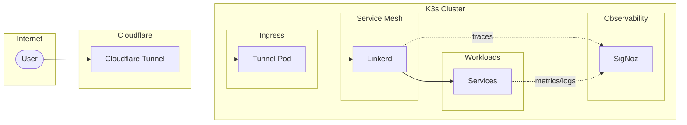

# Homelab

K3s cluster running in my office. GitOps via ArgoCD, automatic mTLS via Linkerd, observability via SigNoz.

> Complexity is the silent killer of engineering velocity and reliability.
> — _A Philosophy of Software Design_, John Ousterhout

## Architecture



Internet → Cloudflare Tunnel → pod-to-pod. Linkerd meshes everything after the tunnel terminates, so all internal traffic gets mTLS and tracing without touching application code.

## Decisions

- **Ingress** — Cloudflare Tunnel only. Nothing exposed directly.
- **Service mesh** — Linkerd. Automatic mTLS and tracing for all pod-to-pod traffic without application changes.
- **Observability** — SigNoz. One thing instead of Prometheus/Loki/Tempo.
- **Storage** — Longhorn. Avoiding state where possible.
- **Policy** — Kyverno enforces non-root + read-only filesystems. No peer reviews here so I need something catching mistakes.
- **Secrets** — 1Password operator.

## Structure

```
charts/               # Helm charts
overlays/
  cluster-critical/   # argocd, linkerd, signoz, kyverno, longhorn
  prod/               # cloudflare-tunnel, gh-arc, nats, trips, vllm
  dev/                # cloudflare-operator, marine, stargazer
clusters/             # ArgoCD entry points
operators/            # Custom operators (cloudflare)
services/             # Backend code
websites/             # Frontend apps
```

## Running this

You can't — it's tied to my 1Password secrets and hardware. Patterns might be useful if you're building something similar.

See [.claude/CLAUDE.md](.claude/CLAUDE.md) for operational details.

## License

MIT
