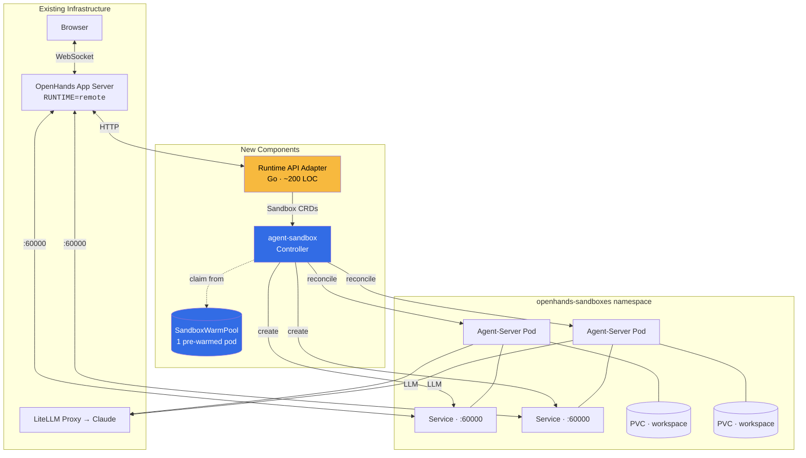
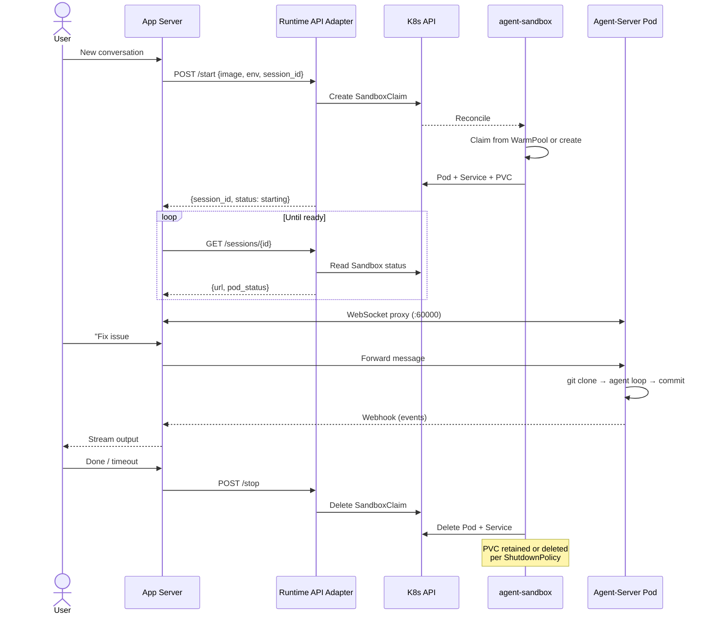

# RFC: Kubernetes-Native OpenHands Sandboxes via agent-sandbox

**Author:** Joe McGinley
**Status:** Superseded by [004-autonomous-agents](004-autonomous-agents.md)
**Created:** 2026-02-25

---

## Context

OpenHands runs autonomous coding agents in isolated sandbox pods. Today this uses the V0 `KubernetesRuntime` — a [deprecated code path](https://github.com/OpenHands/OpenHands/blob/main/openhands/runtime/impl/kubernetes/kubernetes_runtime.py#L1) scheduled for removal April 1, 2026. The V0 runtime creates pods, services, and PVCs directly via the Kubernetes API with no CRD, no reconciliation loop, and no crash recovery. If the OpenHands process restarts, orphaned sandbox pods are left behind.

The V1 app server supports a [`RemoteSandboxService`](https://github.com/OpenHands/OpenHands/blob/main/openhands/app_server/sandbox/remote_sandbox_service.py) backend that delegates pod lifecycle to an external HTTP API. The only official Kubernetes implementation is the [paid OpenHands Cloud `runtime-api`](https://github.com/All-Hands-AI/OpenHands-Cloud) (Polyform license). No open-source V1 Kubernetes sandbox backend exists upstream — the [V0 deprecation project](https://github.com/OpenHands/OpenHands/issues/12417) does not address this gap.

## Proposal

Replace the V0 runtime with [kubernetes-sigs/agent-sandbox](https://github.com/kubernetes-sigs/agent-sandbox) (SIG Apps, v0.1.1, Apache 2.0) and a thin HTTP adapter that implements the `RemoteSandboxService` API contract.

## How OpenHands Agent-Servers Work

Each conversation runs in a self-contained **agent-server** pod (`ghcr.io/openhands/agent-server`). The pod runs the full agent loop internally — LLM calls, code editing, git operations, test execution — and exposes four ports:

| Port  | Service                                   |
| ----- | ----------------------------------------- |
| 60000 | Agent API (conversation events, commands) |
| 60001 | VSCode server (browser IDE)               |
| 12000 | Worker 1 (web apps the agent builds)      |
| 12001 | Worker 2                                  |

The app server is a coordinator: it creates/destroys agent-server pods, proxies WebSocket connections, and stores conversation history. It does not run agent logic itself.

## Architecture

## Control Flow

## What agent-sandbox Provides

[kubernetes-sigs/agent-sandbox](https://github.com/kubernetes-sigs/agent-sandbox) is a Google-led SIG Apps project ([KubeCon NA 2025](https://opensource.googleblog.com/2025/11/unleashing-autonomous-ai-agents-why-kubernetes-needs-a-new-standard-for-agent-execution.html), 1k+ stars) purpose-built for managing isolated AI agent pods.

| CRD               | Purpose                                                                           |
| ----------------- | --------------------------------------------------------------------------------- |
| `Sandbox`         | Single-pod workload with PodTemplate, VolumeClaimTemplates, auto-delete lifecycle |
| `SandboxTemplate` | Reusable pod definition — define the agent-server spec once                       |
| `SandboxClaim`    | Per-session request against a template (created by adapter)                       |
| `SandboxWarmPool` | Pre-warmed pods for near-instant startup vs 30-60s cold start                     |

The controller reconciles the full stack: Pod, headless Service (stable FQDN), PVCs, lifecycle timers. Standard `controller-runtime` — crash-safe, declarative, survives restarts.

## Runtime API Adapter

Stateless Go service (~200 LOC) translating the [RemoteSandboxService HTTP contract](https://github.com/OpenHands/OpenHands/blob/main/openhands/app_server/sandbox/remote_sandbox_service.py) into Sandbox CR operations:

| Endpoint              | → K8s Operation                                                                 |
| --------------------- | ------------------------------------------------------------------------------- |
| `POST /start`         | Create `SandboxClaim` with env vars, image, resource requests                   |
| `POST /stop`          | Delete `SandboxClaim`                                                           |
| `POST /pause`         | Not yet supported — return `501` until agent-sandbox adds PVC-preserving pause  |
| `POST /resume`        | Not yet supported — return `501` until agent-sandbox adds PVC-preserving resume |
| `GET /sessions/{id}`  | Read `Sandbox` status, return `{url, pod_status, session_api_key}`              |
| `GET /sessions/batch` | Batch read `Sandbox` statuses                                                   |
| `GET /list`           | List `Sandbox` CRs in namespace                                                 |

Auth: app-server-to-adapter requests are authenticated via an `X-API-Key` header checked against a 1Password-managed secret. The adapter talks to Kubernetes via its own service account.

## Prior Art

| Project                                                                                                         | Notes                                                                                                                                                                                   |
| --------------------------------------------------------------------------------------------------------------- | --------------------------------------------------------------------------------------------------------------------------------------------------------------------------------------- |
| [OpenHands Cloud `runtime-api`](https://github.com/All-Hands-AI/OpenHands-Cloud)                                | Official K8s backend. Python/Flask, PostgreSQL, warm pools. Polyform license (commercial)                                                                                               |
| [zparnold/openhands-kubernetes-remote-runtime](https://github.com/zparnold/openhands-kubernetes-remote-runtime) | Community Go implementation. Full API, in-memory session→pod map (lost on crash). This RFC's adapter derives state from CRD labels instead — stateless and crash-safe. MIT, 3 weeks old |
| [zxkane/openhands-infra](https://github.com/zxkane/openhands-infra)                                             | Same API on AWS ECS Fargate + DynamoDB. Confirms the contract is portable. Apache 2.0                                                                                                   |

## Risks

| Risk                                       | Mitigation                                                                                                        |
| ------------------------------------------ | ----------------------------------------------------------------------------------------------------------------- |
| agent-sandbox is v0.1.1                    | Backed by Google / SIG Apps; active development; simple CRD surface                                               |
| V0 removal may slip again                  | Run V1 in parallel; cut over when stable, not when forced                                                         |
| Warm pool resource cost                    | Start with 1 warm pod; scale based on usage patterns                                                              |
| PVC retention on pause not yet implemented | [On roadmap](https://github.com/kubernetes-sigs/agent-sandbox/blob/main/roadmap.md); use stop+recreate as interim |
