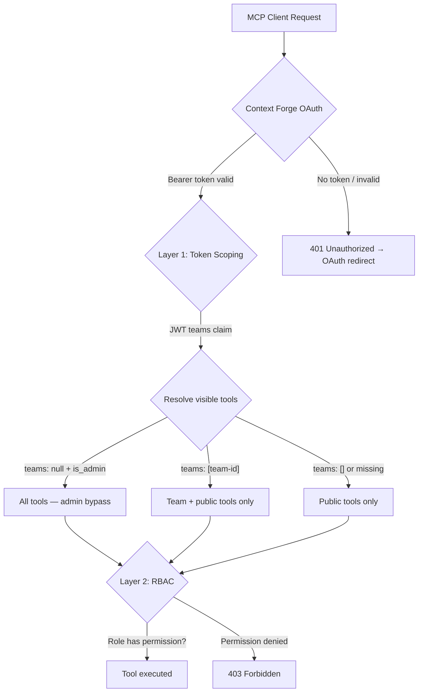
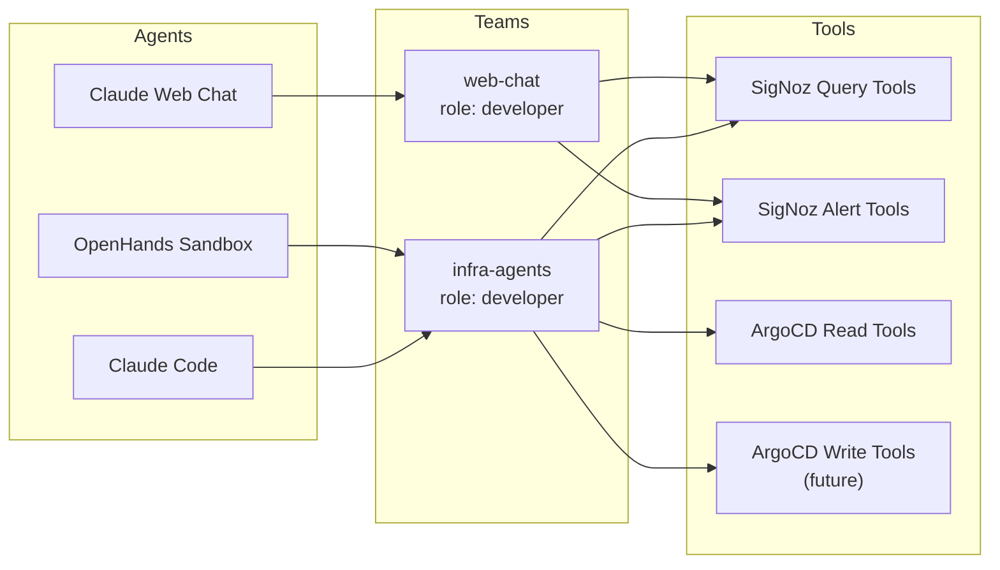

# ADR: Role-Based MCP Access

**Author:** Joe McGinley
**Status:** Draft
**Created:** 2026-03-01
**Relates to:** [003-context-forge](003-context-forge.md), [006-oidc-auth-mcp-gateway](006-oidc-auth-mcp-gateway.md)

---

## Problem

Context Forge currently treats all MCP clients identically. Any agent that reaches the gateway — Claude Code, Claude web chat, OpenHands sandboxes, Cursor — gets the same unrestricted access to every registered tool. There is no way to:

- Give Claude web chat read-only SigNoz access while giving Claude Code full access
- Prevent a future agent from calling write-capable tools (ArgoCD sync, dashboard mutation)
- Audit which agent performed which operation

Cloudflare Zero Trust authenticates the *transport* (is this request allowed to reach the gateway?) but not the *identity* (which agent is this, and what should it be allowed to do?).

---

## Decision

Use Context Forge's built-in two-layer authorization — **token scoping** for resource visibility and **RBAC** for action permissions — to differentiate agents by role.

Each agent type gets a dedicated JWT with a `teams` claim that controls which tools it can see, and an RBAC role that controls what it can do with those tools.

---

## Architecture

### Two-Layer Auth Model

Every MCP request passes through both layers sequentially. Token scoping filters *what you can see*; RBAC controls *what you can do*.



### Agent-to-Team-to-Tool Mapping

Teams control tool visibility. Each agent type maps to a team with the appropriate role and tool set.



---

## Roles

Context Forge provides five built-in roles. Two are relevant:

| Role | Scope | Permissions | Use case |
|------|-------|-------------|----------|
| `developer` | Team | `tools.read`, `tools.execute`, `resources.read` | Agents that call tools |
| `viewer` | Team | `tools.read`, `resources.read` | Agents that only list tools (not useful for us) |

Both Claude Code and web chat need `tools.execute` to actually call SigNoz tools — the tools are read-only at the *backend*, but invoking them is still an `execute` action at the *gateway*. The `developer` role covers this.

The difference between agent types is **which tools they can see** (team scoping), not which RBAC actions they can perform.

---

## Token Scoping

Regardless of how the token is issued (OAuth SSO or admin-minted API token), the authorization decision depends on these JWT claims:

```
# Claude Code / OpenHands — full tool access
{
  "sub": "joe@jomcgi.dev",
  "teams": ["<infra-agents-team-id>"],
  "is_admin": false
}

# Claude Web Chat — SigNoz only
{
  "sub": "joe@jomcgi.dev",
  "teams": ["<web-chat-team-id>"],
  "is_admin": false
}
```

**How tokens are issued** depends on the auth model (see [ADR 006](006-oidc-auth-mcp-gateway.md)):
- **OAuth/SSO (preferred):** User authenticates via browser, Context Forge issues a token. Team membership is resolved server-side from the user's profile — not embedded in the token at mint time.
- **API tokens (automation):** Admin mints a long-lived token via the admin API with explicit team scoping. Used for headless/CI environments where browser OAuth isn't possible.

The admin registration token (`is_admin: true`, `teams: null`) remains for gateway management only — never used by agents at runtime.

---

## Implementation

### Config Changes

Enable MCP client auth (currently `false`):

```yaml
# charts/context-forge/values.yaml
mcp-stack:
  mcpContextForge:
    secret:
      MCP_CLIENT_AUTH_ENABLED: "true"
```

### Setup Steps

1. **Enable OIDC auth** — implement [ADR 006](006-oidc-auth-mcp-gateway.md) first (OAuth replaces CF service tokens)
2. **Create teams** via admin API — `infra-agents` and `web-chat`
3. **Assign users to teams** — after first SSO login, admin assigns the user to the appropriate team with `developer` role (see [Open Questions](#open-questions) on automating this)
4. **Update tool registration** — set SigNoz tools to `visibility: team` and assign to both teams; future write tools assign to `infra-agents` only

### Client Configuration

After OIDC auth ([ADR 006](006-oidc-auth-mcp-gateway.md)) is in place, `mcp-remote` handles OAuth natively — no manual token headers:

```json
{
  "mcpServers": {
    "context-forge": {
      "type": "stdio",
      "command": "npx",
      "args": ["mcp-remote", "https://mcp.jomcgi.dev/mcp/"]
    }
  }
}
```

Claude Code opens a browser for SSO login on first use; `mcp-remote` caches the token. Claude.ai web chat uses the same OAuth flow via its connector dialog — no static tokens needed.

---

## Phasing

**Phase 1 — OIDC auth ([ADR 006](006-oidc-auth-mcp-gateway.md)):**
Replace CF service tokens with OAuth/SSO. All users authenticate via browser. This gives per-user identity and session management without changing tool visibility.

**Phase 2 — Team scoping (this ADR):**
Create `infra-agents` and `web-chat` teams. Assign users to teams after SSO login. Move tool visibility from `public` to `team`. Register ArgoCD write tools in `infra-agents` only.

**Phase 3 — Automated team assignment:**
Map SSO group claims to Context Forge teams so new users are automatically placed in the correct team at login. Removes the manual admin step from Phase 2.

---

## Security

- **Over-exposure from misconfigured team assignment** — if a user is assigned to `infra-agents` instead of `web-chat`, they see write-capable tools. Mitigation: default new SSO users to no team (public-only access). Explicit admin action required to grant team membership.
- **Token scoping / RBAC desync** — a user could have team membership (sees tools) but lack the RBAC role to execute them, or vice versa. Both layers must pass. The `developer` role is the only one that grants `tools.execute`, so this is a configuration error, not a design flaw.
- **In-cluster agents bypass both layers** — ClusterIP access has no auth. Acceptable for sandbox pods in isolated namespaces (see [002-openhands-agent-sandbox](002-openhands-agent-sandbox.md)), but means in-cluster agents see all tools regardless of team scoping.

---

## Open Questions

1. **Automated team assignment** — after SSO login, how does a user end up in the right team? Options: (a) admin manually assigns via admin API, (b) SSO group claim mapping (CF Access for SaaS supports groups → map to Context Forge teams via `SSO_GENERIC_SCOPE` + group claims), (c) domain-based rules. SSO group mapping is the cleanest but needs CF Access for SaaS group support verified.

2. **In-cluster agent identity** — sandbox pods currently bypass auth via ClusterIP. If per-agent audit logging is needed, they could use admin-minted API tokens with team scoping. Defer until needed.

---

## References

| Resource | Relevance |
|----------|-----------|
| [Context Forge RBAC docs](https://ibm.github.io/mcp-context-forge/manage/rbac/) | Role definitions, token scoping contract |
| [Context Forge multi-tenancy](https://ibm.github.io/mcp-context-forge/architecture/multitenancy/) | Team-based resource isolation model |
| [003-context-forge](003-context-forge.md) | Gateway deployment this builds on |
| [006-oidc-auth-mcp-gateway](006-oidc-auth-mcp-gateway.md) | Auth model (OAuth/OIDC) this ADR depends on |
