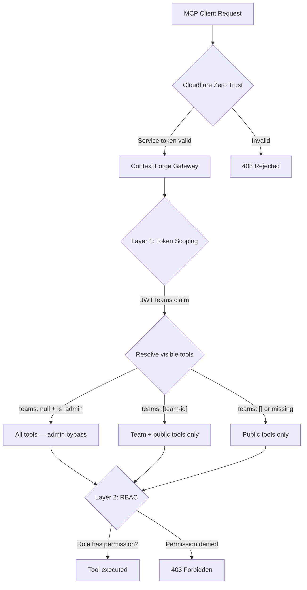
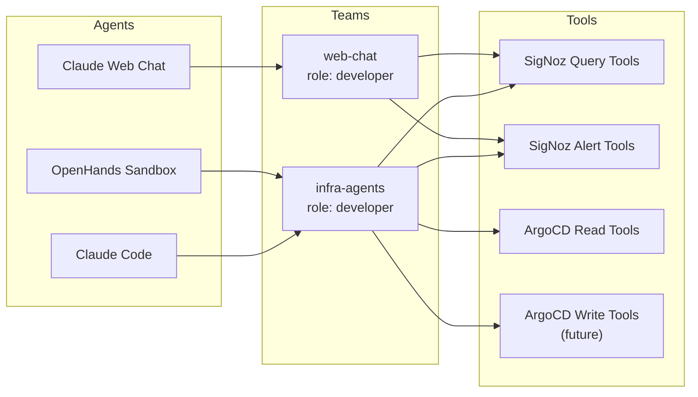

# ADR: Role-Based MCP Access

**Author:** Joe McGinley
**Status:** Draft
**Created:** 2026-03-01
**Relates to:** [003-context-forge](003-context-forge.md)

---

## Problem

Context Forge currently treats all MCP clients identically. Any agent that reaches the gateway — Claude Code, Claude web chat, OpenHands sandboxes, Cursor — gets the same unrestricted access to every registered tool. There is no way to:

- Give Claude web chat read-only SigNoz access while giving Claude Code full access
- Prevent a future agent from calling write-capable tools (ArgoCD sync, dashboard mutation)
- Audit which agent performed which operation

Cloudflare Zero Trust authenticates the *transport* (is this request allowed to reach the gateway?) but not the *identity* (which agent is this, and what should it be allowed to do?).

---

## Decision

Use Context Forge's built-in two-layer authorization — **token scoping** for resource visibility and **RBAC** for action permissions — to differentiate agents by role.

Each agent type gets a dedicated JWT with a `teams` claim that controls which tools it can see, and an RBAC role that controls what it can do with those tools.

---

## Architecture

### Two-Layer Auth Model

Every MCP request passes through both layers sequentially. Token scoping filters *what you can see*; RBAC controls *what you can do*.



### Agent-to-Team-to-Tool Mapping

Teams control tool visibility. Each agent type maps to a team with the appropriate role and tool set.



---

## Roles

Context Forge provides five built-in roles. Two are relevant:

| Role | Scope | Permissions | Use case |
|------|-------|-------------|----------|
| `developer` | Team | `tools.read`, `tools.execute`, `resources.read` | Agents that call tools |
| `viewer` | Team | `tools.read`, `resources.read` | Agents that only list tools (not useful for us) |

Both Claude Code and web chat need `tools.execute` to actually call SigNoz tools — the tools are read-only at the *backend*, but invoking them is still an `execute` action at the *gateway*. The `developer` role covers this.

The difference between agent types is **which tools they can see** (team scoping), not which RBAC actions they can perform.

---

## JWT Structure

Each agent type gets a long-lived API token with explicit team scoping:

```
# Claude Code / OpenHands — full tool access
{
  "sub": "infra-agent@jomcgi.dev",
  "teams": ["<infra-agents-team-id>"],
  "is_admin": false,
  "aud": "mcpgateway-api",
  "iss": "mcpgateway"
}

# Claude Web Chat — SigNoz only
{
  "sub": "web-chat@jomcgi.dev",
  "teams": ["<web-chat-team-id>"],
  "is_admin": false,
  "aud": "mcpgateway-api",
  "iss": "mcpgateway"
}
```

The admin registration token (`is_admin: true`, `teams: null`) remains for gateway management only — never used by agents at runtime.

---

## Implementation

### Config Changes

Enable MCP client auth (currently `false`):

```yaml
# charts/context-forge/values.yaml
mcp-stack:
  mcpContextForge:
    secret:
      MCP_CLIENT_AUTH_ENABLED: "true"
```

### Setup Steps

1. **Create teams** via admin API — `infra-agents` and `web-chat`
2. **Create users** — `infra-agent@jomcgi.dev` and `web-chat@jomcgi.dev` with `developer` role in their respective teams
3. **Mint API tokens** — long-lived, scoped to each user's teams
4. **Update tool registration** — set SigNoz tools to `visibility: team` and assign to both teams; future write tools assign to `infra-agents` only
5. **Distribute tokens** — Claude Code via `direnv` env vars; web chat via its MCP config

### What Changes for Existing Claude Code Sessions

After enabling `MCP_CLIENT_AUTH_ENABLED`, the current unauthenticated MCP access stops working. Claude Code's `.mcp.json` needs a Bearer token header added alongside the existing CF headers:

```json
{
  "mcpServers": {
    "context-forge": {
      "type": "stdio",
      "command": "npx",
      "args": [
        "mcp-remote",
        "https://mcp.jomcgi.dev/mcp/",
        "--header", "CF-Access-Client-Id: ${CF_ACCESS_CLIENT_ID}",
        "--header", "CF-Access-Client-Secret: ${CF_ACCESS_CLIENT_SECRET}",
        "--header", "Authorization: Bearer ${MCP_GATEWAY_TOKEN}"
      ]
    }
  }
}
```

---

## Phasing

**Phase 1 — Identity separation (now):**
Enable `MCP_CLIENT_AUTH_ENABLED`. Create a single `infra-agents` team with all tools set to public visibility. Mint one API token for Claude Code. This adds identity tracking without restricting access.

**Phase 2 — Team scoping (when adding write tools):**
Create the `web-chat` team. Move tool visibility from `public` to `team`. Register ArgoCD write tools in `infra-agents` only. Mint a scoped token for Claude web chat.

---

## References

| Resource | Relevance |
|----------|-----------|
| [Context Forge RBAC docs](https://ibm.github.io/mcp-context-forge/manage/rbac/) | Role definitions, token scoping contract |
| [Context Forge multi-tenancy](https://ibm.github.io/mcp-context-forge/architecture/multitenancy/) | Team-based resource isolation model |
| [003-context-forge](003-context-forge.md) | Gateway deployment this builds on |
