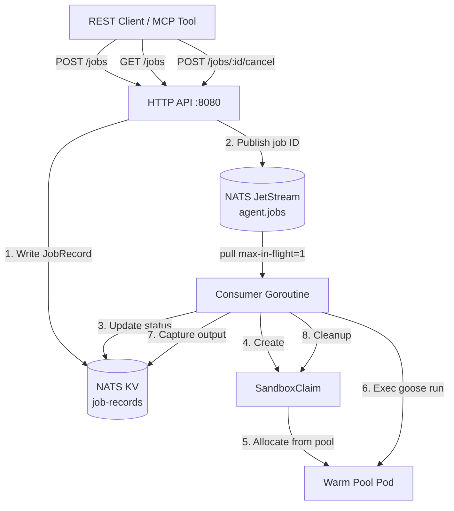

# ADR 007: Agent Run Orchestration Service

**Author:** jomcgi
**Status:** Draft
**Created:** 2026-03-07
**Supersedes:** None (extends [004-autonomous-agents](004-autonomous-agents.md))

---

## Problem

The `agent-run` CLI triggers Goose tasks via SandboxClaims but has no persistence — job state, output, and outcomes are ephemeral. There is no way to:

- Query what jobs have run, are running, or are pending
- Retry failed jobs with context from previous attempts
- Trigger jobs programmatically (e.g. from GitHub webhooks or Linear)
- Review job output after the terminal session ends

We need a service that wraps the existing agent-run logic with durable state and a queryable API, designed for both MCP chat interfaces and future webhook-driven automation.

---

## Proposal

A single Go service (`agent-orchestrator`) that combines an HTTP API with a NATS JetStream consumer. The service accepts job submissions via REST, queues them in JetStream, and processes them serially using the existing SandboxClaim lifecycle.

| Aspect | Today (agent-run CLI) | Proposed (agent-orchestrator) |
| ------ | --------------------- | ----------------------------- |
| Trigger | Human at terminal | REST API (future: webhooks) |
| State | Ephemeral (terminal session) | NATS KV (durable, queryable) |
| Output | Streamed to stdout | Captured to KV + pod logs |
| Retries | Manual re-run | Automatic with context inheritance |
| Concurrency | One per terminal | Serialized via JetStream consumer |
| Lifecycle | Process lifetime | Service lifetime (survives restarts) |

The API is designed for MCP tool wrapping — each endpoint maps to a natural conversational action (submit, list, check status, cancel, read output).

---

## Architecture



### Key design decisions

**NATS JetStream + KV** — Durable queue survives service restarts. KV provides queryable state without a separate database. Both use the existing single-node NATS deployment.

**MaxAckPending=3 (configurable)** — Allows up to 3 concurrent job executions via the `MAX_CONCURRENT` environment variable. Provides natural backpressure via JetStream's `MaxAckPending` setting. A stuck Goose session is detected by an inactivity watchdog (default 10 minutes of no output) which kills the execution context.

**Self-provisioning** — The service creates the JetStream stream and KV bucket on startup if they don't exist (idempotent).

**Cancellation via KV polling** — The consumer checks job status in KV before each lifecycle phase. Setting status to CANCELLED in KV is sufficient; no separate cancel channel needed.

**Retry with context inheritance** — Failed attempts enrich the next attempt's prompt with previous output summaries, helping the agent avoid repeated failure modes.

### Data model

```
JobRecord
├── id (ULID — sortable, URL-safe)
├── task, status, created_at, updated_at
├── max_retries, source ("api" | "github" | "cli")
├── github_issue (reserved), debug_mode (reserved)
├── attempts[]
│   ├── number, sandbox_claim_name
│   ├── exit_code, output
│   └── started_at, finished_at
└── failure_summary (reserved for DLQ)
```

### REST API

| Method | Path | Purpose | MCP use case |
|--------|------|---------|--------------|
| POST | `/jobs` | Submit job (202 Accepted) | "run this task" |
| GET | `/jobs` | List jobs (`?status=`, `?limit=`, `?offset=`) | "what's running?" |
| GET | `/jobs/:id` | Job detail + all attempts | "show me job X" |
| POST | `/jobs/:id/cancel` | Cancel running/pending job | "stop that job" |
| GET | `/jobs/:id/output` | Latest attempt output | "what did it produce?" |
| GET | `/health` | Liveness/readiness | k8s probes |

---

## Implementation

### Phase 1: MVP

- [ ] Create `services/agent-orchestrator/` with Go module and main.go
- [ ] Implement NATS client (connect, ensure stream + KV bucket)
- [ ] Implement job store (KV CRUD operations on JobRecord)
- [ ] Implement HTTP API handlers (submit, list, get, cancel, output, health)
- [ ] Port SandboxClaim lifecycle from `tools/agent-run/main.go` (create, poll, exec, cleanup)
- [ ] Implement consumer goroutine (pull, execute, retry logic)
- [ ] Build apko container image (`charts/agent-orchestrator/image/`)
- [ ] Create Helm chart (`charts/agent-orchestrator/`) with Deployment, Service, SA, RBAC
- [ ] Create overlay (`overlays/prod/agent-orchestrator/`) with ArgoCD Application
- [ ] Add BUILD files and verify `bazel build //services/agent-orchestrator/...`

### Phase 2: Observability & Resilience

- [ ] Add structured logging (slog JSON) with job context
- [ ] Prometheus metrics (jobs submitted, completed, failed, duration histogram)
- [ ] SigNoz dashboard for job lifecycle
- [ ] Output size limits (truncate in KV, full output in pod logs)
- [ ] Graceful shutdown (drain consumer, finish in-flight job)

### Phase 3: External Access & Webhooks

- [ ] Add Cloudflare Access authentication
- [ ] Expose via Cloudflare tunnel
- [ ] Add POST `/webhooks/github` endpoint with signature verification
- [ ] MCP tool definitions for Context Forge

### Phase 4: DLQ & Debug Mode

- [ ] DLQ stream for exhausted-retry jobs
- [ ] DLQ handler: synthesise failure_summary via Claude API
- [ ] DLQ handler: create/update GitHub issue with summary + attempt logs
- [ ] Re-queue with `debug_mode: true` and enriched prompt

---

## Security

- **No auth for MVP** — ClusterIP-only, not exposed outside the cluster
- **Non-root container** — uid 65532, drop ALL capabilities
- **RBAC scoped** — ServiceAccount can only manage SandboxClaims/Sandboxes in `goose-sandboxes` namespace + pod exec
- **No secrets in config** — all secrets via 1Password Operator (existing `agent-secrets`, `claude-auth`)
- **Sandbox isolation** — each attempt gets a fresh SandboxClaim; workspace data is ephemeral

See `architecture/security.md` for baseline. No deviations.

---

## Risks

| Risk | Likelihood | Impact | Mitigation |
| ---- | ---------- | ------ | ---------- |
| Hung Goose session blocks queue | Medium | Medium | Sandbox timeout behaviour terminates stuck pods |
| NATS KV output size limits | Low | Low | Truncate output in KV; full output remains in pod logs |
| Single-node NATS downtime | Low | High | Service retries NATS connection; jobs resume after reconnect |
| Warm pool exhaustion during retries | Low | Low | SandboxClaim waits for pool replenishment; no data loss |

---

## Open Questions

1. Should output capture have a max size before truncation in KV? (Phase 2)
2. Webhook payload format for GitHub → job mapping (Phase 3)
3. How to handle long-running Goose sessions that exceed KV value size limits

---

## References

| Resource | Relevance |
| -------- | --------- |
| [ADR 004: Autonomous Agents](004-autonomous-agents.md) | Current agent architecture this extends |
| [ADR 003: Context Forge](003-context-forge.md) | MCP gateway for future tool wrapping |
| [tools/agent-run/main.go](../../../tools/agent-run/main.go) | Existing CLI being wrapped |
| [NATS JetStream docs](https://docs.nats.io/nats-concepts/jetstream) | Queue and KV backing store |
| [agent-sandbox CRDs](../../../charts/agent-sandbox/crds/crds.yaml) | SandboxClaim lifecycle |
