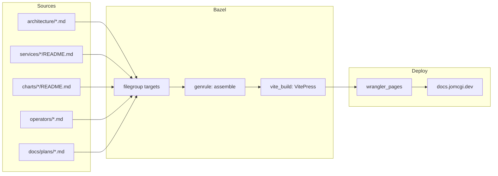

# ADR 001: Static Documentation Site for docs.jomcgi.dev

**Author:** Joe McGinley
**Status:** Draft
**Created:** 2026-03-01

---

## Problem

The homelab repository contains ~95 markdown files (~18,900 lines) spread across
`architecture/`, `services/*/`, `charts/*/`, `operators/`, `docs/plans/`,
`.claude/skills/`, and assorted READMEs. This documentation is only accessible by
navigating the raw repository, which creates friction for day-to-day reference and
makes it harder to share context.

A dedicated site at `docs.jomcgi.dev` would consolidate this knowledge into a
searchable, navigable format without requiring readers to clone the repo.

---

## Proposal

Use **VitePress** to generate the documentation site, deployed to Cloudflare Pages
via the existing `rules_wrangler` + Bazel pipeline.

| Aspect | Today | Proposed |
|--------|-------|----------|
| Discovery | `grep` / browse GitHub | Search at docs.jomcgi.dev |
| Navigation | Repository tree | Sidebar + cross-links |
| Access | Requires repo access | Public static site |
| Build system | N/A | Bazel (`vite_build` macro) |

### Why VitePress

1. **Toolchain alignment** — Vite is already in use across `websites/`. VitePress
   is maintained by the Vite team and shares the same dev server, config conventions,
   and plugin ecosystem. No second toolchain to learn or maintain.
2. **Markdown-first** — A directory of `.md` files *is* the site structure. Minimal
   ceremony to get from raw markdown to a navigable site.
3. **Bazel integration** — VitePress runs `vite build` under the hood. The existing
   `vite_build` macro in `tools/js/vite_build.bzl` already handles Vite builds within
   Bazel. VitePress slots into the same pattern: `js_run_binary` with `vite build`
   args, producing a `dist/` output directory consumed by `wrangler_pages`.
4. **Deployment** — Same `rules_wrangler` CF Pages deployment used by
   `trips.jomcgi.dev`, `ships.jomcgi.dev`, and `jomcgi.dev`. No new infra.

### Alternatives Considered

**Zensical** (Material for MkDocs successor) — v0.0.x alpha. Starting a new project
on alpha software introduces unnecessary maintenance risk. The docstring integration
story is not yet mature enough to differentiate for this use case.

**Starlight** (Astro) — More opinionated, component-heavy documentation framework.
Would work (Astro is already used for `jomcgi.dev`), but the Astro component model
is overkill for a pure-markdown reference site. VitePress is simpler for the same
result.

---

## Architecture

### Content Assembly via Bazel Filegroups

The key design question is how to assemble documentation from scattered locations
into the VitePress source tree at build time. Raw `vitepress dev docs/` assumes all
content lives under one directory — but ours is spread across the repo.

The approach: use Bazel `filegroup` targets to declare which markdown files
participate in the docs site, then assemble them into a predictable directory
structure that VitePress consumes.



Each source directory exports a `filegroup`:

```python
# architecture/BUILD
filegroup(
    name = "docs",
    srcs = glob(["*.md"]) + glob(["decisions/**/*.md"]),
    visibility = ["//websites/docs.jomcgi.dev:__pkg__"],
)
```

A `genrule` in `websites/docs.jomcgi.dev/BUILD` copies these into VitePress's
expected structure:

```python
genrule(
    name = "assemble_docs",
    srcs = [
        "//architecture:docs",
        "//services/ships_api:docs",
        "//charts/longhorn:docs",
        # ...
    ],
    outs = ["assembled"],
    cmd = """
        mkdir -p $@/architecture $@/services $@/charts
        cp $(locations //architecture:docs) $@/architecture/
        cp $(locations //services/ships_api:docs) $@/services/ships-api/
        # ...
    """,
)
```

This gives full control over what lands on the public site (security-sensitive
content stays excluded) and makes the build hermetic — Bazel knows exactly which
files the site depends on.

### VitePress Config

VitePress configuration lives at `websites/docs.jomcgi.dev/.vitepress/config.js`.
The sidebar and navigation are derived from the assembled directory structure.
VitePress supports auto-generated sidebars, but explicit configuration gives better
control over ordering and grouping.

### Build Target Structure

```python
# websites/docs.jomcgi.dev/BUILD
vite_build(
    name = "build",
    srcs = [":assemble_docs"] + glob([".vitepress/**/*"]),
    tool = ":vitepress",
    deps = ["vitepress"],
    # VitePress outputs to .vitepress/dist by default
    out_dir = ".vitepress/dist",
)

wrangler_pages(
    name = "docs",
    dist = ":build_dist",
    project_name = "docs-jomcgi-dev",
    wrangler = ":wrangler",
)
```

### Deployment

Same pattern as all other websites in this repo:
- `bazel run //websites/docs.jomcgi.dev:docs.push` for manual deploys
- GitHub Actions workflow (`.github/workflows/cf-pages-docs.yaml`) for CI
- Cloudflare Pages project: `docs-jomcgi-dev`
- DNS: `docs.jomcgi.dev` CNAME to CF Pages

---

## Implementation

### Phase 1: MVP — VitePress scaffold + architecture docs

- [ ] Add `vitepress` to pnpm workspace (`websites/docs.jomcgi.dev/package.json`)
- [ ] Create VitePress config (`.vitepress/config.js`) with basic theme and nav
- [ ] Add `filegroup` targets in `architecture/BUILD` for markdown exports
- [ ] Create `websites/docs.jomcgi.dev/BUILD` with `vite_build` + `wrangler_pages`
- [ ] Write assembly `genrule` for architecture docs
- [ ] Add static index page (`websites/docs.jomcgi.dev/index.md`)
- [ ] Verify `bazel build //websites/docs.jomcgi.dev:build` produces working output
- [ ] Create Cloudflare Pages project `docs-jomcgi-dev`
- [ ] Add CF Pages deploy workflow (`.github/workflows/cf-pages-docs.yaml`)
- [ ] Configure `docs.jomcgi.dev` DNS

### Phase 2: Expand content sources

- [ ] Add `filegroup` exports for `services/*/` READMEs
- [ ] Add `filegroup` exports for `charts/*/` READMEs
- [ ] Add `filegroup` exports for `operators/` docs
- [ ] Expand assembly genrule to include all sources
- [ ] Configure VitePress sidebar to reflect full content tree
- [ ] Add search (VitePress built-in local search or Algolia)

### Phase 3: Polish

- [ ] Custom theme / branding alignment with jomcgi.dev
- [ ] Cross-reference links between docs (architecture → service → chart)
- [ ] ADR index page (auto-generated from `architecture/decisions/`)
- [ ] Add to CLAUDE.md as documentation reference

---

## Security

No sensitive content should be published. The `filegroup` approach provides an
explicit allowlist — only files named in `srcs` are included. This is safer than
a glob-everything approach where secrets or internal notes could leak.

Review the content of each exported filegroup before adding it to the assembly.
Files like `.claude/AGENTS.md` (which contains internal agent capabilities) should
be excluded.

---

## Risks

| Risk | Likelihood | Impact | Mitigation |
|------|-----------|--------|------------|
| VitePress breaking changes | Low | Low | Pin version in package.json, Bazel ensures hermetic builds |
| Stale docs on site | Medium | Medium | CI rebuilds on every push to main; genrule deps track source files |
| Accidental secret publication | Low | High | Explicit filegroup allowlist, no glob-all patterns |
| Bazel genrule complexity for assembly | Medium | Low | Start simple (Phase 1 = architecture only), expand incrementally |

---

## Open Questions

1. Should the docs site include plan/design documents from `docs/plans/`, or are
   those too ephemeral for a reference site?
2. Should ADRs render with their full implementation checklists, or should those
   be stripped for the public-facing version?
3. Is `vite_build` macro sufficient for VitePress, or does VitePress's non-standard
   output directory (`.vitepress/dist` vs `dist/`) require a small macro extension?
4. Should the assembly step use a `genrule` (shell-based copy) or a custom Starlark
   rule for better file mapping control?

---

## References

| Resource | Relevance |
|----------|-----------|
| [VitePress docs](https://vitepress.dev) | Framework documentation |
| `tools/js/vite_build.bzl` | Existing Vite build macro to extend/reuse |
| `rules_wrangler/defs.bzl` | CF Pages deployment rule |
| `websites/trips.jomcgi.dev/BUILD` | Reference Vite + Bazel + CF Pages pattern |
| `websites/jomcgi.dev/BUILD` | Reference Astro + Bazel + CF Pages pattern |
| `websites/hikes.jomcgi.dev/BUILD` | Reference static filegroup + CF Pages pattern |
