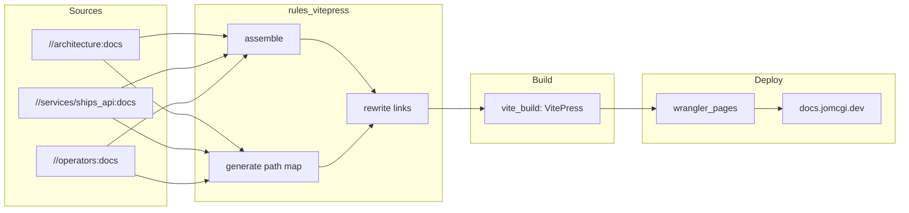

# ADR 001: Static Documentation Site for docs.jomcgi.dev

**Author:** Joe McGinley
**Status:** Draft
**Created:** 2026-03-01

---

## Problem

The homelab repository contains ~99 markdown files (~19,100 lines) spread across
`architecture/`, `services/*/`, `charts/*/`, `operators/`, `docs/plans/`,
`.claude/skills/`, and assorted READMEs. This documentation is only accessible by
navigating the raw repository, which creates friction for day-to-day reference and
makes it harder to share context.

A dedicated site at `docs.jomcgi.dev` would consolidate this knowledge into a
searchable, navigable format without requiring readers to clone the repo.

---

## Proposal

Use **VitePress** to generate the documentation site, deployed to Cloudflare Pages
via the existing `rules_wrangler` + Bazel pipeline. A new **`rules_vitepress`**
module provides the content assembly and link rewriting layer.

| Aspect       | Today                  | Proposed                                       |
| ------------ | ---------------------- | ---------------------------------------------- |
| Discovery    | `grep` / browse GitHub | Search at docs.jomcgi.dev                      |
| Navigation   | Repository tree        | Sidebar + cross-links                          |
| Access       | Requires repo access   | Public static site                             |
| Build system | N/A                    | Bazel (`rules_vitepress` + `vite_build` macro) |

### Why VitePress

1. **Toolchain alignment** — Vite is already in use across `websites/`. VitePress
   is maintained by the Vite team and shares the same dev server, config conventions,
   and plugin ecosystem. No second toolchain to learn or maintain.
2. **Markdown-first** — A directory of `.md` files _is_ the site structure. Minimal
   ceremony to get from raw markdown to a navigable site.
3. **Bazel integration** — The existing `vite_build` macro in
   `tools/js/vite_build.bzl` is framework-agnostic. It wraps `js_run_binary` with
   configurable `tool`, `build_args`, and `out_dir`. VitePress fits the same pattern
   used by `jomcgi.dev` (Astro) and `trips.jomcgi.dev` (Vite+React): pass
   `:vitepress` as the tool binary, and VitePress CLI's `build` subcommand matches
   the macro's default `build_args = ["build"]`. The `--outDir dist` flag normalises
   VitePress's non-standard `.vitepress/dist` output to the standard `dist/` the
   macro expects.
4. **Deployment** — Same `rules_wrangler` CF Pages deployment used by
   `trips.jomcgi.dev`, `ships.jomcgi.dev`, and `jomcgi.dev`. No new infra.

### Alternatives Considered

**Zensical** (Material for MkDocs successor) — v0.0.x alpha. Starting a new project
on alpha software introduces unnecessary maintenance risk. The docstring integration
story is not yet mature enough to differentiate for this use case.

**Starlight** (Astro) — More opinionated, component-heavy documentation framework.
Would work (Astro is already used for `jomcgi.dev`), but the Astro component model
is overkill for a pure-markdown reference site. VitePress is simpler for the same
result.

---

## Architecture

### `rules_vitepress` Module

A custom Bazel rule module that handles content declaration, assembly, link
rewriting, and site building. It provides two rules:

```
rules_vitepress/
├── BUILD
├── defs.bzl            # vitepress_filegroup rule + VitePressContentInfo provider
├── site.bzl            # vitepress_site macro (assemble → rewrite → build → deploy)
└── rewriter/
    ├── BUILD
    └── rewrite.py      # Link resolution, remapping, and dead link stripping
```

### `vitepress_filegroup` — Content Declaration

Each content source declares a `vitepress_filegroup` target in its BUILD file.
This is a custom Bazel rule (not a macro wrapping `filegroup`) that carries a
`VitePressContentInfo` provider with metadata about where the content should
appear in the docs site.

```python
# rules_vitepress/defs.bzl

VitePressContentInfo = provider(
    fields = {
        "repo_path": "Source package path in the repo (auto-derived from ctx.label.package)",
        "vitepress_path": "Output path in the docs site",
        "files": "Depset of source markdown files",
    },
)

def _vitepress_filegroup_impl(ctx):
    return [
        DefaultInfo(files = depset(ctx.files.srcs)),
        VitePressContentInfo(
            repo_path = ctx.label.package,
            vitepress_path = ctx.attr.vitepress_path,
            files = depset(ctx.files.srcs),
        ),
    ]

vitepress_filegroup = rule(
    implementation = _vitepress_filegroup_impl,
    attrs = {
        "srcs": attr.label_list(allow_files = [".md"]),
        "vitepress_path": attr.string(
            mandatory = True,
            doc = "Directory path in the docs site where these files are mounted.",
        ),
    },
)
```

**`repo_path` is derived automatically** from `ctx.label.package` — no user input
needed. This gives the link rewriter the source-side path for resolving relative
links. `vitepress_path` is the user-specified destination in the docs site.

Usage across the repo:

```python
# architecture/BUILD
load("//bazel/vitepress:defs.bzl", "vitepress_filegroup")

vitepress_filegroup(
    name = "docs",
    srcs = glob(["*.md"]) + glob(["decisions/**/*.md"]),
    vitepress_path = "architecture",
    visibility = ["//websites/docs.jomcgi.dev:__pkg__"],
)
# architecture/security.md              → architecture/security.md
# architecture/decisions/docs/001-*.md  → architecture/decisions/docs/001-*.md
```

```python
# services/ships_api/BUILD
vitepress_filegroup(
    name = "docs",
    srcs = ["README.md"],
    vitepress_path = "services/ships-api",
)
# services/ships_api/README.md → services/ships-api/README.md
```

```python
# operators/BUILD
vitepress_filegroup(
    name = "docs",
    srcs = glob(["*.md"]),
    vitepress_path = "operators",
)
```

**Why a custom rule, not a tagged `filegroup`**: A plain `filegroup` with
`tags = ["docs"]` cannot carry structured metadata like `vitepress_path`.
A custom rule with a provider gives the aggregation rule type-safe access
to the path mapping, which the link rewriter needs. This also means Bazel's
dependency graph naturally tracks which content sources are included — adding
a `vitepress_filegroup` is an explicit opt-in act.

### `vitepress_site` — Aggregation and Build

The `vitepress_site` macro in `websites/docs.jomcgi.dev/BUILD` lists all
content sources, assembles them, rewrites links, builds with VitePress, and
wires up deployment.

```python
# websites/docs.jomcgi.dev/BUILD
load("//bazel/vitepress:site.bzl", "vitepress_site")

vitepress_site(
    name = "docs",
    content = [
        "//architecture:docs",
        "//services/ships_api:docs",
        "//operators:docs",
    ],
    wrangler_project = "docs-jomcgi-dev",
)
```

This macro expands to the following pipeline:



Internally, `vitepress_site` creates these targets:

1. **`:assemble`** — Collects files from each `vitepress_filegroup` dep, copies
   them into a directory tree using each target's `vitepress_path` as the
   destination prefix. Preserves internal directory structure beneath the prefix.
2. **`:path_map`** — Generates a JSON mapping from all `VitePressContentInfo`
   providers: `{ "repo_path": "vitepress_path", ... }`.
3. **`:rewrite`** — Runs `rewrite.py` against the assembled tree using the path
   map. Outputs the rewritten content directory.
4. **`:build`** — `vite_build` with VitePress against the rewritten content.
5. **`:docs.push`** — `wrangler_pages` deployment to Cloudflare Pages.

### Link Rewriter

Authors write standard relative markdown links that work on GitHub. The build-time
rewriter translates them for the docs site. This means the same markdown renders
correctly in both GitHub and the docs site.

The rewriter (`rules_vitepress/rewriter/rewrite.py`) processes every `.md` file
in the assembled tree through a three-step pipeline:

| Step         | Operation                                    | On failure              |
| ------------ | -------------------------------------------- | ----------------------- |
| **Resolve**  | Relative path → full repo path               | Warn (malformed link)   |
| **Remap**    | Full repo path → vitepress path via path map | No mapping → strip link |
| **Validate** | Check file exists in assembled tree          | Missing → strip link    |

**Resolve**: Uses the file's `repo_path` (from `VitePressContentInfo`) to resolve
relative links. A link `../services/ships_api/README.md` in a file at repo path
`architecture/services.md` resolves to `services/ships_api/README.md`.

**Remap**: Looks up the resolved repo path in the path map. If
`services/ships_api` maps to `services/ships-api`, the link becomes
`/services/ships-api/README.md`.

**Validate**: Confirms the target file exists in the assembled tree. If the link
points to a file not included in any `vitepress_filegroup` (e.g., `.claude/AGENTS.md`),
the link is stripped — the display text is preserved but the link markup is removed.

Example transformations:

```markdown
# In architecture/services.md (repo source)

See the [Ships API](../services/ships_api/README.md) for details.

# → See the [Ships API](/services/ships-api/README.md) for details.

Read about [agent capabilities](../.claude/AGENTS.md) for context.

# → Read about agent capabilities for context.

# (link stripped — .claude/AGENTS.md not in any vitepress_filegroup)
```

Stripped links produce build warnings (not errors) so the build does not block
on references to unpublished content:

```
WARNING: architecture/services.md:42 — link to .claude/AGENTS.md stripped (not in docs site)
```

### Deployment

Same pattern as all other websites in this repo:

- `bazel run //websites/docs.jomcgi.dev:docs.push` for manual deploys
- GitHub Actions workflow (`.github/workflows/cf-pages-docs.yaml`) for CI
- Cloudflare Pages project: `docs-jomcgi-dev`
- DNS: `docs.jomcgi.dev` CNAME to CF Pages

---

## Implementation

### Phase 1: `rules_vitepress` + architecture docs

- [ ] Create `rules_vitepress/defs.bzl` with `vitepress_filegroup` rule and
      `VitePressContentInfo` provider
- [ ] Create `rules_vitepress/site.bzl` with `vitepress_site` macro
      (assemble + path map + rewrite + vite_build + wrangler_pages)
- [ ] Create `rules_vitepress/rewriter/rewrite.py` — link rewriting script
- [ ] Add `vitepress_filegroup` target in `architecture/BUILD`
- [ ] Add `vitepress` to pnpm workspace (`websites/docs.jomcgi.dev/package.json`)
- [ ] Create VitePress config (`.vitepress/config.js`) with basic theme and nav
- [ ] Create `websites/docs.jomcgi.dev/BUILD` using `vitepress_site`
- [ ] Add static index page (`websites/docs.jomcgi.dev/index.md`)
- [ ] Verify `bazel build //websites/docs.jomcgi.dev:build` produces working output
- [ ] Create Cloudflare Pages project `docs-jomcgi-dev`
- [ ] Add CF Pages deploy workflow (`.github/workflows/cf-pages-docs.yaml`)
- [ ] Configure `docs.jomcgi.dev` DNS

### Phase 2: Expand content sources

- [ ] Add `vitepress_filegroup` targets for `services/*/` READMEs
- [ ] Add `vitepress_filegroup` targets for `charts/*/` READMEs
- [ ] Add `vitepress_filegroup` targets for `operators/` docs
- [ ] Add new content targets to `vitepress_site` content list
- [ ] Configure VitePress sidebar to reflect full content tree
- [ ] Add search (VitePress built-in local search)

### Phase 3: Polish

- [ ] Custom theme / branding alignment with jomcgi.dev
- [ ] ADR index page (auto-generated from `architecture/decisions/`)
- [ ] Add to CLAUDE.md as documentation reference
- [ ] Gazelle extension for auto-discovering `vitepress_filegroup` targets
      (replaces manual `content` list in `vitepress_site`)

---

## Security

No sensitive content should be published. The `vitepress_filegroup` approach
provides an explicit allowlist — only packages that declare a `vitepress_filegroup`
target and are listed in the `vitepress_site` content list are included. This is
safer than a glob-everything approach where secrets or internal notes could leak.

The link rewriter provides a second safety layer: even if a markdown file references
excluded content via relative links, those links are stripped during build rather
than producing broken links on the public site.

Content that must remain excluded:

| Path                                   | Reason                                             |
| -------------------------------------- | -------------------------------------------------- |
| `.claude/AGENTS.md`                    | Internal agent capabilities and permissions        |
| `.claude/skills/`                      | Prompt engineering — internal tooling              |
| `.claude/templates/`                   | Internal workflow templates                        |
| `docs/plans/`                          | Ephemeral design documents, not reference material |
| `advent_of_code/`                      | Puzzle solutions, not homelab docs                 |
| `websites/jomcgi.dev/src/assets/cv.md` | Personal CV, not homelab docs                      |

---

## Risks

| Risk                                   | Likelihood | Impact | Mitigation                                                                                 |
| -------------------------------------- | ---------- | ------ | ------------------------------------------------------------------------------------------ |
| VitePress breaking changes             | Low        | Low    | Pin version in package.json, Bazel ensures hermetic builds                                 |
| Stale docs on site                     | Medium     | Medium | CI rebuilds on every push to main; Bazel deps track source files                           |
| Accidental secret publication          | Low        | High   | Explicit `vitepress_filegroup` allowlist, link stripping for excluded content              |
| Link rewriter misses edge cases        | Medium     | Low    | Warnings on stripped links surface issues; relative links still work on GitHub as fallback |
| `rules_vitepress` maintenance overhead | Low        | Low    | Small surface area (~3 files), follows existing `rules_wrangler` patterns                  |

---

## Open Questions

1. Should ADRs render with their full implementation checklists, or should those
   be stripped for the public-facing version?
2. Should `vitepress_site` support a `strict` mode that fails the build on
   stripped links instead of warning? Useful for enforcing complete cross-references
   once all content sources are added.

---

## References

| Resource                                | Relevance                                                                   |
| --------------------------------------- | --------------------------------------------------------------------------- |
| [VitePress docs](https://vitepress.dev) | Framework documentation                                                     |
| `tools/js/vite_build.bzl`               | Existing Vite build macro — framework-agnostic, supports VitePress directly |
| `rules_wrangler/defs.bzl`               | CF Pages deployment rule — `rules_vitepress` follows same patterns          |
| `rules_wrangler/gazelle/`               | Reference for future gazelle extension (Phase 3)                            |
| `websites/trips.jomcgi.dev/BUILD`       | Reference: Vite + `vite_build` macro + `wrangler_pages`                     |
| `websites/jomcgi.dev/BUILD`             | Reference: Astro (wraps Vite) + `vite_build` macro + `wrangler_pages`       |
| `websites/hikes.jomcgi.dev/BUILD`       | Reference: static `filegroup` → `wrangler_pages` (no build step)            |
