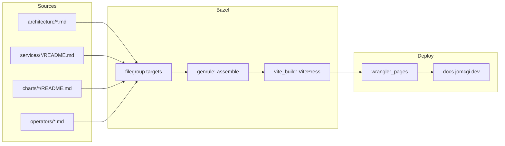

# ADR 001: Static Documentation Site for docs.jomcgi.dev

**Author:** Joe McGinley
**Status:** Draft
**Created:** 2026-03-01

---

## Problem

The homelab repository contains ~99 markdown files (~19,100 lines) spread across
`architecture/`, `services/*/`, `charts/*/`, `operators/`, `docs/plans/`,
`.claude/skills/`, and assorted READMEs. This documentation is only accessible by
navigating the raw repository, which creates friction for day-to-day reference and
makes it harder to share context.

A dedicated site at `docs.jomcgi.dev` would consolidate this knowledge into a
searchable, navigable format without requiring readers to clone the repo.

---

## Proposal

Use **VitePress** to generate the documentation site, deployed to Cloudflare Pages
via the existing `rules_wrangler` + Bazel pipeline.

| Aspect | Today | Proposed |
|--------|-------|----------|
| Discovery | `grep` / browse GitHub | Search at docs.jomcgi.dev |
| Navigation | Repository tree | Sidebar + cross-links |
| Access | Requires repo access | Public static site |
| Build system | N/A | Bazel (`vite_build` macro) |

### Why VitePress

1. **Toolchain alignment** — Vite is already in use across `websites/`. VitePress
   is maintained by the Vite team and shares the same dev server, config conventions,
   and plugin ecosystem. No second toolchain to learn or maintain.
2. **Markdown-first** — A directory of `.md` files *is* the site structure. Minimal
   ceremony to get from raw markdown to a navigable site.
3. **Bazel integration** — The existing `vite_build` macro in
   `tools/js/vite_build.bzl` is framework-agnostic. It wraps `js_run_binary` with
   configurable `tool`, `build_args`, and `out_dir`. VitePress fits the same pattern
   used by `jomcgi.dev` (Astro) and `trips.jomcgi.dev` (Vite+React): pass
   `:vitepress` as the tool binary, and VitePress CLI's `build` subcommand matches
   the macro's default `build_args = ["build"]`. The `--outDir dist` flag normalises
   VitePress's non-standard `.vitepress/dist` output to the standard `dist/` the
   macro expects.
4. **Deployment** — Same `rules_wrangler` CF Pages deployment used by
   `trips.jomcgi.dev`, `ships.jomcgi.dev`, and `jomcgi.dev`. No new infra.

### Alternatives Considered

**Zensical** (Material for MkDocs successor) — v0.0.x alpha. Starting a new project
on alpha software introduces unnecessary maintenance risk. The docstring integration
story is not yet mature enough to differentiate for this use case.

**Starlight** (Astro) — More opinionated, component-heavy documentation framework.
Would work (Astro is already used for `jomcgi.dev`), but the Astro component model
is overkill for a pure-markdown reference site. VitePress is simpler for the same
result.

---

## Architecture

### Content Assembly via Bazel Filegroups

The key design question is how to assemble documentation from scattered locations
into the VitePress source tree at build time. VitePress assumes all content lives
under one directory — but ours is spread across the repo.

The approach: use Bazel `filegroup` targets to declare which markdown files
participate in the docs site, then assemble them into a predictable directory
structure via a `genrule`. This is the same pattern used by
`hikes.jomcgi.dev/BUILD` (static filegroup → `wrangler_pages`), extended with an
assembly step.



Each source directory exports a `filegroup`:

```python
# architecture/BUILD
filegroup(
    name = "docs",
    srcs = glob(["*.md"]) + glob(["decisions/**/*.md"]),
    visibility = ["//websites/docs.jomcgi.dev:__pkg__"],
)
```

A `genrule` in `websites/docs.jomcgi.dev/BUILD` copies these into VitePress's
expected structure:

```python
genrule(
    name = "assemble_docs",
    srcs = [
        "//architecture:docs",
        "//services/ships_api:docs",
        "//charts/longhorn:docs",
        # ...
    ],
    outs = ["assembled"],
    cmd = """
        mkdir -p $@/architecture $@/services $@/charts
        cp $(locations //architecture:docs) $@/architecture/
        cp $(locations //services/ships_api:docs) $@/services/ships-api/
        # ...
    """,
)
```

**Why filegroups, not glob-all**: This gives full control over what lands on the
public site. Only files explicitly named in a `filegroup`'s `srcs` are included —
an allowlist model. Files like `.claude/AGENTS.md` (internal agent capabilities),
`.claude/skills/` (prompt engineering), and `docs/plans/` (ephemeral design
documents) stay excluded by default. When a new content source should be published,
it requires adding a `filegroup` export and an assembly line — a deliberate act, not
an accidental inclusion.

**Why genrule over a custom Starlark rule**: A `genrule` with shell `cp` is
sufficient for Phase 1 where the assembly is a flat copy per content area. The
trade-off is that nested directory structures (e.g., `decisions/agents/001-*.md`)
require explicit `mkdir -p` per subdirectory. If the assembly grows beyond ~10
sources or needs path rewriting (e.g., renaming directories during copy), a custom
Starlark rule would give better control. Start with genrule, migrate if it gets
unwieldy.

### Build Target Structure

The BUILD file follows the same pattern as `trips.jomcgi.dev/BUILD` and
`jomcgi.dev/BUILD` — both use `vite_build` + `wrangler_pages`:

```python
# websites/docs.jomcgi.dev/BUILD
load("@npm//websites/docs.jomcgi.dev:vitepress/package_json.bzl", vitepress_bin = "bin")
load("@npm//websites/docs.jomcgi.dev:wrangler/package_json.bzl", wrangler_bin = "bin")
load("//rules_wrangler:defs.bzl", "wrangler_pages")
load("//tools/js:vite_build.bzl", "vite_build")

# VitePress binary
vitepress_bin.vitepress_binary(name = "vitepress")

# Wrangler binary for Cloudflare Pages deployment
wrangler_bin.wrangler_binary(name = "wrangler")

# Assemble markdown from across the repo into VitePress source tree
genrule(
    name = "assemble_docs",
    srcs = [
        "//architecture:docs",
        # Phase 2: add services, charts, operators filegroups
    ],
    outs = ["assembled"],
    cmd = """
        mkdir -p $@/architecture $@/architecture/decisions/agents $@/architecture/decisions/docs
        cp $(locations //architecture:docs) $@/architecture/
    """,
)

# Build docs site — VitePress wraps Vite, so vite_build macro works directly.
# --outDir dist normalises output from .vitepress/dist to dist/ for the macro.
vite_build(
    name = "build",
    srcs = [":assemble_docs"] + glob([".vitepress/**/*"]),
    build_args = ["build", "--outDir", "dist"],
    config = None,  # VitePress auto-discovers .vitepress/config.js
    tool = ":vitepress",
    visibility = ["//visibility:public"],
    deps = ["vitepress"],
)

# Cloudflare Pages deployment
wrangler_pages(
    name = "docs",
    dist = ":build_dist",
    project_name = "docs-jomcgi-dev",
    visibility = ["//websites:__pkg__"],
    wrangler = ":wrangler",
)
```

**`vite_build` macro compatibility**: The macro (`tools/js/vite_build.bzl`) creates
three targets: `:node_modules`, `:src` (js_library), and `:build` (js_run_binary).
It accepts any tool binary — `jomcgi.dev` passes `:astro`, `trips.jomcgi.dev` passes
`:vite`, and this site passes `:vitepress`. The `build_args` parameter overrides the
default `["build"]` to add `--outDir dist`, which makes VitePress write output to
the standard `dist/` directory instead of `.vitepress/dist`. No macro changes needed.

### Deployment

Same pattern as all other websites in this repo:
- `bazel run //websites/docs.jomcgi.dev:docs.push` for manual deploys
- GitHub Actions workflow (`.github/workflows/cf-pages-docs.yaml`) for CI
- Cloudflare Pages project: `docs-jomcgi-dev`
- DNS: `docs.jomcgi.dev` CNAME to CF Pages

---

## Implementation

### Phase 1: MVP — VitePress scaffold + architecture docs

- [ ] Add `vitepress` to pnpm workspace (`websites/docs.jomcgi.dev/package.json`)
- [ ] Create VitePress config (`.vitepress/config.js`) with basic theme and nav
- [ ] Add `filegroup` targets in `architecture/BUILD` for markdown exports
- [ ] Create `websites/docs.jomcgi.dev/BUILD` with `vite_build` + `wrangler_pages`
- [ ] Write assembly `genrule` for architecture docs
- [ ] Add static index page (`websites/docs.jomcgi.dev/index.md`)
- [ ] Verify `bazel build //websites/docs.jomcgi.dev:build` produces working output
- [ ] Create Cloudflare Pages project `docs-jomcgi-dev`
- [ ] Add CF Pages deploy workflow (`.github/workflows/cf-pages-docs.yaml`)
- [ ] Configure `docs.jomcgi.dev` DNS

### Phase 2: Expand content sources

- [ ] Add `filegroup` exports for `services/*/` READMEs
- [ ] Add `filegroup` exports for `charts/*/` READMEs
- [ ] Add `filegroup` exports for `operators/` docs
- [ ] Expand assembly genrule to include all sources
- [ ] Configure VitePress sidebar to reflect full content tree
- [ ] Add search (VitePress built-in local search)

### Phase 3: Polish

- [ ] Custom theme / branding alignment with jomcgi.dev
- [ ] Cross-reference links between docs (architecture -> service -> chart)
- [ ] ADR index page (auto-generated from `architecture/decisions/`)
- [ ] Add to CLAUDE.md as documentation reference

---

## Security

No sensitive content should be published. The `filegroup` approach provides an
explicit allowlist — only files named in `srcs` are included. This is safer than
a glob-everything approach where secrets or internal notes could leak.

Content to exclude:

| Path | Reason |
|------|--------|
| `.claude/AGENTS.md` | Internal agent capabilities and permissions |
| `.claude/skills/` | Prompt engineering — internal tooling |
| `.claude/templates/` | Internal workflow templates |
| `docs/plans/` | Ephemeral design documents, not reference material |
| `advent_of_code/` | Puzzle solutions, not homelab docs |
| `websites/jomcgi.dev/src/assets/cv.md` | Personal CV, not homelab docs |

Review the content of each exported filegroup before adding it to the assembly.

---

## Risks

| Risk | Likelihood | Impact | Mitigation |
|------|-----------|--------|------------|
| VitePress breaking changes | Low | Low | Pin version in package.json, Bazel ensures hermetic builds |
| Stale docs on site | Medium | Medium | CI rebuilds on every push to main; genrule deps track source files |
| Accidental secret publication | Low | High | Explicit filegroup allowlist, no glob-all patterns |
| Bazel genrule complexity for assembly | Medium | Low | Start simple (Phase 1 = architecture only), expand incrementally |

---

## Open Questions

1. Should ADRs render with their full implementation checklists, or should those
   be stripped for the public-facing version?

---

## References

| Resource | Relevance |
|----------|-----------|
| [VitePress docs](https://vitepress.dev) | Framework documentation |
| `tools/js/vite_build.bzl` | Existing Vite build macro — framework-agnostic, supports VitePress directly |
| `rules_wrangler/defs.bzl` | CF Pages deployment rule |
| `websites/trips.jomcgi.dev/BUILD` | Reference: Vite + `vite_build` macro + `wrangler_pages` |
| `websites/jomcgi.dev/BUILD` | Reference: Astro (wraps Vite) + `vite_build` macro + `wrangler_pages` |
| `websites/hikes.jomcgi.dev/BUILD` | Reference: static `filegroup` -> `wrangler_pages` (no build step) |
