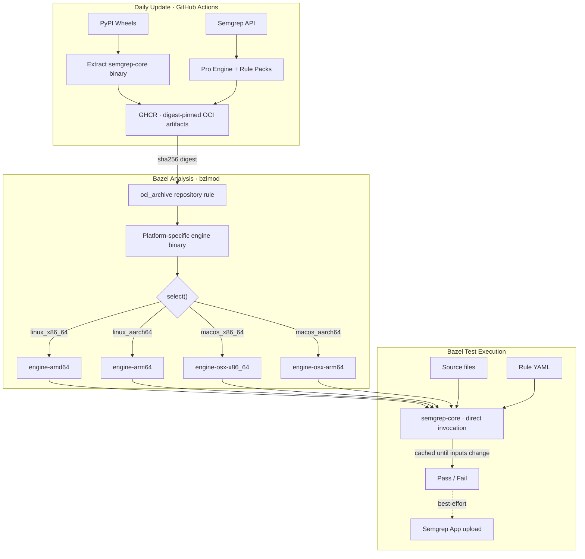

# Hermetic Semgrep via Bazel

**Author:** Joe McGinley
**Status:** Accepted
**Created:** 2026-03-04
**See also:** [rules_semgrep README](../../../rules_semgrep/README.md)

---

## Problem

Agentic coding workflows (Claude Code, autonomous agents) need CI feedback in seconds, not minutes. Semgrep on managed CI infrastructure took **2m+ for diff scans** and **5m+ for full scans** — too slow for tight agent iteration loops.

Beyond speed, the standard Semgrep integration (`pip install semgrep` + registry rule fetches) breaks **determinism**. pip resolution is non-hermetic. Rule registry pulls vary across runs. The Python wrapper adds 2-4s startup overhead per invocation. Agents need identical results from identical inputs.

Bazel's content-addressed cache model is the answer: tests re-run only when their inputs change. But Semgrep has no native Bazel integration, and the engine ships as a Python wheel — not a standalone binary.

## Proposal

Three-layer solution: (1) vendor `semgrep-core` OCaml binary as OCI artifacts on GHCR, bypassing the Python wrapper entirely; (2) Bazel rules that wire engine + rules + sources into cacheable `sh_test` targets; (3) a Gazelle extension that auto-generates scan targets from the dependency graph.

## Key Decisions

| Decision | Rationale |
|---|---|
| Bypass Python wrapper, invoke `semgrep-core` directly | Eliminates 2-4s Python startup per invocation |
| Vendor engine as OCI artifact (not pip) | Content-addressed digest pinning; platform-specific binaries; no pip resolution |
| `no-sandbox` Bazel tag | semgrep-core needs real filesystem paths; sandbox adds ~100x overhead |
| Aspect for transitive source collection | Walks the real dependency graph for cross-file `--pro` analysis |
| Graceful degradation (empty filegroup → SKIP) | Missing GHCR credentials produce SKIP, not FAIL — local dev works without registry access |
| Gazelle auto-generation | Zero-maintenance BUILD files; orphan detection ensures no coverage gaps |
| Per-rule-file execution with post-scan ID filtering | File-level exclusion is O(1); rule-ID exclusion handles granular suppressions |

## Results

| Metric | Before (managed CI) | After (Bazel + BuildBuddy) |
|---|---|---|
| Diff scan (cached) | 2m+ | **30s** |
| Full scan (new rules) | 5m+ | **50s** |
| Cold cache (all tests + images + semgrep) | N/A | **4m** |
| Determinism | Non-deterministic (registry fetches) | **Hermetic** (digest-pinned) |
| Cache invalidation | Time-based / none | **Content-addressed** (source + rule hash) |
