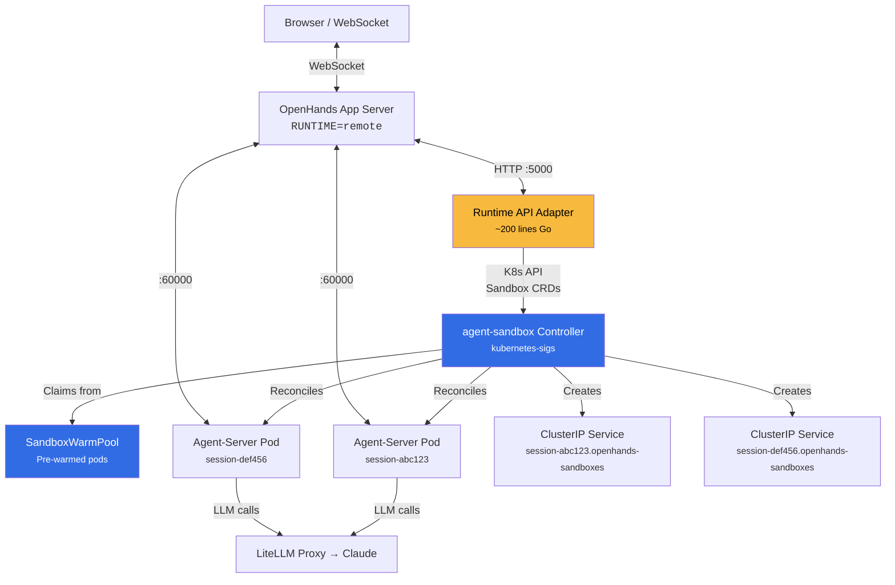
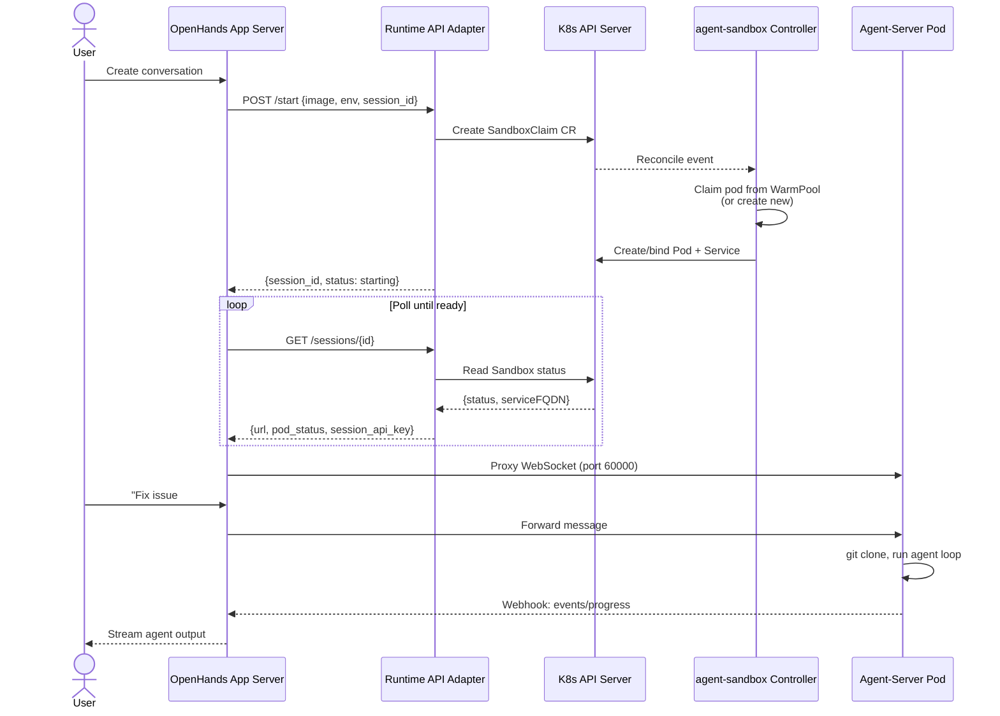

# RFC: OpenHands V1 Sandbox Migration via agent-sandbox

**Author:** Joe McGinley
**Status:** Draft
**Created:** 2026-02-25
**Deadline:** 2026-04-01 (V0 runtime removal date)

---

## Problem

OpenHands V0 `KubernetesRuntime` is [deprecated since 1.0.0](https://github.com/OpenHands/OpenHands/blob/main/openhands/runtime/impl/kubernetes/kubernetes_runtime.py#L1), scheduled for removal April 1, 2026. There is no V1 `KubernetesSandboxService` — the V1 app server only supports [Docker, Process, and Remote](https://github.com/OpenHands/OpenHands/blob/main/openhands/app_server/config.py) sandbox backends. The upstream maintainers have [directed K8s users to the paid OpenHands Cloud Helm chart](https://github.com/OpenHands/OpenHands/issues/6864) and the [V0 deprecation project](https://github.com/OpenHands/OpenHands/issues/12417) does not address the Kubernetes runtime gap.

## Proposal

Use the CNCF [kubernetes-sigs/agent-sandbox](https://github.com/kubernetes-sigs/agent-sandbox) controller (SIG Apps, 1k+ stars, Apache 2.0) to manage sandbox pod lifecycles, with a thin HTTP adapter bridging the [RemoteSandboxService API contract](https://github.com/OpenHands/OpenHands/blob/main/openhands/app_server/sandbox/remote_sandbox_service.py). This replaces the V0 `KubernetesRuntime` with well-supported, off-the-shelf Kubernetes-native infrastructure.

## Architecture



## Control Flow: New Conversation



## Components

### 1. agent-sandbox Controller (off-the-shelf)

[kubernetes-sigs/agent-sandbox](https://github.com/kubernetes-sigs/agent-sandbox) — KubeCon NA 2025, Google-led SIG Apps project. Install via manifests. Provides:

- **Sandbox CRD**: Single-pod workload with PodTemplate, VolumeClaimTemplates, lifecycle (auto-delete)
- **SandboxTemplate**: Reusable definitions — we define one for the OpenHands agent-server image
- **SandboxClaim**: Per-session claim against a template, created by the adapter
- **SandboxWarmPool**: Pre-warmed pods for near-instant startup (vs 30-60s cold start today)
- **Reconciliation**: Standard controller-runtime — crash-safe, survives restarts, declarative state

### 2. SandboxTemplate (YAML, checked into Git)

Defines the agent-server pod spec once. References the OpenHands `agent-server` image, resource limits, env vars (GitHub token, LLM config), and a Longhorn PVC for workspace storage.

### 3. Runtime API Adapter (~200 lines Go)

Stateless HTTP service translating [RemoteSandboxService calls](https://github.com/OpenHands/OpenHands/blob/main/openhands/app_server/sandbox/remote_sandbox_service.py) to Sandbox CR operations:

| Endpoint | Action |
|----------|--------|
| `POST /start` | Create `SandboxClaim` CR with env vars from request body |
| `POST /stop` | Delete `SandboxClaim` CR |
| `POST /pause` | Set `Sandbox.spec.replicas: 0` |
| `POST /resume` | Set `Sandbox.spec.replicas: 1` |
| `GET /sessions/{id}` | Read `Sandbox` status → return `{url, pod_status, session_api_key}` |
| `GET /sessions/batch` | Batch read multiple `Sandbox` statuses |
| `GET /list` | List `Sandbox` CRs in namespace |
| `GET /image_exists` | Check image via crane/registry API |

Authentication: `X-API-Key` header validated against a shared secret (1Password).

### 4. OpenHands App Server Config Change

```
RUNTIME=remote
SANDBOX_API_KEY=<shared-secret>
SANDBOX_REMOTE_RUNTIME_API_URL=http://openhands-runtime-api:5000
```

## Prior Art

| Project | Approach | Status |
|---------|----------|--------|
| [All-Hands-AI/OpenHands-Cloud `runtime-api`](https://github.com/All-Hands-AI/OpenHands-Cloud) | Python/Flask, PostgreSQL, warm pools, HPA. Official production implementation | Polyform license (commercial) |
| [zparnold/openhands-kubernetes-remote-runtime](https://github.com/zparnold/openhands-kubernetes-remote-runtime) | Go, in-memory state, full API contract. Community implementation | MIT, 0 stars, 3 weeks old |
| [zxkane/openhands-infra](https://github.com/zxkane/openhands-infra) | Same API but on AWS ECS Fargate + DynamoDB | Apache 2.0, different compute target |

The API adapter follows the same HTTP contract as all three implementations, validated by [RemoteSandboxService source](https://github.com/OpenHands/OpenHands/blob/main/openhands/app_server/sandbox/remote_sandbox_service.py).

## Migration Path

| Phase | What | When |
|-------|------|------|
| **0. Current** | V0 `KubernetesRuntime` + `RUNTIME=process` workaround | Now |
| **1. Install** | Deploy agent-sandbox controller, create SandboxTemplate + WarmPool | Week 1 |
| **2. Build** | Write and deploy the runtime API adapter | Week 1-2 |
| **3. Switch** | Change OpenHands config to `RUNTIME=remote`, point at adapter | Week 2 |
| **4. Remove** | Drop V0 config.toml `[kubernetes]` section, clean up old RBAC | Week 3 |

## Risks

- **agent-sandbox is v0.1.1**: Early but backed by Google/SIG Apps with active development
- **V0 removal may slip**: Original "4 weeks post-V1" became 4+ months; April 1 may shift again
- **Warm pool sizing**: Need to balance pre-warmed pods vs resource consumption on a 5-node homelab cluster
- **SandboxClaim pause/resume**: PVC retention during pause is [on the roadmap](https://github.com/kubernetes-sigs/agent-sandbox/blob/main/roadmap.md) but not yet implemented

## Decision

Proceed with Phase 1-2 implementation before March 15, test in parallel with V0, cut over when stable.
