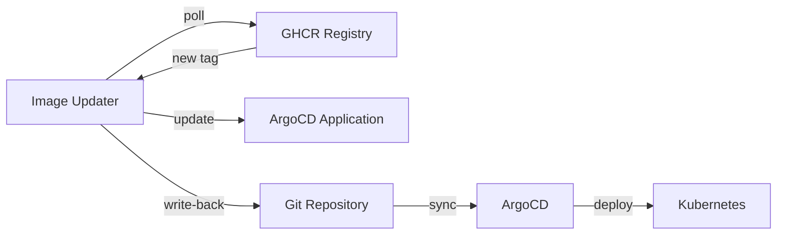

# ArgoCD Image Updater

Automated container image version updates for ArgoCD-managed applications.

## Overview

ArgoCD Image Updater monitors container registries for new image tags and automatically updates ArgoCD Application resources. It writes updated image tags back to Git, maintaining the GitOps workflow without manual intervention.

## Architecture

The chart wraps the upstream `argocd-image-updater` Helm chart and deploys a single component:

- **Image Updater** - A controller that polls configured registries on a 2-minute interval, detects new image versions matching configured constraints, and writes updated tags back to Git via authenticated commits

Authentication uses a GitHub token stored in a Kubernetes Secret (sourced from 1Password) for both GHCR registry access and Git write-back operations.

## Key Features

- **Automated image updates** - Polls GHCR for new tags and updates ArgoCD Applications
- **Git write-back** - Commits image tag changes directly to the Git repository
- **1Password integration** - GitHub token managed via 1Password Operator
- **Annotation-driven config** - Per-application update rules defined via ArgoCD Application annotations
- **Metrics endpoint** - Exposes Prometheus metrics for monitoring update activity
- **Rate-limited polling** - 2-minute interval prevents fork() exhaustion under load

## Configuration

| Value                                          | Description                          | Default                                    |
| ---------------------------------------------- | ------------------------------------ | ------------------------------------------ |
| `argocd-image-updater.extraArgs`               | CLI flags (e.g., polling interval)   | `["--interval", "2m"]`                     |
| `argocd-image-updater.config.registries`       | Container registries to monitor      | GHCR with pull secret                      |
| `argocd-image-updater.authScripts.enabled`     | Enable Git credential helper scripts | `true`                                     |
| `argocd-image-updater.env`                     | Environment variables (GitHub token) | Secret ref to `argocd-image-updater-token` |
| `argocd-image-updater.metrics.enabled`         | Enable Prometheus metrics            | `true`                                     |
| `argocd-image-updater.resources.limits.memory` | Memory limit                         | `1Gi`                                      |
| `argocd-image-updater.resources.requests.cpu`  | CPU request                          | `500m`                                     |
