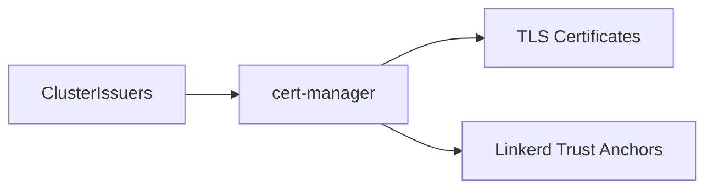

# cert-manager

X.509 certificate management for Kubernetes. Automates certificate issuance and renewal.

## Overview

Wrapper chart around the official [cert-manager](https://cert-manager.io/) Helm chart with local defaults. Used primarily for Linkerd mTLS trust anchor management.

## Key Features

- **Automatic renewal** - Certificates renew before expiration
- **Multiple issuers** - Supports ACME, self-signed, and CA issuers
- **Linkerd integration** - Manages mTLS identity certificates

## Configuration

| Value                    | Description                | Default                                                                   |
| ------------------------ | -------------------------- | ------------------------------------------------------------------------- |
| `cert-manager.*`         | Upstream chart values      | See [cert-manager chart](https://cert-manager.io/docs/installation/helm/) |
| `cert-manager.crds.keep` | Preserve CRDs on uninstall | `true`                                                                    |

## Components

The chart deploys three components:

- **Controller** - Watches Certificate resources and issues certificates
- **Webhook** - Validates and mutates cert-manager resources
- **CA Injector** - Injects CA bundles into webhooks and API services
