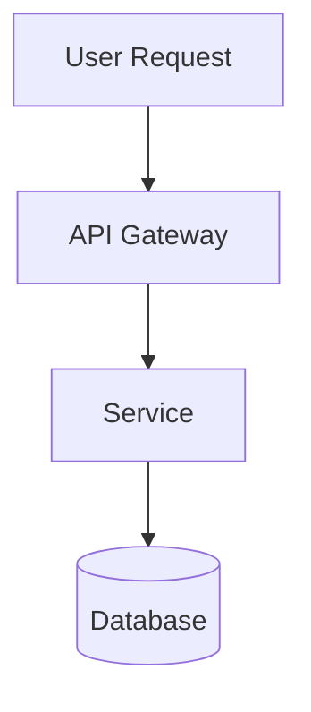

# Claude Web Interface - Developer Guide

This file contains developer-specific information for working with the Claude chart. For deployment and configuration, see [README.md](./README.md).

## Secrets

Required secrets (configured via 1Password Operator):

- `github_token` - Git operations and repository access

## Development

### Local Development

The chart includes source code in `src/` following the homelab colocation principle. See [architecture/contributing.md](/architecture/contributing.md) for build and test instructions.

### Common Operations

```bash
# After first deployment, authenticate Claude Code
kubectl exec -it deploy/claude -n claude -- claude /login

# Check service status
kubectl logs -n claude deploy/claude -f
kubectl exec -it deploy/claude -n claude -- claude /doctor
```

## UI Capabilities

### Diagram Rendering

When explaining architecture, flows, or relationships, you can output Mermaid diagrams
in fenced code blocks with the `mermaid` language tag. These will be rendered visually
in the UI with dark mode support.

Supported diagram types: flowcharts, sequence diagrams, class diagrams, state diagrams,
ER diagrams, gantt charts, pie charts, and more.

Example:



Use diagrams when they help explain:

- System architecture
- Request/response flows
- State machines
- Data relationships
- Process workflows

### Dev Server Previews

When running development servers (npm run dev, vite, next dev, etc.), they're accessible
externally via the preview proxy:

```
https://claude.jomcgi.dev/preview/<port>/
```

Example workflow:

1. Run `npm run dev` - starts dev server on port 5173
2. Tell user: "Preview available at https://claude.jomcgi.dev/preview/5173/"
3. Use Playwright to screenshot or interact with the preview if needed

Features:

- WebSocket support for HMR (hot module reload)
- Works with any dev server on ports 3000-9999
- No additional configuration needed

Common dev server ports:

- Vite: 5173
- Next.js: 3000
- Create React App: 3000
- Astro: 4321
