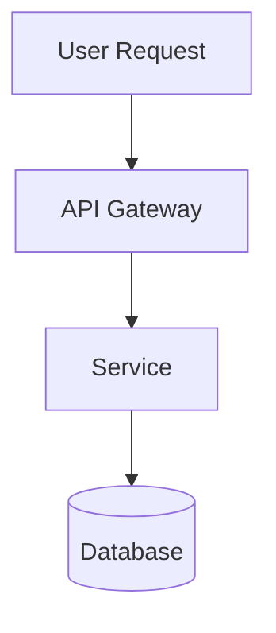

# Claude Web Interface

Claude Code web interface with React frontend, WebSocket streaming, and voice support.

## Architecture

Single pod deployment with:

- **Frontend** (React + Vite) - Served at `/`
- **API Server** (Express) - Endpoints at `/api/*`
- **WebSocket** - Claude Code streaming at `/ws`
- **Claude Code** - Max subscription (authenticate via `claude /login`)
- **Session Management** - File-based session persistence on PVC

## Key Files

- `frontend/` - React frontend (Vite + Tailwind)
- `src/src/index.ts` - Express API server
- `templates/deployment.yaml` - Single pod deployment
- `templates/pvc.yaml` - 200GB Longhorn storage for sessions
- `image/apko.yaml` - Container image definition

## API Endpoints

### REST

- `GET /api/health` - Health check
- `GET /api/sessions` - List all sessions
- `POST /api/sessions` - Create new session
- `GET /api/sessions/:id` - Get session details
- `DELETE /api/sessions/:id` - Delete session

### WebSocket

- `wss://host/ws?session=<id>` - Stream Claude Code I/O

## Persistence

PVC mounted at `/home/user` containing:

- `.claude/` - Claude Code OAuth tokens and state
- `.claude-api/sessions/` - Session metadata
- `.npm-global/` - Installed npm packages

## Secrets

From 1Password item `claude.jomcgi.dev`:

- `github_token` - Git operations
- `google_api_key` - Gemini API for voice transcription

## Common Tasks

### Initial Setup

```bash
# After first deployment, authenticate Claude Code
kubectl exec -it deploy/claude -n claude -- claude /login
```

### Check Status

```bash
kubectl logs -n claude deploy/claude -f
kubectl exec -it deploy/claude -n claude -- claude /doctor
```

## UI Capabilities

### Diagram Rendering

When explaining architecture, flows, or relationships, you can output Mermaid diagrams
in fenced code blocks with the `mermaid` language tag. These will be rendered visually
in the UI with dark mode support.

Supported diagram types: flowcharts, sequence diagrams, class diagrams, state diagrams,
ER diagrams, gantt charts, pie charts, and more.

Example:



Use diagrams when they help explain:

- System architecture
- Request/response flows
- State machines
- Data relationships
- Process workflows

### Dev Server Previews

When running development servers (npm run dev, vite, next dev, etc.), they're accessible
externally via the preview proxy:

```
https://claude.jomcgi.dev/preview/<port>/
```

Example workflow:

1. Run `npm run dev` - starts dev server on port 5173
2. Tell user: "Preview available at https://claude.jomcgi.dev/preview/5173/"
3. Use Playwright to screenshot or interact with the preview if needed

Features:

- WebSocket support for HMR (hot module reload)
- Works with any dev server on ports 3000-9999
- No additional configuration needed

Common dev server ports:

- Vite: 5173
- Next.js: 3000
- Create React App: 3000
- Astro: 4321
