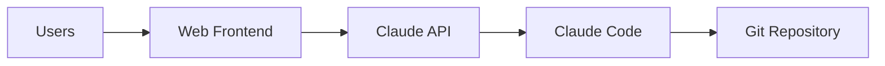

# Claude

Web interface for Claude Code with WebSocket streaming.

## Overview

Self-hosted Claude Code environment with a web UI and persistent sessions.

## Key Features

- **WebSocket streaming** - Real-time conversation updates
- **Persistent sessions** - Longhorn PVC for conversation history
- **Git sync** - Automatic repository cloning and fetch
- **Multi-replica HA** - Leader election for stateful operations

## Components

| Component     | Description                                                    |
| ------------- | -------------------------------------------------------------- |
| **API**       | Bun-based server managing Claude Code sessions                 |
| **Frontend**  | React UI with real-time updates (optional separate deployment) |
| **Repo sync** | Sidecar keeping git repository refs fresh                      |

## Configuration

| Value                    | Description                   | Default |
| ------------------------ | ----------------------------- | ------- |
| `replicas`               | Number of pod replicas        | `2`     |
| `api.port`               | API server port               | `3000`  |
| `repoSync.enabled`       | Enable git repository sync    | `false` |
| `persistence.size`       | PVC size for sessions         | `200Gi` |
| `leaderElection.enabled` | Enable leader election for HA | `true`  |
| `defaultPermissionMode`  | Claude Code permission mode   | `""`    |

## HA Deployment

For high availability:

1. Set `replicas: 2` or higher
2. Enable `leaderElection.enabled: true`
3. Optionally enable `frontend.enabled: true` for separate frontend scaling

Sessions are sticky to pods via leader election - each active conversation routes to a consistent backend.
