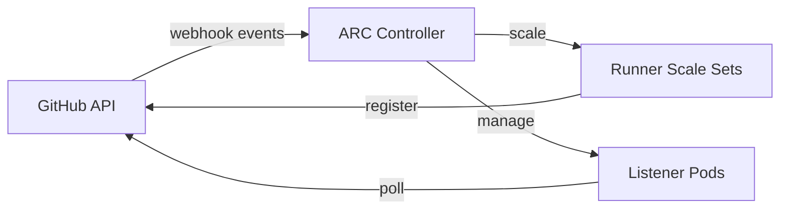

# GitHub Actions Runner Controller

Controller component for GitHub Actions Runner Controller (ARC) that manages self-hosted runner scale sets.

## Overview

The controller watches for GitHub Actions workflow runs and orchestrates runner pods to execute jobs. It runs as a separate deployment from the runners themselves, managing lifecycle and scaling decisions across all configured runner scale sets.

## Architecture

The chart wraps the upstream `gha-runner-scale-set-controller` chart and deploys:

- **Controller Manager** - Kubernetes controller that reconciles AutoscalingRunnerSet custom resources, managing runner pod lifecycle based on queued workflow jobs
- **Listener Pods** - Created per runner scale set to receive webhook events from GitHub and relay them to the controller

Authentication credentials are stored in a Kubernetes Secret managed by the 1Password Operator. The controller runs as non-root with a read-only filesystem and all capabilities dropped.

## Key Features

- **Autoscaling** - Scales runner pods based on pending GitHub Actions workflow jobs
- **1Password secrets** - GitHub PAT managed via OnePasswordItem CRD
- **Hardened security** - Non-root, read-only filesystem, seccomp, no privilege escalation
- **Metrics endpoint** - Exposes controller and listener metrics on port 8080
- **Separate namespace** - Controller runs independently from runner pods

## Configuration

| Value                                                           | Description                                 | Default                           |
| --------------------------------------------------------------- | ------------------------------------------- | --------------------------------- |
| `secret.type`                                                   | Secret provider (`onepassword` or `manual`) | `onepassword`                     |
| `secret.onepassword.itemPath`                                   | 1Password vault path for GitHub PAT         | `vaults/k8s-homelab/items/gh-arc` |
| `gha-runner-scale-set-controller.replicaCount`                  | Controller replicas                         | `1`                               |
| `gha-runner-scale-set-controller.resources.limits.cpu`          | CPU limit                                   | `500m`                            |
| `gha-runner-scale-set-controller.resources.limits.memory`       | Memory limit                                | `512Mi`                           |
| `gha-runner-scale-set-controller.metrics.controllerManagerAddr` | Metrics listen address                      | `:8080`                           |
| `gha-runner-scale-set-controller.serviceAccount.name`           | Controller service account name             | `arc-controller`                  |
