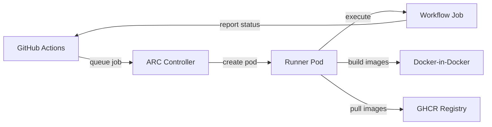

# GitHub Actions Runner Scale Set

Self-hosted GitHub Actions runners deployed as an autoscaling runner scale set with Docker-in-Docker support.

## Overview

This chart deploys ephemeral GitHub Actions runners that automatically scale based on pending workflow jobs. Runners use a custom image with build tools (gcc, g++, make, Bazel support) and Docker-in-Docker for container image builds. The scale set is managed by the ARC controller deployed separately via the `gh-arc-controller` chart.

## Architecture

The chart wraps the upstream `gha-runner-scale-set` chart and deploys:

- **Runner Pods** - Ephemeral containers running a custom runner image with build tooling, scaled from 0 to 3 based on demand
- **DinD Sidecar** - Docker-in-Docker container enabling container image builds within workflow jobs
- **Listener Pod** - Watches GitHub for queued jobs and signals the controller to scale

Secrets are managed via 1Password Operator for both the GitHub PAT and GHCR image pull credentials. Cross-namespace RBAC allows the controller (in `gh-arc-controller` namespace) to read the runner secret.

## Key Features

- **Scale to zero** - No runners when idle, scales up to 3 on demand
- **Docker-in-Docker** - Full container build capability for CI pipelines
- **Custom runner image** - Pre-installed build tools (gcc, g++, make, Bazel dependencies)
- **1Password secrets** - GitHub PAT and GHCR pull secret via OnePasswordItem CRDs
- **Cross-namespace auth** - RBAC grants controller access to runner secrets
- **Hardened listener** - Read-only filesystem, non-root, all capabilities dropped

## Configuration

| Value                                                                      | Description                                 | Default                                       |
| -------------------------------------------------------------------------- | ------------------------------------------- | --------------------------------------------- |
| `github.configUrl`                                                         | GitHub repository or organization URL       | `https://github.com/jomcgi/homelab`           |
| `runners.minRunners`                                                       | Minimum idle runners                        | `0`                                           |
| `runners.maxRunners`                                                       | Maximum concurrent runners                  | `3`                                           |
| `secret.type`                                                              | Secret provider (`onepassword` or `manual`) | `onepassword`                                 |
| `gha-runner-scale-set.containerMode.type`                                  | Container runtime mode                      | `dind`                                        |
| `gha-runner-scale-set.template.spec.containers[0].image`                   | Runner container image                      | `ghcr.io/jomcgi/homelab/gh-arc-runner:latest` |
| `gha-runner-scale-set.template.spec.containers[0].resources.limits.memory` | Runner memory limit                         | `4Gi`                                         |
| `controller.namespace`                                                     | Namespace where ARC controller runs         | `gh-arc-controller`                           |
