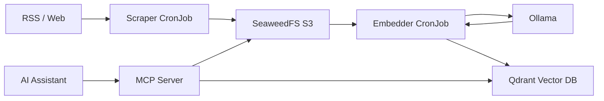

# Knowledge Graph

Extracts, embeds, and serves web content for semantic search via MCP.

## Overview

A content pipeline that scrapes configured sources (RSS feeds, web pages), stores raw content in S3-compatible storage, generates vector embeddings, and exposes semantic search through an MCP (Model Context Protocol) server for use by AI assistants.



## Architecture

The chart deploys four components:

- **Scraper Deployment** - Long-running Python HTTP server that exposes an API for on-demand scraping and health checks. Receives source configuration from a ConfigMap.
- **Scraper CronJob** - Batch job running every 6 hours (`scrape-all` command) that fetches all configured sources and stores raw content in a SeaweedFS S3 bucket. Sends Slack notifications on new content when configured.
- **Embedder CronJob** - Runs 30 minutes after each scrape cycle. Reads raw content from S3, generates vector embeddings via Ollama (nomic-embed-text), and upserts them into a Qdrant collection.
- **MCP Server** - Stateless Python service implementing the Model Context Protocol. Queries Qdrant for semantic similarity and retrieves original content from S3 to serve results.

All four components connect to SeaweedFS for storage and share embedding provider configuration. The scraper and MCP server each have their own ClusterIP Service.

## Key Features

- **Automated content pipeline** - Scrape, embed, and index on a configurable cron schedule
- **Semantic search via MCP** - AI assistants query indexed content through the Model Context Protocol
- **Configurable sources** - Define RSS feeds and web pages in the `sources` values (mounted as ConfigMap)
- **S3-compatible storage** - Raw content persisted in SeaweedFS for durability and reprocessing
- **Vector embeddings** - Powered by Ollama with configurable model (default: nomic-embed-text)
- **Slack notifications** - Optional webhook alerts when new content is discovered during scrapes
- **Independent scaling** - Scraper, embedder, and MCP server are separate workloads

## Configuration

| Value                           | Description                                         | Default                                                |
| ------------------------------- | --------------------------------------------------- | ------------------------------------------------------ |
| `sources`                       | List of URLs/feeds to scrape (mounted as ConfigMap) | `[]`                                                   |
| `cronjob.schedule`              | Scraper cron schedule                               | `"0 */6 * * *"`                                        |
| `embedder.schedule`             | Embedder cron schedule                              | `"30 */6 * * *"`                                       |
| `seaweedfs.endpoint`            | S3-compatible storage endpoint                      | `http://seaweedfs-s3.seaweedfs.svc.cluster.local:8333` |
| `qdrant.url`                    | Qdrant vector database URL                          | `http://qdrant.qdrant.svc.cluster.local:6333`          |
| `qdrant.collection`             | Qdrant collection name                              | `knowledge_graph`                                      |
| `embedding.ollama.model`        | Ollama embedding model                              | `nomic-embed-text`                                     |
| `storage.bucket`                | S3 bucket for raw content                           | `knowledge`                                            |
| `notifications.slackWebhookUrl` | Slack webhook for new content alerts                | `""`                                                   |
| `mcp.enabled`                   | Deploy the MCP server                               | `true`                                                 |

## Usage

### Adding Sources

Define scrape targets in your overlay `values.yaml`:

```yaml
sources:
  - url: "https://blog.example.com/feed.xml"
    type: "rss"
    name: "Example Blog"
  - url: "https://docs.example.com/page"
    type: "web"
    name: "Example Docs"
```

The scraper CronJob processes all sources every 6 hours. New sources take effect after ArgoCD syncs the updated ConfigMap.

### Querying via MCP

The MCP server is available within the cluster at:

```
http://knowledge-graph-mcp.<namespace>.svc.cluster.local
```

Configure your MCP-compatible AI assistant to connect to this endpoint for semantic search over all indexed content.

### Triggering a Manual Scrape

The scraper deployment exposes an HTTP API for on-demand scraping:

```bash
kubectl port-forward -n knowledge-graph svc/knowledge-graph-scraper 8080:80
curl http://localhost:8080/health
```
