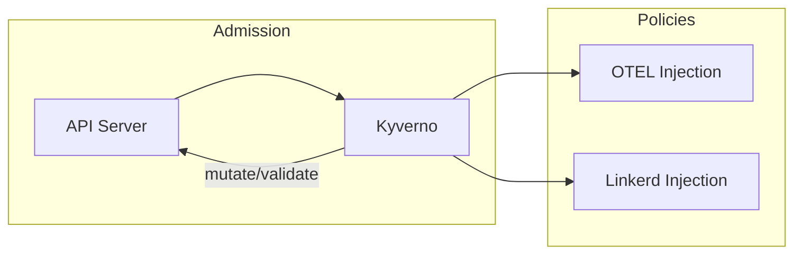

# Kyverno

Policy engine for Kubernetes with custom policies for observability automation.

## Overview



## Custom Policies

### OTEL Environment Variable Injection

Automatically injects OpenTelemetry configuration into all workloads:

```yaml
OTEL_EXPORTER_OTLP_ENDPOINT: signoz-otel-collector.signoz.svc.cluster.local:4317
OTEL_EXPORTER_OTLP_PROTOCOL: grpc
```

**Opt-out:**

```yaml
metadata:
  labels:
    otel.instrumentation: "disabled"
```

### Linkerd Namespace Injection

Automatically enables Linkerd mesh for all namespaces.

**Opt-out:**

```yaml
metadata:
  labels:
    linkerd.io/inject: "disabled"
```

## Configuration

| Value                      | Description                        | Default                                                |
| -------------------------- | ---------------------------------- | ------------------------------------------------------ |
| `otelInjection.enabled`    | Enable OTEL env var injection      | `true`                                                 |
| `otelInjection.endpoint`   | OTEL collector endpoint            | `signoz-otel-collector...`                             |
| `linkerdInjection.enabled` | Enable Linkerd namespace injection | `true`                                                 |
| `kyverno.*`                | Upstream chart values              | See [kyverno chart](https://kyverno.github.io/kyverno) |

## Excluded Namespaces

Both policies exclude system namespaces: `kube-system`, `kube-public`, `kube-node-lease`, `linkerd`, `cert-manager`, `kyverno`, `argocd`, `longhorn-system`, `signoz`.
