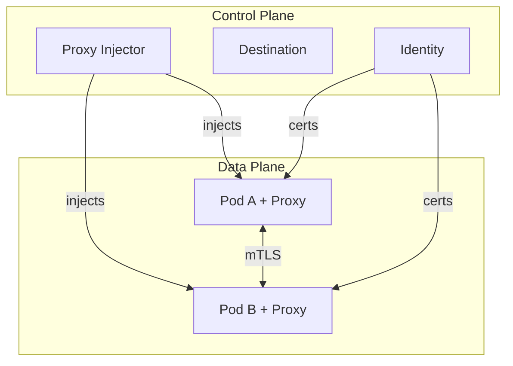

# Linkerd

Lightweight service mesh providing mTLS and observability for all pod-to-pod traffic.

## Overview



## Key Features

- **Automatic mTLS** - All meshed traffic encrypted
- **Zero-config injection** - Kyverno auto-enables for all namespaces
- **Lightweight** - Minimal resource overhead per pod

## Configuration

| Value                                      | Description                       | Default         |
| ------------------------------------------ | --------------------------------- | --------------- |
| `certManager.enabled`                      | Use cert-manager for trust anchor | `true`          |
| `linkerd-control-plane.controllerReplicas` | HA replicas                       | `2`             |
| `linkerd-control-plane.proxy.resources`    | Sidecar resources                 | See values.yaml |

## Integration with cert-manager

Trust anchor certificates are automatically managed by cert-manager via `templates/trust-anchor.yaml`.

## Namespace Injection

All namespaces are automatically injected via Kyverno policy. To opt-out:

```yaml
metadata:
  labels:
    linkerd.io/inject: "disabled"
```
