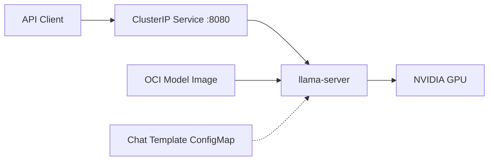

# llama-cpp

Helm chart for llama.cpp (llama-server) GPU-accelerated LLM inference.

## Overview

Deploys a single-replica llama-server instance with NVIDIA GPU support, designed for serving GGUF model files via an OpenAI-compatible API. Models are loaded from OCI image volumes (Kubernetes 1.31+), enabling versioned, pre-cached model distribution without persistent storage.



## Architecture

The chart deploys a single component:

- **llama-server** - The llama.cpp HTTP server running in a CUDA-enabled container (`ghcr.io/ggml-org/llama.cpp:server-cuda`) with GPU passthrough via the `nvidia` RuntimeClass. Exposes an OpenAI-compatible API including `/v1/chat/completions` and `/v1/completions`.

Key design decisions:

- **OCI image volumes** for model distribution -- the kubelet pulls and caches model images like container images, avoiding separate PVC provisioning or download steps.
- **Auto-discovery** -- when `modelPath` is empty, the entrypoint script finds the first `.gguf` file under the mount path. For split GGUF files, it discovers the first shard and llama.cpp loads siblings automatically.
- **Recreate strategy** -- GPU resources cannot be shared between old and new pods during rolling updates.
- **30-minute startup tolerance** -- the startup probe allows up to 180 attempts (30 min) for large model loading before declaring failure.
- **Shared memory** -- a 1Gi memory-backed emptyDir is mounted at `/dev/shm` for CUDA inter-process communication.

## Key Features

- **OCI image volumes** - Models distributed as OCI images, pulled and cached by the kubelet (K8s 1.31+)
- **Auto-discovery** - Automatically finds the `.gguf` file in the model volume when `modelPath` is not set
- **Split GGUF support** - Handles multi-part GGUF files by discovering the first shard
- **Flash attention** - Enabled by default for improved inference throughput
- **KV cache quantization** - Configurable K/V cache types (default: q8_0/q4_0) to reduce VRAM usage
- **Custom chat templates** - Optional Jinja template override via ConfigMap
- **Non-root execution** - Runs as uid 1000 with RuntimeDefault seccomp and all capabilities dropped
- **Jinja template engine** - Enabled by default for flexible chat template processing

## Configuration

| Value                   | Description                                      | Default       |
| ----------------------- | ------------------------------------------------ | ------------- |
| `image.tag`             | llama.cpp server image tag                       | `server-cuda` |
| `modelVolume.enabled`   | Mount model from OCI image volume                | `false`       |
| `modelVolume.reference` | OCI image reference containing GGUF model        | `""`          |
| `server.modelPath`      | Explicit model path (empty = auto-discover)      | `""`          |
| `server.nGpuLayers`     | GPU layers to offload (-1 = all)                 | `99`          |
| `server.ctxSize`        | Context window size in tokens                    | `32768`       |
| `server.flashAttn`      | Flash attention mode (`on`/`off`/`auto`)         | `"on"`        |
| `server.cacheTypeK`     | KV cache quantization for keys                   | `"q8_0"`      |
| `server.cacheTypeV`     | KV cache quantization for values                 | `"q4_0"`      |
| `server.threads`        | Number of CPU threads                            | `8`           |
| `server.chatTemplate`   | Jinja chat template override (creates ConfigMap) | `""`          |
| `runtimeClassName`      | Kubernetes RuntimeClass for GPU access           | `nvidia`      |

## Usage

### OpenAI-Compatible API

The server exposes an OpenAI-compatible API on port 8080:

```bash
kubectl port-forward -n llama-cpp svc/llama-cpp 8080:8080
curl http://localhost:8080/v1/chat/completions \
  -H "Content-Type: application/json" \
  -d '{"messages": [{"role": "user", "content": "Hello"}]}'
```

### Health Check

```bash
curl http://localhost:8080/health
```

The `/health` endpoint returns server status including model loading progress.
