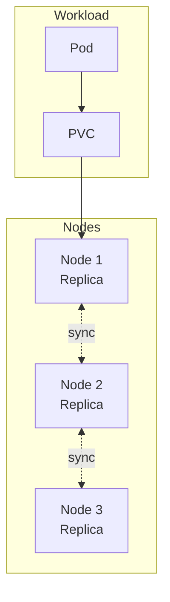

# Longhorn

Distributed block storage system for Kubernetes persistent volumes.

## Overview



## Key Features

- **Distributed replication** - Data replicated across nodes
- **Automatic recovery** - Self-healing from node failures
- **Backup/restore** - S3-compatible backup targets

## Configuration

| Value | Description | Default |
|-------|-------------|---------|
| `longhorn.*` | Upstream chart values | See [longhorn chart](https://charts.longhorn.io) |

## Storage Classes

Longhorn provides the default StorageClass. PVCs are automatically provisioned:

```yaml
apiVersion: v1
kind: PersistentVolumeClaim
metadata:
  name: my-data
spec:
  accessModes: [ReadWriteOnce]
  resources:
    requests:
      storage: 10Gi
```
