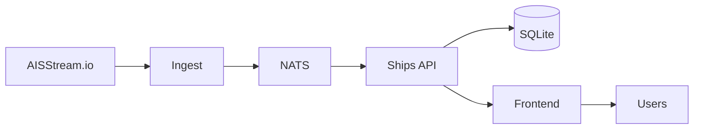

# Marine

AIS vessel tracking system with real-time ship position data.

## Overview

Combined chart deploying three components for ingesting, storing, and displaying maritime vessel data from [AISStream.io](https://aisstream.io/).

## Components

| Component    | Description                                          |
| ------------ | ---------------------------------------------------- |
| **Ingest**   | WebSocket client streaming AIS messages to NATS      |
| **API**      | REST + WebSocket API with SQLite persistence         |
| **Frontend** | MapLibre-based UI for real-time vessel visualization |

## Key Features

- **Real-time streaming** - Live vessel positions via WebSocket
- **Bounding box filtering** - Configure geographic coverage area
- **SQLite storage** - Persistent vessel history with Longhorn PVC
- **Zero Trust** - Optional Cloudflare Access integration

## Configuration

| Value                   | Description                 | Default            |
| ----------------------- | --------------------------- | ------------------ |
| `ingest.enabled`        | Enable AIS ingestion        | `true`             |
| `api.enabled`           | Enable Ships API            | `true`             |
| `frontend.enabled`      | Enable web frontend         | `true`             |
| `aisstream.boundingBox` | Geographic coverage area    | Americas region    |
| `api.persistence.size`  | SQLite storage size         | `20Gi`             |
| `frontend.hostname`     | Cloudflare ingress hostname | `ships.jomcgi.dev` |

## Architecture Notes

- **Single replica API** - Required due to SQLite single-writer constraint
- **NATS messaging** - Decouples ingestion from API for reliability
- **Bazel builds** - All container images built via Bazel rules
