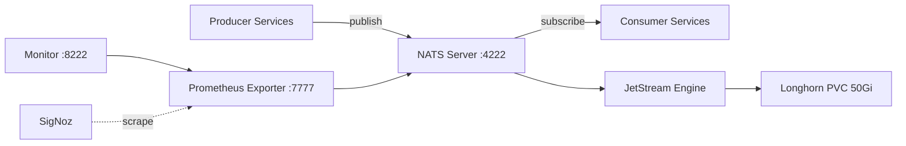

# NATS

JetStream-enabled messaging server -- shared infrastructure for the homelab.

## Overview

Deploys a single-node NATS server with JetStream persistence as shared messaging infrastructure. Multiple services publish and subscribe to NATS subjects, with storage isolation enforced at the stream level via `max_bytes` per stream. Pinned to a specific node with SSD storage for consistent high-throughput stream performance.



## Architecture

The chart wraps the upstream NATS Helm chart and deploys:

- **NATS Server** - Single-replica StatefulSet running NATS 2.10 with JetStream enabled. Listens on port 4222 for client connections. The port is annotated as opaque for Linkerd (`config.linkerd.io/opaque-ports`) since NATS uses a binary protocol that cannot be transparently proxied by the service mesh.
- **JetStream Storage** - File-based persistence backed by a 50Gi Longhorn PVC. The PVC is configured with `numberOfReplicas: "1"` to avoid redundant Longhorn replication on a single-node cluster. Data directory is mounted at `/data`.
- **Prometheus Exporter** - Sidecar container (`natsio/prometheus-nats-exporter:0.18.0`) that scrapes the NATS monitoring endpoint on port 8222 and exposes Prometheus metrics on port 7777. Service annotations enable SigNoz autodiscovery.
- **Node Pinning** - The pod is scheduled exclusively on `node-4` via `nodeSelector` for consistent access to SSD-backed storage.

Clustering is disabled -- this is a single-node NATS deployment suitable for a homelab environment.

## Key Features

- **JetStream persistence** - Durable message streams with at-least-once delivery, backed by Longhorn PVC
- **Linkerd compatible** - Port 4222 marked as opaque to bypass service mesh protocol detection
- **Prometheus metrics** - Exporter sidecar with SigNoz-compatible scrape annotations on the service
- **Node-pinned storage** - Scheduled on `node-4` for dedicated SSD-backed stream performance
- **Stream-level isolation** - Multiple services share one NATS instance with per-stream `max_bytes` limits
- **Low resource footprint** - 50m CPU / 64Mi memory requests for the server, 10m CPU / 32Mi for the exporter

## Configuration

| Value                                                  | Description                           | Default            |
| ------------------------------------------------------ | ------------------------------------- | ------------------ |
| `nats.container.image.tag`                             | NATS server image tag                 | `"2.10.24-alpine"` |
| `nats.config.jetstream.enabled`                        | Enable JetStream persistent messaging | `true`             |
| `nats.config.jetstream.fileStore.pvc.size`             | JetStream storage PVC size            | `50Gi`             |
| `nats.config.jetstream.fileStore.pvc.storageClassName` | Storage class for JetStream data      | `longhorn`         |
| `nats.config.cluster.enabled`                          | Enable NATS clustering                | `false`            |
| `nats.config.monitor.port`                             | Server monitoring endpoint port       | `8222`             |
| `nats.promExporter.enabled`                            | Enable Prometheus exporter sidecar    | `true`             |
| `nats.promExporter.port`                               | Exporter metrics port                 | `7777`             |
| `nats.statefulSet.replicas`                            | Number of NATS server replicas        | `1`                |
| `nats.service.ports.nats.port`                         | Client connection port                | `4222`             |

## Connecting from Other Services

Services within the cluster connect to NATS at:

```
nats://nats.nats.svc.cluster.local:4222
```

Example Go client connection:

```go
nc, err := nats.Connect("nats://nats.nats.svc.cluster.local:4222")
js, err := nc.JetStream()
```

## Resource Budgets

| Component           | CPU Request | Memory Request | CPU Limit | Memory Limit |
| ------------------- | ----------- | -------------- | --------- | ------------ |
| NATS Server         | 50m         | 64Mi           | 500m      | 512Mi        |
| Prometheus Exporter | 10m         | 32Mi           | 100m      | 64Mi         |
