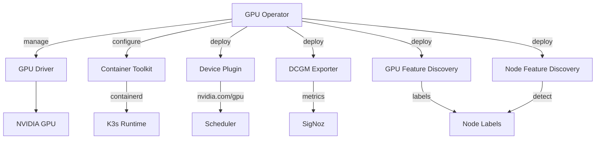

# NVIDIA GPU Operator

NVIDIA GPU Operator for Kubernetes, providing automated GPU driver management and device plugin configuration on K3s.

## Overview

The GPU Operator automates the management of all NVIDIA software components needed to provision and monitor GPUs in Kubernetes. It handles driver installation, container runtime configuration, device plugin registration, and GPU metrics export -- all as DaemonSets that target GPU-capable nodes.

## Architecture

The chart wraps the upstream NVIDIA `gpu-operator` chart and deploys the operator plus several DaemonSets:

- **GPU Operator** - Orchestrates lifecycle of all GPU components as DaemonSets on nodes with NVIDIA hardware
- **GPU Driver** - Builds and installs NVIDIA kernel drivers from source (pre-compiled not available for all kernels)
- **Container Toolkit** - Configures containerd with NVIDIA runtime hooks, using K3s-specific socket and config paths
- **Device Plugin** - Exposes `nvidia.com/gpu` resources to the Kubernetes scheduler
- **DCGM Exporter** - Exports GPU utilization, temperature, and memory metrics for Prometheus/SigNoz
- **GPU Feature Discovery** - Labels nodes with GPU model, driver version, and CUDA capability
- **Node Feature Discovery** - Detects hardware features to identify GPU-capable nodes

## Key Features

- **Automated driver management** - Builds NVIDIA drivers from source for the running kernel
- **K3s integration** - Configured for K3s containerd socket and config paths
- **GPU metrics** - DCGM Exporter with SigNoz annotations for automatic scraping
- **Scheduler-aware** - Device plugin enables `nvidia.com/gpu` resource requests
- **Node labeling** - GPU Feature Discovery labels nodes with hardware capabilities via NVML
- **Consumer GPU support** - MIG and vGPU disabled (not applicable to consumer GPUs)

## Configuration

| Value                                | Description                                      | Default |
| ------------------------------------ | ------------------------------------------------ | ------- |
| `gpu-operator.driver.enabled`        | Install NVIDIA GPU drivers                       | `true`  |
| `gpu-operator.driver.usePrecompiled` | Use pre-compiled drivers (vs. build from source) | `false` |
| `gpu-operator.toolkit.enabled`       | Install NVIDIA Container Toolkit                 | `true`  |
| `gpu-operator.devicePlugin.enabled`  | Deploy GPU device plugin                         | `true`  |
| `gpu-operator.dcgmExporter.enabled`  | Deploy DCGM metrics exporter                     | `true`  |
| `gpu-operator.gfd.enabled`           | Deploy GPU Feature Discovery                     | `true`  |
| `gpu-operator.nfd.enabled`           | Deploy Node Feature Discovery                    | `true`  |
| `gpu-operator.migManager.enabled`    | Enable Multi-Instance GPU manager                | `false` |
