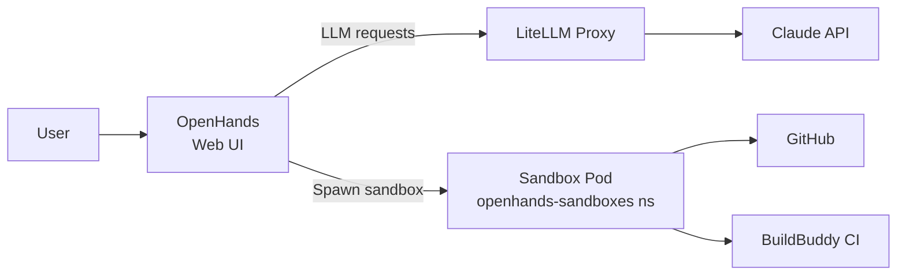

# OpenHands

Autonomous coding agents with Kubernetes-native sandbox runtime.

## Overview

Deploys OpenHands (autonomous AI coding agents) with KubernetesRuntime, where each agent session spawns an isolated sandbox pod in a dedicated namespace. A LiteLLM proxy translates OpenHands LLM requests into Claude API calls using OAuth authentication. Resource quotas and limit ranges constrain sandbox resource consumption.

## Architecture

The chart deploys three layers:

- **OpenHands App** - Web UI and agent runtime coordinator on port 3000. Reads configuration from `config.toml` (KubernetesRuntime settings) and `settings.json` (LLM defaults seeded by init container). Persists workspace and session data to a PVC. Uses Recreate deployment strategy to avoid conflicts with the single-writer workspace volume.
- **LiteLLM Proxy** - Translates OpenAI-compatible API calls from OpenHands into Claude API requests using an OAuth token from 1Password. Runs as non-root (uid 1001) with read-only root filesystem. Hardened with all capabilities dropped.
- **Sandbox Namespace** - Dedicated `openhands-sandboxes` namespace where agent runtime pods are spawned. Secured with ResourceQuota (max 5 pods, 5 CPU, 15Gi memory), LimitRange (1 CPU, 3Gi per container), and RBAC scoped to the OpenHands service account.

## Key Features

- **KubernetesRuntime sandboxes** - Each agent session runs in an isolated pod with its own PVC
- **Resource-constrained sandboxes** - ResourceQuota and LimitRange prevent runaway agents
- **RBAC-scoped pod management** - Service account can only manage pods in the sandbox namespace
- **LiteLLM Claude proxy** - OAuth-based Claude access without exposing API keys to agents
- **1Password secrets** - Claude SDK token and GitHub/BuildBuddy tokens via OnePasswordItem
- **Init container seeding** - Default settings.json created on first deploy, preserved on upgrades
- **Security analyzer** - Built-in LLM-based security analysis of agent actions

## Configuration

| Value                              | Description                                  | Default                     |
| ---------------------------------- | -------------------------------------------- | --------------------------- |
| `llm.model`                        | LLM model for agents                         | `claude-opus-4-6`     |
| `llm.apiKey`                       | Shared API key between app and proxy         | `sk-openhands-internal`     |
| `app.persistence.size`             | Workspace PVC size                           | `5Gi`                       |
| `kubernetes.sandboxNamespace`      | Namespace for sandbox pods                   | `openhands-sandboxes`       |
| `kubernetes.runtimeImage`          | Container image for sandbox pods             | `ghcr.io/openhands/runtime:0.59-nikolaik` |
| `kubernetes.pvcStorageSize`        | PVC size per sandbox                         | `2Gi`                       |
| `sandboxes.resourceQuota.maxPods`  | Maximum concurrent sandbox pods              | `5`                         |
| `sandboxes.resourceQuota.maxMemory`| Total memory budget for all sandboxes        | `15Gi`                      |
| `secrets.claudeSdkToken.itemPath`  | 1Password path for Claude OAuth token        | `""` (set in overlay)       |

## Usage

OpenHands provides a web interface for launching autonomous coding agents. Each agent session spawns a sandbox pod in the `openhands-sandboxes` namespace with its own storage volume. Agents can interact with GitHub repositories and trigger BuildBuddy CI builds using injected credentials. The LiteLLM proxy handles all LLM communication, routing requests to Claude via OAuth without exposing tokens to the sandbox environment.
