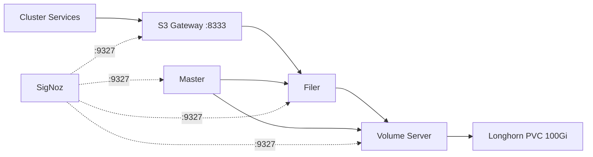

# SeaweedFS

S3-compatible distributed object storage -- shared infrastructure for the homelab.

## Overview

Deploys SeaweedFS as shared object storage infrastructure using the upstream Helm chart. Multiple services (knowledge-graph, marine, etc.) use this for S3-compatible blob storage. Configured for a single-node homelab with Longhorn-backed persistent volumes and Prometheus metrics for SigNoz monitoring.



## Architecture

The chart wraps the upstream SeaweedFS Helm chart and deploys four components, each as a single replica optimized for a homelab environment:

- **Master** - Manages cluster topology and volume assignment. Stores metadata in a 1Gi Longhorn PVC. Coordinates the filer and volume servers.
- **Volume Server** - Stores actual file data in a 100Gi Longhorn PVC. Includes a custom init container (`seaweedfs-vol-fix-idx`) that rebuilds missing `.idx` index files from `.dat` data files on startup. This is necessary because the upstream chart stores `.idx` files in an emptyDir that is lost when pods are rescheduled.
- **Filer** - Provides file-system-like access and metadata mapping over the volume layer. Maintains its own 5Gi Longhorn PVC for the filer database.
- **S3 Gateway** - Exposes an S3-compatible API on port 8333 for standard bucket and object operations. Authentication is disabled for cluster-internal use.

All components have anti-affinity disabled (single-node cluster) and include pre-populated OTEL annotations to prevent ArgoCD drift when Kyverno injects them.

## Key Features

- **S3-compatible API** - Standard S3 operations on port 8333, no auth required within the cluster
- **Longhorn persistence** - All stateful components backed by Longhorn storage classes
- **Index auto-repair** - Custom init container on the volume server rebuilds lost `.idx` files after pod rescheduling
- **Prometheus metrics** - All four components expose metrics on port 9327 for SigNoz autodiscovery
- **ArgoCD drift prevention** - OTEL and Prometheus annotations pre-populated to match Kyverno injection
- **Single-node optimized** - Anti-affinity disabled, single replicas for all components

## Configuration

| Value                                       | Description                      | Default    |
| ------------------------------------------- | -------------------------------- | ---------- |
| `seaweedfs.master.replicas`                 | Number of master replicas        | `1`        |
| `seaweedfs.master.data.size`                | Master metadata PVC size         | `1Gi`      |
| `seaweedfs.volume.replicas`                 | Number of volume server replicas | `1`        |
| `seaweedfs.volume.dataDirs[0].size`         | Volume data PVC size             | `100Gi`    |
| `seaweedfs.volume.dataDirs[0].storageClass` | Storage class for volume data    | `longhorn` |
| `seaweedfs.filer.replicas`                  | Number of filer replicas         | `1`        |
| `seaweedfs.filer.data.size`                 | Filer database PVC size          | `5Gi`      |
| `seaweedfs.s3.port`                         | S3 gateway listen port           | `8333`     |
| `seaweedfs.s3.enableAuth`                   | Enable S3 authentication         | `false`    |
| `seaweedfs.global.enableSecurity`           | Enable inter-component mTLS      | `false`    |

## Connecting from Other Services

Services within the cluster access SeaweedFS via the S3 gateway service:

```
http://seaweedfs-s3.seaweedfs.svc.cluster.local:8333
```

No credentials are required when `s3.enableAuth` is `false`. Standard S3 client libraries (boto3, aws-sdk, etc.) work with any dummy access key:

```python
import boto3

s3 = boto3.client(
    "s3",
    endpoint_url="http://seaweedfs-s3.seaweedfs.svc.cluster.local:8333",
    aws_access_key_id="any",
    aws_secret_access_key="any",
)
s3.put_object(Bucket="my-bucket", Key="data.json", Body=b'{"hello": "world"}')
```

## Resource Budgets

| Component  | CPU Request | Memory Request | CPU Limit | Memory Limit |
| ---------- | ----------- | -------------- | --------- | ------------ |
| Master     | 50m         | 64Mi           | 200m      | 256Mi        |
| Volume     | 100m        | 128Mi          | 500m      | 512Mi        |
| Filer      | 100m        | 128Mi          | 500m      | 512Mi        |
| S3 Gateway | 50m         | 64Mi           | 200m      | 256Mi        |
