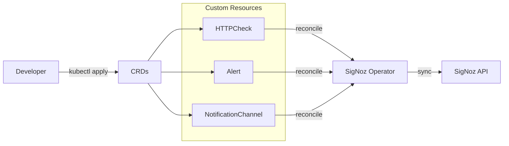

# SigNoz Operator

Custom Resource Definitions for Kubernetes-native management of SigNoz monitoring resources.

## Overview

The SigNoz Operator provides CRDs that let you define HTTP health checks, alerting rules, and notification channels as Kubernetes resources. A separate controller (in `operators/`) reconciles these CRDs against the SigNoz API, enabling co-location of monitoring configuration alongside application deployments.

## Architecture

This chart contains only CRD definitions (no controllers or deployments). The three CRDs are:

- **HTTPCheck** (namespaced) - Synthetic HTTP health checks with configurable intervals, timeouts, expected status codes, and optional Cloudflare Access authentication
- **Alert** (namespaced) - Alerting rules that reference HTTPChecks or use custom PromQL/ClickHouse queries, with configurable severity, evaluation windows, and notification routing
- **NotificationChannel** (cluster-scoped) - Shared notification targets supporting PagerDuty, Slack, and webhook integrations with secret-based credential storage

All CRDs use `apiVersion: monitoring.jomcgi.dev/v1alpha1` and provide status subresources with phases (Pending, Syncing, Synced, Error, Disabled). Short names (`hc`, `al`, `nc`) are registered for quick kubectl access.

## Key Features

- **Co-located monitoring** - Define health checks and alerts alongside application manifests
- **HTTPCheck-to-Alert references** - Alerts can reference HTTPChecks directly, avoiding manual query construction
- **Shared notification channels** - Cluster-scoped NotificationChannels reusable across namespaces
- **Multiple notification types** - PagerDuty, Slack, and generic webhook support
- **Cloudflare Access support** - HTTPChecks can authenticate through Zero Trust endpoints
- **Status tracking** - Resources report sync phase, last check time, and alert state via status subresource
- **Opt-in disable** - Temporarily disable any resource with `spec.disabled: true`

## Configuration

This chart installs CRDs only and has no configurable Helm values. Resources are configured individually via their specs:

| CRD                   | Scope      | Short Name | Key Fields                                                                                    |
| --------------------- | ---------- | ---------- | --------------------------------------------------------------------------------------------- |
| `HTTPCheck`           | Namespaced | `hc`       | `endpoint`, `interval`, `timeout`, `expectedStatusCode`, `authSecretRef`                      |
| `Alert`               | Namespaced | `al`       | `alertName`, `httpCheckRef` or `customQuery`, `condition`, `severity`, `notificationChannels` |
| `NotificationChannel` | Cluster    | `nc`       | `type` (pagerduty/slack/webhook), provider-specific config, `sendResolved`                    |

See the [CRD README](./crds/README.md) for detailed usage examples and the [API Reference](./crds/API_REFERENCE.md) for complete field documentation.
