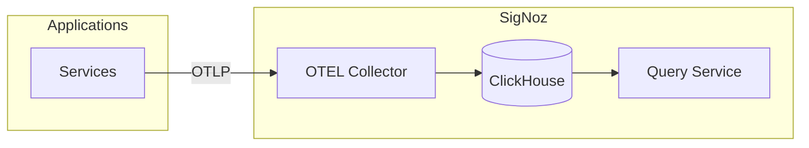

# SigNoz

Unified observability platform for metrics, logs, and traces.

## Overview

## Key Features

- **OpenTelemetry native** - Direct OTLP ingestion
- **ClickHouse backend** - Fast columnar storage for observability data
- **Unified UI** - Single pane for metrics, logs, and traces

## Configuration

| Value         | Description                         | Default                                         |
| ------------- | ----------------------------------- | ----------------------------------------------- |
| `signoz.*`    | Upstream SigNoz chart values        | See [signoz chart](https://charts.signoz.io)    |
| `k8s-infra.*` | Kubernetes infrastructure collector | See [k8s-infra chart](https://charts.signoz.io) |

## OTEL Integration

All workloads receive OTEL environment variables via Kyverno policy:

- `OTEL_EXPORTER_OTLP_ENDPOINT` → SigNoz collector
- `OTEL_EXPORTER_OTLP_PROTOCOL` → gRPC

Applications with OTEL SDKs automatically export traces/metrics.
