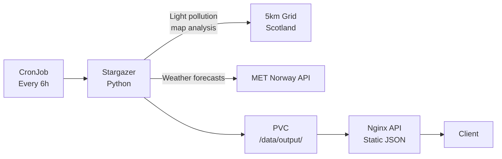

# Stargazer

Dark Sky Location Finder - identifies the best stargazing locations in Scotland.

## Overview

A geospatial analysis pipeline that runs as a Kubernetes CronJob every 6 hours. It evaluates candidate locations across Scotland by combining light pollution data, road proximity filtering, and weather forecasts from MET Norway to produce a ranked list of optimal stargazing sites. Results are persisted to a PVC and optionally served via an Nginx-based API.

## Architecture

The chart deploys two components:

- **CronJob** - Python pipeline that runs every 6 hours. Generates a 5km grid across Scotland, filters by light pollution (color map analysis) and road buffer distance, fetches 72-hour weather forecasts from MET Norway, scores each location, and writes ranked results to persistent storage. Linkerd sidecar injection is disabled since sidecars prevent Job completion.
- **API server** (optional) - Nginx-unprivileged deployment that serves the output JSON files as a static REST API. Reads from the same PVC as the CronJob. Supports CORS and can be exposed via HTTPRoute.

Both components share a Longhorn-backed PVC for data persistence.

## Key Features

- **Geospatial grid analysis** - 5km resolution grid covering all of Scotland (54.63N to 60.86N)
- **Light pollution filtering** - RGB color map analysis to identify dark sky zones
- **Road proximity exclusion** - 1km buffer from roads to avoid headlight interference
- **MET Norway weather integration** - 72-hour cloud cover and astronomy score forecasts
- **OpenTelemetry instrumentation** - Distributed tracing for pipeline observability
- **Static JSON API** - Pre-computed results served via Nginx for fast client access

## Configuration

| Value                          | Description                          | Default       |
| ------------------------------ | ------------------------------------ | ------------- |
| `schedule`                     | CronJob schedule                     | `0 */6 * * *` |
| `config.gridSpacingM`          | Grid cell size in meters             | `5000`        |
| `config.roadBufferM`           | Minimum distance from roads          | `1000`        |
| `config.minAstronomyScore`     | Weather score threshold (0-100)      | `60`          |
| `config.forecastHours`         | Weather forecast look-ahead          | `72`          |
| `config.metNorwayRateLimit`    | MET Norway API requests per second   | `15`          |
| `persistence.size`             | PVC size for output data             | `5Gi`         |
| `persistence.storageClass`     | Storage class for PVC                | `longhorn`    |
| `api.enabled`                  | Enable Nginx API for serving results | `false`       |
| `config.opentelemetry.enabled` | Enable OpenTelemetry tracing         | `true`        |

## Usage

Stargazer automatically runs every 6 hours to evaluate stargazing conditions across Scotland. The pipeline analyzes light pollution maps, filters locations by road proximity, and checks weather forecasts to produce two output files: `best_locations.json` (top-ranked sites) and `forecasts_scored.json` (all evaluated locations with scores). When the API is enabled, these files are served as static JSON endpoints for consumption by frontend applications or monitoring dashboards.
