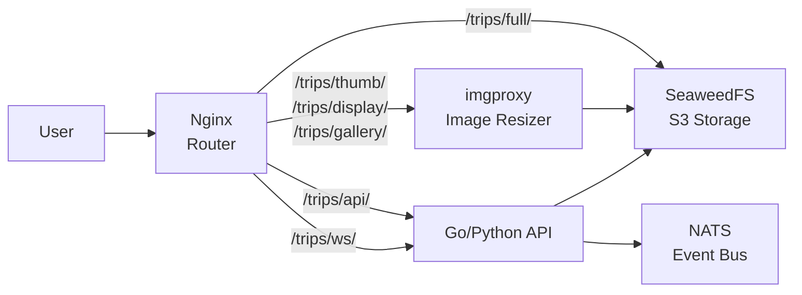

# Trips

Yukon Trip Tracker - image hosting and live updates for travel photography.

## Overview

A trip photo sharing platform that stores original images in SeaweedFS (S3-compatible storage) and serves dynamically resized versions through imgproxy. An API server handles uploads with authentication, publishes real-time events via NATS, and exposes a WebSocket endpoint for live updates. Nginx ties everything together as a routing layer.

## Architecture

The deployment consists of three components:

- **Nginx** - Reverse proxy that routes requests to the appropriate backend: full-resolution images direct to SeaweedFS, resized images through imgproxy, and API/WebSocket traffic to the API server.
- **imgproxy** - On-the-fly image processing service. Generates thumbnails (300px), display (1080p), preview (1200px), and gallery (600px) variants from S3 originals. Runs with 2 replicas by default.
- **API server** - Handles image uploads with API key authentication, publishes events to NATS for real-time notifications, and serves a WebSocket endpoint for live gallery updates.

When the API has 2+ replicas, pod anti-affinity spreads them across nodes and a PodDisruptionBudget ensures availability during rollouts.

## Key Features

- **On-the-fly image resizing** - Four preset sizes via imgproxy with WebP auto-detection
- **Immutable caching** - All image responses set `Cache-Control: immutable` with 1-year max-age
- **Real-time updates** - NATS pub/sub with WebSocket relay for live gallery updates
- **API key authentication** - Upload endpoint protected via 1Password-managed secret
- **Cross-namespace integration** - Connects to SeaweedFS and NATS in separate namespaces
- **High availability** - Optional multi-replica API with anti-affinity and PDB

## Configuration

| Value                     | Description                            | Default                                                |
| ------------------------- | -------------------------------------- | ------------------------------------------------------ |
| `seaweedfs.endpoint`      | SeaweedFS S3 endpoint URL              | `http://seaweedfs-s3.seaweedfs.svc.cluster.local:8333` |
| `nats.url`                | NATS server URL                        | `nats://nats.nats.svc.cluster.local:4222`              |
| `bucket`                  | S3 bucket name for images              | `trips`                                                |
| `imgproxy.replicas`       | Number of imgproxy replicas            | `2`                                                    |
| `imgproxy.config.quality` | Default JPEG quality                   | `90`                                                   |
| `api.replicas`            | Number of API replicas (2+ enables HA) | `1`                                                    |
| `api.corsOrigins`         | Allowed CORS origins (comma-separated) | `https://trips.jomcgi.dev,...`                         |
| `api.auth.secretName`     | Secret containing upload API key       | `trips-api-key`                                        |

## Usage

The Trips service powers a travel photo gallery. Users upload photos through the authenticated API, which stores originals in SeaweedFS and publishes an event to NATS. Connected clients receive live updates via WebSocket. The frontend requests images at various sizes (thumbnail, gallery, display, full) and Nginx routes each to the appropriate backend -- imgproxy generates resized variants on-the-fly while full-resolution requests go directly to S3 storage.
