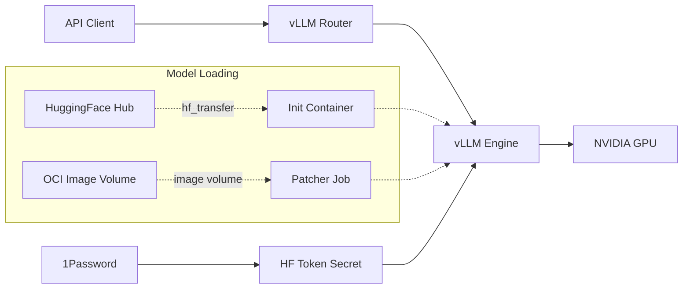

# vLLM

Wrapper chart for the vLLM production stack with homelab-specific extensions.

## Overview

Deploys the vLLM inference server using the upstream `vllm-stack` subchart, with additional support for 1Password-managed HuggingFace tokens, OCI image volumes for model distribution, and init containers for fast model downloads via `hf_transfer`. Post-install patcher Jobs handle features not natively supported by the upstream chart.



## Architecture

The chart wraps the upstream `vllm-stack` Helm chart (from `vllm-project/production-stack`) and adds several homelab-specific components:

- **1Password integration** - Creates a `OnePasswordItem` CRD (or manual `Secret`) for the HuggingFace token needed to download gated models like Llama or Mistral.
- **Init container patcher** - A Helm post-install/post-upgrade Job that patches each vLLM model deployment to inject an init container. The init container uses `hf_transfer` for high-speed parallel model downloads into the vLLM storage PVC.
- **Image volume patcher** - A Helm post-install/post-upgrade Job that patches each vLLM model deployment to mount models from OCI image volumes with a memory-backed `/dev/shm` volume for tensor parallelism.
- **Patcher RBAC** - ServiceAccount, Role, and RoleBinding scoped to `get` and `patch` deployments in the release namespace. Only created when init containers or image volumes are configured.

Each model defined in `servingEngineSpec.modelSpec` produces its own vLLM deployment. The patcher Jobs wait for these deployments to exist, then apply JSON patches to add the appropriate volumes and init containers.

## Key Features

- **Multiple model serving** - Deploy multiple models with independent scaling via the `modelSpec` array
- **Two model loading strategies** - Choose between OCI image volumes (fast, pre-cached) or HuggingFace download (flexible, init container)
- **Fast HuggingFace downloads** - Init container with `hf_transfer` for parallel downloads with resume support
- **OCI image volumes** - Pre-packaged models as OCI images for kubelet-cached loading (K8s 1.31+)
- **1Password secrets** - HuggingFace tokens managed via 1Password Operator, never hardcoded
- **Post-install patching** - Helm hooks inject features into upstream-managed deployments without forking the subchart

## Configuration

| Value                                     | Description                                   | Default            |
| ----------------------------------------- | --------------------------------------------- | ------------------ |
| `secret.create`                           | Create HuggingFace token secret               | `false`            |
| `secret.type`                             | Secret source: `onepassword` or `manual`      | `"onepassword"`    |
| `secret.onepassword.itemPath`             | 1Password item path for HF token              | `""`               |
| `initContainer.enabled`                   | Enable init container model downloader        | `false`            |
| `initContainer.image`                     | Python image for hf_transfer downloads        | `python:3.12-slim` |
| `initContainer.resources.requests.memory` | Init container memory request                 | `4Gi`              |
| `imagePullSecret.enabled`                 | Enable GHCR pull secret for OCI image volumes | `false`            |
| `patcher.image.tag`                       | kubectl image tag for patcher Jobs            | `"1.35.0"`         |
| `vllm-stack.servingEngineSpec.modelSpec`  | List of models to serve (upstream config)     | `[]`               |

## Usage

### OpenAI-Compatible API

vLLM exposes an OpenAI-compatible API via the router service:

```bash
kubectl port-forward -n vllm svc/vllm-router 8080:80
curl http://localhost:8080/v1/chat/completions \
  -H "Content-Type: application/json" \
  -d '{"model": "my-model", "messages": [{"role": "user", "content": "Hello"}]}'
```

### Model Spec Example

Configure models in your overlay `values.yaml`:

```yaml
vllm-stack:
  servingEngineSpec:
    modelSpec:
      - name: my-model
        modelURL: "org/model-name"
        huggingFaceToken:
          secretName: vllm-hf-token
          secretKey: hf_token
        # Option A: OCI image volume
        imageVolume:
          reference: "ghcr.io/org/model-image:latest"
          mountPath: "/model"
        # Option B: HuggingFace download (requires initContainer.enabled=true)
        # (omit imageVolume to use init container download instead)
```
