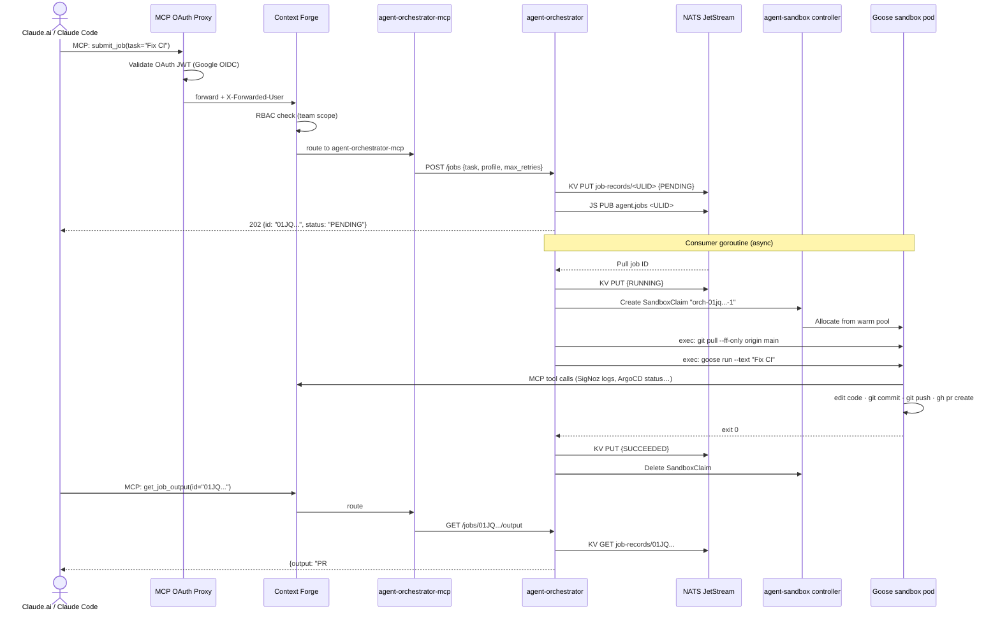

# Agent Platform

This document describes the agent infrastructure end-to-end: how agent sandboxes are provisioned, how the orchestrator manages job lifecycles, and how Claude chat connects through to a running agent pod.

## Component Map

```
Claude.ai / Claude Code (external)
    │
    │  HTTPS  mcp.jomcgi.dev
    ▼
┌─────────────────────────────────────────────────────────────────┐
│  MCP OAuth Proxy  (prod / mcp-gateway namespace)                │
│  charts/mcp-oauth-proxy                                         │
│  OAuth 2.1 AS — Google OIDC — injects X-Forwarded-User         │
└──────────────────────────┬──────────────────────────────────────┘
                           │ proxies to ClusterIP :8000
                           ▼
┌─────────────────────────────────────────────────────────────────┐
│  Context Forge  (prod / mcp-gateway namespace)                  │
│  charts/context-forge  ·  IBM mcp-context-forge v1.0.0-RC1      │
│  MCP gateway — aggregates tool servers, RBAC by team            │
│  Backends: Postgres (state) + Redis (sessions)                  │
└───────┬──────────────────┬─────────────────┬────────────────────┘
        │                  │                 │
        ▼                  ▼                 ▼
  signoz-mcp         buildbuddy-mcp    agent-orchestrator-mcp
  argocd-mcp         kubernetes-mcp    todo-mcp
  (charts/mcp-servers — one pod per server, registered at startup)
                                             │
                                             │ HTTP  ClusterIP :8080
                                             ▼
┌─────────────────────────────────────────────────────────────────┐
│  Agent Orchestrator  (prod / agent-orchestrator namespace)      │
│  services/agent-orchestrator  ·  charts/agent-orchestrator      │
│  Go service — HTTP API + NATS JetStream consumer                │
└──────────┬──────────────────────────────────────────────────────┘
           │ SandboxClaim CRUD  +  pod/exec
           ▼
┌─────────────────────────────────────────────────────────────────┐
│  Agent Sandbox Controller  (cluster-critical)                   │
│  charts/agent-sandbox  ·  registry.k8s.io/agent-sandbox v0.1.1  │
│  CRDs: Sandbox · SandboxTemplate · SandboxClaim · SandboxWarmPool│
└──────────┬──────────────────────────────────────────────────────┘
           │ allocates pod from warm pool / creates pod
           ▼
┌─────────────────────────────────────────────────────────────────┐
│  Goose Sandbox Pod  (prod / goose-sandboxes namespace)          │
│  charts/goose-sandboxes  +  charts/goose-agent (apko image)     │
│  Runs: goose run --text <task>                                   │
│  Tools: developer (builtin) · context-forge (MCP) · github      │
│  LLM: Claude Max via LiteLLM proxy (claude-code provider)       │
└─────────────────────────────────────────────────────────────────┘
```

---

## 1. Agent Provisioning

**Controller:** `charts/agent-sandbox` — runs in `agent-sandbox-system` (cluster-critical)

The [`kubernetes-sigs/agent-sandbox`](https://github.com/kubernetes-sigs/agent-sandbox) controller (SIG Apps, v0.1.1) manages isolated agent pod lifecycle via purpose-built CRDs. It fills the gap between Deployments and StatefulSets with a single stateful pod abstraction.

### CRDs

| CRD                                                    | Purpose                                                               |
| ------------------------------------------------------ | --------------------------------------------------------------------- |
| `Sandbox` (`agents.x-k8s.io/v1alpha1`)                 | Single-pod workload with PVC, headless Service, auto-delete lifecycle |
| `SandboxTemplate` (`agents.x-k8s.io/v1alpha1`)         | Reusable pod spec — image, env, resources defined once                |
| `SandboxClaim` (`extensions.agents.x-k8s.io/v1alpha1`) | Per-job request that claims a sandbox from a pool or creates one      |
| `SandboxWarmPool` (`agents.x-k8s.io/v1alpha1`)         | Pre-warmed pods for near-instant allocation                           |

### Goose Sandboxes

**Chart:** `charts/goose-sandboxes/` — deployed to `goose-sandboxes` namespace

Installs:

- `SandboxTemplate` named `goose-agent` (references the apko-built image)
- `SandboxWarmPool` named `goose-pool` (size: 1)
- `LimitRange` — 1–4 CPU, 2–8Gi memory per pod
- `ResourceQuota` — max 5 pods, 8 CPU, 16Gi across namespace
- 1Password secrets: Claude OAuth token, GitHub PAT + BuildBuddy key, per-profile MCP tokens

### Goose Agent Image

**Built with:** apko + rules_apko (`charts/goose-agent/image/apko.yaml`)
**Registry:** `ghcr.io/jomcgi/homelab/goose-agent`
**Architectures:** x86_64 + aarch64 · **User:** uid/gid 65532

Wolfi packages baked in:

| Package                        | Purpose                              |
| ------------------------------ | ------------------------------------ |
| `goose`                        | Agent framework — entrypoint         |
| `go`                           | Build/test Go services               |
| `nodejs` + `pnpm`              | Build frontend apps                  |
| `git` + `gh`                   | Clone repos, push branches, open PRs |
| `bash`, `coreutils`, `busybox` | Shell tooling for recipe scripts     |
| `ca-certificates-bundle`       | TLS for outbound HTTPS               |

Goose extensions baked into the image (`~/.config/goose/config.yaml`):

| Extension       | Type              | Endpoint                                                             |
| --------------- | ----------------- | -------------------------------------------------------------------- |
| `developer`     | builtin           | Filesystem, shell, text editor (scoped to `/workspace`)              |
| `context-forge` | `streamable_http` | `http://context-forge.mcp-gateway.svc.cluster.local:8000/mcp`        |
| `github`        | stdio             | `pnpm dlx @modelcontextprotocol/server-github` (uses `GITHUB_TOKEN`) |

### Agent Profiles

Profiles narrow tool access for specific task types. Each maps to a Goose recipe YAML and a scoped Context Forge token (stored in `goose-mcp-tokens` secret).

| Profile    | Tools                 | Use case                                   |
| ---------- | --------------------- | ------------------------------------------ |
| _(none)_   | All extensions        | General coding tasks                       |
| `ci-debug` | `buildbuddy-mcp` only | CI failure investigation                   |
| `code-fix` | No cluster tools      | Pure code changes, no observability access |

Profile definitions are documented in `charts/goose-sandboxes/profiles.yaml`. Recipes live in `charts/goose-agent/image/recipes/`.

### Long-Lived Agents

`charts/goose-sandboxes` also supports persistent agents as Kubernetes Deployments. Each entry under `agents:` in `values.yaml` generates a `ConfigMap` (prompt) + `Deployment` (Goose runner). A `checksum/prompt` annotation on the pod template triggers rollouts when the prompt changes.

```yaml
# projects/agent_platform/goose-sandboxes/deploy/values.yaml
agents:
  ci-watcher:
    enabled: true
    prompt: |
      Monitor open PRs for CI failures and fix them...
```

---

## 2. Lean Agent Toolchain

All container images are built **remotely and hermetically** via BuildBuddy RBE — never locally.

```
charts/goose-agent/image/
├── apko.yaml          # Wolfi packages, uid 65532, dual-arch declaration
├── apko.lock.json     # Pinned package SHAs — hermetic builds
├── config.yaml        # Goose extensions baked into image
└── recipes/           # Goose recipe YAML per profile
    ├── ci-debug.yaml
    └── code-fix.yaml
```

**Image pipeline for `goose-agent`:**

```
bazel run //charts/goose-agent/image:push
    │
    ├─ BuildBuddy RBE builds apko image (rules_apko)
    ├─ Hermetic: all deps from apko.lock.json SHAs
    ├─ Output: dual-arch OCI image
    └─ Push: ghcr.io/jomcgi/homelab/goose-agent:<tag>
           │
           └─ ArgoCD Image Updater detects new digest
              └─ Writes back to projects/agent_platform/goose-sandboxes/deploy/values.yaml
```

The `agent-orchestrator` Go binary follows the same pattern:

```
services/agent-orchestrator/ -> go_binary -> go_image (apko base)
    -> ghcr.io/jomcgi/homelab/services/agent-orchestrator
```

No Dockerfiles. All images: apko-based, dual-arch, non-root (uid 65532), `capabilities.drop: [ALL]`.

---

## 3. Agent Orchestrator

**Source:** `services/agent-orchestrator/` (Go)
**Chart:** `charts/agent-orchestrator/`
**Deploy:** `projects/agent_platform/agent-orchestrator/deploy/`
**In-cluster:** `http://agent-orchestrator.agent-orchestrator.svc.cluster.local:8080` (ClusterIP only)

A single Go binary combining an HTTP API and a NATS JetStream consumer. Accepts job submissions, queues them durably, and executes them in isolated Goose sandbox pods.

### Architecture

```
┌───────────────────────────────────────────────────────┐
│               agent-orchestrator                       │
│                                                        │
│  HTTP :8080                                            │
│  ┌──────────┐    NATS JetStream                        │
│  │ REST API ├──▶ stream: agent-jobs                   │
│  │          │    subject: agent.jobs                   │
│  │          │    WorkQueue · max 1000 msgs             │
│  └────┬─────┘         │                               │
│       │               │ pull (MaxAckPending=3)         │
│       │               ▼                               │
│       │    ┌────────────────────┐                     │
│       │    │ Consumer goroutine  │                     │
│       │    │ (up to 3 concurrent)│                     │
│       ▼    └─────────┬──────────┘                     │
│  ┌──────────┐        │                                │
│  │ NATS KV  │◀───────┘                                │
│  │ bucket:  │   job records (TTL 7 days)               │
│  │job-records│                                         │
│  └──────────┘                                         │
└───────────────────────────────────────────────────────┘
```

Both the JetStream stream (`agent-jobs`) and KV bucket (`job-records`) are **self-provisioned** on startup via idempotent `CreateOrUpdate` calls — no manual NATS setup required.

### Job Lifecycle

```
POST /jobs
    │
    ▼
PENDING ──▶ RUNNING ──▶ SUCCEEDED
                   └──▶ FAILED     (retries exhausted)
                   └──▶ CANCELLED  (via API or KV flag)
                   └──▶ PENDING    (retry — message NAK'd for re-delivery)
```

State is persisted in NATS KV, keyed by ULID (lexicographically sortable = free chronological ordering).

**Cancellation** is cooperative: the consumer polls KV status before each lifecycle phase. Setting `status: CANCELLED` in KV is sufficient — no separate signal channel.

**Retry with context inheritance:** On failure with retries remaining, the next attempt's prompt is enriched with the previous exit code and last 2,000 chars of output, helping the agent avoid the same failure mode.

**Inactivity watchdog:** Output streams through a `syncBuffer`. If no bytes arrive within 10 minutes (configurable), the execution context is cancelled — prevents hung Goose sessions from blocking the queue.

### Consumer: Sandbox Execution Steps

```
1. Pull job ID from JetStream
2. Read JobRecord from NATS KV
3. If CANCELLED -> ACK and skip
4. Create SandboxClaim:
       apiVersion: extensions.agents.x-k8s.io/v1alpha1
       kind: SandboxClaim
       spec.sandboxTemplateRef.name: "goose-agent"
       spec.lifecycle.shutdownPolicy: "Delete"
5. Poll SandboxClaim.status.sandbox until name appears
6. Resolve pod name from Sandbox.annotations["agents.x-k8s.io/pod-name"]
7. Wait for goose container Ready
8. Exec (refresh): git -C /workspace/homelab pull --ff-only origin main
9. Exec (run):     goose run --text <task>
       (profile):  goose run --recipe <path> --no-profile --params task_description=<task>
10. Capture stdout+stderr -> syncBuffer (last 32KB)
11. Flush output to KV every 30s (live progress visible via GET /jobs/{id}/output)
12. On exit: KV -> SUCCEEDED | FAILED | CANCELLED
13. Delete SandboxClaim -> controller cleans up pod
```

Step 8 ensures agents always work from the latest `main`.

### REST API

| Method | Path                | Description                                                  |
| ------ | ------------------- | ------------------------------------------------------------ |
| `POST` | `/jobs`             | Submit job -> 202 Accepted                                   |
| `GET`  | `/jobs`             | List jobs (`?status=RUNNING,PENDING`, `?limit=`, `?offset=`) |
| `GET`  | `/jobs/{id}`        | Job detail + all attempt records                             |
| `POST` | `/jobs/{id}/cancel` | Cancel PENDING or RUNNING job                                |
| `GET`  | `/jobs/{id}/output` | Latest attempt output (last 32KB)                            |
| `GET`  | `/health`           | Liveness / readiness                                         |

**Submit example:**

```json
// POST /jobs
{ "task": "Fix the flaky test in services/grimoire", "profile": "ci-debug", "max_retries": 2 }

// 202 Accepted
{ "id": "01JQXK5P...", "status": "PENDING", "created_at": "2026-03-08T..." }
```

### Data Model

```go
type JobRecord struct {
    ID         string    // ULID — lexicographically sorted by time
    Task       string
    Profile    string    // "", "ci-debug", "code-fix"
    Status     JobStatus // PENDING | RUNNING | SUCCEEDED | FAILED | CANCELLED
    CreatedAt  time.Time
    UpdatedAt  time.Time
    MaxRetries int       // default: 2, max: 10
    Source     string    // "api" | "github" | "cli"
    Attempts   []Attempt
}

type Attempt struct {
    Number           int        // 1-based
    SandboxClaimName string     // "orch-<ulid>-<attempt>"
    ExitCode         *int
    Output           string     // last 32KB of goose stdout+stderr
    Truncated        bool
    StartedAt        time.Time
    FinishedAt       *time.Time
}
```

### RBAC

The orchestrator's `ServiceAccount` has the minimum permissions needed to drive sandbox lifecycle:

| Resource                                   | Verbs                            |
| ------------------------------------------ | -------------------------------- |
| `extensions.agents.x-k8s.io/sandboxclaims` | create, get, list, watch, delete |
| `agents.x-k8s.io/sandboxes`                | get, list, watch                 |
| `core/pods`                                | get, list, watch                 |
| `core/pods/exec`                           | create                           |

---

## 4. Claude Chat -> Agent Orchestrator MCP

**Source:** `services/agent_orchestrator_mcp/` (Python, FastMCP + httpx)
**Transport:** `STREAMABLEHTTP`
**Deployed via:** `charts/mcp-servers/` (entry in `projects/agent_platform/mcp-servers/deploy/values.yaml`)
**In-cluster:** `http://agent-orchestrator-mcp.mcp-servers.svc.cluster.local:8000`

A thin FastMCP wrapper around the orchestrator REST API. Registered with Context Forge at deploy time by `charts/mcp-servers/templates/registration-job.yaml`.

### MCP Tools

| Tool             | Wraps                    | Description                                 |
| ---------------- | ------------------------ | ------------------------------------------- |
| `submit_job`     | `POST /jobs`             | Queue a task for agent execution            |
| `list_jobs`      | `GET /jobs`              | List jobs with status filter and pagination |
| `get_job`        | `GET /jobs/{id}`         | Full job record with attempt history        |
| `cancel_job`     | `POST /jobs/{id}/cancel` | Cancel a pending or running job             |
| `get_job_output` | `GET /jobs/{id}/output`  | Latest attempt output (last 32KB)           |

### Full Request Path: Claude Chat -> Running Agent



**Polling:** The MCP server is stateless. Claude must call `get_job` or `get_job_output` to poll for progress. Output is flushed to NATS KV every 30 seconds during execution, so intermediate results are visible before the job completes.

---

## 5. Context Forge

**Chart:** `charts/context-forge/` (wraps upstream IBM `mcp-stack` Helm chart)
**Deploy:** `projects/agent_platform/context-forge/deploy/`
**Namespace:** `mcp-gateway`
**External:** `https://mcp.jomcgi.dev/mcp/` (Cloudflare tunnel -> MCP OAuth Proxy -> Context Forge)
**In-cluster:** `http://context-forge.mcp-gateway.svc.cluster.local:8000/mcp`

IBM's [`mcp-context-forge`](https://github.com/ibm/mcp-context-forge) aggregates multiple upstream MCP servers behind a single endpoint with RBAC-based tool distribution.

### Deployed Components

| Component             | Purpose                                                 |
| --------------------- | ------------------------------------------------------- |
| Context Forge gateway | MCP protocol routing, tool registry, RBAC               |
| Postgres              | Durable state — tool registrations, teams, tokens       |
| Redis                 | Session caching                                         |
| Schema migration Job  | Applied on upgrade, pinned to same image tag as gateway |

### Auth Stack (External Access)

```
Claude.ai / Claude Code
    │
    │ HTTPS
    ▼
Cloudflare Tunnel          (DDoS protection, TLS termination)
    │
    ▼
MCP OAuth Proxy            (obot-platform/mcp-oauth-proxy)
    │  - RFC 9728 discovery + DCR (Dynamic Client Registration)
    │  - Delegates identity to Google OIDC
    │  - Issues its own short-lived JWTs to MCP clients
    │  - Injects X-Forwarded-User: <google email>
    ▼
Context Forge              (TRUST_PROXY_AUTH=true)
    │  - Reads identity from X-Forwarded-User header
    │  - Resolves team membership from identity
    │  - Applies RBAC: tools.read + tools.execute for "developer" role
    ▼
MCP Server (e.g., agent-orchestrator-mcp)
```

In-cluster agents (Goose pods) reach Context Forge directly via ClusterIP at `:8000` — no auth required.

### RBAC Model

Context Forge uses two authorization layers (see [ADR 005](decisions/agents/005-role-based-mcp-access.md)):

1. **Token scoping** — JWT `teams` claim controls which tools an agent can see
2. **Role** — `developer` grants `tools.read` + `tools.execute`

| Client                            | Team            | Visible tools          |
| --------------------------------- | --------------- | ---------------------- |
| Claude Code / Claude.ai           | `infra-agents`  | All registered servers |
| Claude.ai web chat                | `web-chat`      | SigNoz read tools only |
| In-cluster Goose pods (ClusterIP) | — (bypass auth) | All tools              |

### Registered MCP Servers

All servers run in `mcp-servers` namespace. Registration happens once at deploy time via a Kubernetes `Job` that calls the Context Forge admin API.

| Server                   | Image                                      | Transport      | Tools                                     |
| ------------------------ | ------------------------------------------ | -------------- | ----------------------------------------- |
| `signoz-mcp`             | `docker.io/signoz/signoz-mcp-server`       | STREAMABLEHTTP | Logs, traces, metrics, alerts, dashboards |
| `buildbuddy-mcp`         | homelab Go service                         | STREAMABLEHTTP | CI invocations, build logs, targets       |
| `kubernetes-mcp`         | `ghcr.io/containers/kubernetes-mcp-server` | STREAMABLEHTTP | Pod list/logs/exec, resource reads        |
| `argocd-mcp`             | `ghcr.io/argoproj-labs/mcp-for-argocd`     | STREAMABLEHTTP | App status, sync, history                 |
| `todo-mcp`               | homelab Python service                     | STREAMABLEHTTP | Todo CRUD                                 |
| `agent-orchestrator-mcp` | homelab Python service                     | STREAMABLEHTTP | Job submit/list/cancel/output             |

All server definitions live in `projects/agent_platform/mcp-servers/deploy/values.yaml`. ArgoCD Image Updater maintains digest-pinned image tags automatically.

---

## 6. Agent Orchestrator Events

The orchestrator uses **NATS JetStream** as both job queue and state store.

### NATS Resources

| Resource                | Type         | Config                                       |
| ----------------------- | ------------ | -------------------------------------------- |
| `agent-jobs` stream     | WorkQueue    | subject: `agent.jobs`, max 1000 msgs         |
| `job-records` KV bucket | KeyValue     | keyed by ULID, TTL 7 days                    |
| `orchestrator` consumer | Durable pull | MaxAckPending=3, AckWait=JOB_MAX_DURATION+1m |

All three are self-provisioned on orchestrator startup. Single-node NATS at `nats://nats.nats.svc.cluster.local:4222` (`charts/nats/`, `projects/agent_platform/nats/deploy/`).

### Event Flow

```
POST /jobs  ──▶  KV PUT   job-records/<ULID>  { status: PENDING }
             ──▶  JS PUB   agent.jobs          <ULID>

Consumer pull
    ├─▶  KV PUT   { status: RUNNING, attempts: [{...}] }
    ├─▶  [every 30s] KV PUT  { attempts[-1].output: <partial> }
    └─▶  KV PUT   { status: SUCCEEDED | FAILED | CANCELLED }
         JS ACK   (success / retries exhausted / cancelled)
         JS NAK   (retry — message redelivered)
```

State transitions are the events. Job status changes are immediately visible via `GET /jobs/{id}` or direct KV reads.

### Consuming State Changes Externally

Any service with NATS access can watch the KV bucket for real-time job state changes:

```go
// Watch all job-record changes (delta delivery — not full scans)
watcher, _ := kv.WatchAll(ctx)
for entry := range watcher.Updates() {
    var job JobRecord
    json.Unmarshal(entry.Value(), &job)
    // react to job.Status transitions
}
```

This is the intended extension point for future webhook dispatch, DLQ handling, or GitHub issue creation on failure (see [ADR 007](decisions/agents/007-agent-orchestrator.md)).

---

## Related ADRs

| ADR                                                                              | Decision                           |
| -------------------------------------------------------------------------------- | ---------------------------------- |
| [001 - Background Agents](decisions/agents/001-background-agents.md)             | Initial motivation                 |
| [002 - OpenHands Agent Sandbox](decisions/agents/002-openhands-agent-sandbox.md) | Superseded approach                |
| [003 - Context Forge](decisions/agents/003-context-forge.md)                     | MCP gateway deployment             |
| [004 - Autonomous Agents](decisions/agents/004-autonomous-agents.md)             | Goose + agent-sandbox architecture |
| [005 - Role-Based MCP Access](decisions/agents/005-role-based-mcp-access.md)     | Context Forge RBAC model           |
| [006 - OIDC Auth MCP Gateway](decisions/agents/006-oidc-auth-mcp-gateway.md)     | OAuth proxy + Google OIDC          |
| [007 - Agent Orchestrator](decisions/agents/007-agent-orchestrator.md)           | Orchestrator service design        |

## Quick Reference

```bash
# Explore the agent platform
ls charts/agent-sandbox/             # Controller chart + CRDs
ls charts/goose-sandboxes/           # SandboxTemplate, warm pool, namespace config
ls charts/goose-agent/image/         # apko spec, Goose config, recipes
ls services/agent-orchestrator/      # Go service source (api.go, consumer.go, sandbox.go)
ls services/agent_orchestrator_mcp/  # Python MCP wrapper (app/main.py)
ls charts/agent-orchestrator/        # Helm chart
ls charts/context-forge/             # MCP gateway chart (wraps IBM mcp-stack)
ls charts/mcp-servers/               # All MCP server pods + registration jobs
ls projects/agent_platform/goose-sandboxes/deploy/    # Prod sandbox values + image tags
ls projects/agent_platform/agent-orchestrator/deploy/ # Prod orchestrator values
ls projects/agent_platform/context-forge/deploy/      # Prod gateway resource overrides
ls projects/agent_platform/mcp-servers/deploy/        # Prod MCP servers (values.yaml has all definitions)
```
