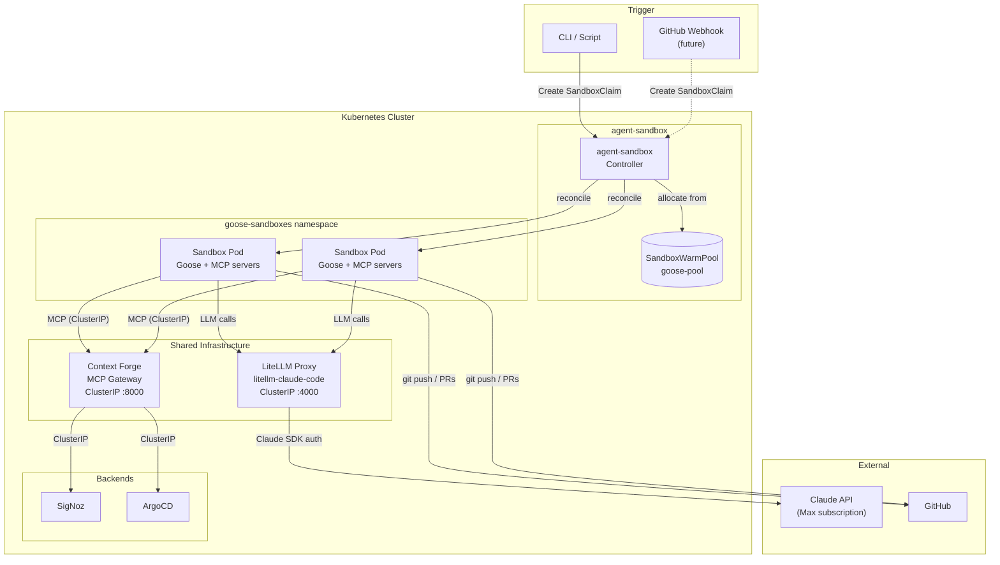
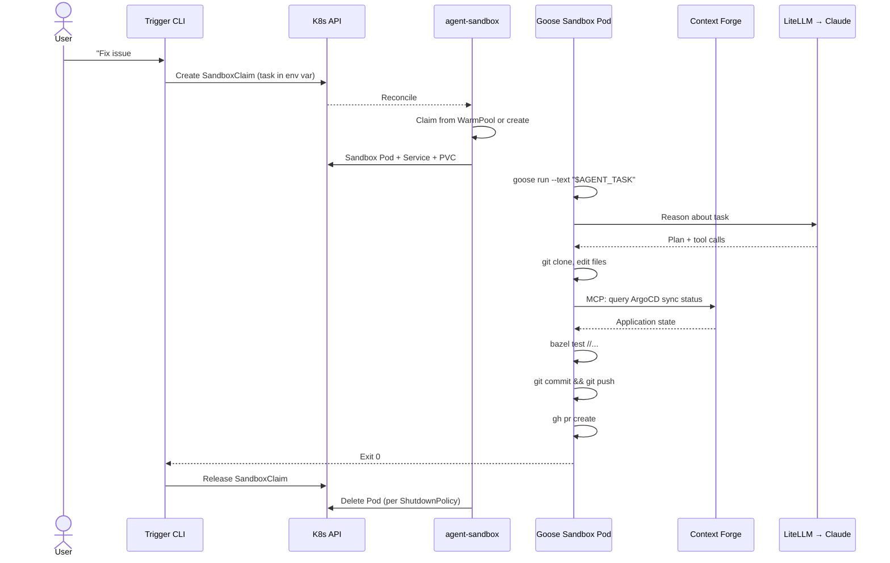

# RFC: Autonomous Coding Agents

**Author:** Joe McGinley
**Status:** Draft
**Created:** 2026-02-28
**Supersedes:** [001-background-agents](001-background-agents.md), [002-openhands-agent-sandbox](002-openhands-agent-sandbox.md)

---

## Problem

Stripe ships 1,000+ AI-authored PRs per week using internal "Minion" agents — isolated sandboxes that take a task description, write code, run CI, and open a PR with zero human interaction. The agent itself is nearly a commodity; the value is in the infrastructure — sandboxing, context curation, CI feedback loops, and guardrails.

Three things make this worth building on a homelab:

1. **Claude Max subscription** — flat-rate LLM access eliminates per-token cost anxiety for autonomous loops that burn millions of tokens per task.
2. **kubernetes-sigs/agent-sandbox** — a purpose-built CRD abstraction for agent pod lifecycle, backed by Google / SIG Apps.
3. **Goose** — Block's open-source agent framework. MCP-native, Stripe's Minions are built on a fork of it. Runs directly in a pod with no app server coordinator.

### Why Not OpenHands

The previous RFCs (`background-agents.md`, `openhands-agent-sandbox.md`) designed an OpenHands-based stack. That approach required:

- An **app server** coordinating sandbox pods via a deprecated V0 KubernetesRuntime
- A custom **Go HTTP adapter** translating OpenHands' `RemoteSandboxService` API into agent-sandbox CRDs
- **Kyverno policies** injecting tools volumes into upstream runtime images we couldn't modify
- Complex **PATH injection** through three competing mechanisms (`runtime_init.py`, `.bashrc`, container env vars)

Goose eliminates all of this. It runs directly inside a sandbox pod — no coordinator, no adapter, no image injection hacks. MCP-native tool access replaces the custom tooling layer. The architecture compresses from three interacting components to one.

---

## Proposal

Five-layer architecture with clean separation of concerns:

| Layer                 | Component                     | Responsibility                                                     |
| --------------------- | ----------------------------- | ------------------------------------------------------------------ |
| **Sandbox lifecycle** | kubernetes-sigs/agent-sandbox | CRDs for pod management, warm pools, TTL cleanup                   |
| **Agent execution**   | Goose (Block)                 | MCP-native agent loop inside sandbox pods                          |
| **LLM access**        | LiteLLM + litellm-claude-code | Claude Max subscription proxy, OpenAI-compatible API               |
| **Cluster tooling**   | Context Forge MCP gateway     | Cluster-internal service access (SigNoz, ArgoCD, K8s API)          |
| **VM isolation**      | Kata Containers + Firecracker | Hardware-enforced kernel isolation + snapshot warm starts (future) |

### Before / After

| Aspect                 | OpenHands (previous)                    | Goose + agent-sandbox (proposed)       |
| ---------------------- | --------------------------------------- | -------------------------------------- |
| Agent framework        | OpenHands agent-server                  | Goose                                  |
| Architecture           | App server + adapter + sandbox pods     | Sandbox pods only                      |
| Sandbox lifecycle      | Custom Go adapter → agent-sandbox CRDs  | agent-sandbox CRDs directly            |
| LLM access             | LiteLLM proxy (Claude Max)              | LiteLLM proxy (Claude Max) — unchanged |
| Tool access            | Kyverno-injected image volumes          | MCP servers (built-in + Context Forge) |
| Cluster service access | Bash patterns / port-forwarding         | Context Forge MCP gateway              |
| Web UI                 | OpenHands React SPA                     | None — CLI/script trigger              |
| Container images       | Upstream OpenHands + custom tools image | Single apko-built Goose image          |
| VM isolation           | Not planned                             | Kata/Firecracker (Phase 2)             |

---

## Architecture

### Overview



### Control Flow



---

### 1. Sandbox Lifecycle — agent-sandbox

[kubernetes-sigs/agent-sandbox](https://github.com/kubernetes-sigs/agent-sandbox) (SIG Apps, Apache 2.0) provides purpose-built CRDs for managing isolated agent pods. It fills the gap between Deployments (stateless, replicated) and StatefulSets (numbered, stable) with a single stateful pod abstraction.

| CRD               | Purpose                                                                           |
| ----------------- | --------------------------------------------------------------------------------- |
| `Sandbox`         | Single-pod workload with PodTemplate, VolumeClaimTemplates, auto-delete lifecycle |
| `SandboxTemplate` | Reusable pod definition — define the Goose image, resources, and env once         |
| `SandboxClaim`    | Per-task request against a template or warm pool (created by trigger)             |
| `SandboxWarmPool` | Pre-warmed pods for near-instant allocation vs. cold scheduling                   |

The controller reconciles the full stack: Pod, headless Service (stable FQDN), PVCs, lifecycle timers. Standard `controller-runtime` — crash-safe, declarative, survives restarts. No custom adapter needed — the trigger CLI creates `SandboxClaim` CRs directly.

#### SandboxTemplate

```yaml
apiVersion: agents.x-k8s.io/v1alpha1
kind: SandboxTemplate
metadata:
  name: goose-agent
  namespace: goose-sandboxes
spec:
  template:
    spec:
      runtimeClassName: kata-fc # Phase 2 — omit in Phase 1
      containers:
        - name: goose
          image: ghcr.io/jomcgi/homelab/projects/agent_platform/goose_agent/image:latest
          command: ["/bin/sh", "-c"]
          args: ['goose run --text "$AGENT_TASK" --profile sandbox']
          env:
            - name: GOOSE_PROVIDER
              value: openai # OpenAI-compatible (LiteLLM)
            - name: OPENAI_BASE_URL
              value: http://litellm-claude-sdk.litellm.svc.cluster.local:4000/v1
            - name: OPENAI_API_KEY
              valueFrom:
                secretKeyRef:
                  name: llm-creds
                  key: litellm-api-key # Dummy or master key
            - name: GOOSE_MODEL
              value: claude-opus-4-6
            - name: GITHUB_TOKEN
              valueFrom:
                secretKeyRef:
                  name: agent-secrets
                  key: github-token
          resources:
            requests:
              cpu: "1"
              memory: 2Gi
            limits:
              cpu: "4"
              memory: 8Gi
          volumeMounts:
            - name: workspace
              mountPath: /workspace
      volumes:
        - name: workspace
          ephemeral:
            volumeClaimTemplate:
              spec:
                storageClassName: longhorn
                accessModes: [ReadWriteOnce]
                resources:
                  requests:
                    storage: 20Gi
```

#### Warm Pool

```yaml
apiVersion: agents.x-k8s.io/v1alpha1
kind: SandboxWarmPool
metadata:
  name: goose-pool
  namespace: goose-sandboxes
spec:
  templateRef:
    name: goose-agent
  size: 1 # Start conservative — 1 warm pod
```

#### Namespace Design

The `goose-sandboxes` namespace gets both a `LimitRange` (per-pod defaults) and a `ResourceQuota` (namespace-wide cap). A runaway `bazel build` inside a sandbox must not starve other homelab workloads.

**LimitRange** (per-pod defaults):

| Resource | Request | Limit |
| -------- | ------- | ----- |
| CPU      | 1       | 4     |
| Memory   | 2Gi     | 8Gi   |

**ResourceQuota** (namespace-wide):

| Resource        | Max  |
| --------------- | ---- |
| pods            | 5    |
| requests.cpu    | 8    |
| requests.memory | 16Gi |

---

### 2. Agent Execution — Goose

[Goose](https://github.com/block/goose) (Block, Apache 2.0) is an open-source coding agent built on an MCP-first tool model. Agents are configured with MCP servers that expose tools — filesystem, shell, git, APIs. Goose executes an agentic loop: reason about a task, call tools, observe results, iterate to completion.

Stripe's Minions system (1,000+ merged PRs/week) is built on a fork of Goose, demonstrating production viability at scale.

#### Why Goose Over OpenHands

| Concern            | OpenHands                                      | Goose                                 |
| ------------------ | ---------------------------------------------- | ------------------------------------- |
| Runtime model      | App server coordinates separate sandbox pods   | Agent runs directly in the pod        |
| Tool integration   | Shell commands + custom injection              | MCP-native — structured tool calls    |
| Adapter complexity | Custom Go adapter for RemoteSandboxService     | None — SandboxClaim is the interface  |
| Image management   | Upstream image + Kyverno-injected tools volume | Single image with everything baked in |
| Cluster access     | Bash patterns / port-forwarding                | Context Forge MCP gateway             |

#### Container Image

The `goose-agent` image is built with apko (consistent with every other image in the repo), dual-arch (x86_64 + aarch64), non-root (uid 65532):

| Component             | Purpose                                                            |
| --------------------- | ------------------------------------------------------------------ |
| Goose                 | Agent framework                                                    |
| BuildBuddy CLI (`bb`) | Build + test via remote execution (aliased as `bazel`, `bazelisk`) |
| Go                    | Build/test Go services and operators                               |
| pnpm + Node.js        | Build website frontend apps                                        |
| git + gh              | Clone repos, create PRs                                            |

The image includes a `sandbox` profile for Goose that configures MCP servers for the homelab environment. The profile is baked into the image at build time.

#### MCP Server Configuration

Goose's `sandbox` profile wires up these MCP servers:

| Server          | Type             | Purpose                                                 |
| --------------- | ---------------- | ------------------------------------------------------- |
| `developer`     | Built-in         | Filesystem, shell, text editor (scoped to `/workspace`) |
| `context-forge` | HTTP (ClusterIP) | Cluster services: SigNoz logs/traces, ArgoCD app status |
| `github`        | Built-in or MCP  | PR creation, issue reading, code search                 |

The `developer` built-in provides filesystem, shell, and editor tools — Goose's equivalent of what OpenHands sandbox pods got from the runtime image. The key difference: these are structured MCP tool calls with proper schemas, not raw shell commands.

Context Forge provides cluster-internal service access via MCP over HTTP. Sandbox pods reach it at `http://context-forge.mcp-gateway.svc.cluster.local:8000/mcp` — no Cloudflare auth needed for in-cluster traffic. See [003-context-forge](003-context-forge.md) for the full gateway design.

---

### 3. LLM Access — LiteLLM

LLM inference routes through an in-cluster [LiteLLM](https://github.com/BerriAI/litellm) proxy with a [Claude Agent SDK custom provider](https://github.com/cabinlab/litellm-claude-code). This uses the official Claude Agent SDK authenticated against a Claude Max subscription via a long-lived token from `claude setup-token`.

```
Goose (sandbox pod) → LiteLLM proxy (ClusterIP:4000) → Claude SDK → Claude API (Max subscription)
```

**Why a proxy instead of direct API keys:** A Claude Max subscription provides flat-rate access to Claude models with no per-token cost — critical for autonomous agent loops. The Claude Agent SDK is the officially supported way to use subscription auth programmatically. Since Goose supports OpenAI-compatible providers, LiteLLM bridges the gap.

**Headless auth:** `claude setup-token` performs a one-time browser-based OAuth flow and outputs a long-lived token (`sk-ant-oat01-*`). This token is stored in a `OnePasswordItem` and injected into the LiteLLM proxy pod as `CLAUDE_AUTH_TOKEN`. No ongoing browser sessions or interactive auth required.

**Multi-model support:** LiteLLM serves all Claude models through a single endpoint — the model is selected per-request. With flat-rate Max pricing, there's no cost penalty for defaulting to the most capable model.

| Role          | Model               | Rationale                            |
| ------------- | ------------------- | ------------------------------------ |
| Primary agent | `claude-opus-4-6`   | Best reasoning for autonomous coding |
| Fast tasks    | `claude-sonnet-4-6` | Speed over depth for simpler tasks   |
| Condensation  | `claude-sonnet-4-6` | Context compaction quality           |

**Deployment:** The LiteLLM proxy runs as a Deployment + ClusterIP Service in its own namespace. No external ingress — only sandbox pods within the cluster reach it. No master key required for internal-only traffic.

**Fallback:** Direct Anthropic API keys can be configured as an alternative provider if the proxy or subscription auth has issues.

---

### 4. MCP Tooling — Context Forge

Designed and deployed separately — see [003-context-forge](003-context-forge.md).

Context Forge (IBM, Apache 2.0) runs as a single in-cluster MCP gateway wrapping internal REST/HTTP APIs as virtual MCP tools. It solves the problem of agent access to cluster-internal services behind Cloudflare Zero Trust.

For Goose sandbox pods, the connection is straightforward:

- **Transport:** MCP over HTTP (streamable-HTTP)
- **Endpoint:** `http://context-forge.mcp-gateway.svc.cluster.local:8000/mcp`
- **Auth:** None needed — ClusterIP is cluster-internal only
- **Tools available:** SigNoz logs/traces/metrics, ArgoCD app status/history, Longhorn volumes (Phase 2)

This replaces the previous approach of injecting CLI tools (`argocd`, `kubectl`) into sandbox pods and relying on Bash patterns for cluster access. Agents make structured MCP tool calls instead of constructing CLI commands from memory.

---

### 5. VM Isolation — Kata/Firecracker (Future)

LLM-generated code runs in a container. A shared kernel means a container escape is a homelab escape. Kata Containers + Firecracker gives each agent run a dedicated microVM kernel with negligible overhead (~5MB memory, sub-second boot).

This layer is designed to be forward-compatible: the `SandboxTemplate` accepts a `runtimeClassName` field. Adding `kata-fc` in Phase 2 requires no structural changes to the rest of the architecture.

#### Phase 2 — Firecracker without snapshots

Install Kata Containers with the Firecracker VMM backend. Add `runtimeClassName: kata-fc` to the `SandboxTemplate`. Each sandbox pod runs inside a microVM with hardware-enforced kernel isolation. Label nodes `kata-fc-capable=true` and use `nodeSelector` on the template.

#### Phase 3 — Snapshot-backed warm pool

Firecracker's snapshot API captures full VM memory + disk state for later restore — enabling near-instantaneous warm starts from a pre-built baseline. This is how AWS Lambda SnapStart eliminates cold-start latency, and is directly applicable to Bazel analysis cache warm-up.

Intended flow:

1. A periodic Job boots a `kata-fc` pod and runs `bazel build //...` to warm the analysis cache
2. The Job calls the Firecracker snapshot API via the Kata shim socket
3. The snapshot (memory + disk image) is written to a shared PV backed by local NVMe
4. `SandboxWarmPool` pods mount this PV; an init container restores from the snapshot before Goose starts

> **Gap:** Kubernetes does not currently expose Firecracker's snapshot API. Snapshot restore requires out-of-band coordination via the Kata shim socket or a sidecar. This is the primary reason Phase 3 is deferred.

#### Upstream opportunity

A `snapshotRef` field on `SandboxTemplate` pointing to a PVC containing a Firecracker snapshot would allow the controller to handle restore natively. Worth raising in `#agent-sandbox` on Kubernetes Slack before investing in the init container approach.

---

## Trigger Interface

Phase 1 — a shell script or small Go binary that:

1. Accepts a task description as argument
2. Creates a `SandboxClaim` referencing the `goose-pool` WarmPool, with the task injected as the `AGENT_TASK` env var
3. Watches the Sandbox until the pod reaches `Running`
4. Streams pod logs until Goose exits
5. Reports exit code and PR URL (if created)
6. Releases the `SandboxClaim`

```bash
# Usage
agent-run "Fix the flaky test in services/trips/handler_test.go"
agent-run --issue 42    # Fetch issue body from GitHub as task description
```

Future triggers:

- **GitHub webhook** — auto-assign agents to issues labelled `agent`
- **Slack slash command** — fire-and-forget from Slack

---

## Secret Management

All secrets are sourced from 1Password via `OnePasswordItem` CRDs, consistent with every other service in the cluster.

| Secret                 | Location                                       | Consumed By                                  |
| ---------------------- | ---------------------------------------------- | -------------------------------------------- |
| `CLAUDE_AUTH_TOKEN`    | `OnePasswordItem` in LiteLLM namespace         | LiteLLM proxy pod                            |
| `GITHUB_TOKEN`         | `OnePasswordItem` in goose-sandboxes namespace | Sandbox pods (git push, PRs)                 |
| `BUILDBUDDY_API_KEY`   | `OnePasswordItem` in goose-sandboxes namespace | Sandbox pods (remote build)                  |
| LiteLLM API key        | `OnePasswordItem` in goose-sandboxes namespace | Sandbox pods → LiteLLM (dummy or master key) |
| SigNoz viewer key      | `OnePasswordItem` in mcp-gateway namespace     | Context Forge (not visible to agents)        |
| ArgoCD read-only token | `OnePasswordItem` in mcp-gateway namespace     | Context Forge (not visible to agents)        |

Note that backend credentials (SigNoz, ArgoCD) live in the Context Forge namespace and are injected server-side by the gateway. Agents never see raw API keys for cluster services — they make MCP tool calls and the gateway handles auth.

---

## Security

### Deviations from `docs/security.md`

This deployment has **fewer security deviations** than the OpenHands design:

| Concern                | OpenHands                                                           | Goose + agent-sandbox                                                                             |
| ---------------------- | ------------------------------------------------------------------- | ------------------------------------------------------------------------------------------------- |
| Root containers        | Required — `runtime_init.py` needs `useradd`, writes `/etc/sudoers` | **Not required** — apko image runs as uid 65532                                                   |
| Linkerd                | Disabled on sandbox namespace                                       | Can be enabled (no agent-server protocol conflicts)                                               |
| Privilege escalation   | Required by runtime init                                            | **Not required**                                                                                  |
| ServiceAccount breadth | Create/delete pods, services, PVCs, ingresses                       | **Narrower** — agent-sandbox controller handles pod lifecycle; sandbox SA only needs minimal RBAC |

### RBAC Model

| ServiceAccount             | Namespace              | Permissions                                                                                                                                              |
| -------------------------- | ---------------------- | -------------------------------------------------------------------------------------------------------------------------------------------------------- |
| `agent-sandbox-controller` | `agent-sandbox-system` | Full lifecycle management of Sandbox CRDs, Pods, Services, PVCs across sandbox namespaces                                                                |
| `goose-agent`              | `goose-sandboxes`      | Read-only cluster access + write to `goose-sandboxes` namespace. Firecracker's kernel isolation is the outer security boundary; RBAC is defence in depth |

### Resource Limits

The `goose-sandboxes` namespace gets both a LimitRange and ResourceQuota (see [Namespace Design](#namespace-design) above). These prevent a runaway agent from starving the cluster.

---

## Implementation

### Phase 1: Foundation

- [ ] Install agent-sandbox controller (`helm install` or kustomize from upstream)
- [ ] Create `goose-sandboxes` namespace with LimitRange and ResourceQuota
- [ ] Build `goose-agent` container image with apko (Goose + bb + Go + pnpm + node + git + gh)
- [ ] Create Goose `sandbox` profile with MCP server config (developer, Context Forge, GitHub)
- [ ] Deploy LiteLLM proxy: Deployment + ClusterIP Service on port 4000
- [ ] `OnePasswordItem` for `CLAUDE_AUTH_TOKEN` (LiteLLM namespace)
- [ ] `OnePasswordItem` for `GITHUB_TOKEN` and `BUILDBUDDY_API_KEY` (goose-sandboxes namespace)
- [ ] Deploy `SandboxTemplate` + `SandboxWarmPool` (size: 1)
- [ ] Build trigger CLI (`agent-run` — creates SandboxClaim, streams logs)
- [ ] End-to-end validation: `agent-run "Fix issue #N"` → sandbox pod → Goose → PR
- [ ] **Success criteria:** task → sandbox pod → committed code, with `bazel test` working inside the sandbox
- [ ] Remove OpenHands deployment (`overlays/prod/openhands/`, `charts/openhands/`)
- [ ] Update Cloudflare tunnel: remove `agents.jomcgi.dev` route (no web UI needed)

### Phase 2: Integration

- [ ] Configure Context Forge MCP tools for agent use (SigNoz, ArgoCD)
- [ ] GitHub webhook trigger: issues labelled `agent` create SandboxClaims
- [ ] OTel traces from sandbox pods → SigNoz
- [ ] Persistent workspace PVCs for incremental builds across runs

### Phase 3: Firecracker VMs

- [ ] Install Kata Containers + Firecracker VMM on cluster nodes
- [ ] Label nodes `kata-fc-capable=true`
- [ ] Add `runtimeClassName: kata-fc` to SandboxTemplate
- [ ] Validate microVM boot + Goose execution
- [ ] Benchmark container vs. microVM start times

### Phase 4: Snapshot Warm Starts

- [ ] Implement Firecracker snapshot capture Job (boot, warm Bazel cache, snapshot)
- [ ] Build snapshot restore init container
- [ ] Wire into SandboxWarmPool
- [ ] Benchmark cold vs. snapshot-restored start times
- [ ] Propose `snapshotRef` field upstream if the init container approach proves fragile

---

## Risks

| Risk                                        | Likelihood | Impact | Mitigation                                                                                               |
| ------------------------------------------- | ---------- | ------ | -------------------------------------------------------------------------------------------------------- |
| agent-sandbox v1alpha1 API breaks           | Medium     | Medium | Pin to specific release tag; track upstream changelog                                                    |
| Goose headless mode gaps                    | Low        | High   | Validate `goose run` non-interactive mode early in Phase 1; fall back to `goose session` with stdin pipe |
| Kata/Firecracker not available on all nodes | Low        | Low    | Label nodes `kata-fc-capable=true`; `nodeSelector` on SandboxTemplate                                    |
| Goose loops indefinitely                    | Medium     | Medium | Resource limits + Sandbox TTL in SandboxTemplate; cap retry attempts (Stripe caps at 2)                  |
| LLM API key exposed in sandbox              | Low        | Low    | Kubernetes Secret + projected volume; microVM isolation in Phase 3; never bake into image                |
| Claude Max token expiry mid-task            | Low        | Medium | Monitor token refresh; LiteLLM should return clear error on auth failure                                 |
| Snapshot restore via Kata shim is fragile   | Medium     | Medium | Defer to Phase 4; track upstream progress; `snapshotRef` proposal may obviate                            |

---

## Open Questions

1. **Goose headless mode** — verify `goose run --text "..."` works non-interactively in a container with no TTY. What exit codes does it use? How does it signal task completion vs. failure?

2. **Task input mechanism** — environment variable (`AGENT_TASK`) vs. mounted ConfigMap vs. Goose CLI args? Env var is simplest but has length limits. ConfigMap is more flexible for long task descriptions.

3. **Goose profile delivery** — bake the `sandbox` profile into the container image, or mount as a ConfigMap? Image is simpler; ConfigMap allows runtime changes without rebuilds.

4. **Claude Max token lifecycle** — the `sk-ant-oat01-*` token from `claude setup-token` is long-lived but not permanent. Need to verify expiration behaviour and whether the LiteLLM proxy handles token refresh, or whether periodic re-auth is required.

5. **Warm pool sizing** — start with 1 warm pod. Monitor allocation latency and adjust. Each warm pod consumes resources even when idle.

6. **Firecracker snapshot interface** — what is the cleanest path for snapshot restore through the Kata shim? vsock? Privileged sidecar? Track upstream Kata progress before committing to an approach.

7. **Trigger CLI location** — standalone binary in `tools/`, or a Go service in `services/`? Given it's a thin K8s client wrapper, `tools/agent-run/` seems appropriate.

---

## References

### Core Components

| Resource                                                                          | Relevance                                       |
| --------------------------------------------------------------------------------- | ----------------------------------------------- |
| [kubernetes-sigs/agent-sandbox](https://github.com/kubernetes-sigs/agent-sandbox) | Sandbox CRDs, warm pool, lifecycle management   |
| [block/goose](https://github.com/block/goose)                                     | Agent framework, MCP-native tool model          |
| [litellm-claude-code](https://github.com/cabinlab/litellm-claude-code)            | LiteLLM custom provider for Claude Agent SDK    |
| [Context Forge RFC](context-forge.md)                                             | MCP gateway for cluster services (separate RFC) |
| [Kata Containers](https://katacontainers.io/)                                     | microVM-based container runtime                 |
| [Firecracker](https://firecracker-microvm.github.io/)                             | VMM for lightweight microVMs                    |

### The Pattern We're Replicating

| Resource                                                                                                                                                                 | Relevance                              |
| ------------------------------------------------------------------------------------------------------------------------------------------------------------------------ | -------------------------------------- |
| [Stripe Minions Part 1](https://stripe.dev/blog/minions-stripes-one-shot-end-to-end-coding-agents)                                                                       | High-level one-shot agent architecture |
| [Stripe Minions Part 2](https://stripe.dev/blog/minions-stripes-one-shot-end-to-end-coding-agents-part-2)                                                                | Blueprints, CI feedback, tool curation |
| [KubeCon NA 2025: Agent Sandbox](https://opensource.googleblog.com/2025/11/unleashing-autonomous-ai-agents-why-kubernetes-needs-a-new-standard-for-agent-execution.html) | Why SIG Apps built agent-sandbox       |

### Superseded RFCs

| RFC                                                           | What It Covered                                                         |
| ------------------------------------------------------------- | ----------------------------------------------------------------------- |
| [001-background-agents](001-background-agents.md)             | OpenHands-based agent architecture — motivation, LiteLLM, secrets, RBAC |
| [002-openhands-agent-sandbox](002-openhands-agent-sandbox.md) | agent-sandbox CRDs + Go adapter for OpenHands RemoteSandboxService      |

### Infrastructure References

| Resource                                                                                                                          | Relevance                                                     |
| --------------------------------------------------------------------------------------------------------------------------------- | ------------------------------------------------------------- |
| [docs/security.md](../../security.md)                                                                                             | Cluster security model                                        |
| [`claude setup-token`](https://docs.anthropic.com/en/docs/claude-code/cli-usage)                                                  | Headless Claude auth token generation                         |
| [Cloudflare Service Tokens](https://developers.cloudflare.com/cloudflare-one/access-controls/service-credentials/service-tokens/) | Service token auth for external agent access to Context Forge |
