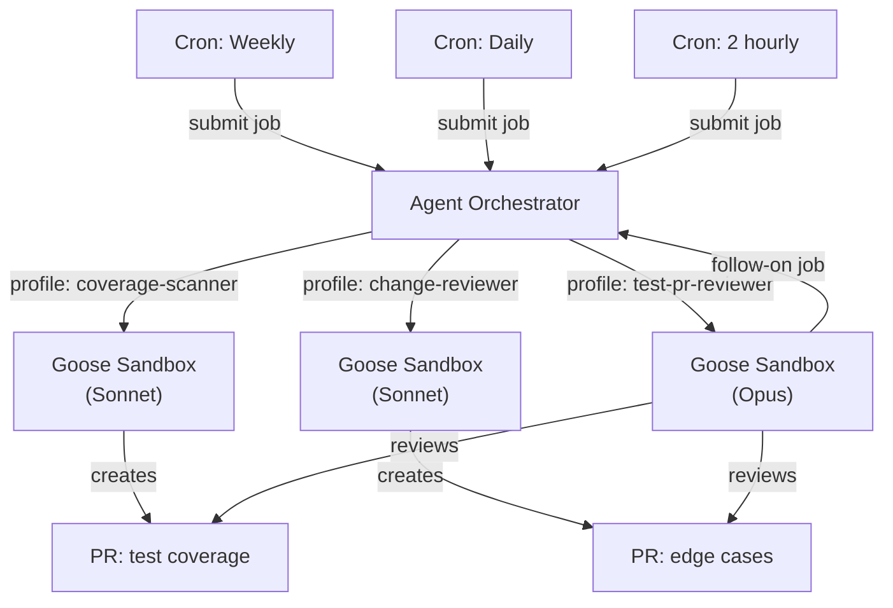
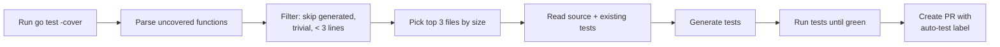
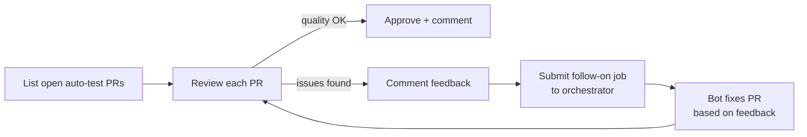

# ADR 009: Automated Test Generation Bots

**Author:** jomcgi
**Status:** Draft
**Created:** 2026-03-11

---

## Problem

Test coverage in the homelab repo is ad hoc — tests exist where authors wrote them, but there's no systematic process for identifying and closing coverage gaps. As the number of services grows, untested code accumulates silently, increasing the risk of regressions.

Uber's engineering team reports that automated test generation (AutoCover) produces 5,000+ unit tests per month and raised platform coverage by ~10%, equivalent to 21,000 developer hours saved. Open-source tools like Qodo Cover demonstrate that the generate-validate-feedback loop is a proven pattern for AI-assisted test creation.

The agent platform already implements the collect-analyze-execute pattern (cluster-agents) and provides isolated execution environments (Goose sandboxes). Adding test generation should reuse this infrastructure rather than building something new.

---

## Proposal

Introduce three specialized bots, each with a single clear responsibility, composed into a feedback loop:

| Bot                  | Model  | Trigger                  | Responsibility                                                    |
| -------------------- | ------ | ------------------------ | ----------------------------------------------------------------- |
| **Coverage Scanner** | Sonnet | Weekly cron              | Find totally uncovered code, generate test PRs                    |
| **Change Reviewer**  | Sonnet | Daily cron               | Review recent commits for missing edge case / behavioral tests    |
| **PR Reviewer**      | Opus   | Every 2h or event-driven | Review generated test PRs, approve or kick off follow-on fix jobs |

Each bot is a Goose recipe + profile, triggered by Kubernetes CronJobs that submit jobs to the existing agent orchestrator. No new Go code is required in cluster-agents.

| Aspect                    | Today                                | Proposed                                                  |
| ------------------------- | ------------------------------------ | --------------------------------------------------------- |
| Test creation             | Manual, ad hoc                       | Automated bots identify gaps and generate PRs             |
| Coverage tracking         | None                                 | Bots run `go test -cover` per package in sandbox          |
| Review of generated tests | N/A                                  | Dedicated Opus reviewer bot with follow-on job capability |
| Infrastructure            | Agent orchestrator + sandboxes exist | Reuse as-is, add recipes + cron triggers                  |

---

## Architecture

### Bot composition

### Coverage scanner flow

### PR reviewer feedback loop

The follow-on job uses the orchestrator's existing retry-with-context pattern — the review feedback becomes the task prompt for the fix job.

### Model routing

Recipes need to control which model the sandbox uses. Currently `GOOSE_MODEL` is set at the SandboxTemplate level. Options:

- **Option A:** Add `model` field to recipe YAML, runner overrides env var (least infra change)
- **Option B:** Add optional `model` field to orchestrator job submission, runner passes through
- **Option C:** Separate SandboxTemplates per model tier

Recommendation: **Option B** — the orchestrator already passes `profile` to the runner, adding `model` is a small API extension and keeps recipes model-agnostic.

---

## Implementation

### Phase 1: Coverage Scanner MVP

- [ ] Create `recipes/coverage-scanner.yaml` — Goose recipe for finding uncovered Go code and generating tests
- [ ] Add `coverage-scanner` profile to `profiles.yaml` and `model.go` ValidProfiles
- [ ] Add model routing support to orchestrator job submission API (optional `model` field)
- [ ] Update sandbox runner to accept model override from orchestrator
- [ ] Create `auto-test` label on GitHub repo
- [ ] Create CronJob in orchestrator deploy templates (weekly schedule)
- [ ] Manual testing: submit coverage scanner job via MCP, validate PR quality

### Phase 2: Change Reviewer

- [ ] Create `recipes/change-reviewer.yaml` — Goose recipe for reviewing recent git diffs against existing tests
- [ ] Add `change-reviewer` profile
- [ ] Create CronJob (daily schedule)
- [ ] Tune: adjust git lookback window, file filters, batch size

### Phase 3: PR Reviewer

- [ ] Create `recipes/test-pr-reviewer.yaml` — Goose recipe for reviewing `auto-test` PRs
- [ ] Add `test-pr-reviewer` profile (Opus model)
- [ ] Implement follow-on job submission from within a recipe (bot calls orchestrator API or uses MCP)
- [ ] Create CronJob (2-hour schedule)
- [ ] Add staleness policy: close `auto-test` PRs open > 7 days without merge

### Phase 4: Coverage in CI (future)

- [ ] Add `bazel coverage //...` step to `buildbuddy.yaml`
- [ ] Configure `.bazelrc`: `coverage --combined_report=lcov`, `coverage --instrumentation_filter=//projects/...`
- [ ] Publish coverage report as BuildBuddy artifact
- [ ] Update coverage scanner to consume CI coverage report instead of running `go test` in sandbox

---

## Security

No new secrets or external access required. Bots reuse existing:

- `GITHUB_TOKEN` — for PR creation (already in sandbox)
- `CI_DEBUG_MCP_TOKEN` — for BuildBuddy MCP access (already in sandbox)
- Sandbox RBAC — scoped to existing goose-agent ServiceAccount

Generated test PRs go through the same CI pipeline and human review as any other PR. No auto-merge in Phase 1.

---

## Risks

| Risk                                                                  | Likelihood | Impact | Mitigation                                                                                  |
| --------------------------------------------------------------------- | ---------- | ------ | ------------------------------------------------------------------------------------------- |
| Low-quality generated tests (pass but don't test meaningful behavior) | Medium     | Medium | Opus reviewer bot validates assertion quality; human review required                        |
| PR flood overwhelming review capacity                                 | Low        | Medium | Cap at 3 PRs per scanner run; staleness policy closes old PRs                               |
| Token cost scaling with frequent cron runs                            | Medium     | Low    | Start with weekly/daily cadence; monitor costs; Sonnet is cheap                             |
| Flaky generated tests                                                 | Medium     | High   | Recipe instructions mandate no sleeps, no real network calls; tests must pass multiple runs |
| Bot creates tests for generated/vendored code                         | Low        | Low    | Recipe filters: skip `*.pb.go`, `zz_generated*`, `vendor/`                                  |

---

## Open Questions

1. **Should the PR reviewer auto-merge high-confidence PRs?** Starting with human-only approval, but could auto-merge PRs where: all tests pass, coverage increases, reviewer bot approves. Revisit after Phase 3 is stable.
2. **Python test generation?** This ADR focuses on Go. Python services exist but are smaller. Extend recipes to support `pytest` once Go workflow is proven.
3. **Coverage thresholds?** Should we set per-package coverage targets that the scanner works toward, or just opportunistically fill gaps? Start opportunistic, consider targets later.

---

## References

| Resource                                                                                                                 | Relevance                                                   |
| ------------------------------------------------------------------------------------------------------------------------ | ----------------------------------------------------------- |
| [Uber AI Development (Pragmatic Engineer)](https://newsletter.pragmaticengineer.com/p/how-uber-uses-ai-for-development)  | AutoCover: 5K+ tests/month, 10% coverage lift               |
| [Qodo Cover (open source)](https://github.com/qodo-ai/qodo-cover)                                                        | Reference implementation of generate-validate-feedback loop |
| [Meta TestGen-LLM paper](https://www.qodo.ai/blog/we-created-the-first-open-source-implementation-of-metas-testgen-llm/) | Academic foundation for AI test generation                  |
| [ADR 007: Agent Orchestrator](007-agent-orchestrator.md)                                                                 | Job lifecycle, sandbox execution, retry-with-context        |
| [ADR 004: Autonomous Agents](004-autonomous-agents.md)                                                                   | Cluster-agents collect-analyze-execute pattern              |
| [ADR 008: Cluster Patrol](008-cluster-patrol-loop-resilience.md)                                                         | Patrol loop resilience patterns reused here                 |
