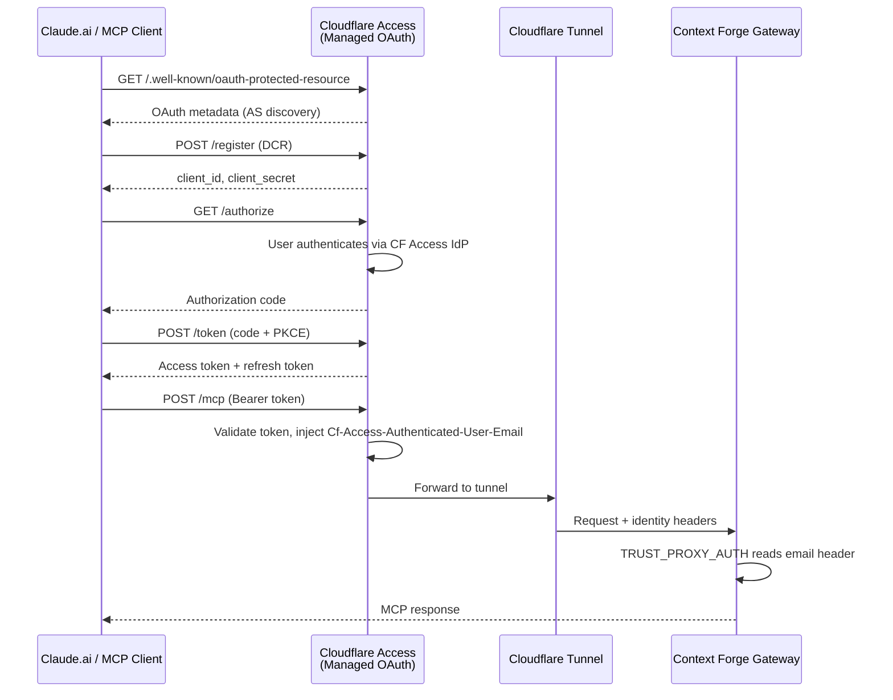

# ADR 011: Cloudflare Managed OAuth for MCP Gateway

**Author:** Joe McGinley
**Status:** Draft
**Created:** 2026-03-29
**Supersedes:** [006-oidc-auth-mcp-gateway](006-oidc-auth-mcp-gateway.md)

---

## Problem

ADR 006 deployed `obot-platform/mcp-oauth-proxy` as an OAuth 2.1 Authorization Server to enable Claude.ai web chat MCP access via RFC 9728 discovery + DCR. While functional, this introduces significant operational overhead for a single-user homelab:

1. **A full auxiliary service** — Go binary + PostgreSQL sidecar + 1Gi PVC (Longhorn) + 1Password secrets + Google OIDC client in GCP Console. Seven Helm templates just to proxy OAuth.

2. **Unpinned upstream image** — The proxy runs on a commit-hash tag (not a semver release). No automated image update, no upstream release cadence to track.

3. **Redundant identity provider hop** — Traffic flows: Cloudflare Tunnel → OAuth Proxy → Google OIDC → back to Proxy → Context Forge. Cloudflare already knows the user's identity if Access is configured — the Google OIDC leg is unnecessary.

4. **DCR state management** — DCR client registrations live in PostgreSQL. Pod restarts are safe (PVC persists), but this is a stateful dependency for what should be a stateless auth layer.

Cloudflare has released **Managed OAuth** (beta) as a feature of Cloudflare Access. It provides RFC 8707-compliant dynamic client registration and token management at the edge — exactly the capability ADR 006 built in-cluster.

---

## Proposal

Replace `mcp-oauth-proxy` with Cloudflare Access Managed OAuth. The CF Access application becomes the Authorization Server, handling DCR, token issuance, and token validation at the edge. Context Forge continues to trust proxy headers, but now those headers come from Cloudflare Access instead of the OAuth proxy.

| Aspect                         | ADR 006 (current)                                | Proposed                                               |
| ------------------------------ | ------------------------------------------------ | ------------------------------------------------------ |
| **Authorization Server**       | `mcp-oauth-proxy` (in-cluster)                   | Cloudflare Access Managed OAuth (edge)                 |
| **Identity Provider**          | Google OIDC (via GCP Console OAuth client)       | Cloudflare Access IdP (already configured)             |
| **DCR**                        | Proxy handles RFC 8707 DCR, stores in PostgreSQL | CF handles DCR at edge                                 |
| **Token issuance**             | Proxy issues its own JWTs                        | CF issues access tokens with configurable lifetime     |
| **Token validation**           | Proxy validates Bearer tokens in-cluster         | CF validates at edge before traffic reaches cluster    |
| **User identity header**       | Proxy injects `X-Forwarded-User`                 | CF Access injects `Cf-Access-Authenticated-User-Email` |
| **In-cluster components**      | Deployment + PostgreSQL + PVC + 1Password secret | None (HTTPRoute only)                                  |
| **Localhost/loopback clients** | Handled by proxy DCR                             | Native CF toggle                                       |
| **Grant session duration**     | Proxy-managed (no explicit config)               | Configurable in CF dashboard                           |
| **Access token lifetime**      | Proxy-managed                                    | Configurable (default 15min, recommended 10-20min)     |

### What Gets Removed

- `projects/mcp/oauth-proxy/` — entire Helm chart (7 templates) + deploy overlay
- PostgreSQL sidecar + 1Gi Longhorn PVC
- Google OIDC client in GCP Console
- `mcp-oauth-proxy` 1Password item (`OAUTH_CLIENT_ID`, `OAUTH_CLIENT_SECRET`, `ENCRYPTION_KEY`)

### What Changes

- Context Forge `PROXY_USER_HEADER` switches from `X-Forwarded-User` to `Cf-Access-Authenticated-User-Email`
- HTTPRoute for `mcp.jomcgi.dev` moves from the oauth-proxy chart to the context-forge-gateway chart (routing directly to Context Forge)
- Cloudflare Access application created for `mcp.jomcgi.dev` with Managed OAuth enabled

---

## Architecture

### Auth Flow (Proposed)

### In-Cluster Access (Unchanged)

In-cluster agents continue to access Context Forge via ClusterIP at `http://context-forge-gateway-mcp-stack-mcpgateway.mcp.svc.cluster.local:80/mcp`. No OAuth required.

---

## Implementation

### Phase 0: Validation (current PR)

- [ ] Create CF Access application for `mcp-test.jomcgi.dev` with Managed OAuth enabled
- [ ] Deploy test HTTPRoute routing `mcp-test.jomcgi.dev` directly to Context Forge
- [ ] Add Cloudflare Tunnel route for `mcp-test.jomcgi.dev`
- [ ] Verify RFC 9728 discovery at `https://mcp-test.jomcgi.dev/.well-known/oauth-protected-resource`
- [ ] Verify DCR works from Claude.ai "Add custom connector" dialog
- [ ] Verify `Cf-Access-Authenticated-User-Email` header reaches Context Forge
- [ ] Test Claude.ai MCP tool invocation end-to-end

### Phase 1: Migration

- [ ] Update Context Forge `PROXY_USER_HEADER` to `Cf-Access-Authenticated-User-Email`
- [ ] Create CF Access application for `mcp.jomcgi.dev` with Managed OAuth enabled
- [ ] Move HTTPRoute from oauth-proxy chart to context-forge-gateway chart
- [ ] Update Cloudflare Tunnel route to point at Context Forge service directly
- [ ] Verify Claude.ai and Claude Code work against production `mcp.jomcgi.dev`

### Phase 2: Cleanup

- [ ] Remove `projects/mcp/oauth-proxy/` from repo
- [ ] Remove `mcp-oauth-proxy` 1Password item
- [ ] Delete Google OIDC client from GCP Console
- [ ] Remove test HTTPRoute and `mcp-test.jomcgi.dev` CF Access app
- [ ] Remove `mcp-test.jomcgi.dev` Cloudflare Tunnel route
- [ ] Update ADR 006 status to `Superseded by 011`

---

## Security

### What Improves

- **Auth validation moves to the edge.** Invalid tokens are rejected by Cloudflare before reaching the cluster. With the proxy model, malformed requests still traverse the tunnel to the proxy pod.
- **No in-cluster secrets for OAuth.** Google OIDC credentials (`OAUTH_CLIENT_ID`, `OAUTH_CLIENT_SECRET`) and the proxy encryption key are eliminated. Fewer secrets = smaller blast radius.
- **Managed token lifecycle.** CF handles token rotation, grant expiry, and session invalidation — no custom PostgreSQL state to manage.

### What Stays the Same

- Non-root (uid 65532), drop all capabilities on Context Forge pods
- Secrets for Context Forge itself via 1Password (`JWT_SECRET_KEY`, `AUTH_ENCRYPTION_SECRET`)
- Ingress via Cloudflare Tunnel only (no direct internet exposure)
- In-cluster access via ClusterIP (unchanged, no auth required)
- Backend credentials (SigNoz API key, ArgoCD token) remain server-side

### Deviations

**CF Access Managed OAuth is in beta.** The feature may change behavior, have undocumented edge cases, or be deprecated. Mitigation: the oauth-proxy chart remains in git history and can be redeployed if CF Managed OAuth is withdrawn.

---

## Risks

| Risk                                                                 | Likelihood | Impact | Mitigation                                                        |
| -------------------------------------------------------------------- | ---------- | ------ | ----------------------------------------------------------------- |
| CF Managed OAuth beta changes or breaks                              | Medium     | Medium | oauth-proxy chart preserved in git history; redeploy if needed    |
| CF doesn't serve RFC 9728 metadata correctly for Claude.ai           | Low        | High   | Phase 0 validation against `mcp-test.jomcgi.dev` before migration |
| `Cf-Access-Authenticated-User-Email` header not injected as expected | Low        | High   | Phase 0 validates header presence before switching production     |
| CF Access domain-level restriction blocks path-based routing         | Confirmed  | Low    | Use dedicated subdomains (`mcp.jomcgi.dev`) — already the case    |
| Vendor lock-in deepens (more reliance on Cloudflare)                 | Certain    | Low    | Already dependent on CF Tunnel; OAuth is additive, not structural |

---

## Open Questions

1. **CF Access IdP configuration** — Which identity provider is the CF Access app using? If it's already Google Workspace, the user experience is identical. If it's a different IdP, verify it supports the same user pool.

2. **Header format** — Does `Cf-Access-Authenticated-User-Email` contain just the email, or a structured claim? Context Forge expects a plain email string for `PROXY_USER_HEADER`.

3. **Refresh token behavior** — Does CF Managed OAuth issue refresh tokens that `mcp-remote` (Claude Code) can cache across sessions? Or does each CLI session require a new browser auth?

4. **Rate limits on DCR** — Does CF impose rate limits on dynamic client registration that could affect reconnection after token expiry?

---

## References

| Resource                                                                                                                                        | Relevance                               |
| ----------------------------------------------------------------------------------------------------------------------------------------------- | --------------------------------------- |
| [Cloudflare Managed OAuth (beta)](https://developers.cloudflare.com/cloudflare-one/applications/configure-apps/self-hosted-apps/managed-oauth/) | Feature documentation                   |
| [ADR 006 — OIDC Auth for MCP Gateway](006-oidc-auth-mcp-gateway.md)                                                                             | Current implementation being superseded |
| [ADR 003 — Context Forge](003-context-forge.md)                                                                                                 | Gateway architecture                    |
| [ADR 005 — Role-Based MCP Access](005-role-based-mcp-access.md)                                                                                 | Authorization layer consuming this auth |
| [Claude.ai Remote MCP Connectors](https://support.claude.com/en/articles/11503834-building-custom-connectors-via-remote-mcp-servers)            | Claude.ai OAuth requirements            |
