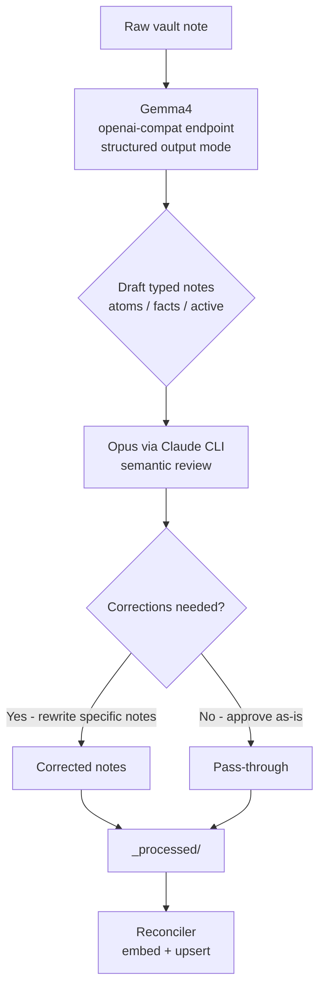

# ADR 012: Knowledge Gardener Two-Tier Model Pipeline

**Author:** jomcgi
**Status:** Draft
**Created:** 2026-04-09
**Supersedes:** N/A

---

## Problem

The knowledge gardener decomposes raw Obsidian vault notes into typed knowledge artifacts (atoms, facts, active items). The original design used the Anthropic SDK directly (pay-per-token). A follow-up plan switched to the Claude Code CLI subprocess using the OAuth token (free tier).

Two problems remain:

1. **Token limits** — the OAuth plan has rate limits that will be hit quickly as the vault grows. A single Sonnet/Opus call per note is expensive in output tokens (the model generates all typed note content).
2. **Quality** — a single model doing decomposition without a review pass produces inconsistent type classification, missed edge relationships, and shallow decomposition.

The question is whether a two-tier architecture — a free local model for first-pass generation, a smarter model for semantic review — achieves better quality at lower effective cost than a single-model approach.

---

## Proposal

Use Gemma4 (running on homelab GPU, OpenAI-compatible endpoint) for the first-pass decomposition, and Claude Opus (via Claude CLI OAuth) as a semantic review/correction layer.

The key token economics insight: **most tokens consumed by Opus are input context (cheap) — the original note plus Gemma4's draft output. Opus's output tokens (the corrections) are small.** This inverts the cost model compared to using Opus for generation.

| Aspect            | Today (Claude CLI only)     | Proposed                                                           |
| ----------------- | --------------------------- | ------------------------------------------------------------------ |
| Model             | Sonnet via Claude CLI       | Gemma4 (generation) + Opus (review)                                |
| Token source      | OAuth (rate-limited output) | Gemma4: free local; Opus: input-heavy (cheap)                      |
| Quality gate      | None — single-pass output   | Opus semantic review catches misclassification, poor decomposition |
| Concern addressed | Cost                        | Cost + content quality                                             |

Structural validation (frontmatter schema) is handled by Gemma4's structured output mode — Opus's role is **content quality only**: type classification, decomposition granularity, and edge relationship accuracy.

---

## Architecture

### Stage 1: Gemma4 Generation

- Called via OpenAI-compatible HTTP API (same endpoint used by the chatbot)
- Structured output mode (`response_format` JSON schema) enforces valid frontmatter fields
- Prompt instructs decomposition into typed notes with edge reasoning
- Output: one or more draft note objects (not yet written to disk)

### Stage 2: Opus Semantic Review

- Opus receives: original raw note + all Gemma4 draft notes as input context
- Prompt: _"Review these draft notes for type accuracy, decomposition quality, and edge correctness. Rewrite only notes that need correction. Output approved notes unchanged."_
- Opus writes final notes to `_processed/` via its native Write tool (Claude CLI subprocess)
- Opus does NOT re-generate from scratch unless a draft is fundamentally wrong

### Prompt Design Principle

Opus's prompt should minimise output tokens:

- If a draft note is correct → Opus outputs it verbatim (pass-through, no re-generation)
- If a draft note has content issues → Opus rewrites that note only
- Opus never generates additional notes beyond what Gemma4 proposed (decomposition is Gemma4's job)

---

## Implementation

### Phase 1: Gemma4 generation stage

- [ ] Add OpenAI SDK client (`openai` Python package, pointed at homelab endpoint) to `gardener.py`
- [ ] Replace or wrap `_ingest_one` with a Gemma4 call using structured output schema matching the existing frontmatter Pydantic model
- [ ] Validate draft output passes frontmatter schema before forwarding to Opus
- [ ] Write unit tests with mocked Gemma4 responses

### Phase 2: Opus review stage

- [ ] Add Opus review step in `_ingest_one`: pass original note + Gemma4 drafts as context
- [ ] Design Opus prompt that minimises output tokens (approve vs. targeted rewrite)
- [ ] Wire Opus output to write to `_processed/` (via Claude CLI subprocess, same as current plan)
- [ ] Write integration test: Gemma4 produces structurally-valid-but-wrong-type note → Opus corrects it

### Phase 3: Observability

- [ ] Emit SigNoz traces for each pipeline stage (Gemma4 latency, Opus latency, correction rate)
- [ ] Track correction rate metric: % of notes where Opus made changes vs. approved as-is
- [ ] Alert if correction rate exceeds 50% (indicates Gemma4 prompt needs tuning)

---

## Security

No new secrets required — Gemma4 endpoint is internal cluster traffic (no external exposure). Opus uses the existing `CLAUDE_CODE_OAUTH_TOKEN` secret already in the monolith deployment.

See `docs/security.md` for baseline. No deviations from baseline.

---

## Risks

| Risk                                                    | Likelihood | Impact                              | Mitigation                                                                         |
| ------------------------------------------------------- | ---------- | ----------------------------------- | ---------------------------------------------------------------------------------- |
| Gemma4 structured output mode unreliable                | Medium     | Pipeline blocked on schema failures | Fallback: retry with explicit JSON prompt; skip to Opus-only if still failing      |
| Opus OAuth rate limits hit despite input-heavy design   | Low        | Gardener stalls                     | Add per-cycle budget cap; skip notes until next cycle                              |
| Opus changes note meaning rather than correcting format | Low        | Knowledge corruption                | Prompt constraint: "preserve author intent, correct only structure/classification" |
| Gemma4 endpoint unavailable                             | Low        | Full pipeline stall                 | Circuit breaker: skip gardener cycle, log error, retry next tick                   |

---

## Open Questions

1. Should the Gemma4 prompt include existing vault notes as context (for edge reasoning), or keep it stateless and rely on Opus to add edges? Stateful Gemma4 calls are more expensive; Opus adding edges during review might be cleaner.
2. What is the Gemma4 model identifier on the homelab endpoint? (Needed for the OpenAI client `model=` param.)

---

## References

| Resource                                                                                                  | Relevance                                |
| --------------------------------------------------------------------------------------------------------- | ---------------------------------------- |
| [docs/plans/2026-04-08-knowledge-gardener-design.md](../../plans/2026-04-08-knowledge-gardener-design.md) | Original single-model design             |
| [docs/plans/2026-04-09-gardener-claude-cli.md](../../plans/2026-04-09-gardener-claude-cli.md)             | Claude CLI subprocess plan (predecessor) |
| [projects/monolith/knowledge/gardener.py](../../../projects/monolith/knowledge/gardener.py)               | Current gardener implementation          |
| [projects/monolith/knowledge/frontmatter.py](../../../projects/monolith/knowledge/frontmatter.py)         | Frontmatter schema (Pydantic models)     |
