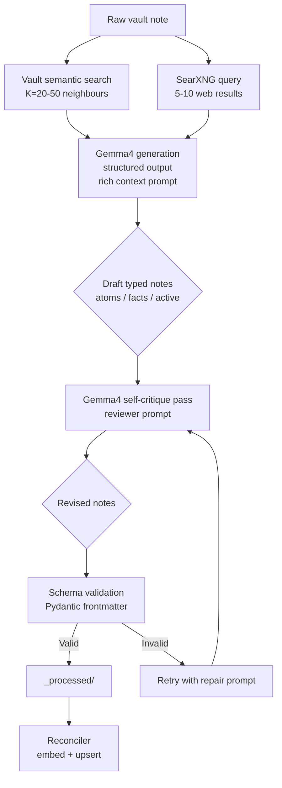

# ADR 013: Knowledge Gardener Gemma4-Only Pipeline

**Author:** jomcgi
**Status:** Draft
**Created:** 2026-04-09
**Supersedes:** [ADR 012](012-knowledge-gardener-model-pipeline.md)

---

## Problem

[ADR 012](012-knowledge-gardener-model-pipeline.md) proposed a two-tier pipeline — Gemma4 for first-pass decomposition plus Claude Opus (via Claude CLI OAuth) as a per-note semantic reviewer — to address two concerns with the current single-model Claude CLI gardener: token budget exhaustion as the vault grows, and shallow decomposition / misclassification from single-pass generation.

That design is a correct intermediate step, but it optimises the wrong axis once you factor in the actual downstream consumer of `_processed/` notes. The gardener's output is **LLM-consumed, not human-consumed**: typed knowledge artifacts are read by a retrieval-augmented LLM at query time. That shifts the quality bar in three ways that collapse the justification for per-note Opus review:

1. **Consumer tolerance is high.** A retriever LLM reading 10 candidate notes at query time can trivially ignore a miscategorised type field, compose across partially-correct atoms, dedupe near-duplicates, and recover from noisy edges. Per-note precision matters less than it would for a human-facing knowledge base.
2. **Coverage beats precision for RAG corpora.** A note that never gets processed (because Opus rate-limited the gardener) hurts recall permanently. A slightly-wrong note that gets fixed on the next reprocess cycle hurts nothing. A per-note quality ratchet optimises the wrong axis.
3. **Free compute unlocks a different design posture.** Gemma4 running locally on the homelab GPU has no token budget, no rate limit, and no external dependency. That makes three new things affordable: constant reprocessing of the entire vault, multi-pass self-critique loops, and rich external context injection (SearXNG web results). None of these are affordable if Opus is in the hot path.

The question this ADR resolves is whether the two-tier architecture in ADR 012 is worth the coupling cost to Claude CLI and OAuth budget, or whether a more aggressive Gemma4-only pipeline with self-critique and external enrichment achieves equivalent or better corpus quality at zero marginal cost.

---

## Proposal

Replace the current Claude CLI subprocess gardener ([`projects/monolith/knowledge/gardener.py`](../../../projects/monolith/knowledge/gardener.py)) with a Gemma4-only pipeline. Drop Opus from the hot path entirely. Design around the assumption that compute and context are free, and optimise for coverage, freshness, and external enrichment rather than per-note precision.

The key reframing: **the gardener's output is LLM input, not human documentation.** Therefore the gardener should behave like a bulk ETL pipeline that prioritises running often and bringing in lots of context, not a careful author that writes each note perfectly.

| Aspect            | ADR 012 (two-tier)                     | This ADR (Gemma4-only)                                              |
| ----------------- | -------------------------------------- | ------------------------------------------------------------------- |
| Hot-path models   | Gemma4 (gen) + Opus (review)           | Gemma4 only (gen + self-critique)                                   |
| Token source      | Gemma4 free; Opus input-heavy OAuth    | Fully free, no OAuth budget impact                                  |
| Quality gate      | Opus semantic review per note          | Gemma4 self-critique pass; coverage and reprocessing as the ratchet |
| External context  | Vault semantic search only             | Vault semantic search **+ SearXNG web results**                     |
| Reprocess cadence | New/changed files per cycle            | Rolling window over the entire vault, every cycle                   |
| Failure coupling  | Claude CLI subprocess + OAuth + Gemma4 | Gemma4 endpoint only                                                |

Opus is not deleted from the toolbox — it is removed from the synchronous path. See the "Future Work" section for how Opus can be reintroduced as an offline audit tool if drift becomes measurable.

### Rollout ordering

ADR 012's two-tier design is left in place as a historical record. In practice, the current gardener (Claude CLI / Sonnet) will finish categorising the existing vault backlog first. Once the backlog is drained, the gardener cuts over directly to the Gemma4-only pipeline described here, skipping the two-tier intermediate entirely.

---

## Architecture

### Stage 1: Context assembly

Before calling Gemma4, the gardener assembles a rich input context:

- **Vault semantic search** — query the existing vault for K=20-50 neighbouring notes (ADR 012 used "a sample"; this ADR explicitly aims wide because context is free). Used for edge reasoning (`derives_from`, `related`) and to keep type classification consistent with existing corpus conventions.
- **SearXNG external enrichment** — for notes that reference external concepts, issue a SearXNG query and pull 5-10 result snippets. Gives Gemma4 ground-truth external context for fact verification and link resolution. This is the single biggest qualitative improvement over ADR 012, and it is only affordable because Gemma4 tokens are free.

SearXNG is already deployed in the cluster for other services — no new infrastructure is required, just a client wrapper in `gardener.py`.

### Stage 2: Gemma4 generation

- Model: `gemma-4-26b-a4b` via `LLAMA_CPP_URL`, same endpoint used by the Discord chatbot ([`projects/monolith/chat/agent.py`](../../../projects/monolith/chat/agent.py))
- Called via PydanticAI `OpenAIChatModel` + `OpenAIProvider` against the OpenAI-compatible endpoint
- Structured output mode (`response_format` with JSON schema matching [`frontmatter.py`](../../../projects/monolith/knowledge/frontmatter.py)) enforces valid frontmatter fields deterministically
- Prompt includes: raw note, K vault neighbours, SearXNG snippets, and a stable set of type/classification rules

### Stage 3: Gemma4 self-critique

A second Gemma4 call with a reviewer prompt ("find misclassifications, weak edges, shallow decomposition, and produce corrected notes"). This is the free substitute for ADR 012's Opus review step.

Prior research on self-consistency and self-refine loops shows that a reviewer pass against the same mid-size model meaningfully improves structured output quality on classification and decomposition tasks — not to frontier-model quality, but enough to close most of the gap that made ADR 012 compelling in the first place. And it costs nothing.

The self-critique prompt must be **strictly conservative**: pass-through unchanged notes, only rewrite notes with identified issues, never hallucinate additional notes. This mirrors ADR 012's Opus prompt design principle.

### Stage 4: Schema validation and repair

Pydantic validates the self-critiqued output against the frontmatter schema. If validation fails, a third Gemma4 call with a repair prompt attempts to fix structural issues. If repair fails twice in a row for the same note, the raw file is left in place and logged as a failure (same posture as the current gardener).

### Stage 5: Write and reconcile

Valid notes are written to `_processed/` directly by the gardener process — no Claude CLI subprocess, no external write tool invocation. The existing reconciler handles embedding + upsert unchanged.

### Reprocessing posture

Because Gemma4 runs are free and the full pipeline takes seconds per note, the gardener shifts from "process new/changed files" to "process a rolling window of the entire vault on every cycle". Concretely:

- Every cycle processes all new/changed files (as today) **plus** a rolling slice of N oldest-processed notes, reprocessing them from their raw sources
- Notes self-heal as prompts, retrieval, and external context improve
- No Opus budget constraints mean the window can be large (e.g., 10% of the vault per cycle)

This reframes the pipeline from "author each note once carefully" to "continuously refresh the corpus from source". For an LLM-consumed corpus, this is strictly better.

---

## Implementation

### Phase 1: Gemma4 generation stage

- [ ] Add a PydanticAI `OpenAIChatModel` client (model `gemma-4-26b-a4b`, `LLAMA_CPP_URL` env var) wrapper to `gardener.py`, reusing the pattern from [`projects/monolith/chat/agent.py`](../../../projects/monolith/chat/agent.py)
- [ ] Replace `_ingest_one` with a Gemma4 call using structured output against the existing [`frontmatter.py`](../../../projects/monolith/knowledge/frontmatter.py) Pydantic schema
- [ ] Delete the Claude CLI subprocess plumbing (`_CLAUDE_PROMPT_HEADER`, `_CLAUDE_TIMEOUT_SECS`, `claude_bin`, the entire `asyncio.create_subprocess_exec` block)
- [ ] Unit tests with mocked Gemma4 responses, including structured output validation failures

### Phase 2: Context assembly

- [ ] Wire `search_notes` to retrieve K=20-50 vault neighbours before generation
- [ ] Add a SearXNG client wrapper (query + snippet extraction) and inject results into the Gemma4 prompt
- [ ] Gate SearXNG enrichment behind a config flag initially so it can be disabled if it produces noisy results
- [ ] Integration test: raw note with external references → Gemma4 prompt includes SearXNG snippets → structured output produced

### Phase 3: Self-critique pass

- [ ] Add a second Gemma4 call with a reviewer prompt after generation
- [ ] Enforce conservative behaviour: pass-through unchanged, targeted rewrites only, no new notes
- [ ] A/B evaluate: sample N notes processed with and without self-critique, manual quality review
- [ ] Add a config flag so self-critique can be disabled if it proves to add no measurable quality uplift

### Phase 4: Rolling reprocess window

- [ ] Add a cycle-level reprocess budget (N oldest notes reprocessed per cycle, configurable)
- [ ] Track a `last_processed_at` timestamp per note so the window can be ordered deterministically
- [ ] Ensure reprocessing is idempotent: re-running on an already-processed note must not create duplicates downstream

### Phase 5: Observability

- [ ] SigNoz traces for each pipeline stage (context assembly latency, Gemma4 gen latency, self-critique latency, schema repair rate)
- [ ] Track `notes_processed_total`, `notes_reprocessed_total`, `schema_repair_rate`, `searxng_enrichment_rate`
- [ ] Dashboard showing rolling vault coverage (how much of the vault has been processed in the last 24h / 7d)

---

## Security

No new secrets required — Gemma4 endpoint is internal cluster traffic, SearXNG is internal cluster traffic, and Opus OAuth is no longer wired up in the hot path.

Removing the Claude CLI subprocess removes a whole class of security surface: no more `CLAUDE_CODE_OAUTH_TOKEN` dependency in the gardener, no subprocess spawning, no filesystem write tool invocation from a foreign process.

See [`docs/security.md`](../../../docs/security.md) for baseline. No deviations.

---

## Risks

| Risk                                                                   | Likelihood | Impact                                 | Mitigation                                                                                                          |
| ---------------------------------------------------------------------- | ---------- | -------------------------------------- | ------------------------------------------------------------------------------------------------------------------- |
| Gemma4 quality is meaningfully worse than Sonnet/Opus on decomposition | Medium     | Corpus degradation over time           | Rolling reprocess window self-heals as prompts improve; periodic manual sampling; Opus audit tool (see Future Work) |
| Self-critique pass adds latency without quality uplift                 | Medium     | Wasted compute, slower cycles          | Config flag; A/B evaluation before enabling by default                                                              |
| SearXNG snippets add noise rather than signal                          | Medium     | Worse note quality, hallucination risk | Config flag; strict prompt framing ("web snippets are hints, not facts")                                            |
| Gemma4 structured output mode unreliable                               | Medium     | Pipeline blocked on schema failures    | Repair prompt retry; skip + log after 2 failures (same as current gardener)                                         |
| Gemma4 endpoint unavailable                                            | Low        | Full pipeline stall                    | Circuit breaker: skip gardener cycle, log error, retry next tick                                                    |
| Rolling reprocess window creates downstream churn                      | Low        | Reconciler load, embedding cost        | Reconciler is idempotent; embedding is local and free                                                               |

---

## Future Work

### Opus as an offline audit tool

If periodic manual sampling surfaces systemic quality issues, Opus can be reintroduced as an **offline audit tool** rather than an inline reviewer:

- A scheduled job (e.g., weekly) samples 20-50 random notes from `_processed/` and asks Opus to review them
- Opus produces a correction rate signal and a list of systemic issues (e.g., "Gemma4 is misclassifying procedural notes as facts 30% of the time")
- The signal feeds a SigNoz dashboard; alerts fire if the correction rate exceeds a threshold
- Opus never writes directly to the corpus — its output is advisory, used to tune Gemma4 prompts and retrieval

This preserves the quality ratchet that made ADR 012 compelling while decoupling it from the gardener's hot path and keeping Opus budget impact negligible.

### Alternative reviewer models

If local-GPU capacity grows, a second larger local model (e.g., a 70B+ model running on a dedicated node) could replace the Opus audit tool entirely, keeping the whole pipeline local and free.

---

## Open Questions

_None — all design questions resolved._

---

## References

| Resource                                                                                                  | Relevance                                      |
| --------------------------------------------------------------------------------------------------------- | ---------------------------------------------- |
| [ADR 012](012-knowledge-gardener-model-pipeline.md)                                                       | Superseded two-tier design                     |
| [docs/plans/2026-04-08-knowledge-gardener-design.md](../../plans/2026-04-08-knowledge-gardener-design.md) | Original single-model design                   |
| [docs/plans/2026-04-09-gardener-claude-cli.md](../../plans/2026-04-09-gardener-claude-cli.md)             | Claude CLI subprocess plan (current gardener)  |
| [projects/monolith/knowledge/gardener.py](../../../projects/monolith/knowledge/gardener.py)               | Current gardener implementation to be replaced |
| [projects/monolith/knowledge/frontmatter.py](../../../projects/monolith/knowledge/frontmatter.py)         | Frontmatter schema (Pydantic models)           |
| [projects/monolith/chat/agent.py](../../../projects/monolith/chat/agent.py)                               | Existing Gemma4 PydanticAI client pattern      |
