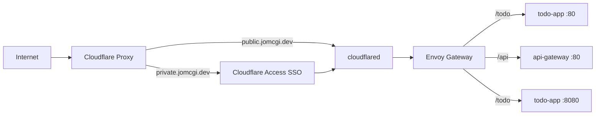
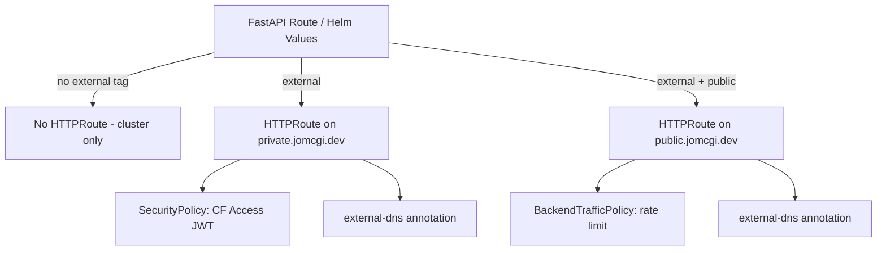

# ADR 002: Path-Based Ingress Tiers with Automatic DNS

**Author:** Joe McGinley
**Status:** Draft
**Created:** 2026-03-29
**Relates to:** [ADR 001: Cloudflare + Envoy Gateway](001-cloudflare-envoy-gateway.md)

---

## Problem

The current ingress model assigns each service its own subdomain (`todo.jomcgi.dev`, `argocd.jomcgi.dev`, etc.). This creates several issues:

1. **Manual DNS management** — every new service requires a new Cloudflare DNS record and tunnel route entry in `cloudflare-gateway/values-prod.yaml`.
2. **Inconsistent SSO enforcement** — whether a service gets Cloudflare Access protection depends on the deployer remembering to add a SecurityPolicy. Nothing prevents exposing an internal service publicly by mistake.
3. **Duplicated HTTPRoute templates** — services hand-roll their own HTTPRoute manifests instead of using the `cf-ingress-library` chart, because the library interface requires too much boilerplate (hostname, gateway ref, tier label all specified manually).
4. **Subdomain conflict** — `jomcgi.dev` is already used by Cloudflare Pages for static content, so service subdomains must avoid colliding with page routes.

---

## Proposal

Replace per-service subdomains with **two fixed hostnames** and **path-based routing**, using a tag system to control exposure:

| Tags                  | Route         | Hostname                    | Auth                  |
| --------------------- | ------------- | --------------------------- | --------------------- |
| _(none)_              | Internal only | Cluster DNS                 | N/A                   |
| `external`            | Private       | `private.jomcgi.dev/<path>` | Cloudflare Access SSO |
| `external` + `public` | Public        | `public.jomcgi.dev/<path>`  | None                  |

### Design principles

- **Internal by default** — services without an `external` tag get no HTTPRoute. They are reachable only within the cluster via service mesh.
- **Private by default when external** — the `external` tag alone routes to `private.jomcgi.dev` behind Cloudflare Access. Public exposure requires an explicit `public` opt-in.
- **Zero DNS management** — external-dns annotations on HTTPRoutes automatically create CNAME records pointing at the Cloudflare tunnel (`<tunnelId>.cfargotunnel.com`). Only two DNS records exist: `public.jomcgi.dev` and `private.jomcgi.dev`.
- **Extensible tags** — the tag system is open for future use cases (e.g. `external` + `ratelimited`, `external` + `websocket`) without changing the core model.

### Before / After

| Aspect              | Today                                           | Proposed                             |
| ------------------- | ----------------------------------------------- | ------------------------------------ |
| DNS records         | One per service subdomain                       | Two total (`public.*`, `private.*`)  |
| DNS management      | Manual per service                              | Automatic via external-dns           |
| SSO enforcement     | Opt-in per service (SecurityPolicy)             | Default for all external routes      |
| Public exposure     | Default (no SSO unless configured)              | Explicit opt-in (`public` tag)       |
| Hostname            | `<service>.jomcgi.dev`                          | `{public,private}.jomcgi.dev/<path>` |
| HTTPRoute authoring | Hand-rolled or verbose library params           | Tags → generated values → library    |
| Gateway ref         | Repeated in every values file                   | Hardcoded in library                 |
| New service setup   | DNS + tunnel route + HTTPRoute + SecurityPolicy | Add `external` tag                   |

---

## Architecture

### Ingress flow



### Tag-to-HTTPRoute mapping



### Library chart interface

The `cf-ingress-library` template derives everything from minimal input:

```yaml
# What a consumer provides:
cfIngress:
  external:
    - path: /todo
      serviceName: todo-public
      servicePort: 80
      public: true # opt-in to public.jomcgi.dev
      rateLimit:
        requests: 100
        unit: Minute
    - path: /todo/admin
      serviceName: todo-admin
      servicePort: 8080
      # no public: true → private.jomcgi.dev (SSO)
```

The library hardcodes:

- **Hostnames**: `public.jomcgi.dev` / `private.jomcgi.dev`
- **Gateway ref**: `cloudflare-ingress` in `envoy-gateway-system`
- **external-dns annotation**: `<tunnelId>.cfargotunnel.com`
- **SecurityPolicy**: Cloudflare Access JWT validation (for private routes)
- **Tier label**: derived from `public: true/false`

### FastAPI codegen (future)

For FastAPI services, route tags drive automatic generation of `cfIngress` values:

```python
# Routes default to internal (no HTTPRoute)
@app.get("/todo/admin")
async def admin_panel(): ...

# external tag → private.jomcgi.dev/todo/admin
@app.get("/todo/admin", openapi_extra={"x-ingress": ["external"]})
async def admin_panel(): ...

# external + public → public.jomcgi.dev/todo
@app.get("/todo", openapi_extra={"x-ingress": ["external", "public"]})
async def list_todos(): ...
```

A Bazel rule extracts the OpenAPI spec at build time and generates the `cfIngress` values block. This applies to any FastAPI app in the repo — not specific to any single service.

---

## Implementation

### Phase 1: Library chart redesign

- [ ] Update `cf-ingress-library` `_httproute.tpl` — new interface accepting a list of routes with `path`, `serviceName`, `servicePort`, `public` flag
- [ ] Hardcode hostnames (`public.jomcgi.dev`, `private.jomcgi.dev`), gateway ref, and external-dns annotation in the template
- [ ] Update `_security-policy.tpl` — auto-attach to all private (non-public) routes
- [ ] Update `_backend-traffic-policy.tpl` — accept optional rate limit config per route
- [ ] Bump library chart version

### Phase 2: Migrate existing consumers

- [ ] Migrate `todo_app` to the new `cfIngress.external` interface
- [ ] Migrate `agent-orchestrator` to use the library chart (currently hand-rolled)
- [ ] Migrate `mcp-oauth-proxy` to use the library chart (add filter support if needed, or remove the `X-Forwarded-Proto` header hack if Envoy Gateway handles it natively)
- [ ] Remove per-service hostname entries from `cloudflare-gateway/values-prod.yaml` as services migrate

### Phase 3: FastAPI codegen

- [ ] Build `gen_ingress.py` script — extracts OpenAPI spec, groups routes by `x-ingress` tags, emits `cfIngress` values YAML
- [ ] Create `fastapi_ingress_gen` Bazel rule wrapping the script
- [ ] Apply to first FastAPI service as proof of concept
- [ ] Add lint rule: warn on FastAPI routes missing `x-ingress` tag (forces explicit internal/external decision)

### Phase 4: Cleanup

- [ ] Remove legacy per-service subdomain DNS records from Cloudflare
- [ ] Remove stale tunnel routes from `cloudflare-gateway/values-prod.yaml`
- [ ] Update `docs/contributing.md` and `docs/services.md` with new ingress pattern

---

## Security

- **Private by default** — the `external` tag is required to generate any HTTPRoute. Without it, a service is unreachable from outside the cluster. This inverts the current model where any service with an HTTPRoute is exposed.
- **SSO by default when external** — `external` routes go to `private.jomcgi.dev` with Cloudflare Access JWT validation. Public exposure requires the explicit `public` tag.
- **Two Cloudflare Access policies** — one wildcard policy on `private.jomcgi.dev/*` enforces SSO for all private routes. No per-service policy configuration needed.
- **Tunnel ID in annotations** — Cloudflare tunnel IDs are UUIDs visible in DNS CNAME records and are not sensitive. Safe to include in external-dns annotations.
- Follows baseline in `docs/security.md` — no deviations.

---

## Risks

| Risk                                                            | Likelihood | Impact | Mitigation                                                                           |
| --------------------------------------------------------------- | ---------- | ------ | ------------------------------------------------------------------------------------ |
| Path conflicts between services                                 | Low        | Medium | Lint rule to check for overlapping path prefixes across all HTTPRoutes               |
| external-dns creates records before Access policy is configured | Low        | High   | Deploy Access policy for `private.jomcgi.dev/*` before any routes migrate            |
| Existing clients hardcode old subdomains                        | Medium     | Low    | Cloudflare redirect rules from old subdomains to new paths during transition         |
| FastAPI codegen misses routes (no tag = silent omission)        | Medium     | Low    | Lint rule requires explicit `x-ingress` tag on all routes; missing tag is a CI error |

---

## Open Questions

1. **Tunnel ID value source** — hardcode in the library chart (it's not sensitive) or pass as `global.tunnelId`? Hardcoding is simpler but couples the chart to one cluster.
2. **Path prefix ownership** — should there be a registry of claimed path prefixes to prevent conflicts, or is a CI lint rule sufficient?
3. **Mixed tiers for one path** — can a service expose the same path on both public and private (e.g. `/api` public for reads, `/api` private for writes)? If so, the Gateway needs to merge routes with different method matchers.

---

## References

| Resource                                                                                                                            | Relevance                                                      |
| ----------------------------------------------------------------------------------------------------------------------------------- | -------------------------------------------------------------- |
| [ADR 001: Cloudflare + Envoy Gateway](001-cloudflare-envoy-gateway.md)                                                              | Foundation — this ADR builds on the Envoy Gateway architecture |
| [Gateway API HTTPRoute spec](https://gateway-api.sigs.k8s.io/api-types/httproute/)                                                  | Path matching semantics and route merging behavior             |
| [external-dns docs](https://kubernetes-sigs.github.io/external-dns/)                                                                | Annotation-driven DNS record management                        |
| [Cloudflare Access JWT validation](https://developers.cloudflare.com/cloudflare-one/identity/authorization-cookie/validating-json/) | SecurityPolicy JWT provider configuration                      |
