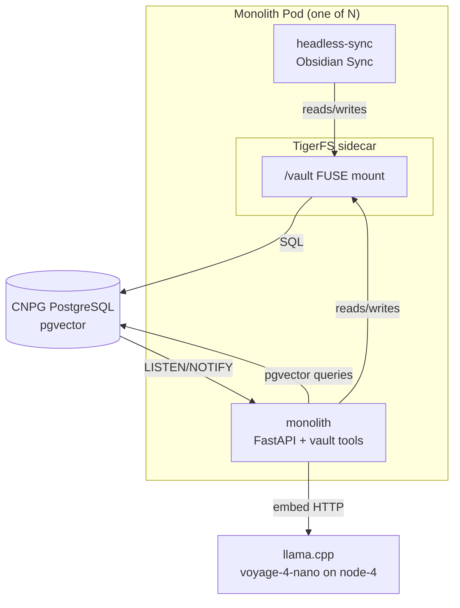
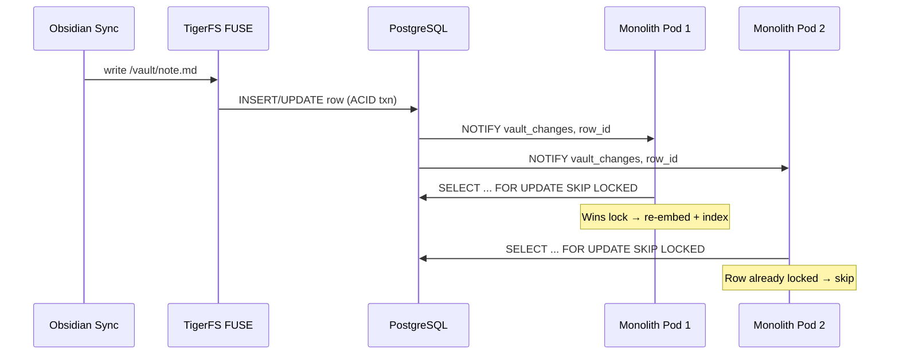

# ADR 001: Migrate Obsidian Vault into Monolith with TigerFS

**Author:** jomcgi
**Status:** Draft
**Created:** 2026-04-06

---

## Problem

The Obsidian vault runs as a standalone service (`projects/obsidian_vault/`) with three stateful dependencies:

1. **RWO PersistentVolumeClaim** — forces `Recreate` deploy strategy, no horizontal scaling
2. **Qdrant subchart** — dedicated vector database for 768-dim nomic embeddings
3. **git-sidecar** — watches filesystem for changes, commits and pushes to GitHub

This architecture prevents running multiple replicas (RWO constraint), creates downtime during deploys (Recreate strategy), and spreads state across three systems that must stay in sync.

Meanwhile, the monolith already has:

- A **CNPG PostgreSQL cluster with pgvector** (`vector` extension loaded, 10Gi storage)
- Schemas for `todo`, `chat`, `notes`, and `home`
- A `notes` module that proxies to vault-mcp over HTTP — a natural integration seam

Paid **Obsidian Sync** (via the headless-sync sidecar) requires a real POSIX filesystem to detect and sync changes. Any solution must preserve filesystem semantics.

---

## Proposal

Migrate the Obsidian vault into the monolith by:

1. **Using TigerFS as a FUSE mount** to present the Postgres-backed vault as a real filesystem, preserving Obsidian Sync compatibility
2. **Replacing Qdrant with pgvector** in the existing CNPG cluster for semantic search
3. **Moving vault_mcp logic into the monolith** FastAPI app, replacing the HTTP proxy in `notes/service.py` with direct database access
4. **Using Postgres `LISTEN/NOTIFY` + `SKIP LOCKED`** for file change deduplication across pods
5. **Removing `projects/obsidian_vault/`** as a standalone service

| Aspect                    | Today                                        | Proposed                                                    |
| ------------------------- | -------------------------------------------- | ----------------------------------------------------------- |
| **Vault storage**         | RWO PVC (5Gi)                                | TigerFS FUSE → CNPG Postgres                                |
| **Vector search**         | Qdrant subchart (768-dim, cosine)            | pgvector in existing CNPG cluster                           |
| **Embedding model**       | nomic-embed-text-v1.5 in-process (FastEmbed) | voyage-4-nano via existing llama.cpp on node-4 (1024-dim)   |
| **File change detection** | git-sidecar (inotify → git commit)           | Postgres `LISTEN/NOTIFY` on row changes                     |
| **Obsidian Sync**         | headless-sync sidecar on RWO PVC             | headless-sync sidecar on TigerFS FUSE mount                 |
| **Deploy strategy**       | `Recreate` (RWO constraint)                  | `RollingUpdate` (all pods share Postgres)                   |
| **Replicas**              | 1 (hard limit)                               | N (limited only by Postgres connections)                    |
| **Stateful dependencies** | PVC + Qdrant + git remote                    | Postgres only                                               |
| **MCP registration**      | Standalone gateway registration job          | Monolith registers vault tools alongside existing MCP tools |
| **Notes API**             | HTTP proxy (`notes/service.py` → vault-mcp)  | Direct database access                                      |

---

## Architecture

### Pod Layout (per replica)



### Data Flow: Note Write



### Schema Addition

New `vault` schema in the monolith database:

```sql
CREATE SCHEMA IF NOT EXISTS vault;

CREATE TABLE vault.notes (
    id SERIAL PRIMARY KEY,
    path TEXT NOT NULL UNIQUE,       -- e.g. 'daily/2026-04-06.md'
    content TEXT NOT NULL DEFAULT '',
    created_at TIMESTAMPTZ NOT NULL DEFAULT now(),
    updated_at TIMESTAMPTZ NOT NULL DEFAULT now()
);

CREATE TABLE vault.embeddings (
    id SERIAL PRIMARY KEY,
    note_id INTEGER NOT NULL REFERENCES vault.notes(id) ON DELETE CASCADE,
    chunk_index INTEGER NOT NULL,
    chunk_text TEXT NOT NULL,
    embedding vector(1024) NOT NULL, -- voyage-4-nano via llama.cpp
    UNIQUE(note_id, chunk_index)
);

CREATE INDEX ON vault.embeddings USING ivfflat (embedding vector_cosine_ops);

-- Change notification for deduplication
CREATE OR REPLACE FUNCTION vault.notify_change() RETURNS trigger AS $$
BEGIN
    PERFORM pg_notify('vault_changes', NEW.id::text);
    RETURN NEW;
END;
$$ LANGUAGE plpgsql;

CREATE TRIGGER vault_notes_change
    AFTER INSERT OR UPDATE ON vault.notes
    FOR EACH ROW EXECUTE FUNCTION vault.notify_change();
```

### FUSE Security

Ubuntu Server nodes (kernel 5.x+) support unprivileged FUSE. TigerFS sidecar needs:

```yaml
volumeDevices:
  - name: dev-fuse
    devicePath: /dev/fuse
# OR via hostPath volume:
volumes:
  - name: dev-fuse
    hostPath:
      path: /dev/fuse
      type: CharDevice
```

No `SYS_ADMIN` capability required. Existing `DROP ALL` + `runAsNonRoot` security posture is preserved.

---

## Implementation

Single-phase approach — try it, revert if it doesn't work.

### Schema & Data

- [ ] Add `vault` schema migration with `notes` and `embeddings` tables (1024-dim vectors)
- [ ] Backfill existing vault notes into Postgres (one-time migration script from git repo)

### Monolith Integration

- [ ] Migrate chunking logic from `vault_mcp/app/chunker.py` into monolith
- [ ] Reuse existing `chat/embedding.py` client (already calls voyage-4-nano via llama.cpp)
- [ ] Implement pgvector-backed semantic search (replace Qdrant)
- [ ] Add reconciler using `LISTEN/NOTIFY` + `SKIP LOCKED` for change deduplication
- [ ] Replace `notes/service.py` HTTP proxy with direct DB access
- [ ] Register vault MCP tools from monolith's gateway registration

### TigerFS + Obsidian Sync

- [ ] Add TigerFS sidecar container to monolith deployment
- [ ] Configure `/dev/fuse` device access in pod spec
- [ ] Add liveness probe on FUSE mount health (e.g. `stat /vault/.tigerfs-health`)
- [ ] Wire headless-sync sidecar to TigerFS FUSE mount
- [ ] Test Obsidian Sync end-to-end: mobile edit → cloud → headless-sync → TigerFS → Postgres → re-embed

### Deploy Changes

- [ ] Add CNPG `Pooler` CRD (`transaction` mode) — monolith + TigerFS connect via pooler
- [ ] Switch deploy strategy from `Recreate` to `RollingUpdate`
- [ ] Bump CNPG resource limits (memory: 256Mi → 512Mi, storage: 10Gi → 15Gi)

### Cleanup

- [ ] Remove `projects/obsidian_vault/` (chart, deploy, image, vault_mcp)
- [ ] Remove Qdrant from cluster
- [ ] Deregister old `obsidian-vault` MCP server from gateway
- [ ] Update `format` / `home-cluster` kustomization (remove obsidian_vault references)
- [ ] Archive git-sidecar (keep GitHub repo as read-only historical backup)

---

## Security

Baseline per `docs/security.md`. Deviations:

- **`/dev/fuse` hostPath mount** — required for TigerFS FUSE. This is a character device, not a filesystem mount, and does not grant host filesystem access. No capability escalation needed on kernels supporting unprivileged FUSE.
- **No other changes** — `runAsNonRoot`, `DROP ALL`, uid 65532, 1Password secrets all remain.

---

## Risks

| Risk                                     | Likelihood | Impact                          | Mitigation                                                                                            |
| ---------------------------------------- | ---------- | ------------------------------- | ----------------------------------------------------------------------------------------------------- |
| TigerFS is too immature                  | Medium     | Medium — revert to standalone   | Keep `projects/obsidian_vault/` until migration is verified. Revert is a single ArgoCD app re-enable. |
| FUSE mount goes stale (TigerFS crash)    | Low-Medium | High — pod becomes unresponsive | Liveness probe on mount; kubelet restarts pod. TigerFS sidecar with restart policy.                   |
| Postgres becomes single point of failure | Low        | High — all vault access lost    | CNPG handles failover (already configured). Postgres is already SPOF for todo/chat/notes.             |
| CNPG resource pressure from embeddings   | Low        | Medium — slower queries         | Monitor with SigNoz; bump resources proactively. IVFFlat index keeps search fast.                     |
| Obsidian Sync incompatibility with FUSE  | Low        | High — breaks paid sync         | Test end-to-end before cutting over. Fallback: revert to standalone service with RWO PVC.             |

---

## Open Questions

1. **TigerFS versioning vs git** — TigerFS claims built-in version history. Is it sufficient to replace the git audit trail, or should we keep async git pushes as a backup?

---

## References

| Resource                                                                          | Relevance                                                |
| --------------------------------------------------------------------------------- | -------------------------------------------------------- |
| [TigerFS](https://tigerfs.io/)                                                    | FUSE filesystem backed by PostgreSQL                     |
| [pgvector](https://github.com/pgvector/pgvector)                                  | Vector similarity search for Postgres                    |
| [CNPG](https://cloudnative-pg.io/)                                                | Kubernetes-native PostgreSQL operator (already deployed) |
| [Unprivileged FUSE](https://www.kernel.org/doc/html/latest/filesystems/fuse.html) | Kernel docs on FUSE without SYS_ADMIN                    |
| `projects/obsidian_vault/`                                                        | Current standalone service being migrated                |
| `projects/monolith/notes/`                                                        | Existing HTTP proxy to vault-mcp (integration seam)      |
| `projects/monolith/chat/embedding.py`                                             | Existing voyage-4-nano client with retry logic (reuse)   |
| `projects/agent_platform/llama_cpp_embeddings/`                                   | Already-deployed voyage-4-nano on node-4 via llama.cpp   |
| `projects/monolith/chart/templates/cnpg-cluster.yaml`                             | Existing CNPG cluster with pgvector                      |
