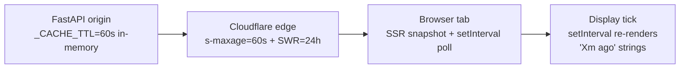

# ADR 002: CDN-Cached Data Fetching for Monolith Public Routes

**Author:** Joe McGinley
**Status:** Draft
**Created:** 2026-04-26

---

## Problem

Public routes on the monolith (the homepage marquee today, the upcoming `ships` migration tomorrow, others after that) need to display data that is both **fresh-ish** and **cheap to serve** as user count grows. Three constraints pull against each other:

1. **Freshness** — visitors expect to see live state (last deploy, cluster utilization, knowledge graph size), not values frozen at the time the tab was opened.
2. **Origin protection** — the homelab cluster is a small set of nodes. Any pattern whose origin load scales linearly with concurrent user count will eventually break it.
3. **Long-lived tabs** — a side monitor or a forgotten tab should pick up new state without a manual reload, but ideally without each tab hammering origin once a minute.

Today the homepage SSRs `data.stats` once and freezes it for the life of the tab. The accompanying client-side `setInterval` (introduced alongside this ADR) updates the _display_ of `deployed Xm ago` as time passes, but cannot pull in a _new_ `deployed_at` if a deploy happens while the tab is open. Naive fixes — periodic `fetch('/api/.../stats')` from each tab — bypass the Cloudflare edge entirely and turn user count into origin load.

This decision establishes a shared pattern for CDN-cacheable JSON polling that future routes can follow without re-relitigating the design each time.

---

## Proposal

For any monolith route that returns **public, anonymous JSON** intended for client-side polling:

1. **Set HTTP `Cache-Control` headers on the FastAPI response** so the Cloudflare edge can cache the JSON: `public, s-maxage=N, stale-while-revalidate=M`.
2. **Add a Cloudflare Cache Rule** for the path so the edge actually caches it (CF's default behavior does not cache `/api/*` JSON, even with cache-control headers).
3. **Client polls the cached endpoint** at an interval ≥ `s-maxage`. The CDN absorbs the request volume; origin load stays roughly constant in user count.
4. **Display formatting (e.g., `Xm ago` strings)** runs on a separate `setInterval` tick — independent of data fetching. Time-derived display does not require a network round-trip.

| Aspect                              | Today                                 | Proposed                                            |
| ----------------------------------- | ------------------------------------- | --------------------------------------------------- |
| `/api/.../stats` cache headers      | none                                  | `public, s-maxage=60, stale-while-revalidate=86400` |
| CF edge cache for `/api/*` JSON     | bypassed                              | explicit Cache Rule per public endpoint             |
| Client polling for freshness        | none                                  | `setInterval` against the cached endpoint           |
| Display tick (formatting)           | introduced for marquee age 2026-04-26 | retained as a separate concern                      |
| Origin load with N concurrent users | linear in N                           | ~constant in N                                      |

---

## Architecture

Three nested cache layers, each bounding a different kind of staleness:

| Layer                | Bounds staleness of          | TTL                         |
| -------------------- | ---------------------------- | --------------------------- |
| Backend `_CACHE_TTL` | Origin response              | 60s                         |
| Cloudflare edge      | JSON/HTML across page loads  | 60s fresh + 24h SWR         |
| Browser polling      | Tab's in-memory `data.stats` | poll interval (e.g., 5 min) |
| Display tick         | Formatted strings (`Xm ago`) | 30s                         |

Polling endpoint requirements:

- **Anonymous and cookie-free** — no `Authorization`, no `Set-Cookie` on the response, no per-user data in the body. CF caches by URL; any user-specific bytes leak across users.
- **Idempotent GET, no per-request nonces** — query params must be stable so the cache key is shared.
- **`Cache-Control: public, s-maxage=N, stale-while-revalidate=M`** — `s-maxage` (shared cache only), deliberately no `max-age` so the browser always re-asks the edge instead of caching locally and stalling in-tab freshness.
- **Self-describing freshness** — include a backend-cache timestamp in the body (e.g., `cached_at`) so clients can show "data from Ns ago" or detect SWR-served fossilized payloads.

---

## Implementation

### Phase 1: Marquee age display tick — landed in this PR

- [x] Make `MARQUEE_ITEMS` a `$state` rune in `projects/monolith/frontend/src/routes/public/+page.svelte`
- [x] `setInterval` re-runs `buildMarquee(data.stats)` every 30s so `deployed Xm ago` advances as wall-clock time passes (no fetch involved)

### Phase 2: CDN-cached `/stats` polling

- [ ] Add `Cache-Control: public, s-maxage=60, stale-while-revalidate=86400` to the `/api/home/observability/stats` FastAPI response
- [ ] Add a Cloudflare Cache Rule matching that path → "respect origin cache-control"
- [ ] Add a homepage client-side poll (e.g., every 5 min) that re-fetches `/stats` and updates `data.stats` so the marquee picks up new deploys without a reload
- [ ] Verify cache hit ratio in Cloudflare analytics; alert if `cf-cache-status: MISS` rate exceeds ~5% sustained

### Phase 3: Generalize for ships migration and other public routes

- [ ] Document the pattern in `docs/services.md` so new public-data routes default to it
- [ ] Consider a FastAPI dependency / decorator (`@public_cacheable(s_maxage=60)`) once a second caller exists — premature with one
- [ ] Audit other `/api/*` routes during the ships migration; promote ones that fit the criteria (anonymous, idempotent, polled by clients) to the cached pattern

---

## Security

Reference `docs/security.md` for baseline. Pattern-specific constraints:

- **Never apply this pattern to authenticated endpoints.** Cloudflare keys cache entries by URL by default; a cached response leaks across users if auth state is not reflected in the cache key (`Vary: Cookie` or `Vary: Authorization`). The simplest safe rule: cache _only_ endpoints that have no notion of "current user."
- **No PII or per-user fields in cached bodies.** Once at the edge, the response is served to anyone with the URL.
- **Strip `Set-Cookie` from cacheable responses explicitly.** CF refuses to cache responses with `Set-Cookie` and silently degrades to origin-hit-per-request — defeating the whole point.
- **Rate-limit at the origin as defense-in-depth.** A misconfigured Cache Rule can route traffic past the edge; origin should not assume the edge is always in front.

---

## Risks

| Risk                                                                 | Likelihood | Impact                                            | Mitigation                                                                                                                                              |
| -------------------------------------------------------------------- | ---------- | ------------------------------------------------- | ------------------------------------------------------------------------------------------------------------------------------------------------------- |
| CF Cache Rule misconfigured → endpoint not actually cached           | medium     | Origin load scales with users                     | Verify `cf-cache-status: HIT` rate in CF analytics post-deploy; alert on sustained MISS                                                                 |
| `Set-Cookie` accidentally added to a cacheable response              | low        | Edge silently bypasses cache                      | Add a test asserting cacheable routes have no `Set-Cookie` header                                                                                       |
| Schema drift introduces a per-user field to a cached endpoint        | low        | Cross-user data leak                              | Schema review checklist when modifying any `@public_cacheable` route; consider a semgrep rule that flags auth-context-derived fields in cached handlers |
| Client polls more aggressively than `s-maxage`                       | low        | Slightly more edge cache misses, no origin impact | Document recommended poll interval = 1.5–2× `s-maxage`                                                                                                  |
| `stale-if-error` serves year-old data during prolonged origin outage | low        | UI shows fossilized values                        | Cap human-readable `Xm ago` formatting at ~30d → display `>30d` past that                                                                               |

---

## Open Questions

1. Should we encode the cache strategy as a FastAPI dependency / decorator now, or wait until phase 3 when ships migration exposes more routes? Lean: wait — premature with one caller.
2. Should the homepage poll `/stats` at all, or rely on user reloads + SWR? Defer to phase 2; gate on whether real users complain about stale tabs.
3. Cloudflare Cache Rules are configured outside this repo today. Do we want to bring them under IaC (Terraform / the CF API) so they're reviewable alongside the routes that depend on them?
4. Should `cached_at` (already present on `/stats`) become a required field on every cached endpoint by convention?

---

## References

| Resource                                                                                                              | Relevance                                                              |
| --------------------------------------------------------------------------------------------------------------------- | ---------------------------------------------------------------------- |
| [MDN: Cache-Control directives](https://developer.mozilla.org/en-US/docs/Web/HTTP/Headers/Cache-Control)              | Semantics of `s-maxage`, `stale-while-revalidate`, `stale-if-error`    |
| [Cloudflare: Cache Rules](https://developers.cloudflare.com/cache/how-to/cache-rules/)                                | How to enable caching for `/api/*` paths whose default would be bypass |
| [`projects/monolith/frontend/src/lib/cache-headers.js`](../../../projects/monolith/frontend/src/lib/cache-headers.js) | Existing SSR page cache header constant — reuse for JSON endpoints     |
| [`projects/monolith/home/observability/stats.py`](../../../projects/monolith/home/observability/stats.py)             | Origin cache layer (`_CACHE_TTL`) and `cached_at` field                |
| [ADR networking/001: Cloudflare + Envoy Gateway](../networking/001-cloudflare-envoy-gateway.md)                       | Ingress topology this pattern depends on                               |
