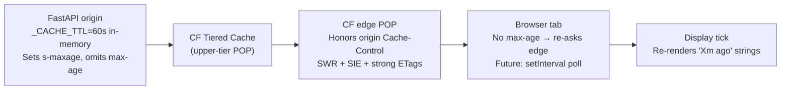

# ADR 003: CDN Cache Rule Scoped to `public.jomcgi.dev`

**Author:** Joe McGinley
**Status:** Implemented
**Created:** 2026-05-06
**Supersedes:** [002-cdn-cached-data-fetching.md](002-cdn-cached-data-fetching.md)

---

## Problem

ADR 002 sketched a per-route Cloudflare Cache Rule pattern as part of the "cacheable iff anonymous" invariant: each public endpoint would get its own rule matching its URI path. When the rule was actually deployed, three things became clear that 002 had not anticipated:

1. **The hostname is already a stronger filter than the path.** The monolith's routing layer maps `monolith/public/*` to `public.jomcgi.dev/*` and routes everything else (private SSR pages, authenticated APIs, internal services) through different hostnames. The hostname `public.jomcgi.dev` is therefore, by construction, only ever served by handlers that emit cookie-free anonymous responses. A per-path rule is redundant work the URL/host topology already does.
2. **Cloudflare's global "Browser Cache TTL" silently injects `max-age` into responses that omit it.** ADR 002 line 64 deliberately omits `max-age` from origin's `Cache-Control` header so browsers always re-ask the edge. With Browser Cache TTL set to a fixed value (the Cloudflare default is 5 days = 432000s), CF rewrites the response header to add `max-age=432000`, breaking the omission silently. The CDN cache works perfectly; browsers cache the homepage for 5 days and miss every deploy. ADR 002 did not document this knob.
3. **No verification methodology was specified.** "Verify cache hit ratio in CF analytics" (002 Phase 2) is too coarse for the actual failure modes we hit (`cf-cache-status: DYNAMIC` on every request before the rule landed; `max-age` injection after). A repeatable `curl -sI` probe sequence catches both classes in seconds.

This ADR records the design as actually deployed, fixes the silent-injection trap, and documents the verification protocol.

---

## Proposal

A single Cloudflare Cache Rule, scoped by hostname rather than path, paired with the global Caching → Configuration knobs needed to keep the rule's intent intact end-to-end.

| Aspect                                | ADR 002 (draft)                                  | ADR 003 (deployed)                                                                                                              |
| ------------------------------------- | ------------------------------------------------ | ------------------------------------------------------------------------------------------------------------------------------- |
| Cache Rule scope                      | Per-path (`/api/.../stats`, `/public/*`)         | Hostname-wide: `http.host wildcard r"public.jomcgi.dev"`                                                                        |
| Enforcer of "cacheable iff anonymous" | Per-route discipline + per-path CF rule          | Routing topology (`monolith/public/* → public.jomcgi.dev/*`) + hostname CF rule + origin `Cache-Control` discipline             |
| Edge TTL setting                      | Implicit ("respect origin")                      | Explicit: "Use cache-control header if present, **bypass cache if not**" (so unheadered responses are never cached by accident) |
| Browser Cache TTL                     | Not addressed                                    | Global: **"Respect Existing Headers"** — required to stop CF injecting `max-age` into responses that omit it                    |
| Tiered Cache                          | Not addressed                                    | **Smart Tiered Caching: ON** (single-origin homelabs benefit disproportionately)                                                |
| ETag handling                         | Not addressed                                    | **Respect strong ETags: ON** (free 304 revalidation for routes that emit ETags, e.g. `/api/knowledge/graph`)                    |
| Stale-while-revalidate at edge        | Implied via origin SWR directive                 | Explicit: "Serve stale content while revalidating: ON"                                                                          |
| Always Online                         | Not addressed                                    | ON (covers the case where origin is fully down and edge has no stale entry)                                                     |
| Verification                          | "CF analytics hit ratio" + alert at 5% MISS rate | Three-stage `curl -sI` probe pattern (below) + the same MISS-rate alert as a long-running guardrail                             |

---

## Architecture

Same three nested cache layers ADR 002 described, with the actual settings filled in:



| Layer                | Bounds staleness of          | TTL                                       | Source                                          |
| -------------------- | ---------------------------- | ----------------------------------------- | ----------------------------------------------- |
| Backend `_CACHE_TTL` | Origin response              | 60s                                       | `projects/monolith/home/observability/stats.py` |
| CF upper-tier        | Origin fetch deduplication   | Inherited from edge                       | Smart Tiered Caching (no per-rule TTL)          |
| CF edge              | Across page loads            | 60s fresh + 24h SWR + 1y SIE              | Origin `Cache-Control` honored by rule          |
| Browser              | Tab's in-memory `data.stats` | None (no `max-age` → always re-asks edge) | "Respect Existing Headers" preserves omission   |
| Display tick         | Formatted strings (`Xm ago`) | 30s                                       | `+page.svelte` `setInterval`                    |

The structural invariant — **"cacheable iff anonymous"** — now sits in three locks in series:

1. **Routing topology**: only `monolith/public/*` handlers serve `public.jomcgi.dev`. Authenticated/private code paths physically cannot respond on this hostname.
2. **Origin discipline**: `Cache-Control` is set explicitly on cacheable responses (`projects/monolith/frontend/src/lib/cache-headers.js`); other responses omit the header.
3. **CF rule**: hostname filter + "bypass cache if no Cache-Control" means anything that escapes locks 1 and 2 still won't be cached unless origin actively asked for it.

A single lock failing does not cause a leak. All three would have to fail simultaneously.

---

## Implementation

### Phase 1: Marquee age display tick — landed pre-002

- [x] `MARQUEE_ITEMS` as a `$state` rune in `projects/monolith/frontend/src/routes/public/+page.svelte`
- [x] `setInterval` re-runs `buildMarquee(data.stats)` every 30s

### Phase 2: Edge cache rule (this ADR's primary work)

- [x] Origin emits `Cache-Control: public, s-maxage=60, stale-while-revalidate=86400, stale-if-error=31536000` on `/public/*` (`projects/monolith/frontend/src/lib/cache-headers.js:6`, applied at `+page.server.js:221`)
- [x] Cloudflare Cache Rule deployed: match `http.host wildcard r"public.jomcgi.dev"`, action "Eligible for cache" + "Use cache-control header if present, bypass cache if not", "Serve stale while revalidating: ON", "Respect strong ETags: ON"
- [x] Verified `cf-cache-status: HIT` on repeated `/` requests with `age` header incrementing
- [ ] **Caching → Configuration → Browser Cache TTL: "Respect Existing Headers"** (currently set to 5 days — injecting `max-age=432000` into all responses; verified post-deploy 2026-05-06 via `curl -sI`)
- [ ] **Caching → Tiered Cache → Smart Tiered Caching: ON**
- [ ] **Caching → Configuration → Always Online: ON**
- [ ] Add `Cache-Control: public, s-maxage=60, stale-while-revalidate=86400` to `/api/home/observability/stats` FastAPI response (`projects/monolith/home/observability/router.py:251`)
- [ ] Add homepage client-side poll re-fetching `/stats` every ~5 min to update marquee without reload
- [ ] SigNoz alert: `cf-cache-status: MISS` rate sustained > 5% (existing follow-up from 002)

### Phase 3: Generalize and codify

- [ ] Document the pattern in `docs/services.md` so new public-data routes default to it
- [ ] Decide whether to bring CF Cache Rules / Caching configuration under IaC (Terraform `cloudflare_ruleset` + `cloudflare_zone_settings_override`). See open question 1.
- [ ] Audit other `/api/*` routes during the ships migration; promote ones that fit the criteria (anonymous, idempotent, polled by clients) to set `Cache-Control` headers — they will be cached automatically by the existing rule

### Verification protocol

Run after any change to CF caching configuration or origin `Cache-Control` headers:

```bash
# Hit 1: cold edge (or recently-warmed) — expect MISS or HIT with low age
curl -sI https://public.jomcgi.dev/ | grep -i 'cf-cache-status\|age:\|cache-control'

# Hit 2: 2s later — expect HIT, age incremented by ~2
sleep 2 && curl -sI https://public.jomcgi.dev/ | grep -i 'cf-cache-status\|age:\|cache-control'

# Hit 3: past s-maxage=60 — expect HIT (refreshed) or REVALIDATED (304 path)
sleep 65 && curl -sI https://public.jomcgi.dev/ | grep -i 'cf-cache-status\|age:\|cache-control'
```

Expected, post-fix:

- `cf-cache-status: HIT` (or `REVALIDATED`) on hits 2 and 3
- `age` header present and monotonically incrementing within a window
- `cache-control` is **exactly** `public, s-maxage=60, stale-while-revalidate=86400, stale-if-error=31536000` — no `max-age` directive

If `cache-control` contains `max-age=…`, Browser Cache TTL is overriding origin (see risks table). If `cf-cache-status: DYNAMIC`, the rule isn't matching the request — check the rule is enabled and ordering.

---

## Security

Reference `docs/security.md` for baseline. The cacheable-iff-anonymous constraints from 002 still apply:

- **Never cache authenticated endpoints.** With the hostname-wide rule, private routes are protected by the routing topology — authenticated handlers are not reachable on `public.jomcgi.dev` because they're not mounted there. This is a stronger guarantee than per-path rules but only as strong as the routing config. **Any change to Helm/Envoy that exposes a private handler under `public.jomcgi.dev` would silently make its responses cacheable if it set `Cache-Control: s-maxage`.** Treat the routing layer as a load-bearing security boundary.
- **No PII or per-user fields in any response served from `public.jomcgi.dev`.** Once at the edge, the response is served to anyone with the URL.
- **No `Set-Cookie` on any response served from `public.jomcgi.dev`.** CF refuses to cache responses with `Set-Cookie` and silently degrades to origin-hit-per-request.
- **Rate-limit at the origin as defense-in-depth.** A misconfigured rule (or a CF outage routing past the edge) should not assume the edge is always in front.

Routing-as-security-boundary is new with this ADR. Worth adding to the security review checklist when modifying ingress / Envoy / Helm release names.

---

## Risks

| Risk                                                                          | Likelihood | Impact                                                   | Mitigation                                                                                                                                                      |
| ----------------------------------------------------------------------------- | ---------- | -------------------------------------------------------- | --------------------------------------------------------------------------------------------------------------------------------------------------------------- |
| Routing change exposes a private handler on `public.jomcgi.dev`               | low        | Authenticated content cached by CF and served cross-user | Treat ingress changes that touch the public hostname as security-relevant; mention this ADR in their reviews                                                    |
| Browser Cache TTL global setting drifts back to a fixed value                 | medium     | Browsers cache homepage for days, miss deploys           | Verification protocol above runs after any caching config change; consider bringing the zone setting under IaC (Terraform)                                      |
| `Set-Cookie` accidentally added to a `/public/*` response                     | low        | Edge silently bypasses cache                             | Add a test asserting `/public/*` responses have no `Set-Cookie` header                                                                                          |
| Schema drift introduces a per-user field to a public response                 | low        | Cross-user data leak via shared cache                    | Schema review checklist when modifying any handler under `monolith/public/*`; consider a semgrep rule that flags auth-context-derived fields in public handlers |
| Client polls more aggressively than `s-maxage`                                | low        | Slightly more edge cache misses, no origin impact        | Document recommended poll interval = 1.5–2× `s-maxage`                                                                                                          |
| `stale-if-error=31536000` serves year-old data during prolonged origin outage | low        | UI shows fossilized values                               | Cap human-readable `Xm ago` formatting at ~30d → display `>30d` past that                                                                                       |
| CF rule disabled or reordered behind a more permissive rule                   | low        | Reverts to `cf-cache-status: DYNAMIC` everywhere         | Verification protocol catches this immediately; alert on sustained MISS rate                                                                                    |

---

## Open Questions

1. **IaC for CF rules and zone settings.** Carried forward from ADR 002 open question 3, now sharper: the Browser Cache TTL gotcha would be invisible in a dashboard-only world (no diff to review when someone changes a zone setting), but trivially diff-able under Terraform. Lean: yes, codify under Terraform once a second CF resource needs the same treatment. Premature with one rule + a few zone settings.
2. **`cached_at` as a required field on every cached response.** Carried forward from 002 open question 4. Helps clients show "data from Ns ago" and detect SWR-served fossilized payloads. Lean: convention not enforcement until a second cached endpoint exists.
3. **FastAPI `@public_cacheable` decorator.** Carried forward from 002 open question 1. Same answer as 002: wait until phase 3 and a second caller exists.
4. **Hostname expansion.** If we ever want to cache a second public hostname (e.g., a future `blog.jomcgi.dev`), do we add a second rule, or expand the wildcard? Lean: separate rule per hostname so each can evolve independently.

---

## References

| Resource                                                                                                                                    | Relevance                                                                                                                          |
| ------------------------------------------------------------------------------------------------------------------------------------------- | ---------------------------------------------------------------------------------------------------------------------------------- |
| [ADR 002: CDN-Cached Data Fetching for Monolith Public Routes](002-cdn-cached-data-fetching.md)                                             | Original draft this ADR supersedes — preserves the design history                                                                  |
| [`projects/monolith/frontend/src/lib/cache-headers.js`](../../../projects/monolith/frontend/src/lib/cache-headers.js)                       | Origin `Cache-Control` constants; deliberately omits `max-age`                                                                     |
| [`projects/monolith/frontend/src/routes/public/+page.server.js`](../../../projects/monolith/frontend/src/routes/public/+page.server.js)     | Applies `PAGE_CACHE_CONTROL` via `setHeaders`                                                                                      |
| [`projects/monolith/home/observability/stats.py`](../../../projects/monolith/home/observability/stats.py)                                   | Origin in-memory cache layer (`_CACHE_TTL`) and `cached_at` field — Phase 2 will add edge headers here                             |
| [ADR networking/001: Cloudflare + Envoy Gateway](../networking/001-cloudflare-envoy-gateway.md)                                             | Ingress topology this rule relies on as a security boundary                                                                        |
| [Cloudflare: `cf-cache-status` values](https://developers.cloudflare.com/cache/concepts/default-cache-behavior/#cloudflare-cache-responses) | Distinguishes `DYNAMIC` (no rule matched) from `BYPASS` (rule matched but per-response bypass triggered) — important for diagnosis |
| [Cloudflare: Cache Rules](https://developers.cloudflare.com/cache/how-to/cache-rules/)                                                      | Reference for the rule we deployed                                                                                                 |
| [Cloudflare: Tiered Cache](https://developers.cloudflare.com/cache/how-to/tiered-cache/)                                                    | Why a single-origin homelab benefits disproportionately                                                                            |
| [MDN: `Cache-Control` directives](https://developer.mozilla.org/en-US/docs/Web/HTTP/Headers/Cache-Control)                                  | Semantics of `s-maxage`, `stale-while-revalidate`, `stale-if-error`                                                                |
